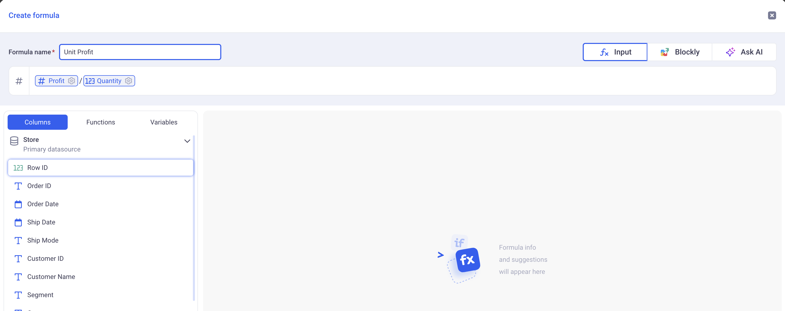
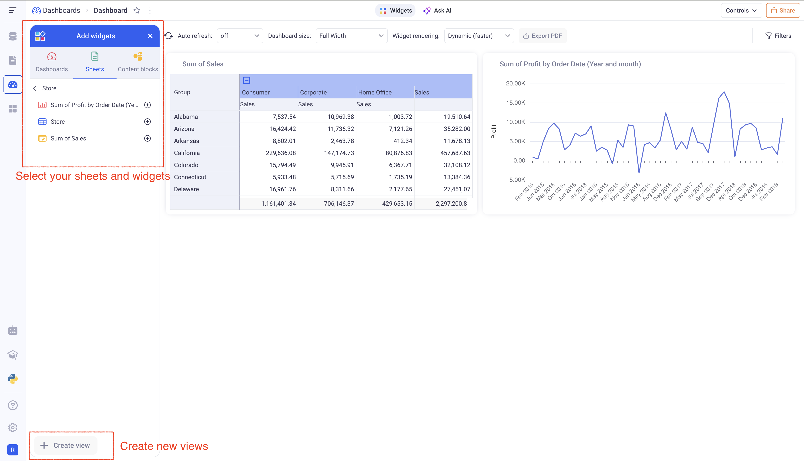

# Getting Started

KAWA contains 4 main sections:

- Connect your data in the Data Source section
- Build your models and explore in the Sheet section
- Publish in the Dashboard and Applications sections

## 1. Create your first Data Source

Loading data into KAWA is the first step, and it is done via the Data Source section. 

> If the data that you want to explore is already loaded in KAWA, go to the next paragraph.

Let's create one from a simple CSV file.
This example will use a [sample CSV file you can download](./readme-assets/store.csv) - but feel free to bring in your own.

- ➡️ _Step 1:_ Go to the Data Source section (Top icon in the left bar), and click on the __(+ Data Source)__ button. Choose: __(Upload a file)__.

- ➡️ _Step 2:_ Drag and Drop your file in the drop zone and once your data is displayed, click on __(Next)__

- ➡️ _Step 3:_ Click directly on __(Save)__. In the form, choose a good name for your new Data Source, then click on __(Save and run)__.

🚀 Your first Data Source has been created. The system will take a few seconds to process the entire file. Once it is done, you will see a green __SUCCESS__ badge that indicates that the data has been successfully loaded.

Before going to the next paragraph, go ahead and click on the __Data__ tab, next to overview. There, you will see the profile of your uploaded dataset. 

You can click on the various columns to get detailed information about them.

## 2. Create your first Sheet

There are two ways to create a Sheet on top of a Data Source.

- From the Data Source section, click on your Data Source and click on the __(Explore)__ button at the top. You will be redirected it the new sheet.

- From the Sheet section (Second icon from the top in the left bar), click on the __(+ Sheet)__ button, and select your Data Source. Click on __(Next)__, pick a name for your Sheet and __(Create)__.

A Sheet works like an Excel Workbook. When created, it has only one tab, which is the default Grid. This is the ideal tool to explore your data in KAWA.

### 2.1 Manipulate your data in the grid

Feel free to explore the main actions by using the buttons on the top right of the Grid.

A good starting point is Grouping. Click on the __(Group)__ button (on the top right), and on the __(+)__ button. Choose the _State_ field (Or any other dimension of your dataset), and click on __(Apply)__.

🔎 Feel free to explore: Sorting, Hide field, Filtering. All the options of the grid view are documented in details in the [Grid View section](./04_01_grid_views). There is a special section about [Filtering](./04_04_filtering).

### 2.2 Create a new simple formula

The __(Enrich Data)__ button is the way to add data in your sheet to complement the one coming from your data source. It lets you join with other data sources (Lookup column), create ad-hoc mapping tables, create your own formulas and even connect to Python scripts.

Let's create a simple formula to compute the unit profit by dividing the _Profit_ by the _Quantity_. 

> This is based on the example file from the first paragraph, feel free to adapt to your own business logic.

- ➡️ _Step 1:_ Click on the __(Enrich Data)__ button, then __(Formula)__.

- ➡️ _Step 2:_ If AI is enabled on your platform, you can just type: "Calculate unit profit". If it is not, just type `Profit / Quantity` (Do not copy paste, type in the formula). KAWA will assist you on the way.

- ➡️ _Step 3:_ Type in a name for your formula and __(Create)__. The new column will be added in your grid, at the last position.

### 2.3 Create a first simple chart

In order to explore your data in a more visual way, let's now create a chart. In our example, let's have a look at a profit trend over the years.

- ➡️ _Step 1:_ On the top left, click on __(Create View)__, and pick __(Graph/Chart)__.

- ➡️ _Step 2:_ In the configuration panel, search for the _Profit_ column and drag and drop it in the Series Zone. 

- ➡️ _Step 3:_ In the configuration panel, search for the _Order Date_ column and drag and drop it in the Group by Zone. 

- ➡️ _Step 4:_  Next to the Order Date in the Group By Zone, click on the small Calendar and pick: __(Year/Month)__. This will sample the data by month. 

- ➡️ _Step 5:_ Click on the line chart icon.

Please refer to the complete [Chart Documentation](./04_02_chart_views) to learn how to customize your charts.

### 2.4 Create a Pivot Table

Pivot tables in KAWA work like in any spreadsheet software, except that they can scale on billions of rows.

- ➡️ _Step 1:_ On the top left, click on __(Create View)__, and pick __(Pivot Table)__.

- ➡️ _Step 2:_ In the Rows section, add the _State_ column. This can be done either by drag and drop or by clicking on the __(+)__ and selecting the State column.
- ➡️ _Step 3:_ In the Columns section, add the _Segment_ column. 
- ➡️ _Step 4:_ In the Values section, add the _Sales_ column. 

To know what is possible with the pivot tables, go to the [Pivot Documentation](./04_03_pivot_table_views).

## 3. Put it together in a Dashboard

Go to the __Dashboard__ section (Third icon from the top in the left bar). Click on __(+ Dashboard)__, then __(Dashboard)__.

You will be redirected to a new empty dashboard.
Pick your sheet from the __(Add Widgets)__ panel and add the view you created in the previous steps.  

Widgets can then be arranged in the layout of your choice. Dashboard are a powerful tool to bring data from all your sheets in one place.

## 4. What's next?

Those three paragraphs: __Data Source__, __Sheet__ and __Dashboard__ are giving a good overview of the central structure of the KAWA platform. It is the base on which you can start building and sharing your data applications.

| Objective                             | Link                                     |
|---------------------------------------|-------------------------------------------------|
| Connect your Python libraries to KAWA | [Python integration](./09_00_python_integration)
| Build and share data applications     | [Publishing](./05_00_publishing)
| Connect KAWA to your Jupyter notebook to load and query data | [Python SDK](./09_00_python_integration)
| Automate your workflows | [Automations](./07_00_automations)
| Use AI to chat with your data | [AI Integration](./06_00_ai_integration)
| Build and share data models | [Data Modeling](./02_00_modeling)
| Build impactful visualizations | [Visualizations](./04_00_visualization)

