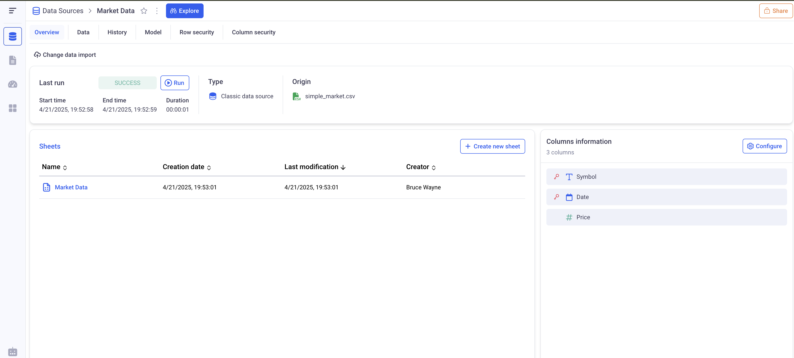
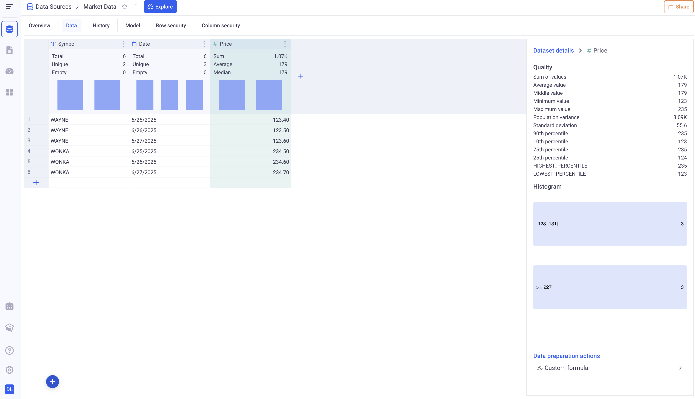

# Data Sources

There are several ways to connect KAWA with your data.
KAWA supports: Importing files, Connecting to external systems such as CRMs, databases, APIS etc, Linking to existing tables in the main warehouse, Importing unstructured data, Importing data from Python scripts, creating a data source from scratch, importing data from Knowledge.

* TOC
{:toc}

## 1 Data Source columns

In KAWA, a Data Source corresponds to one data table. Each Data Source has a list of columns or`Indicators`. 

### 1.1 Column types

Each Data Source column has a given type:

| Type | Example | Comment | 
|------|---------|---------|
| date    | 2025-06-25 | Dates do not have any timezone |
| date time | 2025-06-25 21:12:12 | Date times have a timezone and the precision depends on the settings of the KAWA instance. By default, date times are precise down to the millisecond. |
| text | 'Wayne' | |
| boolean | `true` or `false` | |
| integer | 1, 2, 0, -3 | |
| decimal | -0.3, 45.56 | |

KAWA also supports lists of texts and list of numbers.

### 1.2 Primary keys

Every Data Source must define one primary key. A primary key is a column — or a fixed combination of columns — whose values uniquely identify each row in the dataset.

Let's take the example of a Data Source with some market data.

| 🔑 Symbol   | 🔑 Date        | Price    | 
|---------|------------|----------|
| WAYNE   | 2025-06-25 | 123.4    |
| WAYNE   | 2025-06-26 | 123.5    |
| WAYNE   | 2025-06-27 | 123.6    |
| WONKA   | 2025-06-25 | 234.5    |
| WONKA   | 2025-06-26 | 234.6    |
| WONKA   | 2025-06-27 | 234.7    |

It has three columns:

- __Symbol:__ a text column, first primary key.
- __Date:__ a date column, second primary key.
- __Price:__ a decimal column 

Each row of the dataset is identified by the value of the symbol column and the date indcolumn. There cannot be any duplicate pairs (Symbol, Date).

### 1.3 Column definitions in the KAWA GUI

In the KAWA GUI, the overview tab of each Data Source gives information about its structure.

On the right part, you can see all the columns of the Data Source, with an icon representing the type, and a red key to represent whether or not an column is a primary key. Here, there is composite primary key: Symbol and Date.

## 2. Data profile and Data preparation

In the GUI, under the __Data__ tab of any Data Source, you can access global information such as the total number of rows, value distributions for each column, and other dataset-wide statistics.

_Above, the data profile for the Market Data set._

Each column header give information about that particular column. The right panel gives contextual statistics. Clicking on any column header will move the context to that particular column.

_Here for example, after clicking on the Price column, we get statistics about it. We can also add some computation to sanitize the values of the column._

## 3. Configure the import type

This is valid for most of the Data Sources. KAWA supports import type configuration for CSV import, Connecting to an external system, Loading with Python.
Three options are available:

| Option | Description
|-----------|------------
| Reset Before Insert | Each time the import will run, the data in KAWA will be entirely replaced with the content of the file.
| Incremental | The data from the incoming file will be appended to the data that was already imported. Based on the primary key, if some rows that were already present in KAWA are present in the file, then the values will be replaced.
| Snapshot | This mode will append all the content of the file to the existing data. Two additional columns will be created: `Snapshot Id` and `Snapshot DateTime`. 

Please refer tpo the three examples below:

### 3.1 Reset Before Insert

__Initial import:__

| 🔑 Stock | Position
|-------|----------
| WAYNE | 23
| WONKA | 12

Data in KAWA after initial import:

| 🔑 Stock | Position
|-------|----------
| WAYNE | 23
| WONKA | 12

> The data will be copied in KAWA after the initial import, exactly as is.

__Second import:__

| 🔑 Stock | Position
|-------|----------
| WAYNE | 25
| STARK | 26

Data in KAWA after second import:

| 🔑 Stock | Position
|-------|----------
| WAYNE | 25
| STARK | 26

In the Reset Before Insert mode, the data is deleted in KAWA before importing the new position. As a result, KAWA will contain exactly a copy of the second import. My position on WONKA will be removed and a new position on STARK will be added.

### 3.2 Incremental

__Initial import:__

| 🔑 Stock | Position
|-------|----------
| WAYNE | 23
| WONKA | 12

Data in KAWA after initial import:

| 🔑 Stock | Position
|-------|----------
| WAYNE | 23
| WONKA | 12

> The data will be copied in KAWA after the initial import, exactly as is.

__Second import:__

| 🔑 Stock | Position
|-------|----------
| WAYNE | 25
| STARK | 26

Data in KAWA after second import:

| 🔑 Stock | Position
|-------|----------
| WAYNE | 25
| WONKA | 12
| STARK | 26

In the incremental mode, the content of the second import will be appended to the existing data. This explains why the STARK position is added, and why the WONKA position is not affected. Because the WAYNE stock was already present, its value will be updated (The initial 23 will be replaced with a 25).

### 3.3 Snapshot

__Initial import:__

| 🔑 Stock | Position
|-------|----------
| WAYNE | 23
| WONKA | 12

Data in KAWA after initial import:

| 🔑 Stock | Position | 🔑 Snapshot id | 🔑 Snapshot date time
|----------|-----------|-------------|-----------------------
| WAYNE | 23         | 1 | 2025-25-06 12:34:56
| WONKA | 12         | 1 | 2025-25-06 12:34:56

> Two additional columns will be added: snapshot id and snapshot date time, both of which become part of the composite primary key alongside the existing key columns. For the first import, because this is the initial snapshot, every row will receive a snapshot id of 1 and a snapshot date time set to the moment of import (e.g. 2025-06-25 12:34:56). 

__Second import:__

| 🔑 Stock | Position
|-------|----------
| WAYNE | 23
| WONKA | 12

Data in KAWA after second import:

| 🔑 Stock | Position | 🔑 Snapshot id | 🔑 Snapshot date time
|----------|-----------|----------------|-----------------------
| WAYNE | 23         | 1              | 2025-25-06 12:34:56
| WONKA | 12         | 1              | 2025-25-06 12:34:56
| WAYNE | 23         | 2              | 2025-27-06 12:58:13
| WONKA | 12         | 2              | 2025-27-06 12:58:13

> Subsequent imports will increment the snapshot id (to 2, 3, …) and record a new snapshot date time, allowing each import to be stored as a distinct, non-destructive snapshot in the same table.
