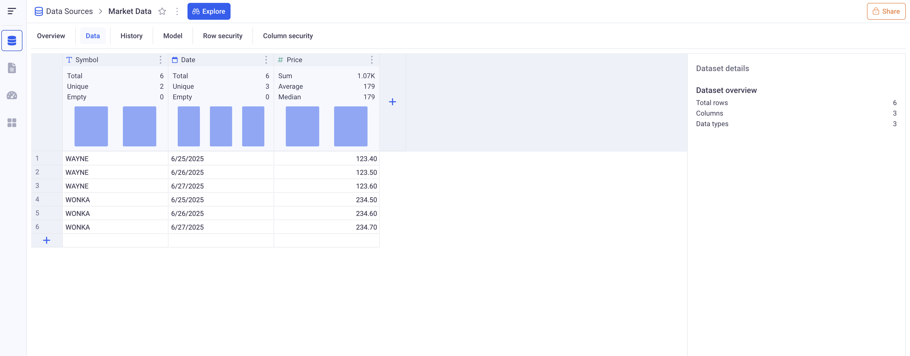

Data Integration - Data Sources
---

There are several ways to connect KAWA with your data.
KAWA supports: Importing files, Connecting to external systems such as CRMs, databases, APIS etc, Linking to existing tables in the main warehouse, Importing unstructured data, Importing data from Python scripts.

# 1 Data Source columns 

In KAWA, a Data Source corresponds to one data table. Each Data Source has a list of columns or`Indicators`. 

## 1.1 Column types

Each Data Source column has a given type:

| Type | Example | Comment | 
|------|---------|---------|
| date    | 2025-06-25 | Dates do not have any timezone |
| date time | 2025-06-25 21:12:12 | Date times have a timezone and the precision depends on the settings of the KAWA instance. By default, date times are precise down to the millisecond. |
| text | 'Wayne' | |
| boolean | `true` or `false` | |
| integer | 1, 2, 0, -3 | |
| decimal | -0.3, 45.56 | |

KAWA also supports lists of texts and list of numbers.

## 1.2 Primary keys

Each Data Source includes at least one primary key, whose values uniquely identify every individual row within the dataset.

Let's take the example of a Data Source with some market data.

| Symbol  | Date       | Price    | 
|---------|------------|----------|
| WAYNE   | 2025-06-25 | 123.4    |
| WAYNE   | 2025-06-26 | 123.5    |
| WAYNE   | 2025-06-27 | 123.6    |
| WONKA   | 2025-06-25 | 234.5    |
| WONKA   | 2025-06-26 | 234.6    |
| WONKA   | 2025-06-27 | 234.7    |

It has three columns:

- __Symbol:__ a text column, first primary key.
- __Date:__ a date column, second primary key.
- __Price:__ a decimal column 

Each row of the dataset is identified by the value of the symbol column and the date indcolumnicator. There cannot be any duplicate pairs (Symbol, Date).

## 1.3 Indicators in the KAWA GUI

In the KAWA GUI, the overview tab of each Data Source give information about its structure.

On the right part, you can see all the columns of the Data Source, with an icon representing the type, and a red key to represent whether or not an column is a primary key. Here, there are two primary keys: Symbol and Date.

# 2 Data profile and Data preparation

In the GUI, under the __Data__ tab of any Data Source, you can access global information such as the total number of rows, value distributions for each column, and other dataset-wide statistics.

_Above, the data profile for the Market Data set._

Each column header give information about that particular column. The right panel gives contextual statistics. Clicking on any column header will move the context to that particular column.

_Here for example, after clicking on the Price column, we get statistics about it. We can also add some computation to sanitize the values of the column._

