# Connect to an External system

* TOC
{:toc}

KAWA allows you to connect to an external system. You may choose your connector from the existing list.

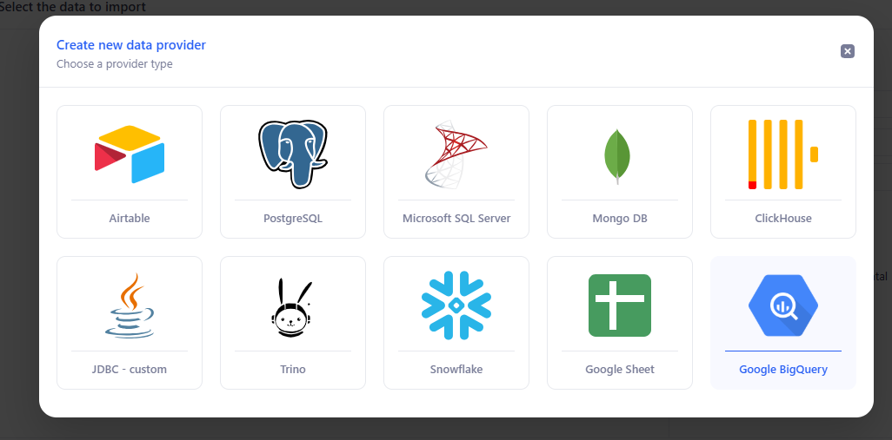

> Your connection details will be encrypted in KAWA’s database and will be decrypted only to import data from your bases when an ETL runs (Manual trigger on the GUI or according to your schedule). It is NOT accessible to KAWA support team.

## 1. Connecting with Google Sheet

### 1.1 Configure the provider on KAWA

By default, KAWA comes in with a way to load data from public Google Sheets.

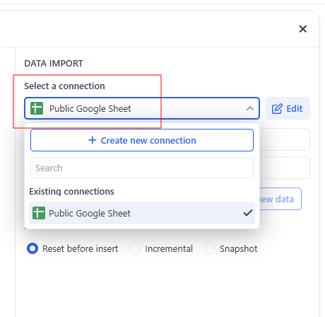

If you wish to connect to restricted sheets, follow this guide.

In the data source section:

- Click on “+ Data source” button and choose: “Connect to an external system” 
- Then, click on “+ Create new connection” button next to the data import section 
- Pick the **Google Sheet** provider 

### 1.2 Configure your service account JSON key

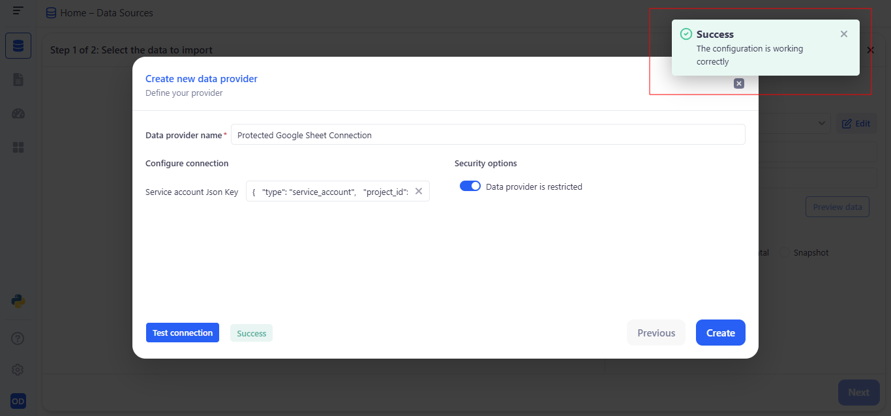

The JSON key must be similar to this:

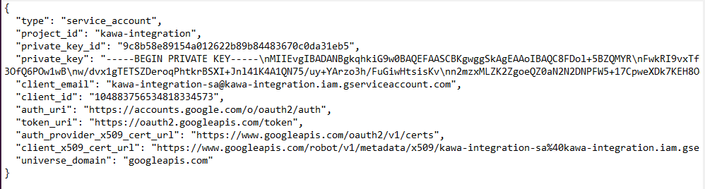

Your service account key can be found on your Google Cloud Platform console, in the IAM section.

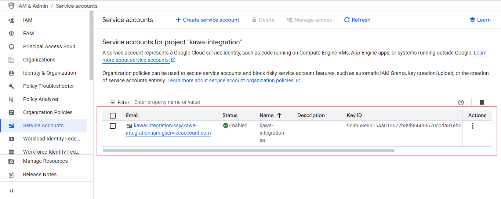

Please refer to this section for help creating a service account: <https://cloud.google.com/iam/docs/service-accounts-create>

> While keeping your sheets protected, share them with the service account whose key you’ve used.

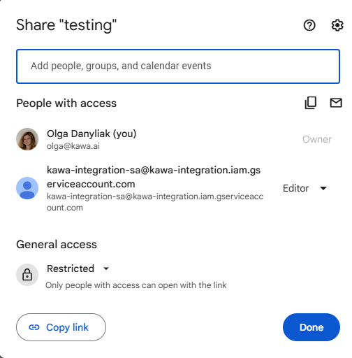

Click on "Test Connection" then "Create". 

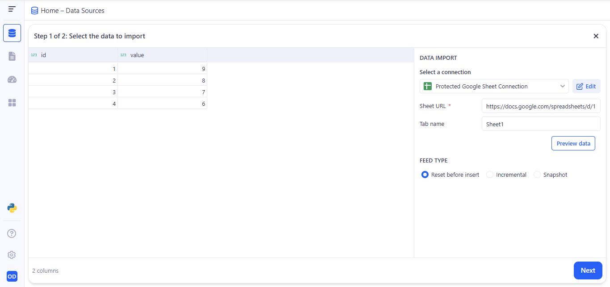

In the Select a connection field you’ll see your new Google Sheet connector. Paste your spreadsheet link into "Sheet URL" and enter the sheet’s name in "Tab name". Click "Preview data" to check the first rows and make sure it loaded correctly. Choose your Feed Type (Reset before insert, Incremental, or Snapshot). When you’re ready, click "Next" and complete creating the new data source.

## 2. Connecting with Airtable (personal Access token)

### 2.1 Create a personal access token to your airtable data

Follow this link > <https://airtable.com/create/tokens>

- ➡️ _Step 1:_ Click on “Create new Token” from the “Personal access tokens” section

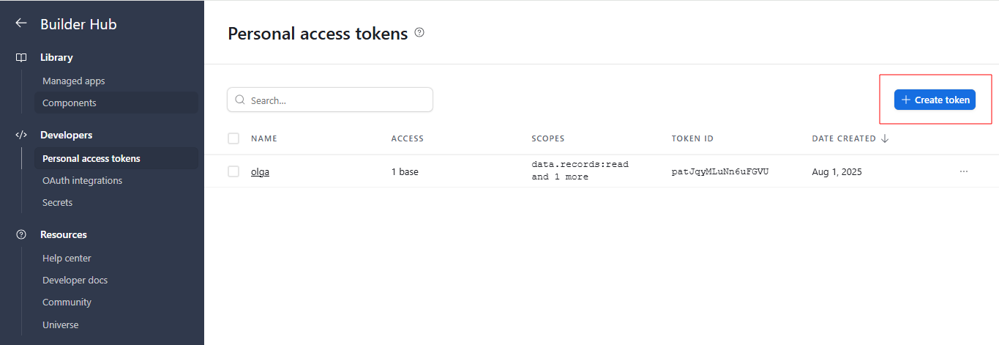

- ➡️ _Step 2:_ Configure your access token as follows

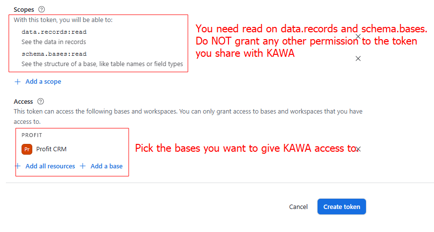

- ➡️ _Step 3:_ Copy your token

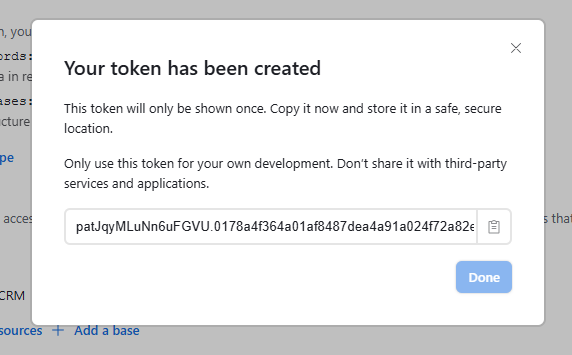

### 2.2 Configure the provider on KAWA

In the data source section:

- Click on “+ Data source” button and choose: “Connect to an external system”
- Then, click on “+ Create new connection” button next to the data import section
- Pick the **Airtable** provider

Fill in the following form:

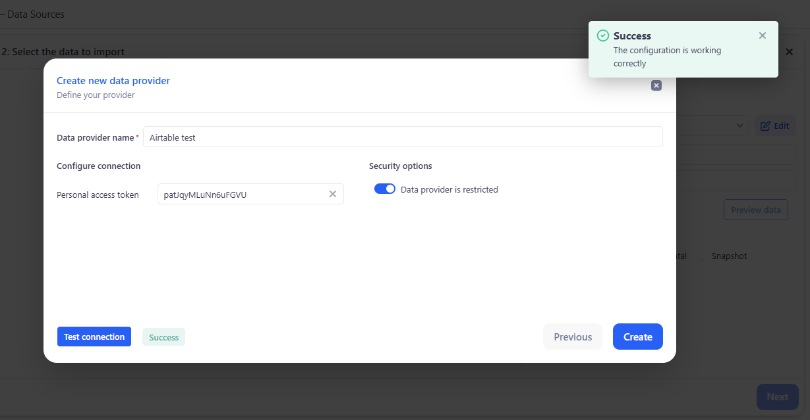

Click on "Test Connection" then "Create".

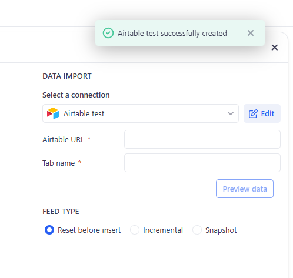

### 2.3 Import data

In order to import data, select the provider that you created in the previous step.Copy and paste the URL of your table in the first field and the Tab Name in the second one:

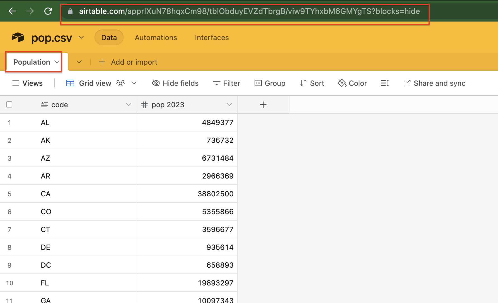

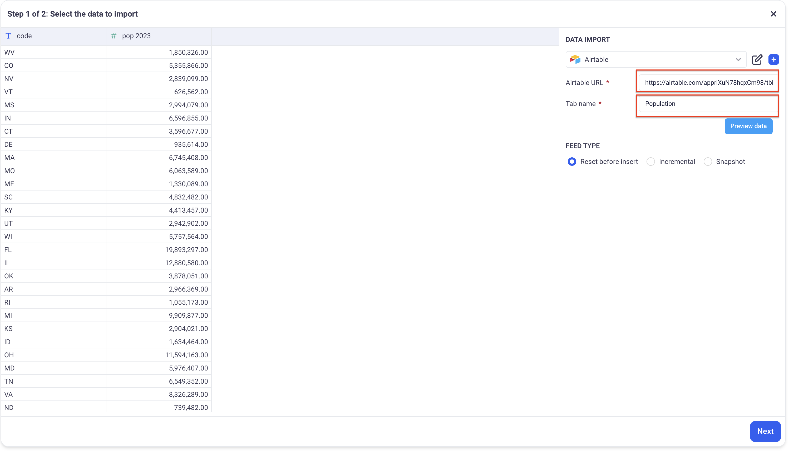

Click on "Preview Data", then "Next".

## 3. Connecting to Oracle DB (via JDBC)

### 3.1 Configure the provider on KAWA

In the data source section:

- Click on “+ Data source” button and choose: “Connect to an external system”
- Then, click on “+ Create new connection ” button next to the data import section
- Pick the **JDBC Custom** provider 

Enter the required connection details for your Oracle database:

- Fill in the name of your database
- Fill in the JDBC URL: jdbc:oracle:thin:user/******@hostname:port:SID

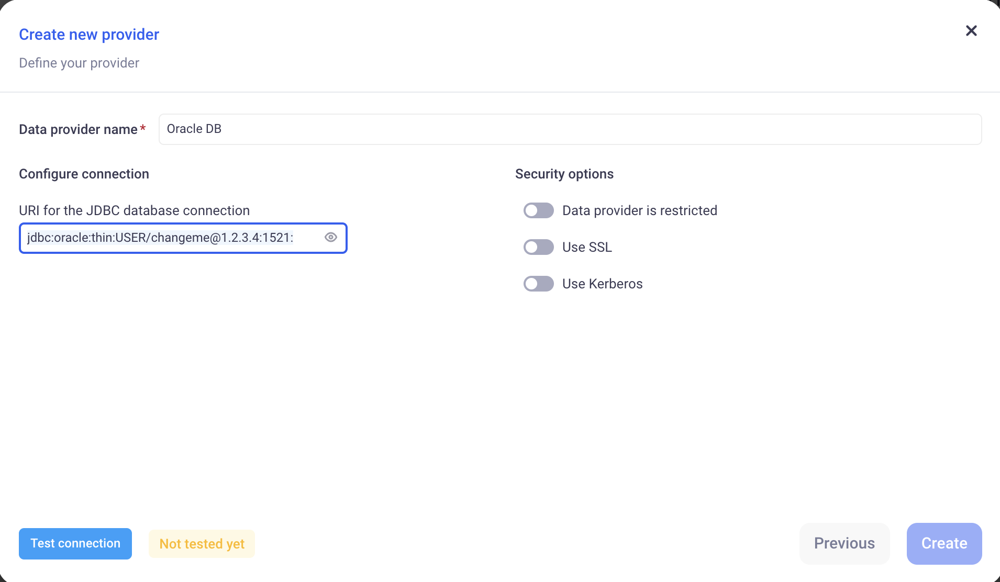

> Here is a documentation about how to build the JDBC URL: <https://docs.oracle.com/en/database/oracle/oracle-database/21/jajdb/index.html#:~:text=Examples%3A,mydbhost1%2Cmydbhost2%3A1521%2Fmydbservice>

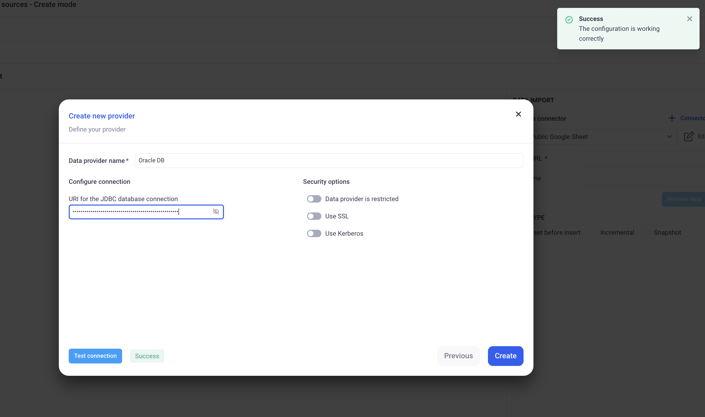

Click on "Test Connection" then "Create".

You can import data either by picking a database and a table or by writing your own query.

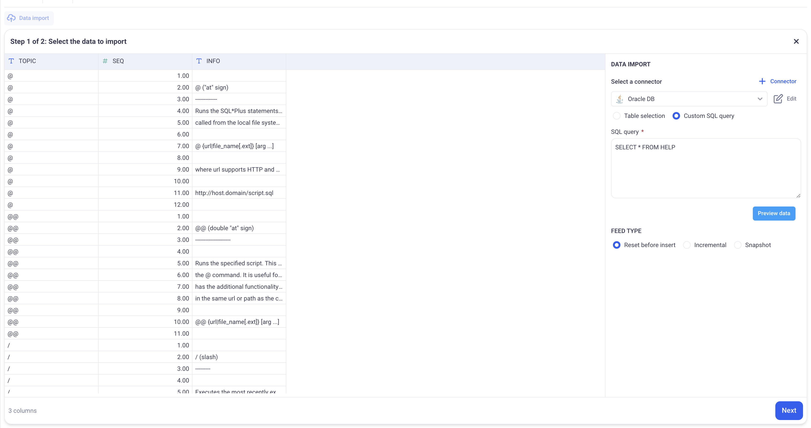

## 4. Connecting with PostgreSQL

### 4.1 Create a PostegreSQL user

We strongly advise creating a dedicated user for KAWA to enhance tracking of usage and performance metrics with appropriate permissions. To set up this user, please refer to the following resources:

#### a. Creating a User Account:

Follow the instructions provided in the PostgreSQL documentation at this link: [Create User in PostgreSQL](https://www.postgresql.org/docs/current/role-membership.html).

#### b. Assigning Appropriate Roles:

Grant the necessary roles to the user to enable querying of your analytics data. Detailed guidance can be found here: [Role Membership in PostgreSQL](https://www.postgresql.org/docs/current/role-membership.html).

### 4.2 Configure the provider on KAWA

In the data source section:

- Click on “+ Data source” button and choose: “Connect to an external system”
- Then, click on “+ Create new connection ” button next to the data import section
- Pick the **PostegreSQL** provider 

Enter the required connection details for your PostgreSQL database:

- Hostname or IP address of the PostgreSQL server.
- Port number (default is 5432).
- Username and password for database access.
- Database name (the name of the PostgreSQL database you want to connect to).

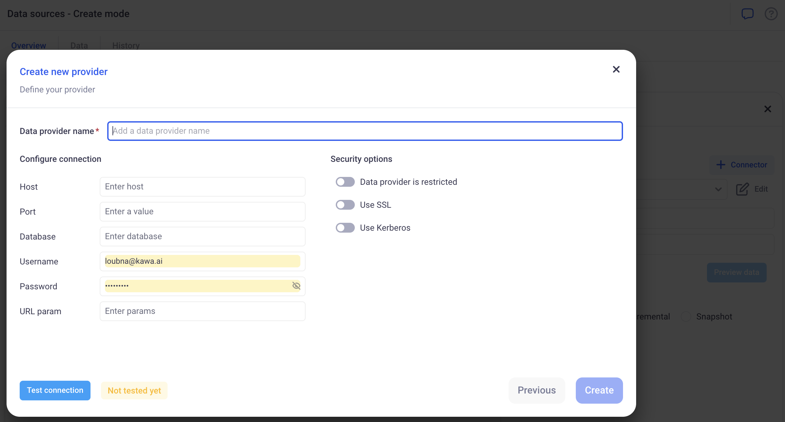

Click on "Test Connection" then "Create".

## 5. Connecting with Snowflake

### 5.1 Configure the provider on KAWA

In the data source section:

- Click on “+ Data source” button and choose: “Connect to an external system”
- Then, click on “+ Create new connection ” button next to the data import section
- Pick the **Snowflake** provider

Enter the required connection details for your Snow Flake account:
    
- Host: The host is formed as follows: `<account_identifier>.snowflakecomputing.com`. Your url can be found on your snowflake account page:

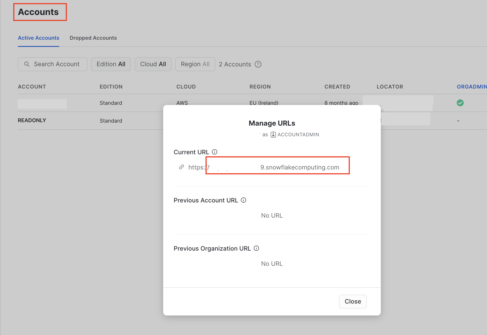

- Port: The port is always 443
- Database: The database you want to connect to
- Username/Password: Your credentials
- URL param: can be left empty.
- Please keep USE SSL and USE KERBEROS turned off.
- You can turn on “Data Provider is restricted” If you want only privileged users to access this data provider.

Here is how a valid configuration looks like:

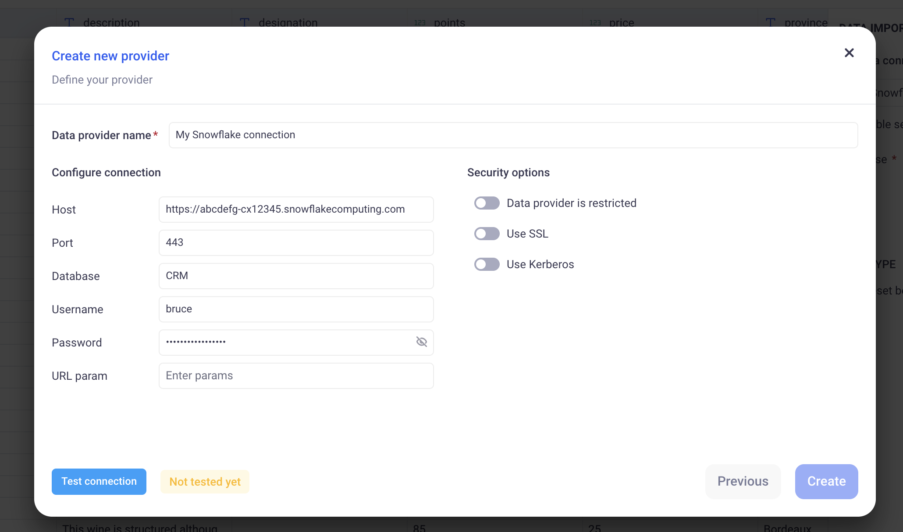

Click on "Test Connection" then "Create".

## 6. Connecting with Google BigQuery

### 6.1 Create a BigQuery service account

- ➡️ _Step 1:_ Create a service account in GCP by going to [IAM > Service accounts](https://console.cloud.google.com/iam-admin/serviceaccounts).

- ➡️ _Step 2:_ Select + Create Service Account from the top of the page.

- ➡️ _Step 3:_ When prompted you will need to add four IAM roles below:

- `BigQuery User`
- `BigQuery Data Viewer`
- `BigQuery Job User`
- `BigQuery Metadata Viewer`

- ➡️ _Step 4:_ Create JSON key 

Your service account is now created. Click into the service account and select the `Keys` tab.

Click `Add Key` and make sure you create a JSON key (not a P12 key). The key will be automatically downloaded to your computer.

> Refer to this section for more help creating a service account: <https://cloud.google.com/iam/docs/service-accounts-create>.

### 6.2 Configure the provider on KAWA

In the data source section:

- Click on “+ Data source” button and choose: “Connect to an external system”
- Then, click on “+ Create new connection ” button next to the data import section
- Pick the **SBigQuery** provider

Enter the required connection details for your BigQuery database:

- Data provider name.
- JSON Key: Open the file downloaded on Step 4 and copy paste the content.

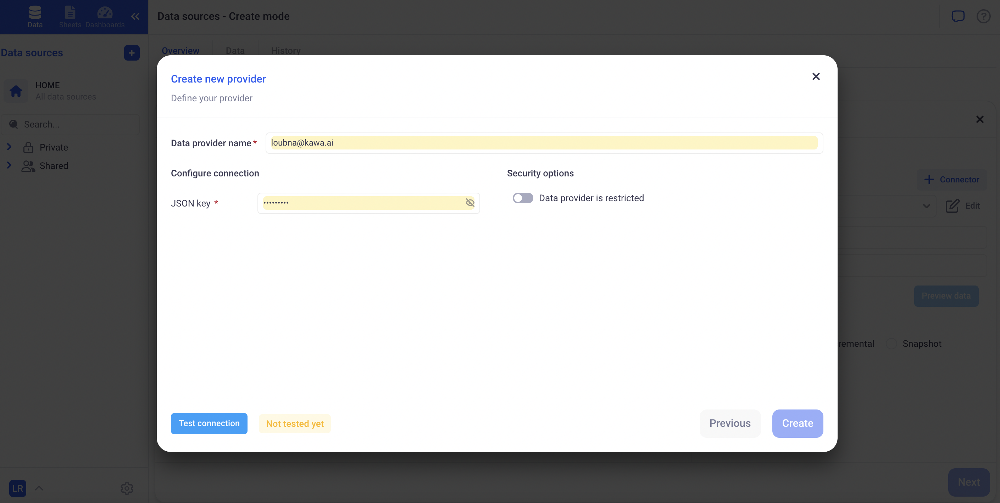

Click on "Test Connection" then "Create" . 