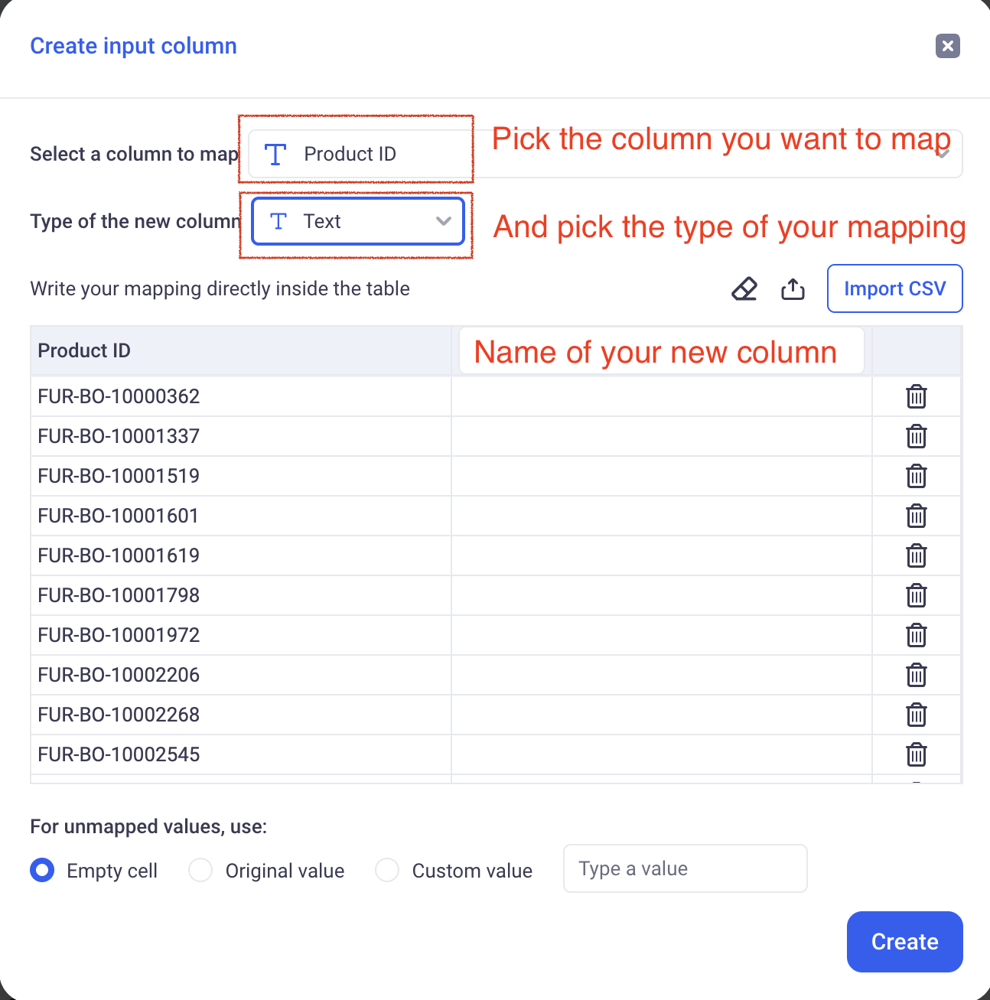

# Manual Edit

This feature lets you manually edit data from the GUI.
(This feature is under active development)

* TOC
{:toc}

## 1. Data edition

KAWA has three main mechanisms for manual data edits.

- Direct edits (Like in Excel or Google Sheet)
- Manual patching
- Via mapping tables

All edits will be stored on the original tables and _will propagate in the entire KAWA application, for all users._

> KAWA will not write in `Live Connect` type datasources. Only in table that were created through the platform.

> Edit permissions are handled on the data source level and provide a flexible system to control who can edit what in each data source.

### 1.1 Direct edits (Excel like)

Direct edits can only be done in specific data sources: `Create from Scratch`.

They behave like an Excel sheet, meaning that you can:

- Add rows, 
- Add columns,
- Remove rows and
- Edit cells
- Copy ranges of cells (Coming soon)

__The main differences with Excel are:__

- Each column of the sheet is strongly typed (`text`, `integer`, `decimal`, `date`, `date time` or `boolean`). Once the type of a column is set, it cannot be changed.

- Columns cannot be removed (but can be hidden)

#### a. Create an editable datasource

In order to create an editable data source, navigate to the DataSource section, (+ Data source), Create from scratch.

And then, click on explore to go to the associated sheet.

#### b. Edit data from the sheet section

When opening a sheet based on an editable datasource, the default view is an editable grid:

It behaves like a regular grid with the following main differences:

- Grouping is not available
- It always show all the editable columns by default

On this view you can:

- Add new rows (Add row button in the action bar on the top)
- Add new Columns (Add column button in the action bar on the top)
- Remove entire rows by right clicking on any cell and choosing: _Remove row_.

In order to edit a cell, either use double click on a cell to input your value, either on the arrows on the line you wish to edit:

#### c. Edit data from dashboards or applications

The editable views can be added to your dashboards or you applications to provide more interactivity. 

__In a dashboard__, simply pick the editable view in the widget selector:

_The editable widget has all the options of the editable view, directly in the dashboard_.

__From within an application__: 

Make sure to have the "Edit data in grid" toggle enabled.

_Users of the application will then be able to edit directly from the application page_.

### 1.2 Data patching

When you datasource is not created only for edits, manual edits are still possible. Those edits behave like patches that can be easily reverted.

__Example__: The DEALS datasource is connected to my trading system and is refreshed every morning. If a user detects an issue in the table during the day (for example: name of the counterparty is wrong), they can edit that value in KAWA - the edit will propagate in all the connected analytics. Once the data is fixed in the original system, that edit can then be removed.

_On the image above, the Segment has been patched (yellow border). If you hover your mouse over the patch, you will see that you can remove that patch_.

> When removing a patch, the value will be reverted to the latest value that was synchronized from your remote system.

_Example:_

1) My deals are synchronized this morning at 9AM in my deals data source.

2) I detect a mistake at 10AM: Deal 1 has the wrong counterparty - _Wonka Corp_ instead of _Wayne Industries_.

3) I manually edit my data through my editable view and correct the counterparty. I also report this issue to my data team.

4) The next day at 9AM, my deals are synchronized again and the data team fixed the issue. I can now safely remove my patch and the corrected value will be taken in account.

### 1.3 Mappings

Mappings are a way to edit data directly at the sheet level. Data will not be written in the underlying data source.

#### a. Create a new mapping (also called: manual input columns)

From the sheet section (Grid, but also charts and pivots), click on the Manual Input item in the (Enrich data) menu.

Then, in the configuration modal, choose:

- The column to map.
- The type of the mapping (Text or Numeric)
- The name of the new column

- The bottom of the screen lets you define the behavior to adopt when the value is not mapped.

More details about mappings are available here: [Mapping columns](./03_03_mapping_columns.html)

#### b. Edit mapping column values directly in the Grid

KAWA lets you edit mapping values directly in the grid.

> For this to work, you must have AT LEAST one defined primary key that is not the `automatic_uuid` column. This is very important for _LIVE CONNECT_ data sources.

If your data source is _LIVE CONNECT_, go to the datasource model, and select the correct primary leys for your data source. Make sure that their combination yields to a unique definition of each record from your table.

In order to edit data directly from the grid, open a grid view (It can be in a dashboard widget, in an application or in a sheet). You can then double click on any cell (on a mapping column) to edit its value.

> If the mapping is not at the level of the primary key (in the above example, it is a comment per state), each edit will result in multiple impacted cells. If I input a comment for the state of California, all the rows for that state will receive the same value.

## 2. Data edition permissions

### 2.1 Set edit permissions at the data source level

KAWA provides a profile based mechanism to restrict edition permissions on data sources.

In order to configure the data edition permissions, navigate to the data source you wish to configure and click on: (Edition Rules).

This screen lets you create some edition profiles.

> If there are no profiles, the data source is NOT editable.

In order to add a profile, click on the (+ Add Profile) button.

Each profile has the following parameters:

- _Public access_: If turned on, all users with READ access to the sheet will be able to access that profile.

- _Applies to_: If the profile is not public, then a list of teams can be selected to decide who this profile will apply to.

- _Can add / remove rows_: When toggled on, this profile allows users to add and remove rows to the data source.

- _Can add new columns_: When activated, users can add new columns to the data source.

- _Editable columns_: Defines the set of columns that can be edited in a datasource. This will be set to `All Columns` if the profile lets users add and remove rows.

> As soon as the data source is editable (at least one profile), the owner of the data source can access all the permissions, meaning that they can edit all columns, add and remove rows and add columns. 

_Here, the ADMINS team can add and remove rows, add columns and edit all fields. All other users (public profile) can only edit the `Title` column._

### 2.2 Set edit permissions for the mapping columns

To control whether a mapping column is editable by users other than its creator, you need to share the sheet it resides in.

In order to share a mapping column, go to the model section of the sheet it belongs to and click on the (Shared) checkbox.

> If this option is disabled for you, it means that you do not have enough permission on the sheet. Contact the sheet owner to get this permission.

__Only users with whom the sheet will be shared as Editors will be able to edit the mapping columns.__
