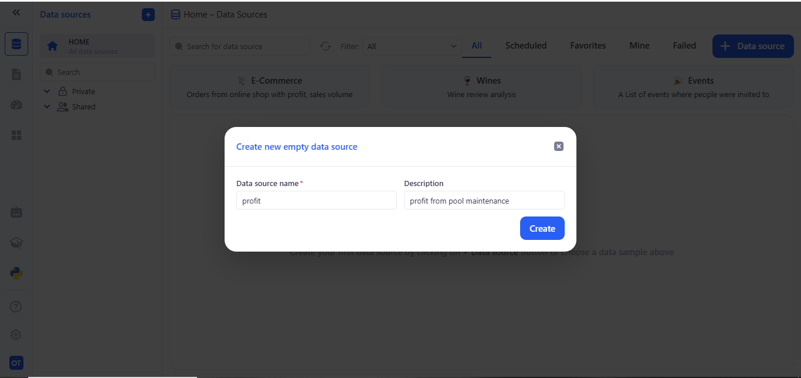
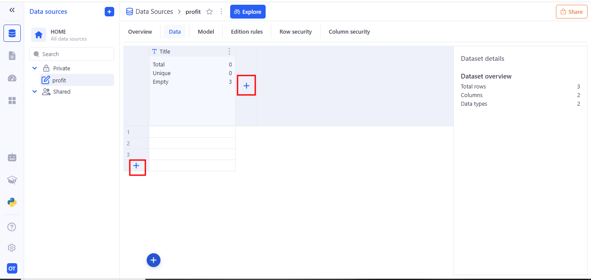
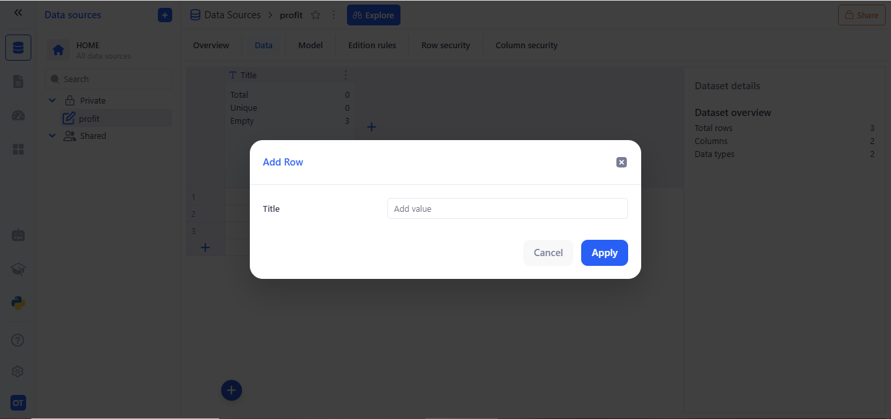
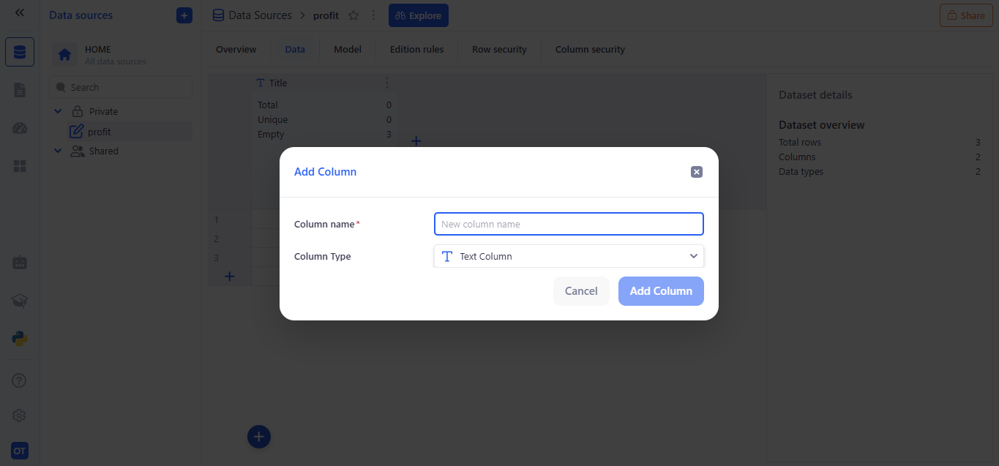

# Create from Scratch

This is the simplest way to set up a blank, manual-input data source in KAWA.

To create a new data source in the __Data Source__ section, click on __(+ Data Source)__ then __(Create from Scratch)__.

Fill in the data source details:
- A modal titled Create new empty data source appears.
- In Data source name, enter a unique name for your new source.
- (Optional) In Description, jot a brief note about what this source will hold.
- Click Create.

After creation, you land on the Overview tab for your new source.

Once you switch to the Data tab, you can begin populating your Data Source. Here’s what you’ll see and how to use it:
- Grid view
A blank grid appears with your column headers across the top (e.g. Title) and empty rows numbered down the left.

- Add rows
Click the + button at the bottom-left of the grid to insert a new row. Each click adds one more blank row where you can type in values.

- Add columns
Hover over the top right of the header area and click the + icon to define a new column. You’ll specify:
  - A column name
  - A data type (Text, Number, Date, etc.)

