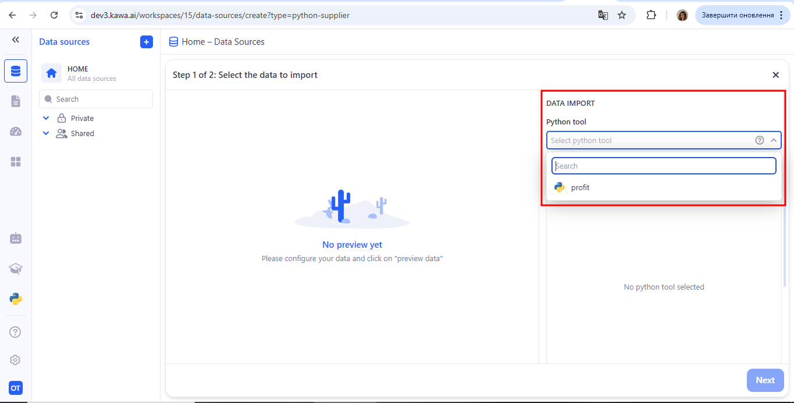
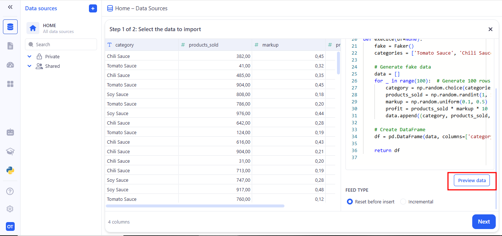
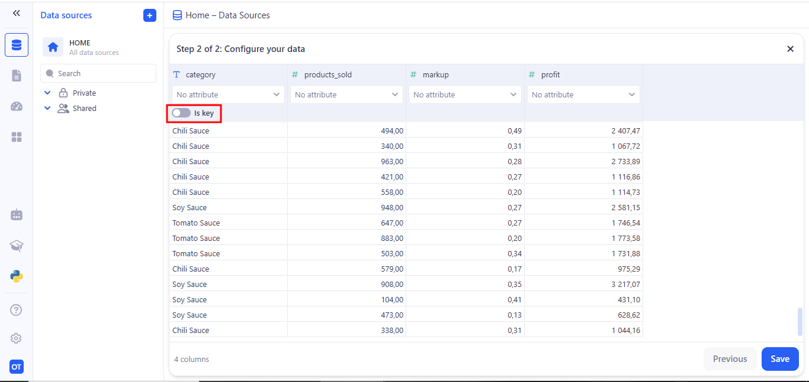
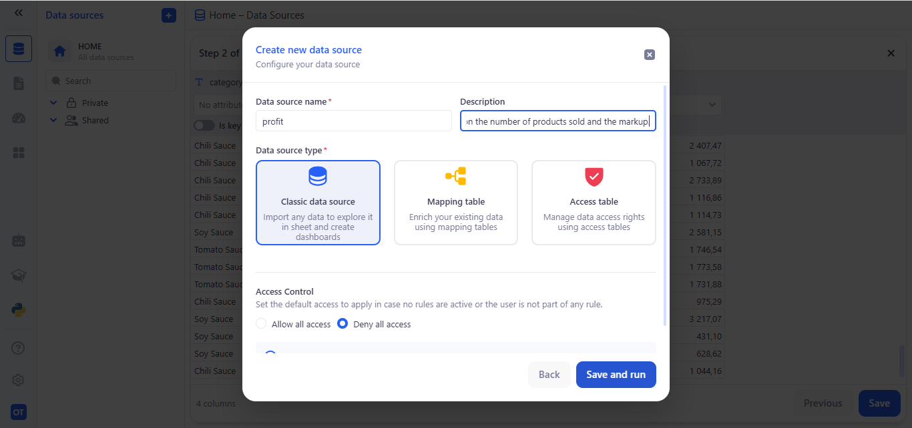

# Load with Python

In the Load with Python section you’ll find two ways to create a new data source with your own ETL code:
- Quick deploy in the KAWA File Store – just write or paste your load_data() function through the UI;
- Full DevOps workflow – connect your GitHub/GitLab repo as Source Control, version your scripts in Git, and KAWA will automatically scan the branch and list them under Python tools.
Both approaches let you easily manage data updates and set up scheduled runs.

The next step is to create a new data source by running your own Python script in the __Data Source__ section, click on __(+ Data Source)__ then __(Load with Python)__.

Select Your Python Tool:
- In the DATA IMPORT panel, open the Python tool dropdown.
- Choose your script from the list (e.g. profit).

Your script’s code will appear on the right. Click Preview data—KAWA will run your function and display the rows of the resulting data table.

At the bottom, select one of the Feed type options: Reset before insert or Incremental. Then click Next.

On the Configure your data screen, review column names and data types. Toggle Is key on the column you’ll use for incremental updates. Click Save to lock in your schema and finish creating the Data Source.

In the Create new data source dialog, enter:
- Data source name (e.g. profit).
- Description (optional).
- Data source type (usually Classic data source).
- Access Control default permissions.
Click Save and run.

