Sharing and permissions
---

* TOC
{:toc}

# 1 User management and permissions

Users in KAWA have a global profile that applies across all workspaces and some workspace
related permissions.

## 1.1 Authentication

### a. KAWA internal authentication

KAWA can be configured to authenticate users without relying on
SSO. In this mode, administrators can either choose to let people
create accounts using email activation codes or to manage the user
accounts themselves through KAWA's Python API.

KAWA will store the user's unique identifiers (must be the email address
if people are making use of email activation), their first and last names, and their secure password hashes.

When using KAWA internal authentication mechanism, the following page will be shown to users:

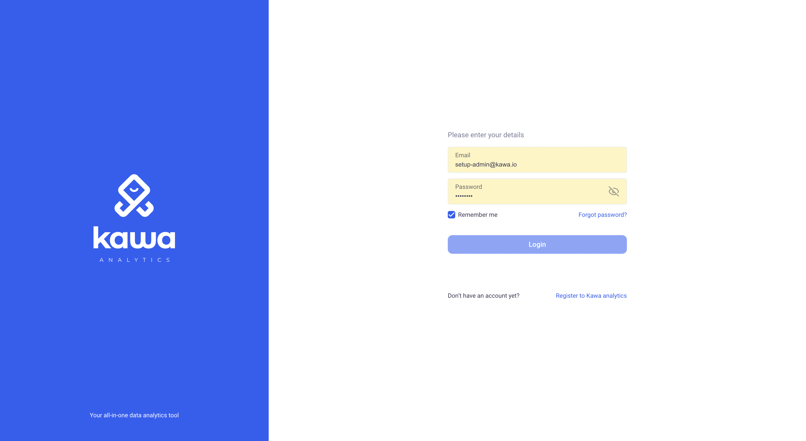

> **⚡ Important:** Note that the "Register in KAWA Analytics" section can be turned off if you do not wish users to sign up by themselves. The feature flag name is: `user-sign-up`.

> **⚡ Important:** If you want to allow users to sign up, you need to configure SMTP support

### b. Using external IDPs and SSO

When configured to work with SSO, KAWA will automatically create users
in its database when new authenticated users will connect.

__Open ID Connect__:
KAWA is compatible with OIDC to authenticate users. It can be integrated with providers such as OKTA, AWS Cognito, Auth0, Azure Active Directory, etc...

__Kerberos SSO__: Kawa can be configured to integrate with Kerberos to authenticate users.

__HTTP Header-based Authentication__: Users can be authenticated with HTTP Header based authentication. In that setup, the user information will be extracted from the incoming HTTP requests.

### c. Using API Keys

KAWA provides a mechanism to allow users to generate API keys in order to authenticate. This is mainly used to work with KAWA's Python API.

## 1.2 Application wide profile

Application wide profiles are configured through KYWY, KAWA's python client.

Please refer to this repository: https://github.com/kawa-analytics/kywy-documentation which contains all the details and examples regarding the usage of this library.

### a. The user roles

There are 3 global roles in KAWA.
Each user has one role that is valid for the entire application.

Each time a new user is added in KAWA, they will get the _REGULAR USER_ role.

**ADMINISTRATORS**

Administrators can access all the admin functionalities of the platform. 
They can create, delete, activate, deactivate users. They can also modify user passwords
and change the global roles of other users.

Administrators can also access all workspaces and all assets in all of the workspaces without restrictions.

They can access all data bypassing all the row level and column level security.

> **⚡ Warning:** Typically, very few admin accounts should be created. They should be reserved for IT, global support and maintenance.

**SETUP ADMINISTRATORS**

There is only one such user for the entire KAWA platform. This user has all the privileges 
of ADMINISTRATORS. It can never be disabled, deleted or switched to another user role.

**REGULAR USERS**

Most of the users should have this role. It allows them to benefit from all the features
of the platform.

### b. The restricted data source types

There are 7 data source types in KAWA:

- __USER FILES__: To create data sources of that type, users can upload CSV files from the GUI.

- __EXTERNAL SYSTEMS__: This type of data source is created by connecting to an external system directly from the GUI: Database, API, etc... 

- __KYWY__ (Python client): This corresponds to data sources created from the Python client using the data loader.

- __LIVE CONNECT__: Live connections are created by querying tables or views that are stored in the main data warehouse, without ETL or synchronization.

- __PYTHON ETL__: This type of data source is created by scheduling a Python script decorated by the `@kawa_tool` decorator.

- __FROM SCRATCH__: This allows users to create data sources directly in the GUI and edit the values manually, like Excel.

- __TRANSFORMATIONS__: Those are created by materializing existing views into new warehouse tables.

Each user (_Regular users_) can only create data sources of a type that was not explicitly restricted by administrators.

This allows administrators to control what the various users can load into the platform.

In the GUI, when users create a data source, the types they are allowed to work with are shown here:

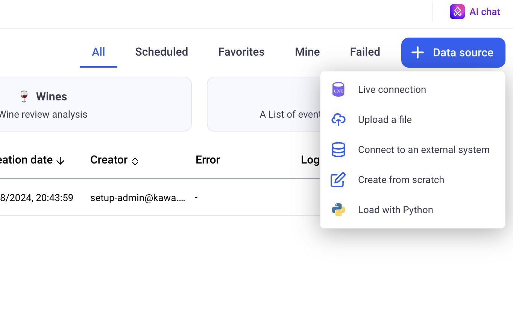

> **⚡ Important:** by default, users will not have access to the __LIVE CONNECT__ data type.

### c. The overall permissions

Overall permissions are a list of features that individual users have access to.
For example, to benefit from all the Generative AI features,
the permission: `GENERATIVE_AI` must be granted. This grant will apply to the entire KAWA platform.

## 1.3 Workspace permissions

Each workspace functions as a separate isolated tenant. 

In order to access a given workspace, a user must be explicitly invited in it. 
A workspace can also be configured as public. If that is the case,  all the registered users in the platform can access it without restriction.

In each workspace, users benefit from a set of permissions:

__Sharing permissions:__

- Share Sheets and Views
- Share Data Sources 
- Share Dashboards
- Share Applications
- Share Knowledge

__Misc:__

- Access and manage Python scripts
- Run Python scripts
- Manage directories

__Data access permissions:__

>  **⚡ Warning:** Reserved to administrators of the workspace

- Manage row level and column level security
- Access restricted data and restricted data providers

__Workspace administrative permissions:__

>  **⚡ Warning:** Reserved to administrators of the workspace

- Edit workspace settings
- Manage workspace members

Workspace permissions are handled directly on the GUI, from the settings section (cog icon at the bottom left)

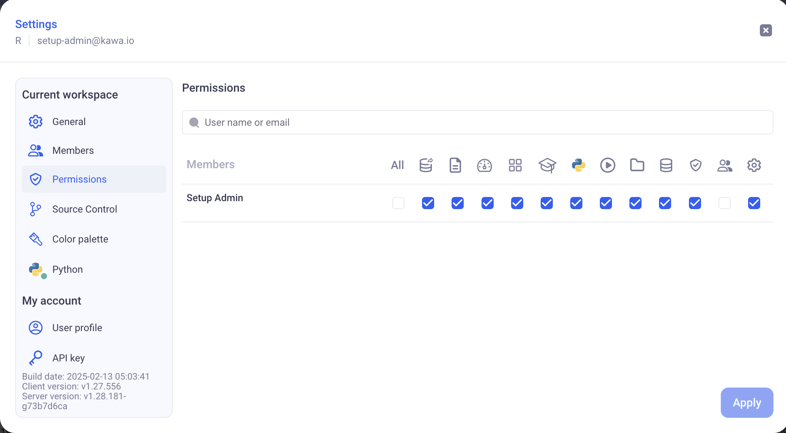

> **⚡ Warning:** Administrative and data access permissions give users ability to directly or indirectly access all data. Those permissions should
be reserved to workspace administrators only.

> **⚡ Warning:** Application wide Administrators will
benefit from ALL those permissions by default.

## 1.4 Teams

Within each workspace, users can be grouped in Teams. 
Teams can be used to share entities with user groups, such as applications,
dashboards, sheets and data sources.

Teams are configured on the GUI, from the settings menu.

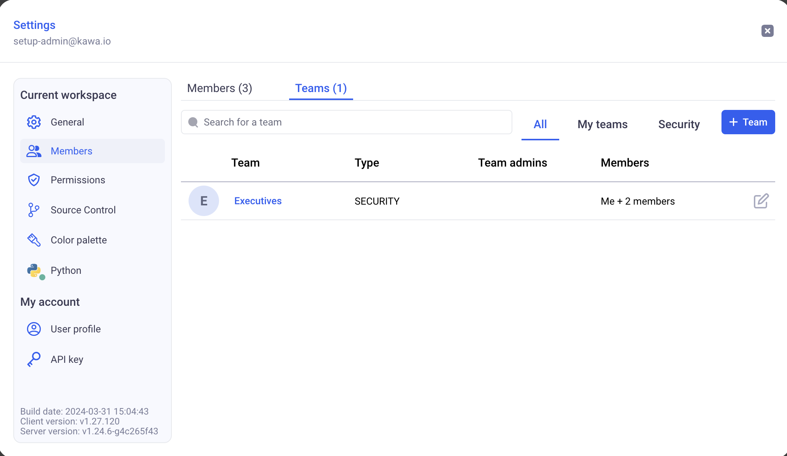

There are two types of teams:

- Sharing teams: Those teams are mainly used to share objects between users.
- Security teams: They work exactly as sharing teams with an additional property: a `security name`. Those are used in row level security and column security configuration policies.

#### Designating team administrators

When adding members to teams, you can designate them as team administrators.
Team administrators do NOT need any specific privileges to manage the members of the teams they administrate.

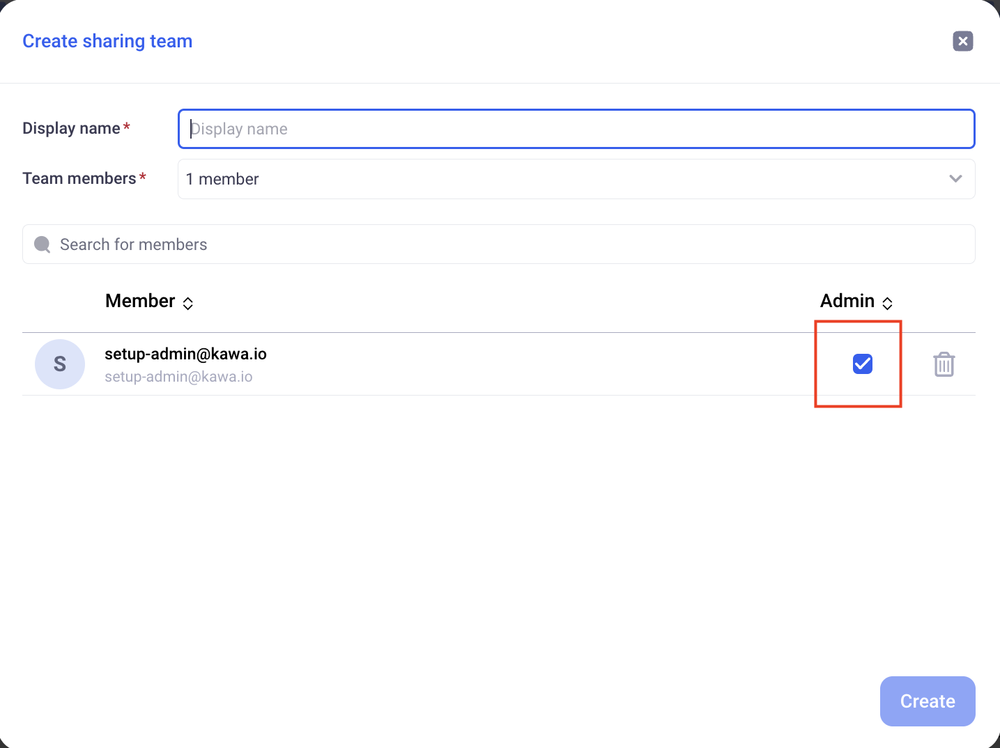

# 2 Sharing

The main assets of KAWA can be shared across the workspace to which they belong.
Sharing allows to set up publishing and collaborating flows between members of the KAWA workspaces.

No information contained in Sheets or Dashboards is confidential, those are mere configuration objects. The security in KAWA only stems from two sources:

- Workspace isolation
- Data ROW and COLUMN level security.

All entities consuming the data (Sheets, Dashboards, Python computations) are without exception subject to the configured RLS and CLS policies.

> **⚡ Important:** Entities can not be shared across workspaces.

__Sharing options__:

Entities can be shared with particular teams or with all the users who can access the workspace.
When sharing an entity:

- Set a general access policy: 
    - `RESTRICTED` means users of the workspace cannot access the entity
    - `VIEWER` means that users of the workspace can access the entity but cannot publish any change on it
     -`EDITOR` this level means that all the users of the workspace can publish changes on the entity

- Set a per team access policy: The same levels apply.

> **⚡ Important:** A user affected by more than one policy will benefit from the higher available access.
If a user is targeted by `RESTRICTED`, `VIEWER` and `EDITOR` simultaneously (through different teams perhaps), they will have the `EDITOR` policy on that entity.

## 2.1 Sharing Sheets and Views

A Sheet contains multiple views, such as charts, grids and pivot tables.
They also contain the business logic, expressed through formulas and python scripts.

### a. Sheets and Views

A sheet can be shared in Read or Write mode with other users or teams of the workspace.

Within a sheet, views can be shared or private. When a view is shared,
it inherits the sharing mode (Read or Write) from its parent sheet.

If a sheet is shared with TeamA for Write, then all the shared views within that sheet will be editable by members of TeamA.

In order to configure sharing parameters for a sheet, use the icon at the top, next to the sheet name.

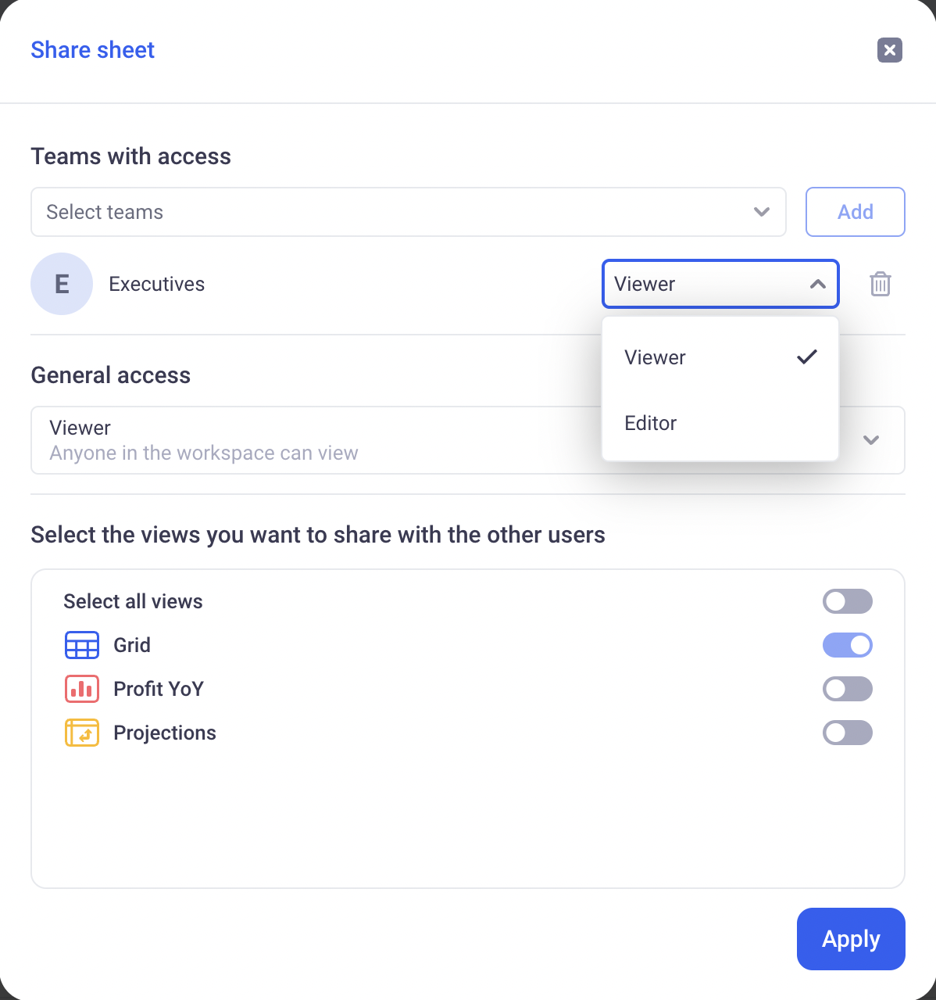

> **⚡ Information:** You can also individually share views, either from the sheet sharing parameters, or from the option menu within each individual view.

__Note about views:__

When views are shared, a control becomes available on them.
It lets users rollback to the latest published version,
publish a new version (if the user has write permission on the view) or save the view as a new object.

### b. Columns: Formulas, Links, Mappings, Python

Within sheets, you can share your columns:
- Formulas,
- Mappings,
- Linked columns,
- Python columns.

This can be done through the sheet model, using the shared checkbox.

Sharing columns will make them available to all users accessing the sheet. They will be able to use those shared columns within their own formulas, and add them to their views - grids, pivots and charts.

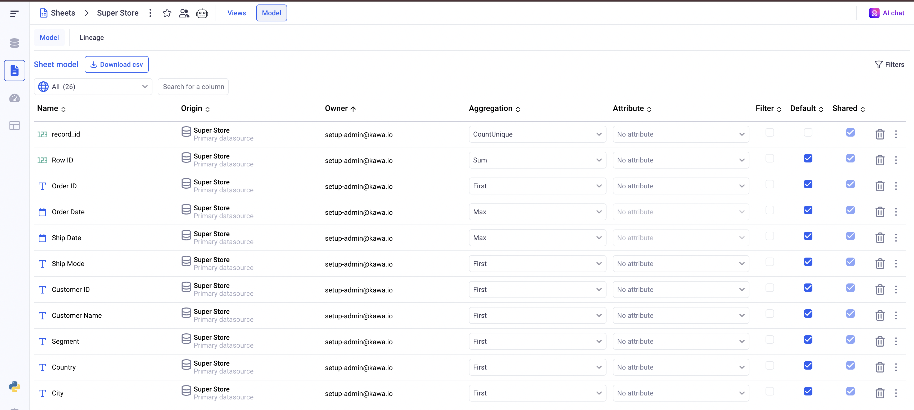

## 2.2 Sharing Data Sources

### a. Data Sources

Data Sources can be shared like sheets, within the application.

> **⚡ Important:** If a data source is shared with some users, those users might __NOT__ see it if the row level security (RLS) configuration is set to __DENY ALL__. Make sure to either upload some specific RLS rules or set the general access to __ALLOW ALL__.

When a data source is shared with writing permissions,
users can configure them and manually override data.

In order for a user to be able to configure row level and column security on a data sources, two conditions must be met:

- The user must be able to edit the data source (shared with writing permissions)
- The user must have the `Manage Data Source Security` flag enabled.

### b. Data Providers

Data providers are databases or external APIs to which KAWA is connected to import data.
When a data provider is restricted, only users with the `Access restricted data and restricted data providers` flag can access them to create new data sources.

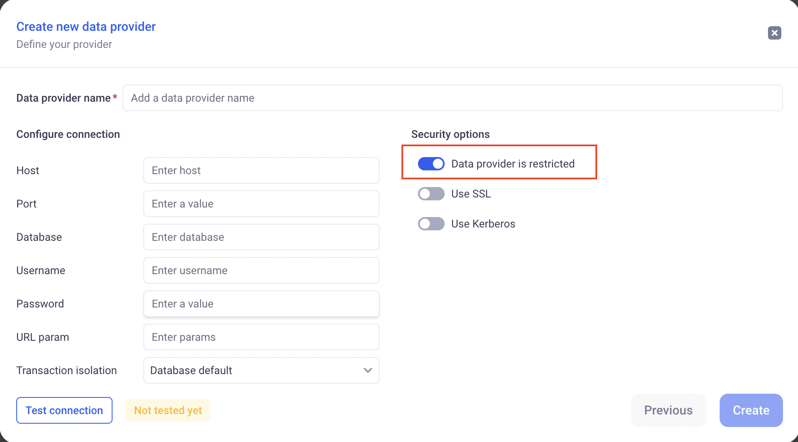

## 2.3 Sharing Dashboards

Dashboards can be shared in the UI, in the same way as sheets and data sources.
All the widgets of the dashboards follow the dashboard sharing policies and publications.

It means that the PUBLISH and ROLLBACK buttons on the dashboard will affect all views of the dashboards automatically.

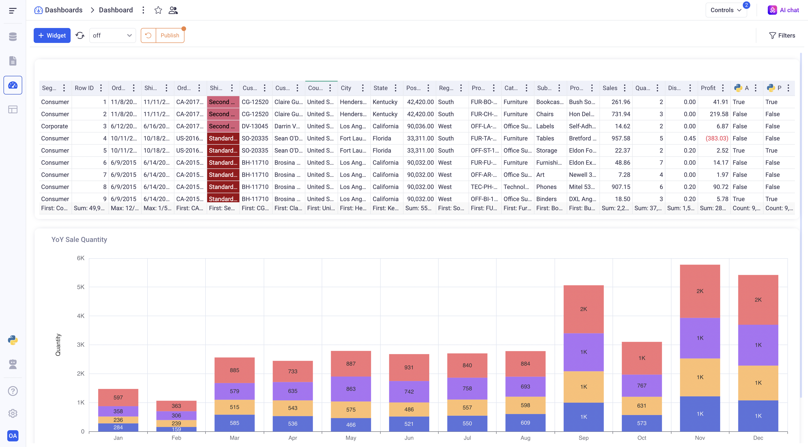

When sheets are used in shared dashboards, modifying elements of their model (like formulas for example), will result in a warning for the users:

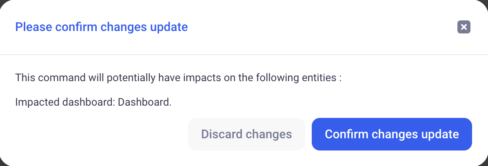

## 2.4 Sharing Apps

Applications can be shared in the UI, in the same way as sheets and data sources.
All the pages of the apps follow the zpp sharing policies and publications.

It means that the PUBLISH and ROLLBACK buttons on the app will affect all pages (views, dashboards) of the app automatically.

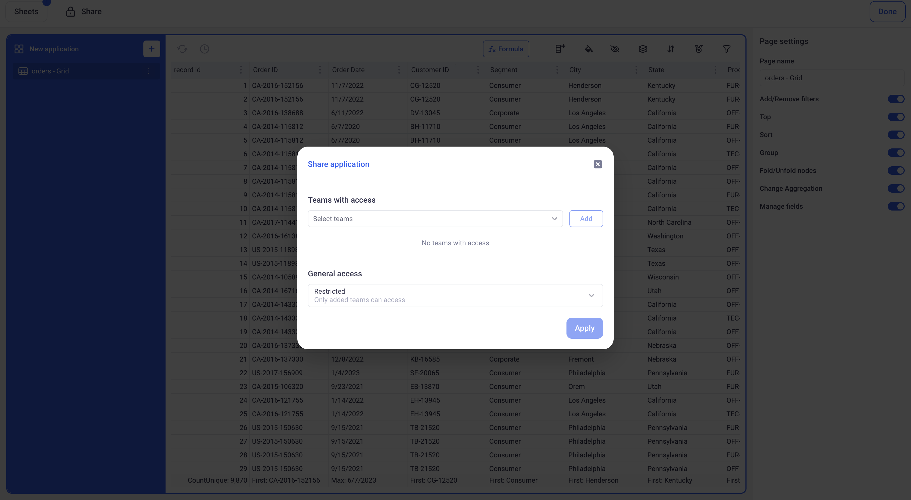

When sheets are used in shared apps, modifying elements of their model (like formulas for example), will result in a warning for the users.

## 2.5 Sharing Knowledge

As with the other entities, Knowledge can be shared in the workspace.
When a user does not have read access to a knowledge, they will not be able to access the 
content of the knowledge anywhere. (Parsed data, previews etc)

