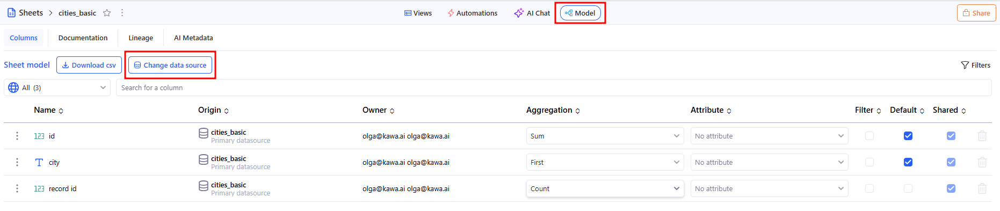
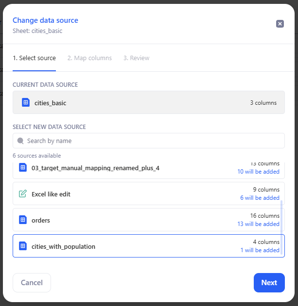
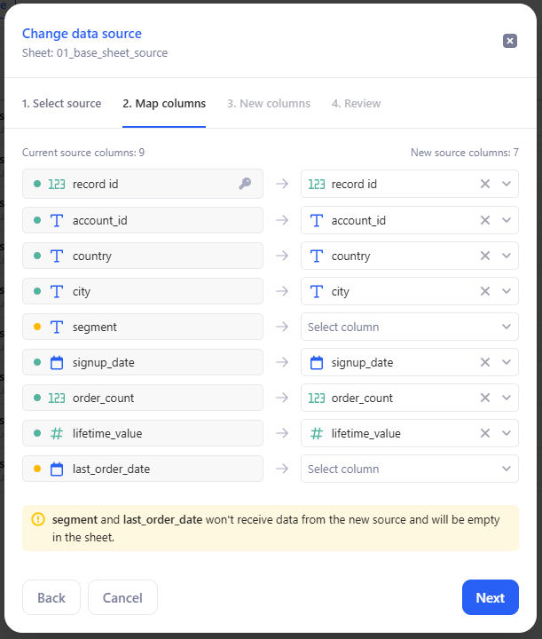
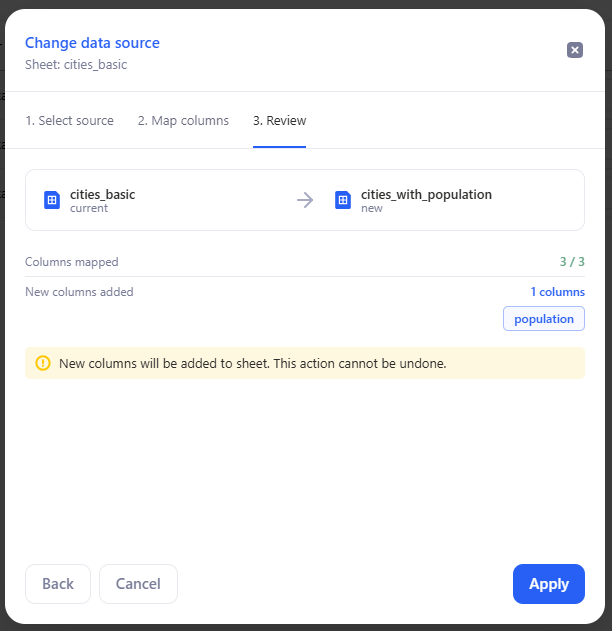
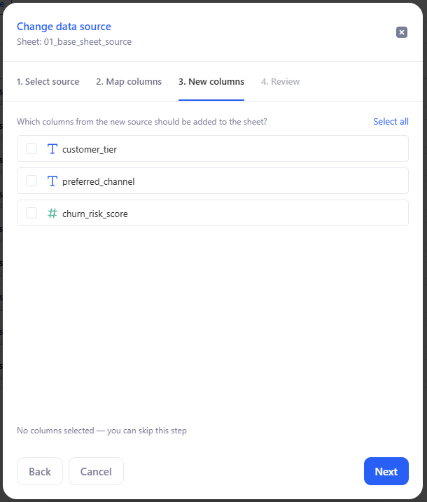
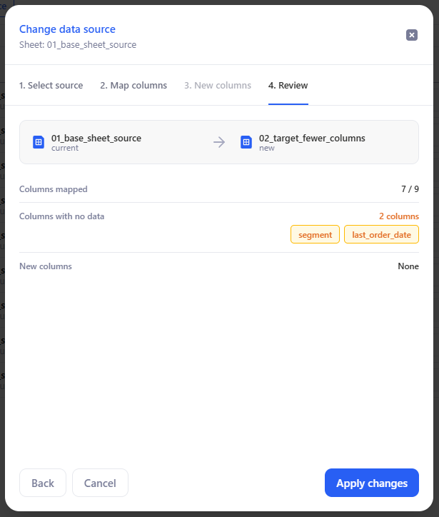
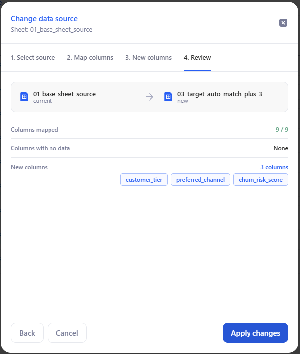
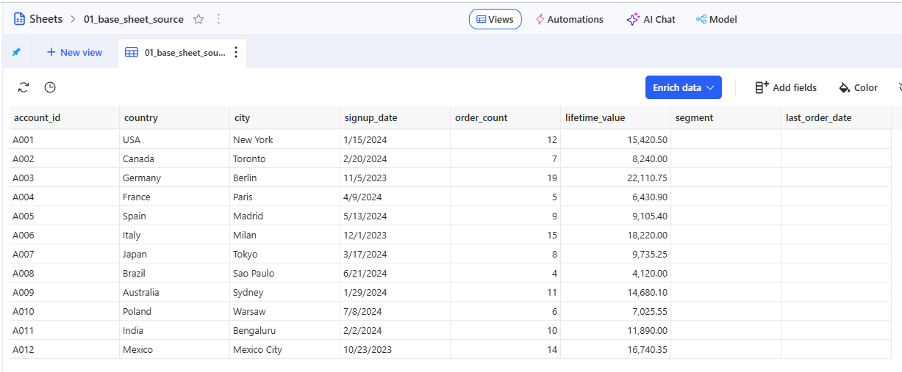

# Change Data Source

Use **Change data source** to replace the primary data source of an existing sheet.

Use this feature when you want to:

* switch the sheet to a source with the same structure
* replace the source with one that has fewer columns
* replace the source with one that has additional columns

## 1. Before you start

* The feature is available from the **Model** tab.
* It is not available for **multi-sheets**.
* The current data source is shown for reference, but it does not appear in the replacement list.
* You can switch to a source with fewer, the same number of, or more columns than the current source.

> You can use this feature even if the sheet already contains charts, pivot tables, grouping, filters, formulas, lookup columns, or mapped columns.

This article uses the following example files:

* `01_base_sheet_source.csv` — the original source
* `02_target_fewer_columns.csv` — a compatible replacement source with fewer columns
* `03_target_auto_match_plus_3.csv` — a compatible replacement source with additional columns

## 2. Open the dialog

1. Open the sheet.
2. Go to **Model**.
3. Click **Change data source**.

<figure><figcaption></figcaption></figure>

KAWA opens a 4-step flow:

1. **Select source**
2. **Map columns**
3. **New columns**
4. **Review**

<figure><figcaption></figcaption></figure>

## 3. Step 1 — Select source

Choose the new data source for the sheet.

For each available source, KAWA shows:

* the source name
* the number of columns
* the difference compared with the current source

Badges show the column-count difference:

* **+N extra** — the new source has more columns
* **N fewer** — the new source has fewer columns

### 3.1 Example

Suppose the sheet currently uses `01_base_sheet_source.csv`.

In the source list, you may see:

* `02_target_fewer_columns.csv` with **2 fewer**
* `03_target_auto_match_plus_3.csv` with **3 extra**

This tells you that one replacement will leave some existing columns without data, while the other may let you add new columns to the sheet.

Click **Next** to continue.

## 4. Step 2 — Map columns

KAWA matches columns from the current sheet to columns in the new data source.

KAWA automatically matches columns when their **name** and **type** are compatible. Review these matches before continuing.

### 4.1 Current source columns

This section shows columns that are currently mapped from the active primary source.

Rules:

* **Key columns must remain mapped.**
* **Non-key columns can be left unmapped.**
* Columns with incompatible types cannot be mapped to each other.
* One target column can be used only once.
* Mapping must remain **1:1**.

If a non-key column is left unmapped, it stays in the sheet but no longer receives data from the new source.

### 4.2 Example: replace with fewer columns

Suppose `01_base_sheet_source.csv` contains these columns:

* `record id`
* `account_id`
* `country`
* `city`
* `segment`
* `signup_date`
* `order_count`
* `lifetime_value`
* `last_order_date`

Now replace it with `02_target_fewer_columns.csv`, which contains:

* `record id`
* `account_id`
* `country`
* `city`
* `signup_date`
* `order_count`
* `lifetime_value`

In this case, KAWA automatically matches 7 columns and leaves these columns unmapped:

* `segment`
* `last_order_date`

These two columns remain in the sheet, but they will no longer receive data after the change.

<figure><figcaption></figcaption></figure>

### 4.3 Previously unmapped columns

If the sheet already contains columns that lost their source mapping during an earlier replacement, KAWA shows them in a separate **Previously unmapped columns** section.

Use this section to reconnect those columns to the new source.

Important behavior:

* KAWA can auto-match these columns when possible.
* These columns are optional to remap.
* A target column from the new source can be used only once across the entire mapping step, including both Current source columns and Previously unmapped columns.

### 4.4 Example: restore unmapped columns later

Suppose you first replace `01_base_sheet_source.csv` with `02_target_fewer_columns.csv` and leave `segment` and `last_order_date` unmapped.

Later, you run **Change data source** again with a source that contains compatible versions of these fields. KAWA shows them in **Previously unmapped columns**, so you can connect them again.

<figure><figcaption></figcaption></figure>

Click **Next** after reviewing the mappings.

## 5. Step 3 — New columns

This step shows columns from the new source that are not used in any existing mapping.

Select the columns you want to add to the sheet.

> Extra columns are not added automatically. Only the columns you select in this step are added.

### 5.1 Example

Replace `01_base_sheet_source.csv` with `03_target_auto_match_plus_3.csv`.

In this case:

* existing compatible columns are mapped first
* unused columns from the new source appear in **New columns**
* only the columns you select are added to the sheet

If you do not select any extra columns, they are ignored.

<figure><figcaption></figcaption></figure>

Click **Next** to continue.

## 6. Step 4 — Review

Before applying the change, KAWA shows a summary of the result.

The summary includes:

* the current data source
* the new data source
* **Columns mapped**
* **Columns with no data**
* **New columns**

### 6.1 Example: fewer columns

If you replace `01_base_sheet_source.csv` with `02_target_fewer_columns.csv`, the review may show:

* **Columns mapped:** `7 / 9`
* **Columns with no data:** `segment`, `last_order_date`
* **New columns:** `None`

<figure><figcaption></figcaption></figure>

### 6.2 Example: additional columns

If you replace `01_base_sheet_source.csv` with `03_target_auto_match_plus_3.csv`, the review shows:

* the mapped existing columns
* the extra columns you selected in **New columns**

Review the summary, then click **Apply changes**.

<figure><figcaption></figcaption></figure>

## 7. What happens to columns with no data

If a non-key column is left unmapped:

* the column remains in the sheet
* it no longer receives data from the primary source
* its cells remain empty
* its data source is shown as **N/A** in field information
* it is excluded from parts of the UI that require an active source mapping

### 7.1 Example

After replacing `01_base_sheet_source.csv` with `02_target_fewer_columns.csv`:

* `segment` remains visible in the sheet
* `last_order_date` remains visible in the sheet
* both columns stay empty until they are remapped in a later replacement

This lets you keep the sheet structure and decide later whether to remap or remove the column.

<figure><figcaption></figcaption></figure>

