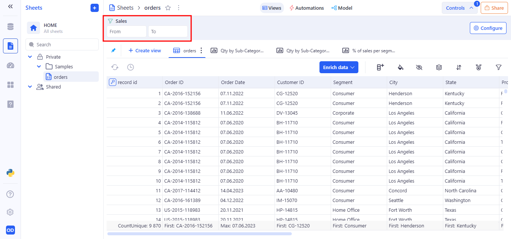

Control Panel
---
The Controls Panel allows users to dynamically customize and interact with data views within the Sheets workspace. It is designed to provide flexibility, improve data exploration, and support user-driven input directly from the interface.

A control is an interactive interface element that is linked to the data on the sheet and allows the user to dynamically filter, configure, or enter values directly in the interface for the immediate updating and viewing of the corresponding data.

The Controls Panel is accessible via the "Controls" button located in the top-right corner of the toolbar, adjacent to the Share button. When expanded, it reveals an area where interactive controls can be configured and added to the current sheet view.

By default, the panel displays the message: “No controls available yet …” This indicates that no controls have been configured for the active view. Users are prompted to begin customization via the “Configure” button.

After clicking the Configure button, the Add new control panel opens from the right side of the screen. After opening it, a categorized list of configurable control types is presented. 

These include:

# 1 Filter Control

The Filter control lets users interactively narrow down the data in the current sheet view by selecting specific values from a chosen column. It is part of the Controls Panel system and is especially useful for narrowing down datasets interactively without modifying the underlying data or requiring complex formulas.

Filter is created from the Add new control modal.

Here is an example of creating a filter for a text field.

Filter behavior at runtime after saving:

- The filter control appears in the Controls Panel.
- Users can select one or multiple values from the dropdown menu.
- The sheet automatically updates to display only the records that match the selected filter criteria.

When setting up a Filter control for a text field, the Values list Display type is used by default. It automatically generates a dropdown menu containing all distinct values from the selected column. This option is ideal for filters, as it allows users to easily select from existing dataset entries without the need to type values manually.

*When configuring a filter control, the Values list display type is selected by default if the column contains text.*

Use Values list to:

- Provide a user-friendly way to filter by predefined column values.
- Avoid errors associated with free text input.
- Enable dynamic population of the control based on real data.
- If Multi selection is enabled, users can select multiple values.

The Range display type is used in Filter controls to enable users to filter data by specifying a numeric interval using From and To inputs. 

 

It is automatically selected by default when the target column contains numeric values.

When configuring a Filter Control, selecting the Free input option as the Display type enables users to manually enter values for filtering — rather than choosing from a predefined list. This mode is ideal for numeric, text, or computed columns where user-entered criteria offer more flexibility.

*In the Add new control tab when creating a filter, select Free input Display type.*

When Free input is selected, an additional field titled Operator becomes available. This lets users define how the inputted value will be compared against the data in the selected column.

- Default Operator: Equals is set by default.
- Customizable: Users can choose from a list of comparison operators to tailor the filter logic.

When to Use Free Input?

- For numeric columns like Profit, Quantity, or Score where exact values or thresholds are important.
- When filtering on fields with large value ranges where dropdowns are impractical.
- When needing precision control over dataset behavior.

For fields with a different data type (e.g., date, datetime), the Display Type selection is not supported.

# 2 Button Control

Button controls serve as interactive triggers for preconfigured Python tool. They can execute Python scripts (code inside a Python tool that can be inserted, but it is not tied to the UI) directly from the interface, making them a powerful feature for data transformation, filtering, statistical analysis, or any automated logic embedded in the sheet. Button controls serve as interactive triggers for preconfigured workflows. They can execute Python scripts directly from the interface, making them a powerful feature for data transformation, filtering, statistical analysis, or any automated logic embedded in the sheet. This control is particularly useful for users who want to apply logic, run analytics, or initiate processes manually with a single click.

To perform an action after clicking a Button Control, you must configure the Action field to Run Python tool. This links the button to a specific Python script or tool available within the current sheet environment.

Once configured, clicking the button will immediately execute the selected Python tool, allowing you to perform operations such as calculations, data transformations, or any custom logic defined in the script.

To link a tool, use the “Python tool” dropdown to choose from available tools, or add a new one from the library.

*Selecting an available Python tool.*

*Add a new Python tool from the library.*

# 3 Variable control

Variable Controls allow users to enter values that can be used in other parts of the sheet, such as formulas and filters. They work like parameters that can be changed at any time, without needing to edit the structure of the table. Variables are independent elements — they do not filter data on their own, but can be linked to other components.

### Available Variable Controls

The following variable types are available when adding a new control:

| **Control Type**       | **Description**                                                                                                  |
| ---------------------- | ---------------------------------------------------------------------------------------------------------------- |
| **Text**               | Accepts single-line freeform text. Useful for keywords, search strings, or identifiers.                          |
| **Number**             | Accepts a single numeric value (integer or float). Ideal for threshold settings or numeric filters.              |
| **Number range**       | Allows users to define a numeric interval (min and max). Commonly used for price, quantity, or metric filtering. |
| **Date**               | Accepts a single calendar date.                                                                                  |
| **Date range**         | Allows users to select a start and end date. Useful for temporal filtering or period-based analysis.             |
| **Date time**          | Captures a full date and time value.                                                                             |
| **Datetime range**     | Allows selection of a time-bound interval with both date and timestamp.                                          |
| **Switch**             | A binary toggle (on/off, true/false). Used for enabling/disabling conditions or options.                         |
| **Single select list** | Dropdown menu allowing the user to choose one value from a predefined list of options.                           |

## 3.1 Text variable

A Text control allows the user to manually enter any string value. It is useful for filtering, defining conditions in formulas, or dynamically providing parameters — such as a city name, region, or keyword.

### Behavior:

- Displays as a single-line text input field.
- Accepts any user-entered string.
- Stores the value as a named variable that can be used in filters and formulas.
- The variable updates in real time and applies within the current sheet view.

### Example Use Case:

You can bind the Location control to a filter on the City column with the following condition:
Operator: Begins with → Variable: Location

This enables dynamic filtering of records based on user input, such as a partial city name.

Using a Text Control in a Formula: 
Suppose you have a variable named Location, created using a text control. You want the formula to check whether the city name in the City column contains the text entered by the user in the Location variable.

How it works:
- Location is a variable that accepts free text input from the user.
- City is a column in the table containing city names.
- CONTAINS() checks whether the entered value appears within the city name.
- The result is "Match" for rows where a match is found, and "No match" otherwise.

Example:
- The user enters "con" in the Location field.
- The formula returns "Match" for Concord.

## 3.2 Number variable

A Number control allows the user to manually enter a single numeric value. This value is stored as a variable and can be used in formulas and filters to create parameterized logic.

### Behavior:

- Displays as a single-line numeric input field in the Controls Panel.
- Accepts any valid number (integer or decimal) entered by the user.
- Stores the input as a named variable that can be referenced in filters, formulas, and Python tools.
- The value updates in real time and is applied instantly across the current view wherever the variable is used.

### Example Use Case:

You can bind a Number control to a Profit numeric column in a filter. For example:
Operator: Greater than or equals → Variable: Min Profit

This means: only rows where Profit is greater than or equal to the value entered by the user in the Min Profit field will be shown.

Usage in Formulas. A number variable can be used in a formula for conditional calculations:

- Profit is a numeric column in the table.
- MinProfit is a variable linked to a Number control.
- The formula returns "High" for rows where profit is greater than the variable's value, and "Low" otherwise.

Example:
- The user enters 150 000 in the Min Profit field.
- The formula returns "High" for rows where Profit > 150 000.
- The formula returns "Low" for rows where Profit <= 150 000.

## 3.3 Number range variable

The Number range control allows users to enter a minimum and maximum numeric value to define an interval.

### Example Use Case:

Usage in Formulas. To reference the range in a formula, use both boundaries:

## 3.4 Date variable

The Date control allows users to select a specific calendar date through a visual date picker. It stores the selected value as a variable that can be used in filters and formulas and - enabling dynamic, date-driven logic in the sheet view.

### Behavior

- Renders a single date picker input
- Accepts any valid calendar date
- Stores the selected date as a named variable
- Updates all connected components (filters, formulas) in real time

### Example Use Case:

You can bind a Date control to a Order Date column in a filter. For example:
Operator: Is on or after → Variable: StartDate

This filter will display only the records where the order was placed on or after the selected date.

Usage in Formula

This formula uses the date selected in the control to label rows based on whether the order date is on or after the specified day.

## 3.5 Date range variable

The Date range control allows users to select a start and end date to define a time interval.

### Example Use Case:

Usage in Formulas. To reference the range in a formula, use both boundaries:

## 3.6 Date time variable

Date Time control allows users to input a precise date and time value, stored as a variable. This control is ideal for scenarios where both the calendar date and the specific time of day are important for filtering data, running calculations.

### Behavior:

- Appears as a combined date and time picker
- Saves the selected value as a named variable (e.g. StartTime)
- Variable can be referenced in filters or formulas
- Updates dynamically — changes take effect across all components using the variable

### Example Use Case:

You can bind a Date time control to a Created At column in a filter. For example:
Operator: Is on or after → Variable: StartTime

This filters all records that were created on and after the selected date and time.

Usage in Formula

This formula returns "Late" for records created after the specified time, and "On Time" otherwise.

## 3.7 Datetime range variable

The Datetime range control allows the user to select a range that includes both the start and end date and exact time.

### Example Use Case:

Usage in Formulas. To reference the range in a formula, use both boundaries:

## 3.8 Switch variable

The Switch control is a toggle input designed for binary user choices such as true/false, yes/no, or on/off conditions.

### Example Use Case:

Usage in Formulas

- With MySwitch = Off, SwitchStatus shows “Disabled” 
- Toggling MySwitch = On changes all SwitchStatus values to “Enabled” instantly

## 3.9 Single select list variable

The Single Select List control allows users to choose one option from a predefined dropdown list. The selected value is stored as a variable that can be used throughout the sheet - in filters and formulas.

### Behavior:

- Appears as a dropdown menu with a fixed list of values
- Only one value can be selected at a time
- Stores selection as a named variable (e.g. Location)
- Variable can be referenced in filters and formulas

A user can add values to a Single select list variable in two ways:
- Custom values
The user manually enters a set of predefined values, from which only one can be selected.

- From a column
The user selects a column from a table, and all unique values from that column are automatically used as options.

### Example Use Case:

You can bind a Single Select List control to a City column in a filter. For example:
Operator: Equals → Variable: Location

Shows only records that belong to the selected city from the dropdown.

Usage in Formula

Returns Sales only for rows matching the selected category; otherwise returns 0.

## 3.10 Multi select list variable

The Multi select list variable control allows users to choose multiple values from a predefined or dynamically loaded list. This control is useful when filtering or computing data based on more than one matching value.

### Behavior:

- Appears as a dropdown menu with a fixed list of values
- Multiple value can be selected at a time
- Stores selection as a named variable (e.g. Location)
- Variable can be referenced in filters and formulas

A user can add values to a Multi select list variable in two ways:
- Custom values
  The user manually enters a set of predefined values, from which only one can be selected.
- From a column
  The user selects a column from a table, and all unique values from that column are automatically used as options.

### Example Use Case:

Usage in Formula

Returns Selected only for rows matching the selected category; otherwise returns 0ther.

