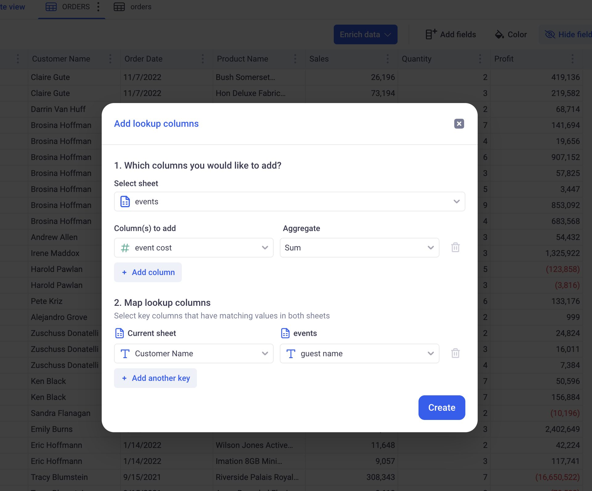
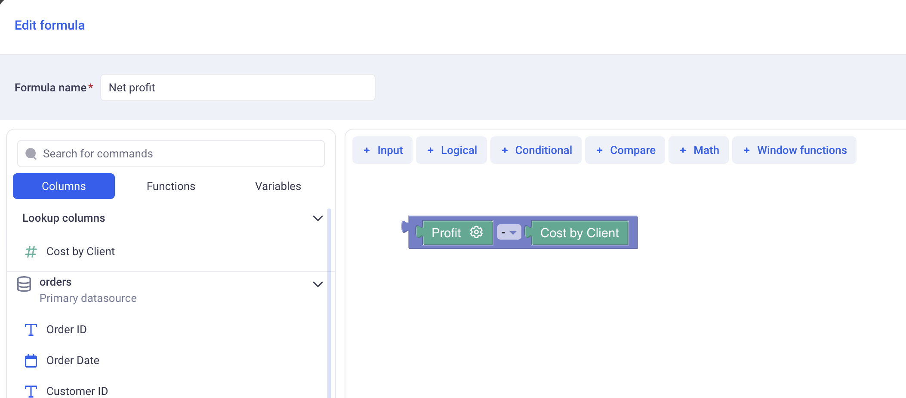

Lookup Columns
---

* TOC
{:toc}

# 1 What is a lookup column? 

Lookup columns are similar to VLookup in Excel. They allow to mix data from various sources in one place.

## 1.1 Creating a first lookup column

We have two sheets, one showing orders made by clients in an online store, and another one showing events to which clients were invited.

_Table 1: Orders placed by clients_

_Table 2: Events where customer where invited_

> Those two sheets have a column in common: `Customer name` in the Orders sheet and `guest name` in the Events sheet. Those columns have different name but their content is similar.

If we want to answer the question: __Which customer is the most profitable?__ - Computing net profit by subtracting the cost of all events someone attended to the Profit that was made from Orders alone - We would need to bring in the same place the Profit from Orders and the Cost of events.

In order to do that, you first need to create a lookup column (That will lookup the total cost of event for each customer):

Clicking on Enrich Data > Lookup column brings up the following configuration form:

- _Select sheet:_ Which sheet do we want to bring column from. Here, working from within the ORDERS sheet, we want to bring data from the EVENTS sheet.

- _Columns to add:_ From the EVENTS sheet, we are interested in the SUM of event cost.

- _Map Lookup Columns:_ In this step, we define how the mapping between ORDERS sheet and EVENTS sheet will be made. Here, we ar looking up guest name in EVENTS with Customer name in ORDERS.

Clicking on APPLY will add a new column to the ORDERS sheet, as shown in red below:

> The new column has a purple icon in its header that indicates that it is a Lookup Column. It contains, for each customer, the TOTAL of event cost they attended.

> Notice also that this lookup columns will automatically perform a SUM DISTINCT per customer. Looking at "Aaron Bergman", you notice that the value 350 (which is the SUM of TOTAL event cost), is the same on the Group level and on each row. This is because, each customer will be counted only once in each SUM.

## 1.2 Parameters of lookup columns

Lookup columns have the following parameters:

- A main sheet: This is the sheet to which the lookup column belongs.

- A target sheet: this is where data will be fetched from (It can be the same as the main sheet).

- A metric from the target sheet: This is the column from the target sheet with an aggregation method, that we are connecting through the lookup column. For example: The SUM of EVENT COSTS.

- A mapping (Or join) definition: It defines how the lookup will take place. This mapping requires a list of column pairings: One from the main sheet, with one of the target sheet. For example: 

| Main Sheet   | Target Sheet
|--------------|---------------|
| Customer Name | Client Name

_With this mapping configuration, Customer name from the main sheet will be matched against Client name in the target Sheet._

It is very helpful to think of the mapping definition as the __Granularity__ of the Linked column. In our example, our linked column has a Granularity at the guest name level.

In addition to these parameters, Lookup columns can also have filters. Those restrict the scope of what is available for Lookup. For example, I can filter by `event_year == current year`. This will restrict the scope and only return events for the current year. Our SUM of EVENT COSTS will only be SUM of EVENT COSTS for this year only.

> Filters cannot be configured when creating the columns themselves. They can only be added on once they already exist.

## 1.3 How are lookup columns computed

Let's keep our example: The TOTAL COST of events per customer.
Here is the raw data:

_Events sheet:_ It shows various events with guest name and cost

| event date   | Guest name    | Cost    |
|--------------|---------------|---------|
| 01/01/2025   | Bruce Wayne   | $1,000  |
| 01/02/2025   | Bruce Wayne   | $2,000  |
| 01/03/2025   | Bruce Wayne   | $3,000  |
| 01/01/2025   | Lucius Fox    | $4,000  |
| 01/02/2025   | Lucius Fox    | $5,000  |

_Orders sheet:_ It shows various orders with profit and customer

| order id     | Client name   | Profit   |
|--------------|---------------|----------|
| O-12345      | Bruce Wayne   | $10,000  |
| O-12346      | Bruce Wayne   | $15,000  |
| O-12349      | Lucius Fox    | $10,000  |
| O-12350      | Lucius Fox    | $12,000  |
| O-12351      | Lucius Fox    | $10,000  |
| O-12352      | Lucius Fox    | $14,000  |

### 1.3.1 Step 1: Partitioning and aggregating the target sheet (Events)

The Target sheet (Events) is partitioned by the Granularity (Here the guest name). Each partition will have: 

- One guest name (which is the partition name)
- A TOTAL COST for that guest name.

| Partition    | Total Cost    |
|--------------|---------------|
| Bruce Wayne  | $6,000        |
| Lucius Fox   | $9,000        |

_After step 1,the Event sheet is grouped by guest name and the Cost of all events is aggregated with the SUM aggregation_

> Note that the aggregation (here SUM) can be set to anything. It is a parameter of the linked column. 

### 1.3.2 Step 2: Injecting the partitioned data in the main sheet (Orders)

Once the partition has be computed, we can now inject their value in the main sheet.
In the table below, see how we inject $6,000 to the lines where the customer is Bruce Wayne and how we inject $9,000 to the lines where the customer is Lucius Fix.

| order id     | Client name   | Profit   | Total Event Cost |
|--------------|---------------|----------|------------------|
| O-12345      | Bruce Wayne   | $10,000  | $6,000  
| O-12346      | Bruce Wayne   | $15,000  | $6,000  
| O-12349      | Lucius Fox    | $10,000  | $9,000
| O-12350      | Lucius Fox    | $12,000  | $9,000
| O-12351      | Lucius Fox    | $10,000  | $9,000
| O-12352      | Lucius Fox    | $14,000  | $9,000

### 1.3.3 Step 3: Aggregating the injected data in the main sheet (Orders)

Whether we are working in Grids, Pivot tables or Charts, we almost only deal with aggregated data. Data from lookup columns can also be aggregated in the Main sheet.

In the table below, the aggregated values where indicated in the bottom row.

| order id     | Client name   | Profit   | Event Cost per Client |
|--------------|---------------|----------|------------------|
| O-12345      | Bruce Wayne   | $10,000  | $6,000  
| O-12346      | Bruce Wayne   | $15,000  | $6,000  
| O-12349      | Lucius Fox    | $10,000  | $9,000
| O-12350      | Lucius Fox    | $12,000  | $9,000
| O-12351      | Lucius Fox    | $10,000  | $9,000
| O-12352      | Lucius Fox    | $14,000  | $9,000
|--------------|---------------|----------|------------------|
| COUNT:       |COUNT UNIQUE:  | SUM:     | SUM:
| __6__        | __2__         | __$71,000__ | __$15,000__

When adding the profit together, notice that KAWA does a simple SUM across all rows.
In fact, `$10,000 + $15,000 + $10,000 + $12,000  + $10,000 + $14,000 = $71,000`.

However, when adding the event cost by client, KAWA does a sum distinct, counting each client only once. More generally, at each level of grouping, KAWA will keep track of all the partitions met and count them only once.

Here, there is only one group, containing all the rows (The grand total is performed on all the rows). KAWA detects that the partition `Bruce Wayne` appears twice and that the partition `Lucius Fox` is here three times. It then counts each one once only when performing the Sum.

### 1.3.4 Step 4: Mixing local columns with lookup columns in a sheet

To complete our example, we want to compute, for each customer, its net profit. This is done by subtracting the Total profit and the Event cost, for each customer.

Here, the net profit for Bruce Wayne would be:

`NET PROFIT('Bruce Wayne') = ( $10,000 + $15,000 ) - $6,000 = $19,000`

Notice that in this formula, we are dealing with two different granularities:
- Profit is at the Order granularity, there is one value per order.
- Event cost is at the Customer granularity, there is only one value per customer.

In KAWA, you would write this simply like this:

When aggregating values of this formula together, meaning computing:

`SUM( Net Profit) = SUM( Profit - Cost by Client)`

KAWA will look at all the granularities within the aggregation and will automatically apply the Distinct functions for each one, at the right level. Here, profit will be summed at the Order granularity and Cost by client at the client granularity.

> ⚠️ This system will not work when one aggregation operations deal with multiple granularities originating from multiple linked columns. To make those case work, please refer to the [Level of detail documentation](./02_1_formulas#b-levels-of-detail). You would need to wrap each Linked column in its own group function. 

| order id     | Client name   | Profit   | Cost per Client | Net Profit
|--------------|---------------|----------|-----------------|-------------|
| O-12345      | Bruce Wayne   | $10,000  | $6,000          | $4,000      |
| O-12346      | Bruce Wayne   | $15,000  | $6,000          | $9,000      |
| O-12349      | Lucius Fox    | $10,000  | $9,000          | $1,000      |
| O-12350      | Lucius Fox    | $12,000  | $9,000          | $3,000      |
| O-12351      | Lucius Fox    | $10,000  | $9,000          | $1,000      |
| O-12352      | Lucius Fox    | $14,000  | $9,000          | $5,000      |
|--------------|---------------|----------|-----------------|-------------|
| COUNT:       |COUNT UNIQUE:  | SUM:     | SUM:            | SUM:        |
| __6__        | __2__         | __$71,000__ | __$15,000__  | __$56,000__ |

The Total net profit is `$71,000 + $15,000 = $56,000`. Also note that the net profit at row level do not make much sense as we subtract the total cost per client with the profit for one order only. 
