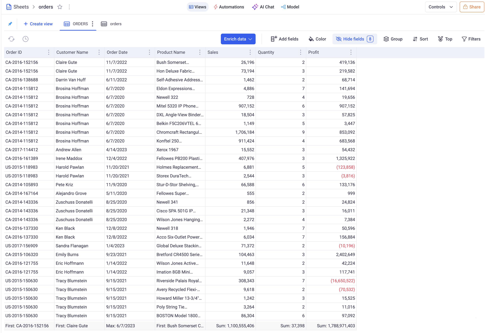
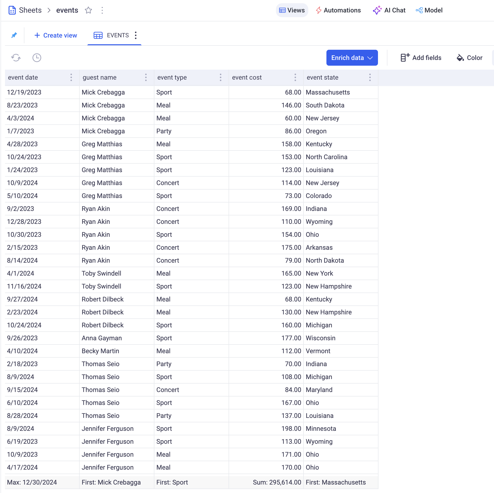
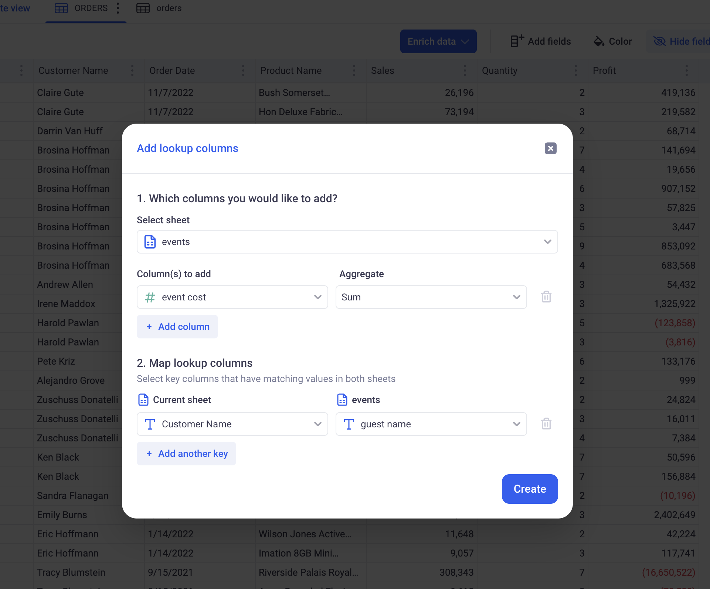
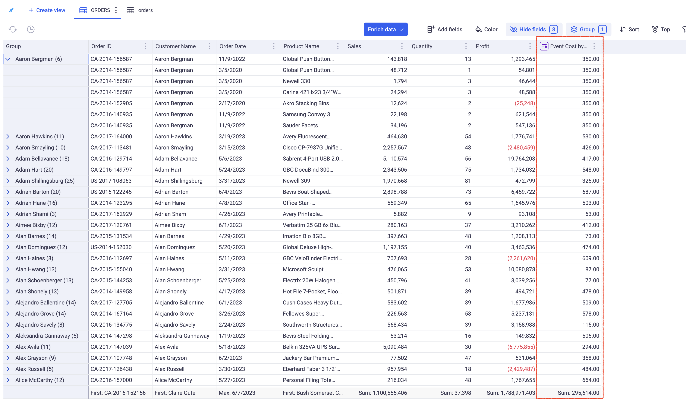
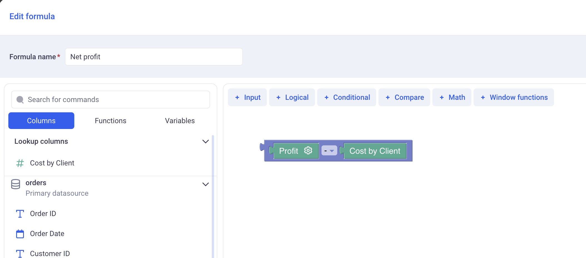
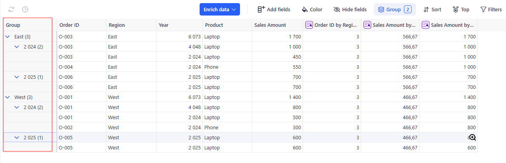
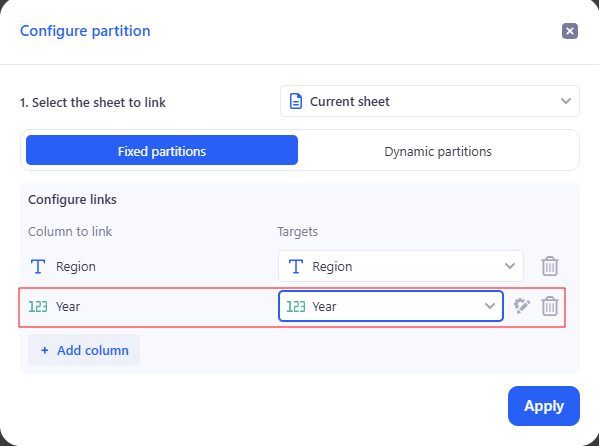

# Lookup columns

## 1. What is a lookup column?

Lookup columns are similar to the VLookup operation in Excel. They allow to mix data from various sources in one place. In KAWA, they allow to join data sources together in an intuitive and powerful way, keeping consistency in all derived computations.

Throughout this paragraph, we will use the following setup: Two sheets, one showing orders made by clients in an online store, and another one showing events to which clients were invited.

_Table 1: Orders placed by clients_

_Table 2: Events where customer where invited_

> Those two sheets have a column in common: `Customer name` in the Orders sheet and `guest name` in the Events sheet. Those columns have different names but their content is similar - they both refer to the same dimension and have values in common.

### 1.1 Creating our first lookup column

If we want to bring in the Orders sheet the cost of all events clients went to, we would need to create a lookup column:

Clicking on Enrich Data > Lookup column brings up the following configuration form:

* _Select sheet:_ Which sheet do we want to bring column from. Here, working from within the Orders sheet, we want to bring data from the Events sheet.
* _Columns to add:_ From the Events sheet, we are interested in the SUM of event cost.
* _Map Lookup Columns:_ In this step, we define how the mapping between the Orders sheet and Events sheet will be made. Here, we ar looking up guest name in Events with Customer name in Orders.

Clicking on APPLY will add a new column to the Orders sheet, as shown in red below:

> The new column has a purple icon in its header that indicates that it is a Lookup Column. It contains, for each customer, the TOTAL of event cost they attended.

> A One-to-Many join has been made: One customer corresponds to Many events.

> Notice also that this lookup columns will automatically perform a SUM DISTINCT per customer. Looking at "Aaron Bergman", you notice that the value 350 (which is the SUM of TOTAL event cost), is the same on the Group level and on each row. This is because, each customer will be counted only once in each SUM.

### 1.2 Parameters of lookup columns

Lookup columns have the following parameters:

* A main sheet: This is the sheet to which the lookup column belongs (The Orders sheet).
* A target sheet: this is where data will be fetched from (It can be the same as the main sheet). Here: the Events sheet.
* A metric from the target sheet: This is the column from the target sheet with an aggregation method, that we are connecting through the lookup column. In our example: The SUM of EVENT COSTS.
* A mapping (or join) definition: It defines how the lookup will take place. This mapping requires a list of column pairings: One from the main sheet, with one of the target sheet. In our example:

| Main Sheet: Orders | Target Sheet: Events |
| ------------------ | -------------------- |
| Customer Name      | Guest Name           |

_With this mapping configuration, "Customer name" from the main sheet will be matched against "Guest name" in the target sheet._

It is very helpful to think of the mapping definition as the **Granularity** of the Linked column. In our example, our linked column has a Granularity at the guest name level.

In addition to these parameters, Lookup columns can also have filters. Those restrict the scope of what is available for Lookup. For example, I can filter by `event_year == current year`. This will restrict the scope and only return events for the current year. Our SUM of EVENT COSTS will only be SUM of EVENT COSTS for this year only.

> Filters cannot be configured when creating the columns themselves. They can only be added on once they already exist.

### 1.3 How are lookup columns computed

Let's keep our example: The TOTAL COST of events per customer. Here is the raw data:

_Events sheet:_ It shows various events with guest name and cost

| event date | Guest name  | Cost   |
| ---------- | ----------- | ------ |
| 01/01/2025 | Bruce Wayne | $1,000 |
| 01/02/2025 | Bruce Wayne | $2,000 |
| 01/03/2025 | Bruce Wayne | $3,000 |
| 01/01/2025 | Lucius Fox  | $4,000 |
| 01/02/2025 | Lucius Fox  | $5,000 |

_Orders sheet:_ It shows various orders with profit and customer

| order id | Client name | Profit  |
| -------- | ----------- | ------- |
| O-12345  | Bruce Wayne | $10,000 |
| O-12346  | Bruce Wayne | $15,000 |
| O-12349  | Lucius Fox  | $10,000 |
| O-12350  | Lucius Fox  | $12,000 |
| O-12351  | Lucius Fox  | $10,000 |
| O-12352  | Lucius Fox  | $14,000 |

#### 1.3.1 Step 1: Partitioning and aggregating the target sheet (Events)

The Target sheet (Events) is partitioned by the Granularity (Here the guest name). Each partition will have:

* One guest name (which is the partition name)
* A TOTAL COST for that guest name.

| Partition   | Total Cost |
| ----------- | ---------- |
| Bruce Wayne | $6,000     |
| Lucius Fox  | $9,000     |

_After step 1,the Event sheet is grouped by guest name and the Cost of all events is aggregated with the SUM aggregation_

> Note that the aggregation (here SUM) can be set to anything. It is a parameter of the linked column.

#### 1.3.2 Step 2: Injecting the partitioned data in the main sheet (Orders)

Once the partition has been computed, we can now inject their value in the main sheet. In the table below, see how we inject $6,000 to the lines where the customer is Bruce Wayne and how we inject $9,000 to the lines where the customer is Lucius Fox.

| order id | Client name | Profit  | Total Event Cost |
| -------- | ----------- | ------- | ---------------- |
| O-12345  | Bruce Wayne | $10,000 | $6,000           |
| O-12346  | Bruce Wayne | $15,000 | $6,000           |
| O-12349  | Lucius Fox  | $10,000 | $9,000           |
| O-12350  | Lucius Fox  | $12,000 | $9,000           |
| O-12351  | Lucius Fox  | $10,000 | $9,000           |
| O-12352  | Lucius Fox  | $14,000 | $9,000           |

#### 1.3.3 Step 3: Aggregating the injected data in the main sheet (Orders)

Whether we are working in grids, pivot tables or charts, we almost only deal with aggregated data. Data from lookup columns can also be aggregated in the main sheet.

In the table below, the aggregated values are indicated in the bottom row.

| order id       | Client name     | Profit      | Event Cost per Client |
| -------------- | --------------- | ----------- | --------------------- |
| O-12345        | Bruce Wayne     | $10,000     | $6,000                |
| O-12346        | Bruce Wayne     | $15,000     | $6,000                |
| O-12349        | Lucius Fox      | $10,000     | $9,000                |
| O-12350        | Lucius Fox      | $12,000     | $9,000                |
| O-12351        | Lucius Fox      | $10,000     | $9,000                |
| O-12352        | Lucius Fox      | $14,000     | $9,000                |
| -------------- | --------------- | ----------  | ------------------    |
| COUNT:         | COUNT UNIQUE:   | SUM:        | SUM:                  |
| **6**          | **2**           | **$71,000** | **$15,000**           |

When adding the profit together, notice that KAWA does a simple SUM across all rows. In fact, `$10,000 + $15,000 + $10,000 + $12,000 + $10,000 + $14,000 = $71,000`.

> However, when adding the event cost by client, KAWA does a sum distinct, counting each client only once. More generally, at each level of grouping, KAWA will keep track of all the partitions met and count them only once.

Here, there is only one group, containing all the rows (The grand total is performed on all the rows). KAWA detects that the partition `Bruce Wayne` appears twice and that the partition `Lucius Fox` is here three times. It then counts each one once only when performing the Sum. That explains why the SUM of event cost by client is: `$6,000 + $9,000 = $15,000` and not `$6,000 + $6,000 + $9,000 + $9,000 + $9,000 + $9,000`.

#### 1.3.4 Step 4: Mixing local columns with lookup columns in a sheet

To complete our example, we want to compute the net profit per customer. This is done by subtracting the Total profit and the Event cost, for each customer.

Here, the net profit for Bruce Wayne would be:

`NET PROFIT('Bruce Wayne') = ( $10,000 + $15,000 ) - $6,000 = $19,000`

Notice that in this formula, we are dealing with two different granularities:

* Profit is at the _Order granularity_, there is one value per order.
* Event cost is at the _Customer granularity_, there is only one value per customer.

In KAWA, you would write this simply like this:

When aggregating values of this formula together, meaning computing:

`SUM( Net Profit) = SUM( Profit - Cost by Client)`

KAWA will look at all the granularities within the aggregation and will automatically apply the Distinct functions for each one, at the right level. Here, profit will be summed at the Order granularity and Cost by client at the client granularity.

> This system will not work when one aggregation operation deals with multiple granularities originating from multiple linked columns. To make those cases work, please refer to the [Level of detail documentation](03_01_formulas.md#id-1.2-types-and-levels-of-detail). You would need to wrap each Linked column in its own group function.

| order id       | Client name     | Profit      | Cost per Client   | Net Profit    |
| -------------- | --------------- | ----------- | ----------------- | ------------- |
| O-12345        | Bruce Wayne     | $10,000     | $6,000            | $4,000        |
| O-12346        | Bruce Wayne     | $15,000     | $6,000            | $9,000        |
| O-12349        | Lucius Fox      | $10,000     | $9,000            | $1,000        |
| O-12350        | Lucius Fox      | $12,000     | $9,000            | $3,000        |
| O-12351        | Lucius Fox      | $10,000     | $9,000            | $1,000        |
| O-12352        | Lucius Fox      | $14,000     | $9,000            | $5,000        |
| -------------- | --------------- | ----------  | ----------------- | ------------- |
| COUNT:         | COUNT UNIQUE:   | SUM:        | SUM:              | SUM:          |
| **6**          | **2**           | **$71,000** | **$15,000**       | **$56,000**   |

The Total net profit is `$71,000 + $15,000 = $56,000`. Also note that the net profit at row level do not make much sense as we subtract the total cost per client with the profit for one order only.

## 2. Using Lookup Columns with a Single Sheet

### 2.1 When is this useful?

You don’t need two sheets to use Lookup Columns. Even with a single sheet, you can match rows to each other. This is helpful when:

* You want to compare detailed data to totals (e.g. each order vs. total by region).
* You want to bring in group-level metrics (like sums or averages) next to individual rows.
* You want to avoid using formulas or manually duplicating summary data.

### 2.2 Example: Sales Data

Let’s say you have a sheet called **Sales** with each row as an order:

| Order ID | Region | Year | Product | Sales Amount |
| -------- | ------ | ---- | ------- | ------------ |
| O-001    | West   | 2024 | Laptop  | 500          |
| O-002    | West   | 2024 | Phone   | 300          |
| O-003    | East   | 2024 | Laptop  | 450          |
| O-004    | East   | 2024 | Phone   | 550          |
| O-005    | West   | 2025 | Laptop  | 600          |
| O-006    | East   | 2025 | Laptop  | 700          |

### 2.3 Step-by-step: Adding Lookup Columns in the same sheet

#### 2.3.1 Step 1 — Total sales per Region & Year

* In the Sales sheet, click on “Enrich Data” → choose Lookup Column.
* Under Select sheet, choose the Current sheet (Sales).
* In Columns to add, choose the column Sales Amount and set aggregation to SUM.
* Under Map lookup columns, match:
  * Current Sheet: Region ↔ Lookup Sheet (also Sales): Region
  * Current Sheet: Year ↔ Lookup Sheet (also Sales): Year
* Click Create.
* Get a column: Sales Amount by Region, Year.

#### 2.3.2 Step 2 — Average sales per Region

In the same Lookup Column setup:

* Column to add: Sales Amount → Aggregation: AVERAGE.
* Map lookup columns:
  * Region ↔ Region
* Get a column: Sales Amount by Region.

#### 2.3.3 Step 3 — Order count per Region

* Column to add: Order ID → Aggregation: COUNT.
* Map lookup columns:
  * Region ↔ Region
* Get a column: Order ID by Region .

#### 2.2.4 Result

Your table will now look like this:

| Order ID | Region | Year | Product | Sales Amount | Sales Amount by Region, Year | Sales Amount by Region | Order ID by Region |
| -------- | ------ | ---- | ------- | ------------ | ---------------------------- | ---------------------- | ------------------ |
| O-001    | West   | 2024 | Laptop  | 500          | 800                          | 466.7                  | 3                  |
| O-002    | West   | 2024 | Phone   | 300          | 800                          | 466.7                  | 3                  |
| O-003    | East   | 2024 | Laptop  | 450          | 1 000                        | 566.7                  | 3                  |
| O-004    | East   | 2024 | Phone   | 550          | 1 000                        | 566.7                  | 3                  |
| O-005    | West   | 2025 | Laptop  | 600          | 600                          | 466.7                  | 3                  |
| O-006    | East   | 2025 | Laptop  | 700          | 700                          | 566.7                  | 3                  |

These three examples show how Lookup Columns can give you different perspectives on your data without leaving the original sheet.

* **Sales Amount by Region**, Year helps you quickly compare each row’s sales to the total for its region in a specific year.
* **Sales Amount by Region** shows the typical sales value for that region, useful for benchmarking performance.
* **Order ID by Region** reveals the volume of transactions, allowing you to spot high-activity areas.

By combining these aggregations, you can analyze sales performance, identify trends, and uncover patterns — all dynamically, without manual grouping or formulas.

### 2.3 Different grouping levels

* Group by 1 field → e.g., Region only → total sales for all years and products in that region.

* Group by 2 fields → e.g., Region + Year → total sales for that region in that year.

* Group by 3 fields → e.g., Region + Year + Product → most granular aggregation.

The grouping level is defined by the fields you map in Map lookup columns.

* With fewer grouping fields, you get a higher-level summary for broad trends and strategic insights.
* With more grouping fields, you can drill down into detailed performance, compare specific product lines, or analyze results within precise segments.

This flexibility means you can move seamlessly between a big-picture overview and granular investigation, all within the same table and without creating separate reports.

### 2.4 Why this is powerful

* Easy comparison: See both row-level and group-level data side by side.
* Auto aggregation: KAWA calculates the totals — no formulas needed.
* Flexible: You can use this with categories, dates, customers, etc.

## 3. Editing lookup columns

> This section explains how to edit an existing Lookup Column and change the grouping level using aggregations, filters, and partitions (fixed or dynamic), using a single Sales table as the example.

### 3.1 Example: from simple counting to flexible analysis

#### 3.1.1 Step 1 — Open editing

Click the **Sales Amount by Region, Year** column header.

#### 3.1.2 Step 2 — Open editing

* In Column name, enter Sales Amount by Region, Year (2024).
* In Filters, turn off Sync with main view (so it won’t inherit global filters).
* Click + → add Year = 2024.

* Click Apply.

You now have a column with a local 2024 filter, independent of other views.

#### 3.1.3 Step 3 — Fixed grouping: Region & Year (Fixed partitions tab)

* Next to Static Partition: Region, click Edit icon → Configure partition.

* Switch to Fixed partitions.
* In Configure links, delete:
  * Year ↔ Year

* Click Apply.

What you’ll see (as in the screenshots):

* Before: the header shows Static Partition: Region, Year, and the preview now has Region: \[ ] Year: \[ ] will be \[ ].
* After: the header updates to Static Partition: Region, and the preview has a single input Region: \[ ] will be \[ ].
* The aggregation chips at the bottom (e.g., Count: 6, First: West) remain, but their values will respond to the new partition once you test keys or apply filters.

Use the preview to validate:

* Enter Region = West → will be 1400

* Enter Region = West, Year = 2025 → will be 1700

> Tip: If you still have a Year = 2024 filter from the previous step, counts for 2025 will show 0.

#### 3.1.4 Step 4 — Adaptive grouping (Dynamic partitions tab)

* Next to Static Partition: Region, click Edit icon → Configure partition.
* Switch to Dynamic partitions.
* Columns to include: select Region.
* Columns to exclude: select Year.

* Click Apply.

How it works: Automatically Region = East → 1700.

Year never affects grouping (it’s in exclude).

Dynamic partitions adapt to the fields visible in the current view and its filters. Use them for exploratory analysis; for fixed KPIs prefer Fixed partitions.

#### 3.1.5 Step 5 — Aggregations

* Click the aggregations link (under the column name).
* Choose a function: SUM, COUNT, AVERAGE, MIN, MAX, etc.
* Added totals appear at the bottom as chips (e.g., Sum: 3,100, First: West).
* Totals are calculated within the current partition and respect the Filters.

### 3.2 Summary — Why this matters

Editing Lookup Columns lets you reshape metrics without rebuilding or writing formulas.

* Fixed vs Dynamic partitions: keep KPIs stable or let groupings adapt to the view.
* Column-level filters: scope a metric (e.g., 2024 only) without touching other views.
* Instant feedback: preview + aggregation chips show results immediately.

Net result: from one Sales table you can get the right totals, counts, and averages at the right granularity, faster analysis, and cleaner, reusable reports.
