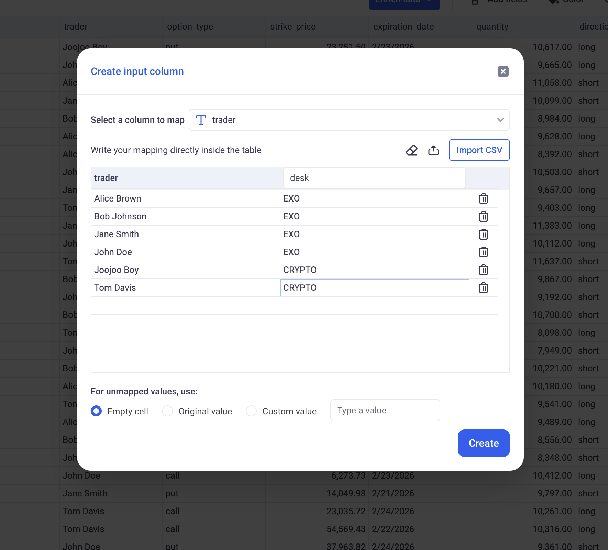

Mapping Columns
---

Mapping columns are a useful feature for performing ad-hoc data enrichment by manually associating values from a dimension with custom mapped values.

* TOC
{:toc}


# 1 Creating mapping columns

Mapping columns can be created from the Enrich Data section > __Manual Input__.


They let you input manual mappings for the values of your dimension columns.

For example, you can manually define the desks at which your traders work:



_Here, we are defining a mapping column for the Trader dimension. A Desk name was manually selected for each trader of the firm._

> 🚨 When a dimension has a high cardinality, some of the available values might be missing from the displayed list. It is recommended to use CSV files to configure exhaustive mappings of large dimensions.


The name of the newly created mapping column should be entered in the header of the input column, as shown on the screenshot above.


__CSV imports and exports:__
Your mapping can be exported as a CSV file and imported into the software.

Below, the CSV associated with the trading desk mapping:
```csv
trader,desk
Alice Brown,EXO
Bob Johnson,EXO
Jane Smith,EXO
John Doe,EXO
Joojoo Boy,CRYPTO
Tom Davis,CRYPTO
```

This CSV file can be edited manually and loaded back in KAWA.

__Handling values without mapping:__

When the mapping does not cover all the values of your dimension, for example: after an ETL, a new trader was added into the system - and they were not assigned to a desk yet.


- _Empty cell:_ All the unmapped values will not be filled and left empty.

- _Original value:_ Unmapped values will stay unchanged. A trader without a desk will be rendered as the trader name without change.

- _Custom value:_ You can define a placeholder there for unmapped values like: N/A etc...


# 2 Editing a mapping column

In the 3 dots menu of a mapping column, click on __Edit Mapping__. You can then change the mapped values (either manually or by loading a new CSV file), you can rename the column and change the behavior for unmapped values.


