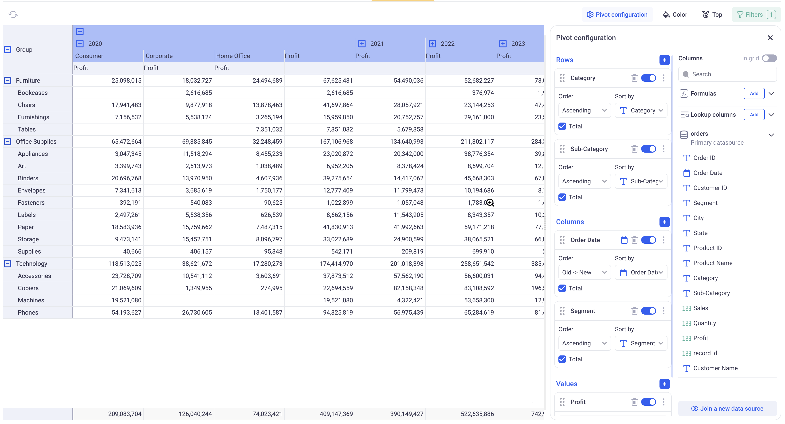

Pivot Table views
---

Pivot tables are a great way to dynamically reshape and aggregate data across multiple dimensions. in KAWA, pivot tables have the same powerful features as in the most advanced spreadsheet softwares. The main difference is that it can operate on huge datasets, with billions of rows.

* TOC
{:toc}

In order to create a new Pivot Table, click on the plus button at the top left of your sheet, and pick: Pivot Table.

# 1 Rows, Columns and Values

In the following example, we configured a Pivot with:

- _Two rows:_ Category and Sub-Category. It creates two nested row groupings. The pivot has one row per Category (showing the aggregated values per category), and one row per Sub-Category for each Category.

- _Two columns:_ Similarly to the rows, we created two columns: Year and Segment. This results in two nested column groupings. The pivot features one column per year with the yearly aggregations of the values. It also shows one column per segment per year, with the corresponding aggregations.

- _One Value:_ We are interested in the Sum of profit. This is the metric that will be shown in each cell of the pivot.

