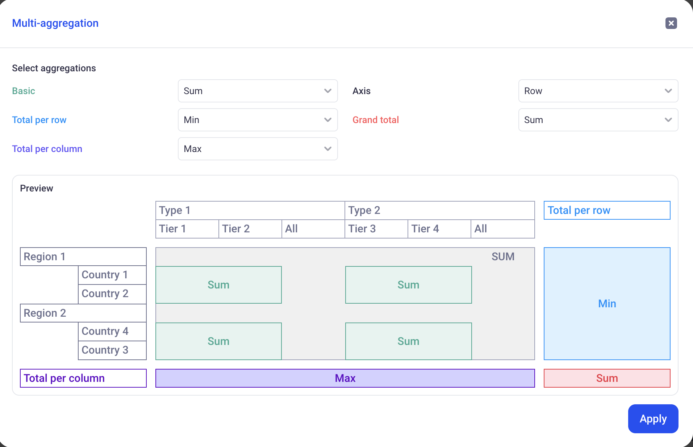

Pivot Table views
---

Pivot tables are a great way to dynamically reshape and aggregate data across multiple dimensions. in KAWA, pivot tables have the same powerful features as in the most advanced spreadsheet softwares. The main difference is that it can operate on huge datasets, with billions of rows.

* TOC
{:toc}

In order to create a new Pivot Table, click on the plus button at the top left of your sheet, and pick: Pivot Table.

# 1 Rows, Columns and Values

In the following example, we configured a Pivot with:

- _Two rows:_ Category and Sub-Category. It creates two nested row groupings. The pivot has one row per Category (showing the aggregated values per category), and one row per Sub-Category for each Category.

- _Two columns:_ Similarly to the rows, we created two columns: Year and Segment. This results in two nested column groupings. The pivot features one column per year with the yearly aggregations of the values. It also shows one column per segment per year, with the corresponding aggregations.

- _One Value:_ We are interested in the Sum of profit. This is the metric that will be shown in each cell of the pivot.

## 1.1 Configuring the values

For each value field, you can configure its format and name, its aggregation, and its calculation (Show as).

### 1.1.1 Value format and name

In order to rename a field, click on the three dots menu next to it and click on: Rename Field.

The format can be changed too by clicking on the three dots menu and Format data. The dialog will depend on the type of the field.

### 1.1.2 Value aggregation

__Simple aggregations:__ The pivot table will always show aggregated values. In the first drop down of the value cards, pick the aggregation that you wish to use. The list of available aggregations will depend on the type of the data.

> When adding multiple values on the same measure (For example: Sum of Sales and Average of Sales, make sure to rename the fields to avoid confusions).

_In the above example, notice two value fields: Sum and Average of Sales. They have been renamed to reflect the aggregation. A dollar prefix has been added in the format data section._

__Multi aggregations:__ 

When selecting the last value of the aggregation drop down (Multi-aggregation), a configuration popup will be displayed:

It lets you configure 5 parameters:

- _Basic:_ Corresponds to the aggregation that will be used for the pivot values (as opposed to the totals per rows/columns or grand totals). 

- _Total per row:_ This defines how the Basic aggregations are further aggregated to come up with the totals per row (The last columns of the pivot table, shown in blue).

- _Total per column:_ This defines how the Basic aggregations are further aggregated to come up with the totals per column (The last row of the pivot table, shown in purple).

- _Axis and Grand Total:_ Axis will define what will be used to compute the Grand total: Choose Rows if you want it to be computed from the totals per row. Choose Columns if yoy prefer it to be computed from the totals per column. The Grand Total aggregation defines which aggregation to use in order to further combine the values of the chosen Axis.

_In the above example:_
- _Basic: SUM._ This means that the values of the pivot will be summed from the Row values of the dataset.

- _Total per row: MIN._ It means that the last column for this value (In Blue on the illustration) will be computed by taking the MIN of all the SUMS on each row.

- _Total per column: MAX._ It means that the last line for this value (In Purple on the illustration) will be computed by taking the MAX of all the SUMS on each column.

- _Axis: Row and Grand total: Sum._ Here, we will compute the Red cell by adding together the Blue cells. It will be the SUM of the MINS of the SUMS.

### 1.1.3 Value calculation (Show As)

This is the same documented here (Similar as the one available in the Chart Views): [Configure chart series](03_02_chart_views#213-value-calculation-show-as)