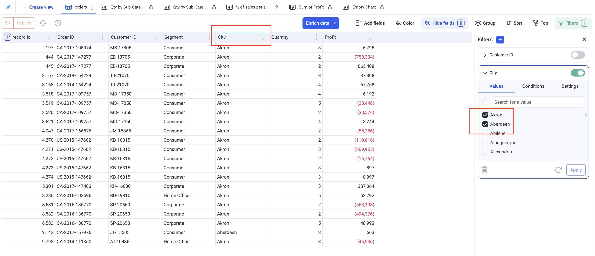

Filtering data
---

Filters can be applied to all types of view through the same filter panel.
KAWA comes with powerful built-in filters, adapted to all your data types: text, number, booleans, date, date time.

* TOC
{:toc}

# 1. The filter panel

## 1.1 Overview

The filter panel is situated at the right of all the views (Charts, Grids and Pivots). It can be toggled on and off by clicking on the green "Filters" button at the top right. This button indicates how many active filters are applied on your view.

_Here, three filters are configured, but only one is applied. The toggle button on each filter card toggles on and off the corresponding filters._

In this panel, you can configure the filters that are applied to your view, add new ones or remove existing ones.

To add new filters, click on the (+) button situated at the top of the panel. You can then choose what you want to filter. You have the choices between the fields of the current view or the columns of the underlying sheet. __You do not need to add the filtered columns to your views.__

## 1.2 Filtering grouped data

When your view is grouped (It is always the case with pivot tables, often the case with Charts, and sometimes with Grids), you can decide at which level of grouping you want to apply your filter.

In the apply to menu, pick which group and which aggregation you want to apply your filter on.

_In this example, we want to keep only the states with a negative Total. We picked: Apply to State, aggregation: SUM._

# 2. Configuring your filters

## 2.1 The Text filters

### 2.1.1 Filtering particular values

This mode (The first tab of the filter) will only keep rows whose values for the picked column fall in a selection.

_Here, KAWA will only keep rows for which the city is Aberdeen or Akron_

> IMPORTANT: The list of available values might not be exhaustive if there are too many (Above 300). This limitation exists to prevent millions and potentially billions of values to be sent to users. However, The search box has access to the entire list of values. For example, if the city `Miami` is not there in the initial set, typing the letter `M` will most likely filter down the list and make `Miami` available.

> IMPORTANT: As a consequence of the previous note, if you have text columns with a very high cardinality, do not use this mode to filter everything out EXCEPT a few values. (Clicking on select all followed by unchecking a few)

### 2.1.2 Filtering based on conditions

The second tab of the text filter lets you configure multiple conditions.

- You can add / remove conditions.
- When you have more than one condition, you can pick whether you want them ALL to match (`AND`) or at least one (`OR`).
- Each condition has an operator picked from the list: Begins with, Ends with, Contains, etc... and a text value (except for: Is empty and Is not empty).
- Important: All the conditions are not case sensitive.

__Examples:__

- Begins with _W_ `AND` Ends with _E_ will match the word Wayne.
- Begins with _W_ `OR` Ends with _E_ will match the words Bruce, Walter and Wayne.

_Keeps only the cities whose name starts with A, ends with A and contains T._

### 2.1.3 Advanced settings for text filters

The third tab lets you configure the behavior of the filter card itself.

__Selection Mode:__ Can be set to multi-select or single-select. This will define how many can be selected in the selection (first tab).

__Configure options:__ Lets you define the exact content of the list in the selection. You can either restrict the values that are offered to the users or group them into categories. 

## 2.2 The Numeric filters

The numeric filters have two modes:

- _Simple range:_ Filter the number with a simple closed range. Note that both boundaries are optional. For example, if you specify only the Min, you will get all the values greater or equal to the Min. 

- _Conditions:_ Works the same way as the text filters with numeric conditions.

_The above filters only keep quantities that are either strictly lesser than 10 or strictly larger than 100._

## 2.3 The Boolean filters

The boolean filter has only one mode: 
You can decide whether to keep `True`, `False` or `Empty`. There is a toggle between multi and single select modes at the top right of the filter card. (It lets you for example pick both `False` and `Empty`).

## 2.4 Temporal filters

Temporal filters are the most complex filters, they apply to both date and date time filters.

### 2.1.1 Filtering using presets

Presets are the quickest way to filter your temporal data. Each filter has their own sets of presets. By default, the Popular ones are shown:

| Preset| Description |     
|-------|-------------|
| D       | Shows today's data
| D-1     | Shows yesterday's data
| M-1     | Shows data for previous Month
| YoY YTD | Year on Year Year to Date: Shows data across all years until today's day. For example, if today is the 25th of June 2025, we will show data for 2025, 2024, 2023, ... until the 25th of June.
| YTD     | Year To Date: Show all dates from the beginning of the year until today's date. 
| MTD     | Month To Date: Show all dates from the beginning of the month until today's date.
| Future  | Shows all the data after today
| Past    | Shows all the data before today

You can also display presets by time unit:

- Minute (For date time filters only)
- Hour (For date time filters only)
- __D__ Day
- __BD__ Business day (all days except weekends)
- __W__ Week
- __M__ Month
- __Q__ Quarter
- __S__ Semester
- __Y__ Year

Each category will show a list of presets similar to D+1 or D-1. The capital letter indicates the unit (Y for year, BD for business day, etc..) and the number indicates the offset. For example: BD+1 indicates the next business day. Q-1 indicates the previous Quarter.

### 2.1.2 Filtering using ranges

There are three types of range available.

__a. Fixed ranges:__ They correspond to a range defined by two fixed dates that you can pick. For example: all dates between 1/1/2020 and 2/1/2020. The min and max are included in the returned datasets. If you omit the Max, KAWA will give you all dates after the Min, and vice versa.

__b. Rolling ranges:__ They correspond to a rolling range, relative to today. It contains 3 parameters:

- _From:_ A number to indicate how many units we start from (Minimum)
- _To:_ A number to indicate how many units we go to (Maximum)
- _Unit:_ A time unit

Here are a few examples to illustrate this:
_Let's suppose that today is the 25th of June 2025._

`From -1 To 1 Month`: Means all dates from the 25th of May 2025 to the 25th of July 2025. (One month back to one month forward).

`From -10 To 0 Day`: Means all dates from the 15th of June 2025 to the 25th of June 2025. (10 days back, 0 days forward).

Special case for __Available date__: Available date can be picked as a Unit. Picking for example: -1 to 0 Available date will filter the data on the last available date in your dataset.

__c. By Period:__ Lets you choose one period of time like: the Year 2023 or the month of March, or the month of April 2020.

### 2.1.3 Filtering using conditions

This mode is similar to text and number filters. It lets you pick multiple conditions and choose how you want to combine them: `OR` or `AND`. It operates only on static dates.

For example, you can specify: any date after the 10th of July 2024 or before the 1st of Sept 2020.