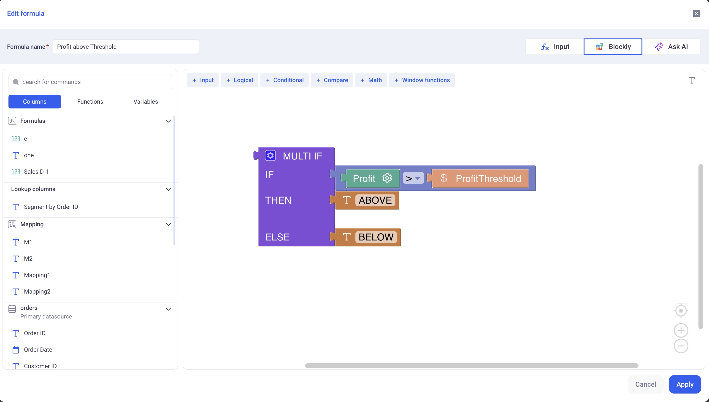
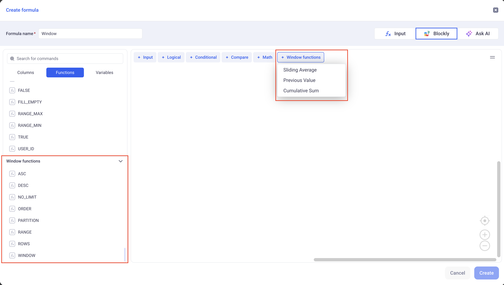

Computations are created in Sheets and can take various forms such as:

- A formula
- A mapping column
- A lookup column


* TOC
{:toc}


# 1 General Concepts

## 1.1 Formulas

Formulas are created from the Formula editor, available from the enrich data button.
There are three modes to input formulas:
- Text mode (Excel like)
- Visual mode (Using blockly)
- AI assisted mode, via prompt.


Formulas can be composed of:
- Other columns
- Operators or Functions
- Variables (From the control panel)
- Constants

Here is an example of a simple formula, in Visual mode and in Text mode.

Visual:


Text:


This formula returns `ABOVE` if the profit is above `ProfitThreshold`
and it returns `BELOW` otherwise.

Note that:
- `Profit` is a column of the sheet
- `ProfitThreshold` is a variable from the control panel
- We use the IF/THEN/ELSE operator as well as the Greater Than one.

The return type of this formula is a `Text`, as indicated on the UI (Top left in text mode and top right in visual mode).

## 1.2 Types and Levels of detail

### a. Types

Formulas are typed. It means that they only return one type of data which can be:

- `Text`
- `Integer`
- `Decimal`
- `Date`
- `Date Time`
- `Boolean`

Their type is derived from the operators they use and their various columns, constants and variables.
For example: Concatenating two texts will yield a text, adding two integers will yield an integer etc... 

You can always refer to the documentation of each operator directly on the GUI for that purpose:


### b. Levels of detail

In addition to being typed, formulas also have a Level of Detail.
It can be either: `ROW`, `GROUP` or `ANY`.


- **The ROW level of detail:**

A ROW level of details means that the formula will be computed for each row of the data.

For example, the formula `Profit / Quantity` will have a value for each row. When we sum the values of this formula - that might happen in Grid, Pivots and Charts - we apply the sum of the division for each row:
`SUM(  Profit / Quantity  )`

In other words, the computation is done at the row level and we simply aggregate those results together.


- **The GROUP level of detail:**

A GROUP level of details means that the formula will be computed for both the rows and directly for the group. The main difference is that a group function manipulates aggregating operators, such as SUM or AVERAGE etc..

It allows us to write powerful formulas such as Weighted averages etc..

Here is how you would write a weighted average using a GROUP formula:

```
WeightedAverage = SUM(weight * value) / SUM(weight)
```


- **Quick example:**

The example below illustrates the difference between the two:

Look a the two columns on the right of the grid:
- `Profit / Quantity`
- `SUM(Profit) / SUM(Quantity)`

They both have the exact same value on each row, but the global aggregation of both, on the bottom row, is different.

Because the first one is computed ONLY for each row and then aggregated, the global aggregation will be: 

```
SUM(Profit / Quantity) = 
Profit1/Quantity1 + ... + Profitn/Quantityn
```

On the other hand, because the second one is computed directly at the group level, its aggregation will be:

```
SUM(Profit) / SUM(Quantity) = 
(Profit1 + ... + Profitn)/(Quantity1 + ... + Quantityn)
```

Note that for the second formula, the aggregation at the bottom of the grid cannot be changed (the same goes for charts and pivots), because it is imposed by the formula itself.


# 2 Window Functions


## 2.1 What is a Window Function?

A Window Function is a ROW LEVEL computation operation. This means that it will compute one value for each row of data.

Without window function, all the computations only "see" one row of data at a time. If you write for exampe: `col1 + col2`, this means that `col1` and `col2` will be added for each row.

With window functions, computations can now see a Window of rows around the current row.
We can now access rows such as: Previous and Next rows, all the rows before, all the rows after etc...

The image below illustrates this:


When you write a window function, you need to define which rows will be accessible from each computation.


## 2.2 Examples

- **Example 1: Average of surrounding rows**

Below, an example of an Average of the row before, the row after and the current row, per client.


- **Example 2: Cumulative Sum**

Here, we compute the Chronologic Cumulative sum per client.
Notice the use of the `NO_LIMIT` block in the Window range. This lets you define unbounded windows.

It is also important to note that the ORDER defined in the WINDOW function is independant from the one defined in the main view. The WINDOW function will operate on its own ORDER function and ignore the one of the view.


- **Example 3: Delta between today's price and yesterday's price for Stock**


**Case 1: Using the ROWS operator**

Notice how we use the `ROWS` operator to define the range. This operator will just look at the rows and ignore gaps in the dates. Here `STOCK2` has gaps but the delta ignores them (always -$1). In short, the `ROWS` operator will load N rows before and P rows after without caring about the content of those rows.


**Case 2: Using the RANGE operator**

With this syntax, we are using the `RANGE` operator.

As opposed to the `ROWS` operator, the `RANGE` looks at the values from the `ORDER` clause.

In this example, we order by date and we are looking at the actual previous date.
So if a row is dated on the 2nd of January 2025, It will fetch the row dated on the 1st of January 2025 (Within the defined partition, here: The STOCK). If there is no such row, then the window function will not find any row. 

In the below screenshot, it explains why, for STOCK2, the delta is defined only for the 16th of Feb 2025: it is because the WINDOW is able to pick up the previous date which exists.

As a result, the `ROWS` operator is interesting when you order by date and you want to account for missing dates in your computation.


## 2.3 Creating and defining window functions

In order to configure Window function, create a new formula and use the
Blockly mode. It has several prebuilt functions to help you getting started.




In order to define your Window, you must set the following parameters:

1) **The Partition**: 

The partition will define which dimension(s) will be used to build the Window function.
It defines where to pick the rows that will constitute the Window. 

2) **The Order By**:

Within each Window, this clause define how the data will be sorted.

3) **The Window Range**:

This defines how many rows before and after the current row we will look at in the window.

There are two ways to define a range:

- Using the `ROWS` operator: This will be based on the number of rows before and after the current one.

- Using the `RANGE` operator: It will look for consecutive values. It makes sense for dates and date times.


