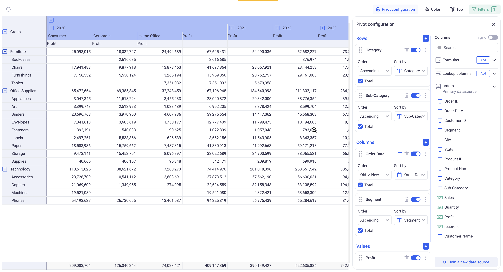
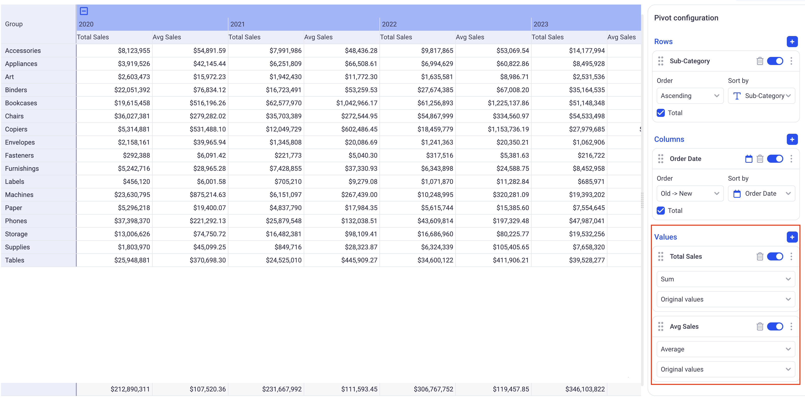
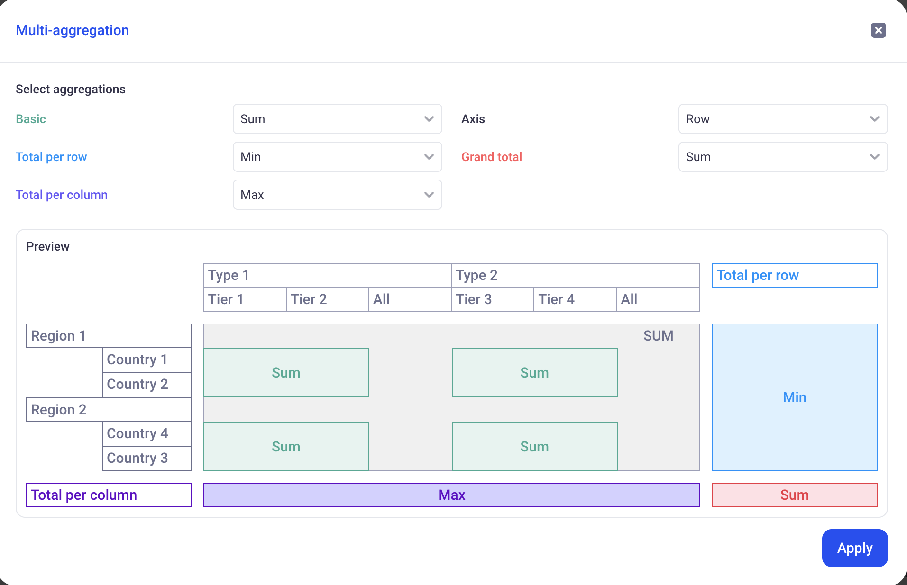
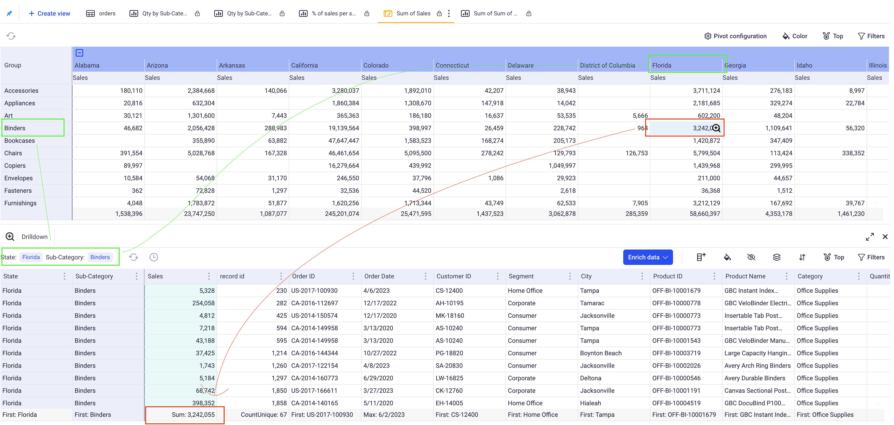
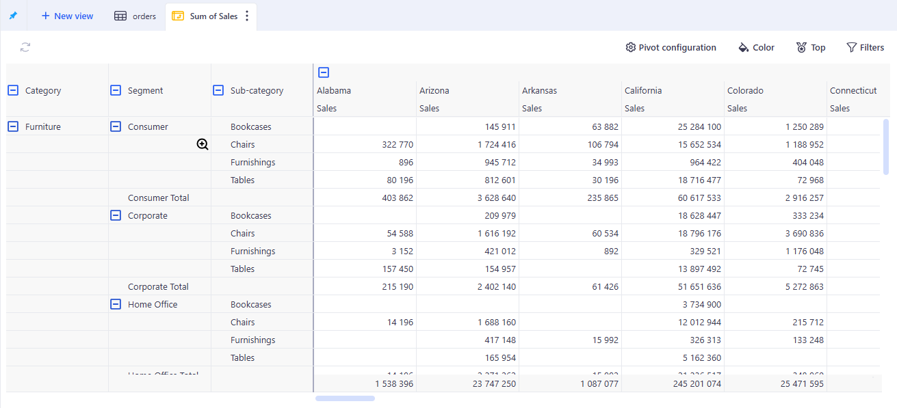

# Pivot table views

Pivot tables are a great way to dynamically reshape and aggregate data across multiple dimensions. in KAWA, pivot tables have the same powerful features as in the most advanced spreadsheet softwares. The main difference is that it can operate on huge datasets, with billions of rows.

* TOC {:toc}

In order to create a new Pivot Table, click on the plus button at the top left of your sheet, and pick: Pivot Table.

## 1. Rows, Columns and Values

In the following example, we configured a Pivot with:

* _Two rows:_ Category and Sub-Category. It creates two nested row groupings. The pivot has one row per Category (showing the aggregated values per category), and one row per Sub-Category for each Category.
* _Two columns:_ Similarly to the rows, we created two columns: Year and Segment. This results in two nested column groupings. The pivot features one column per year with the yearly aggregations of the values. It also shows one column per segment per year, with the corresponding aggregations.
* _One Value:_ We are interested in the Sum of profit. This is the metric that will be shown in each cell of the pivot.

> Note that you can easily fold and unfold your rows and columns by clicking on the (plus) and (minus) signs. When multiple rows or columns are nested, clicking on upper level (plus) and (minus) lets you control which nodes are deployed in bulk.

### 1.1 Configuring the values

Adding values to the pivot table can be done by clicking on the (+) button next to the Values header or by directly dragging and dropping data from the Columns panel into the Value section.

Value can be removed by using the Trash Can icon or simply disabled by toggling them off.

For each value field, you can configure its format and name, its aggregation, and its calculation (Show as).

#### 1.1.1 Value format and name

In order to rename a field, click on the three dots menu next to it and click on: Rename Field.

The format can be changed too by clicking on the three dots menu and Format data. The dialog will depend on the type of the field.

#### 1.1.2 Value aggregation

**Simple aggregations:** The pivot table will always show aggregated values. In the first drop down of the value cards, pick the aggregation that you wish to use. The list of available aggregations will depend on the type of the data.

> When adding multiple values on the same measure (For example: Sum of Sales and Average of Sales, make sure to rename the fields to avoid confusions).

_In the above example, notice two value fields: Sum and Average of Sales. They have been renamed to reflect the aggregation. A dollar prefix has been added in the format data section._

**Multi aggregations:**

When selecting the last value of the aggregation drop down (Multi-aggregation), a configuration popup will be displayed:

It lets you configure 5 parameters:

* _Basic:_ Corresponds to the aggregation that will be used for the pivot values (as opposed to the totals per rows/columns or grand totals).
* _Total per row:_ This defines how the Basic aggregations are further aggregated to come up with the totals per row (The last columns of the pivot table, shown in blue).
* _Total per column:_ This defines how the Basic aggregations are further aggregated to come up with the totals per column (The last row of the pivot table, shown in purple).
* _Axis and Grand Total:_ Axis will define what will be used to compute the Grand total: Choose Rows if you want it to be computed from the totals per row. Choose Columns if yoy prefer it to be computed from the totals per column. The Grand Total aggregation defines which aggregation to use in order to further combine the values of the chosen Axis.

_In the above example:_

* _Basic: SUM._ This means that the values of the pivot will be summed from the Row values of the dataset.
* _Total per row: MIN._ It means that the last column for this value (In Blue on the illustration) will be computed by taking the MIN of all the SUMS on each row.
* _Total per column: MAX._ It means that the last line for this value (In Purple on the illustration) will be computed by taking the MAX of all the SUMS on each column.
* _Axis: Row and Grand total: Sum._ Here, we will compute the Red cell by adding together the Blue cells. It will be the SUM of the MINS of the SUMS.

#### 1.1.3 Value calculation (Show As)

This is the same documented here (Similar as the one available in the Chart Views): [Configure chart series](../04_02_chart_views/#213-value-calculation-show-as)

### 1.2 Configuring the Rows and Columns

Rows and Columns have identical configuration on the Pivot table.

Adding rows/columns to the pivot table can be done by clicking on the (+) button next to the Rows/Columns header or by directly dragging and dropping data from the Columns panel into the Rows/Columns section.

Rows/Columns can be removed by using the Trash Can icon or simply disabled by toggling them off.

_Configure the Binning or Time sampling:_ When you use temporal data as row or column, you can configure Binning (Click on the cog icon next to the field name) or Time sampling (Click on the calendar next to the field name). These features are described in the Grid View: [Configure Binning](../04_01_grid_views/#212-number-binning) and [Configure time sampling](../04_01_grid_views/#211-time-sampling).

_Configure order:_ The order of each row and column can be defined by picking a direction (Ascending, Descending, Absolute value Ascending and Descending for numeric metrics) and a field.

_Toggling on and off the total:_ You can toggle on and Off the Total checkbox to show or hide the corresponding totals for this Row/Column.

## 2. Drilling Down

### 2.1 Standard Drill Down

A Pivot table only show aggregated values in its cells. Accessing the Raw data for each of them is done by clicking on the magnifying glass in any cell of the pivot.

A bottom section will then open, showing the raw data that was used to computed that particular value.

_In this example, you can see the data that was used to compute the 3,242,055 in Sales for Binders in Florida. Note that this drill down view is a Grid View and can be further configured. You could group by year and explore how this total is distributed across various periods of time._

### 2.2 Visual Drill Down

You can configure the pivot to open specific views instead of the basic drill down grid when users click on particular cells.

In the three dots menu of each Row and Column, clink on Link View. You can then associate various existing views with each value of your rows or columns.

_In this example, a monthly sales evolution chart was associated with the Accessories sub category. When a user clicks on a cell in this particular sub category, the chart will open, filtered in the Selected state. Notice that you can also go back to the drill down view by clicking on the corresponding tab on the lower section._

## 3. Conditional formatting

You can configure conditional formatting in Pivot tables in a similar way that you would in Grid views. In the pivot tables, there is no notion of Row Data, so you can only work on conditions operating at the group level. Please refer to this [Conditional Formatting](../03_01_grid_views/#a-conditional-formatting).

Both rule based and gradient formatting are available in the pivot tables.

_This pivot table was configured as a heatmap to show the breakdown of Quantity sold per quarter and category._

## 4. Specific interactions

### 4.1 Auto sizing mode

Right clicking anywhere on the pivot will bring specific display options. The Auto size mode is either: _By content_ or _Disabled_. When _By content_ is selected, each time the configuration of the pivot changes, the width of its columns will be recomputed based on the content of its cells. If you manually change a column width, this change will be persisted.

### 4.3 Aggregation position

Controls where the metric name (Sales, Profit, etc.) appears in multi‑level column headers.

#### 4.3.1 How to use

Right clicking anywhere on the pivot → Choose Aggregation position → Top (default) or Bottom.

#### 4.3.2 What it does

* **Top** — the metric name is above the dimension headers.

* **Bottom** — the metric name is below the dimension headers.

The setting applies to the entire Pivot View. It changes header layout only; exports and totals are not affected.

### 4.3 Cell multi select

You can multi select cells on the pivot to access local statistics. Copy and paste into spreadsheet softwares works too.

### 4.4 CSV export

By clicking on the tab and selecting the "Download CSV" option, you will get a CSV representation of your pivot table.
