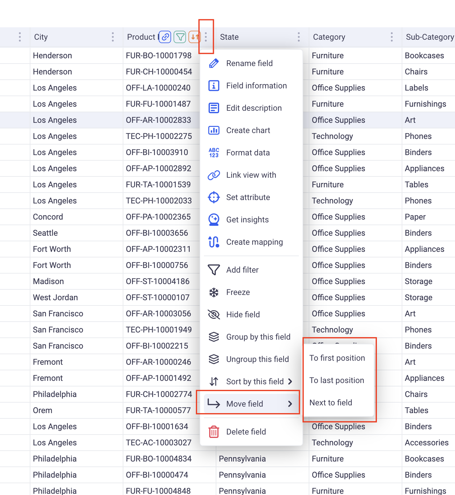
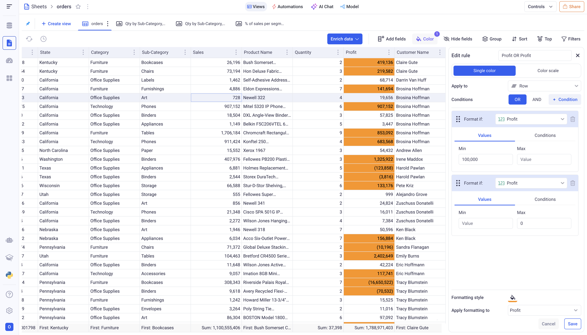
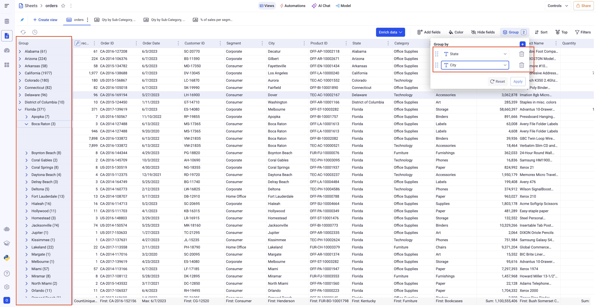
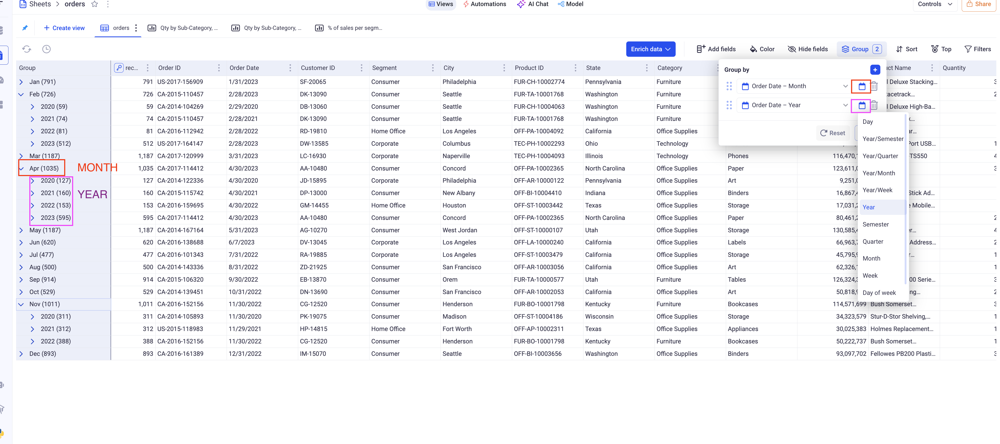
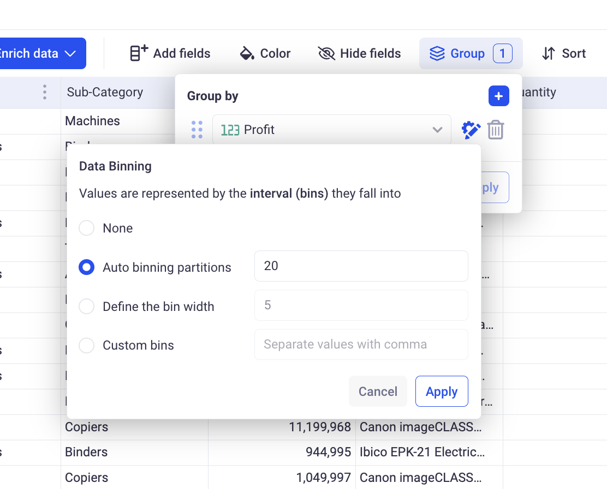
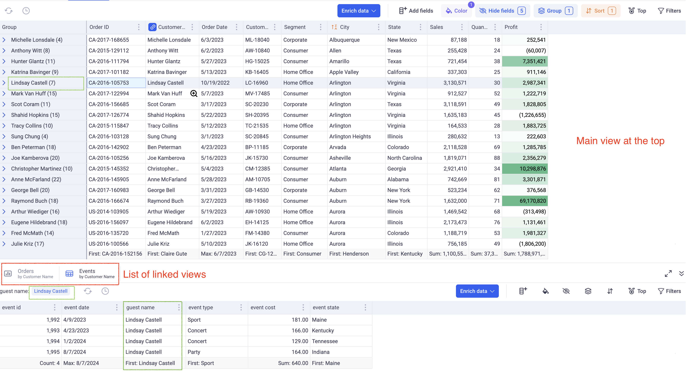

Grid views
---

Grid view is the most powerful type of visualization in KAWA.
They support an unlimited number of rows and have a very wide range of features.

> **Fields:** Each column of the grid is called a _field_. They are connected to your data and each one can be configured independently from the others. Note that you can connect many fields to the same data, if you want to show it in multiple ways in the same grid. 

* TOC
{:toc}

In order to create a new Grid View, click on the plus button at the top left of your sheet, and pick: Grid.

# 1 Manage the fields of your grids

## 1.1 Field visibility

You can show and hide your fields using the Hide Fields button situated at the top right of the grid. 

This menu lets you choose which fields you want to show or hide by clicking on the small eye icon in front of each field.

You can also opt to hide or show all of the fields by clicking on the hide all and show all button.

Also note that you can directly reorder fields in the grid by rearranging them from this component (drag and drop).

> Hiding a field does not mean that it is removed from your Grid. 

## 1.2 Adding and removing fields

In order to add new fields to your Grid, go to the add fields menu, situated at the top of the Grid. This will let you choose various types of data you can create fields from.

- Data Sources contains all the data from your underlying data sets.

- Linked Views contain columns from the views that were linked to that Grid.

- Formulas are the computations that were added to your sheet

- Python Tools let you add fields that are computed with Python scripts.

Once you find the fields you wish to add, drag and drop it from the add field panel into the grid, at the desired location.

> You are not limited to one field from the same source.

Removing fields from the grid is done via the three dots menu on the header of the field. Click on the delete field option.

## 1.3 Reordering your fields

To reorder your fields, you have several options:

Usually if the fields of your Grid can fit on your screen, you can directly drag and drop them at the desired position.

> When you move fields over other ones, you will see contextual menus appearing with several options. To reorder the field, please do not drop in a given option but below them all.

Another option to reorder your field is via the contextual menu in the header.

From there, you can either move your field to the first and last position, or move it next to an existing field.

> From the same menu, you can also Freeze your field. Frozen fields are moved to the first position and become insensitive to horizontal scrolling.

## 1.4 Formatting the fields

You have many ways to format your fields in KAWA.

### a. Conditional formatting

Conditional formatting will apply some style to
your fields based on their values. 
It will either set a style if a value matches a condition or apply some gradient coloring depending on where the values fall within a range.

This type of formatting, click on the Color button at the top of your grid.

#### i Rule based formatting:

In order to create a new Rule based formatting,
Click on Color > + Rule > Single color.

Here are the items to configure:

- _Apply to:_ It will define whether to color the Groups (Aggregated values) or the Rows (Row values).

- _Combine conditions:_ You can have multiple conditions (Adding conditions is done via the + Condition button). If you do, you can pick how to combine them: `AND` (in that case, the style will be applied if ALL the conditions are verified) or `OR` (here, you only need one condition to match to apply the style).

- _Define conditions:_ Pick which field will be subject to a condition and configure it following the options given to you. They depend on the type of the field you pick.

> If you are working at the group level, you also must decide how to aggregate your field. For example, you can want to color based on the average of profit or the minimum of sales.

- Lastly, pick the color you want to apply and where you want to apply it: only one field or all the fields.

_Here we color in orange all row values above 100,000 `OR` below 0. The color is applied to the profit field._

#### ii Gradient based formatting:

In order to configure a new Gradient based formatting rule, 
click on Color > + Rule > Color Scale.

Similarly to the rule based formatting, pick the field you are basing the gradient on (not that you can compute the gradient on one field and color another).

- _Apply to:_ Gradient can either be applied to ROW values or GROUP values (Aggregations). If you pick "GROUP", you must also choose the aggregation to be used. For example: The average of Sales or the Maximum of profit.

- _Gradient configuration:_ Pick the color you want and to which values they correspond. Note that the values below the lowest bound will be colored with the lowest bound color. The same goes for the highest bound.

_Here we apply a gradient to the Row values of the quantity field_

#### iii Managing your rules

The rules can be removed and reordered to define in which priority they are applied. The first one will be applied first, then the second, and so on.

### b. Formatting the fields values

Another way to format the fields is to apply a static configuration on all values.

Depending on the type of the field, you will be able to format the content.

Regardless of the type, you can:

- apply a color to the entire field
- pick data position (left, center or right)

__Rendering URLs in the Grid:__

When a column of the grid contains a URL, you can apply a formatter to make that URL clickable:

In order to do so, click on the three dot menu of the column containing the URL, and click on __Format Data__.

Check the option: _Format data as link_. You can then pick the column to use to render the labels. For example here, the column CITY was used to render the URL name. As a result, when clicking on the New York city value, the link associated with this row will be opened in a new tab.

# 2 Grouping and Aggregation

Grids are a powerful tool to visualize both row data and aggregated data.
You can define aggregation methods for each of your fields and define a hierarchy of groupings to apply.

## 2.1 Define groupings

In order to group your data, you can use the Group button at the top left of the grid.
Here, you can add new groups to your grid, reorder the existing groups and delete unwanted ones.

*Here, you can see that two levels of grouping were applied, State then City. On the grid you can see the aggregated data per State, and per City and deploy the nodes to reach the row level data.*

> Note that the action of deploying a group will result in a query to the database. It ensures that just the right amount of data is loaded to the interface for optimal performances.

### 2.1.1 Time Sampling

When applying grouping on temporal fields (`date` or `date time`), you have the option to apply time sampling on the groups.

This is accessible via the small calendar icon from the grouping component.

You will have the possibility to choose the time period
you wish to sample your data on.

*In this example, we group twice on the date column to obtain a year on year monthly comparison. The first group is defined on the Month of the date, while the second one is defined on the Year of the date.*

### 2.1.2 Number Binning

When applying grouping on a numeric filter, you can apply binning to analyze distributions for example.

This is accessible via the cog icon next to your defined groups.
It lets you pick the binning methodology you wish to apply:

- _Auto binning partitions:_ This specifies the number of bins you want to divide your data into. If you pick 20, then you will end up with (about) 20 groups. The overall range of your data will be divided in 20 even bins.

- _Fixed bin Width:_ this defines the width of each bin. If you define 20, then you will cut your overall range in bins of 20. A range of 1000 will result in 50 groups.

- _Custom bins_: Lets you define how your data will be divided by inputting the boundaries of the bins. For example: `0,10,100,1000` will group together all the numbers below 0, then all the numbers between 0 and 10 (excluded), then 10 and 100, 100 and 1000 and then above 1000.

## 2.2 Define aggregations

For each field, you can specify the method used to aggregate data at the group level.

> For example, if we deal with a profit column and we group our Grid by State, we need to define how to aggregate the profit per state. Are you interested in the TOTAL profit per state, or the AVERAGE, etc..

> Note that the aggregation method is identical for all the levels of grouping and does not depend on what you group your data by.

To define the aggregation method for a field, click on the bottom row of the grid and select an option from the list. The available options will depend on the type of field you are looking at: text, number, date, boolean etc...

The aggregated values will then be shown at the group level, and the overall aggregation on the bottom fixed row.

> You may be interested in multiple aggregation for the same data, say: MIN, MAX and AVG. In that case, create 3 fields on the same data and set the three desired aggregations.

# 3 Linked Views

Linked views can be created from the grid views.

_On the image above, the top view is the main Grid view. It is linked to two views that open in the bottom section.
Those views are connected to the main one: clicking on a row of it will filter the bottom one. Notice here (in green) the
bottom view is filtered on Lindsay Castell._

> Linked views can be created from any sheet within the workspace, providing an interactive and intuitive way to explore data across multiple data models.

## 3.1 Creating a linked view

To create a linked view, identify a field to which you want to link a view to. In the above example, the link was made with the _Customer Name_.
Then, either click on the blue link icon in its header or go in the three dots menu > "Link View With".

The configuration popup will ask you to complete the following steps:

- First: select the sheet to link. It can be the same sheet (current sheet), or any other sheet of the workspace.
- Second: from that sheet, pick the view you want to link. It can be any type of view: Grid, Chart and Pivot.
- Last: configure the link itself by pairing up fields from the main view with fields of the linked views. There is no limit to the number of fields you can pick.

Click on Apply - and a new linked view will be added. Clicking on any row of the top view will filter the bottom view on the field that you picked to create the link.

## 3.2 Managing linked views

On the three dot menu on the link view tabs, you can:

- Delete a linked view
- Rename one
- Export them as CSV (for Grid views)

The linked view panel can be expanded to occupy the full screen and collapsed.

## 3.3 Creating lookup columns

One of the main usage of linked views is to allow the creation of linked columns which are one of the most powerful feature of the platform. Please have a look at the [Documentation on Linked columns](./03_02_lookup_columns#1-what-is-a-lookup-column) for more details.

# 4 Global settings

## 4.1 Context menu

By right clicking on any cell of the grid, you access the global settings and some shortcuts.

- *Go to field:* Is very useful when you are working with a grid containing a lot of fields. It will scroll to and focus on any field that you are looking for.

- *Select Row height:* Will let you pick the height of your rows.

- *Auto size columns:* This option will trigger a resizing of all the columns of your grid, either based on the content off the cells or on the values of the headers.

- *Headers:* Gives you access to the wrapping setting of the headers. You can configure if you want the content of the header to occupy many rows if the title is too long (Wrapped) or if you'd rather truncate them (Ellipsis).

## 4.2 View settings

From the context menu: right click > View Settings, you can access some global settings of the view. 

- *Hide empty fields:* Will automatically hide the fields for which ALL the values are empty. This can be useful for sparse grids.

- *Compute overall aggregations:* When you have too much data in your grid, say billions of rows, computing the overall aggregations (In the bottom row) can slow down the interactions. You can then opt to turn it off.

- *Auto compute:* When turned off, modifications in the configuration of your Grid (sorting, grouping, filters, etc) will not be immediately taken into account. You will need to explicitly click on a compute button to trigger the calculation taking in account the new parameters. This is very useful if your grid takes several seconds to compute.

