# Chart views

Chart views let you build powerful visualizations of your data.
Many different types of charts are available and each one supports a wide range of configuration parameters.

* TOC
{:toc}

In order to create a new Chart View, click on the plus button at the top left of your sheet, and pick: Chart.

## 1. Configure  your Chart

Configuring your chart is made through the Configure chart menu, accessible from the top right.

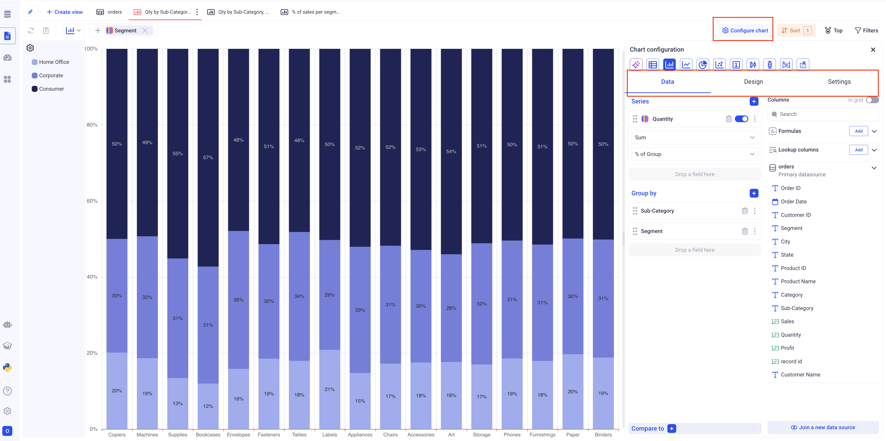

*There are three main sections in the chart configuration panel: Data, Design and Settings.*

You can pick your chart type at the top of the configuration panel.

__The settings tab:__ Contains global settings that apply for most types of charts. They let you control legend, behavior of the axis, display properties and zoom.

The number of labels and label rotation work together. If you want to add more labels, you might need to rotate them by 45 or 90 degrees (vertical).

### 1.1 Configure a bar chart

In the data section, pick the Series and the Groupings.
A bar chart can have one or two levels of grouping and does not have any limit in the number of series.

> It is strongly recommended to have only one series when two levels of grouping are present.

#### a. Bar chart with one level of grouping and one or more series

In a bar chart, the first level of grouping will always be the X-Axis.

When configuring a chart with multiple series and one grouping, you can decide to stack the series or show them separately. 

The stacking option is found in the design section, in the upper horizontal tab.

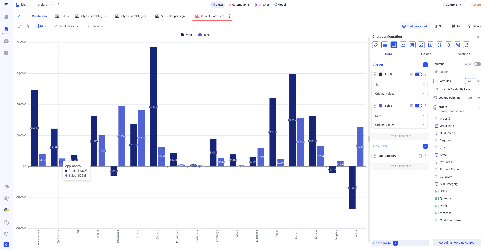

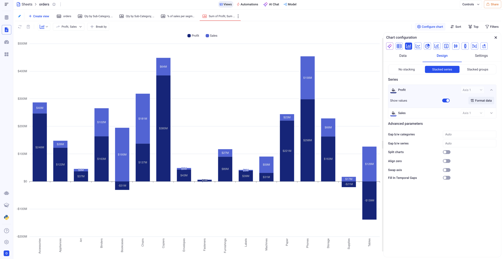

*Bar chart showing the profit and sales per sub-category, with and without Stacking*

#### b. Bar chart with two levels of grouping and one series

With two levels of grouping, the first level will be the X-Axis and the second level will be reflected as the various portions of each bar.

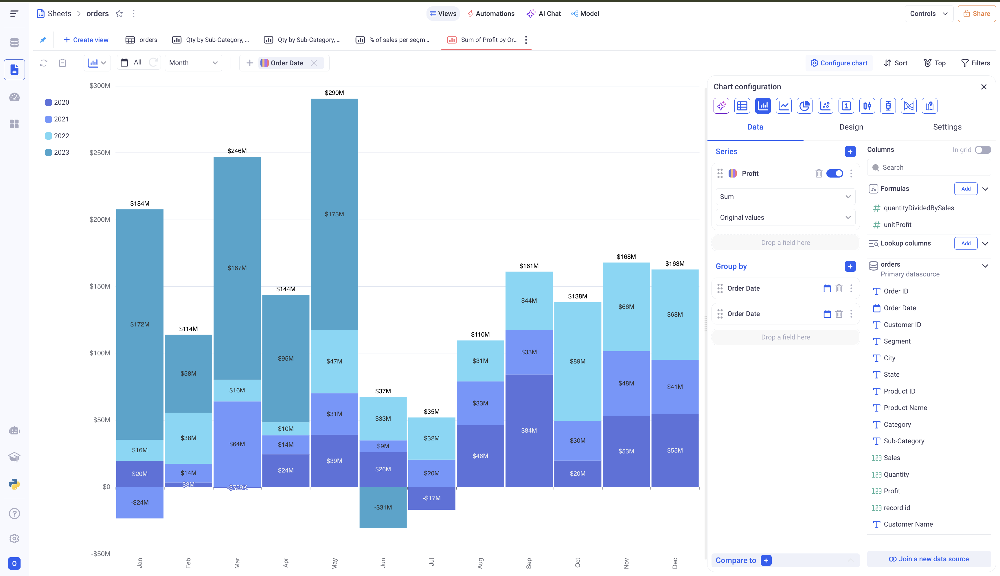

*In the above example, you can see that the first level of grouping (Months) is shown on the X-Axis, while the second level of grouping is reflected on each bar (One color per year)*

#### c. Specific settings for the bar charts

In the design section, you have several options to customize your bar charts:

- Formatting of each series
- Setting colors to each series or each point for the second level of grouping
- Defining gaps between bars
- Show the totals on top of each bar
- Make the bar chart horizontal (Only works for one level of grouping)

#### 1.2 Configure a line chart

Line charts are similar to Bar charts, but are generally preferred to plot trends or evolutions of metrics.

In the data section, pick the Series and the Groupings.
A line chart can have one or two levels of grouping and does not have any limit in the number of series.

> It is strongly recommended to have only one series when two levels of grouping are present, otherwise the chart will be difficult to read.

#### a. Line chart with one level of grouping and one or more series

In a bar chart, the first level of grouping will always be the X-Axis.

*Simple line chart showing the evolution of profit per day*

When plotting multiple series for one grouping, you can decide whether to plot all series on the same axis or on separate axes. If you choose the split chart option, you can have one chart per axis.

*Plotting both Quantity (Ranges from -2 to 26 on a given date) and the Profit (Ranges from -200K to 3M on a given date) on two different axes.*

#### b. Line chart with two levels of grouping and one series

Adding a second level of grouping on top of a temporal dimension is useful to see the breakdown of some indicator per another dimension.

*Here, we added the Segment as the second level of grouping -  as a result, we have one line showing the evolution of each segment over the days*

#### c. Specific settings for line charts

In the design section, you can access the following parameters, specific to line charts:

- _Align zero:_ If we have many different axes, this setting will determine whether or not to align all the 0 horizontally.

- _Fill in temporal gaps:_ If the X-Axis is a temporal one, date or date time, empty points will be added in case the dataset is missing dates. For example, if the dataset has a point for the 1/1/2020, and one for the 1/3/2020 - the chart will add a tick on the X-Axis on the 1/2/2020. 

For each series, you can also configure if you want to:

- Smooth the lines
- Draw an area beneath the lines
- Add a trend line (Polynomial or Linear)
- Change line width / line style

### 1.3 Configure a pie chart

In the data section, pick the Series and the Groupings.
A pie chart can have one or two levels of grouping and does not have any limit in the number of series.

> When adding more than one series, KAWA will create as many pie charts as series.

> Only show series containing positive values. Otherwise the pie chart can lead to misinterpretation of the data.

*A simple pie chart showing the sales per state. A Pie chart will show the ten biggest categories and then aggregate all the others in an `Other` category*.

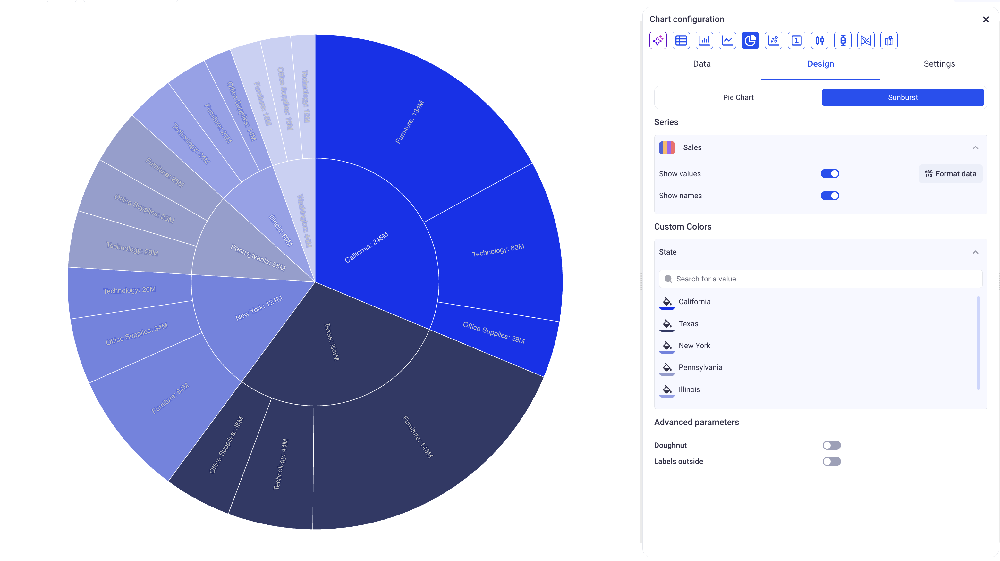

*Make sure to select the Sunburst option in the settings tab for a pie chart with two levels of groupings*.

> When using more than one level of grouping on a pie chart, you should use the `SUM` aggregation.

The design tab offer special options for Pie charts:

- _Doughnut:_ Plots as a doughnut instead of a pie chart

- _Labels outside:_ Shows the labels outside of the chart. Can be more readable in some configurations.

### 1.4 Configure an indicator chart

Indicator charts are suited to show high level indicators or KPIs in dashboards. See definitions in [Terminology](00_02_terminology.md) section. They can be used either to show the global aggregation of a measure for the entire dataset (say the global average of profit) or to show the latest value for a metric and compare it to the previous one.

#### a. Show a global metric

This is the most basic usage of an indicator chart.
In order to configure an indicator chart this way, just pick one series and no grouping.

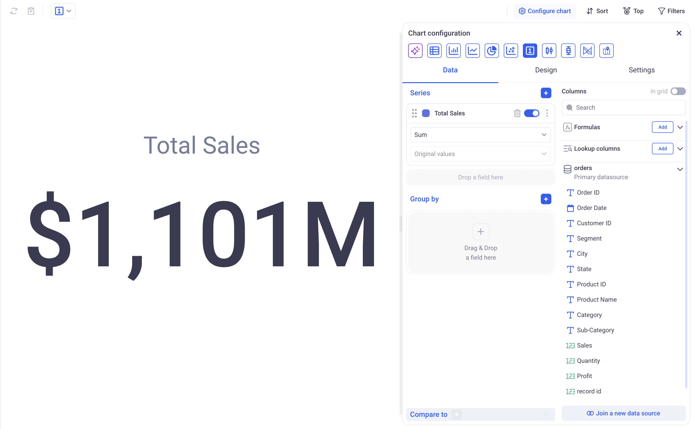

#### b. Show the last value for a metric, and compare it to its previous values

Indicator charts can be configured to show the last value for a metric. 
In order to do so, pick one series and one grouping. The chart will show the last point for that metric applying the defined grouping.

The compare to menu at the bottom (below the Group by) is useful to set up some comparisons: 

You can pick many among:

- _Previous value:_ To see the evolution of a metrics from one group to the next.

- _Minimum:_ To compare the last value with the minimum

- _Maximum:_ To compare the last value with the maximum

- _Average:_ To compare the last value with the average

- _Constant goal:_ To compare the last value with a fixed value - that can represent a goal to reach for instance.

> In the design section, you can set the color of the trend arrows - by default an Upward trend is Green, Downward is red and constant is Black.

### 1.5 Configure a scatter plot

A scatter plot is a chart that displays the values of two (or three) variables (series) as points on a chart. Each point on the plot represents one item (or group) and shows how two values are related to each other.

Purpose of a scatter plot:

- Visually assess the relationship (correlation) between two values.
- Identify trends, patterns, clusters, outliers, or possible groupings.
- Examine whether a change in one variable affects another.

#### a. Scatter plots with one grouping level

Scatter plots require at least **one grouping level and two series**. The chart will build a correlation graph between the two series for each group:

- The first series will be plotted on the X-axis (independent variable).
- The second on the Y-axis (dependent variable reacting to X).
- One point represents each group.

On the plot:

- If all points lie along an upward line → positive correlation.
- If they go downward → negative correlation.
- If they are scattered without pattern → no correlation.

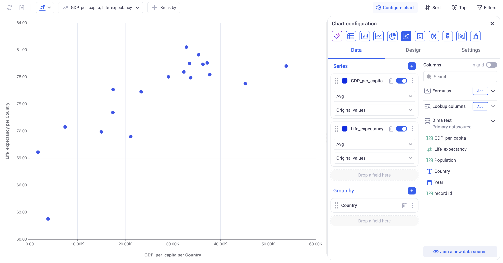

*In the example above, you can see the relationship between the average life expectancy of people (shown on the X-axis) and GDP per capita (Y-axis). Grouped by country. Each point corresponds to a group (country). This chart shows a positive correlation: the higher the GDP per capita, the longer people live*.

When the user adds **a third series**, each dot on the scatter plot shows one observation (or group). The position of the dot is based on two values: one for the X axis and one for the Y axis.The color of the dot shows the value of the third variable.

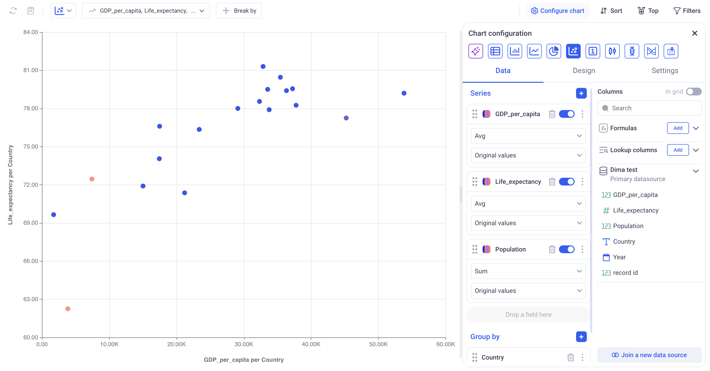

When you add Population as a third variable, it is shown by the color of each point:

- Darker colors represent countries with a larger population
- Lighter colors show countries with a smaller population
This allows you to explore three variables at once:
- Position shows GDP and life expectancy
- Color shows how many people live in each country
You can still see a positive trend: countries with higher GDP per capita often have higher life expectancy — and now you can also notice how population size varies across them.

#### b. Scatter Plots with Two Levels of Grouping

**Scatter plots with two series**  
Each point represents one group. Points differ in color depending on which group they belong to. Their position is determined by two variables (X, Y).

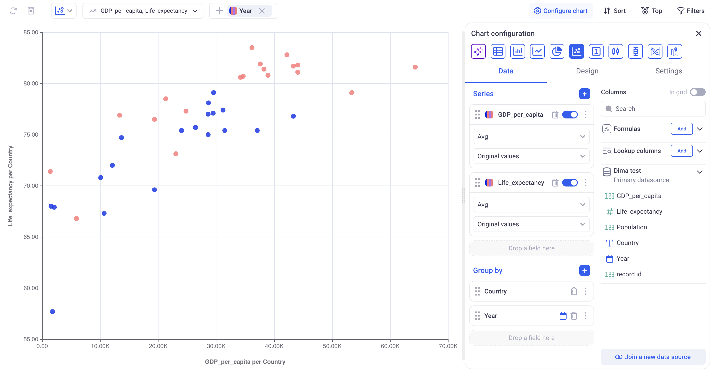

In the example above, you can see the relationship between the average life expectancy of people (shown on the X-axis) and GDP per capita (Y-axis) for different countries in two years — 1995 and 2025. 
- Each point represents a specific country in one of the selected years.
- The color of the point indicates the year (blue — 1995, red — 2025).
- The chart shows a positive correlation — countries with higher GDP per capita tend to have higher life expectancy.
- The grouping is done by the fields Country and Year, allowing comparison of trends across years.

**Scatter plots with three series**  
Each point represents one group. Points differ in color depending on which group they belong to. Their position is determined by two variables (X, Y), and the size indicates the value of a third variable.

When a third variable is added, each point not only shows a country's GDP per capita (X-axis) and life expectancy (Y-axis), but also uses size to represent an additional value — for example, population.
- Position shows GDP and life expectancy
- Color indicates the year
- Size represents the third variable (e.g., population)
This lets you see three types of data at once and compare countries by economy, health, and population size.

### 1.6 Configure a Sankey chart

Sankey charts work with one series and as many levels of grouping that you need. It requires no specific configuration in addition to this. 

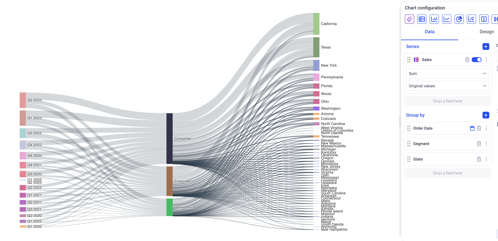

_This chart shows how the Sales of each quarter are distributed across Segments then States._

## 2. Series and Groups

Series and Groups define what data will be plotted in the charts. They play different roles in different types of charts.

### 2.1 Chart series

Each field has several configuration options:

#### 2.1.1 Display options

You can configure the field name (how it will appear on the charts) as well as the format of labels associated with this field. (For example set a unit or a number of digits to show after the decimal point). All these parameters are accessible on the three dots menu of each field.

#### 2.1.2 Aggregation

The charts will show aggregated values for each field. For example: The sum of profit per segment or The average of sales per region, etc... The first drop down menu contains a list of aggregation to pick from.

> __IMPORTANT:__ Be mindful of the aggregation method when you are plotting time series with time sampling. It is recommended to use aggregations such as Average, Min or Max (and avoid SUM as the value will grow with the number of samples falling within each bucket).

#### 2.1.3 Value calculation (Show As)

In charts, you can define ad-hoc calculations to apply to your fields by setting the Show As parameter.

__Table 1:__ Calculation Methods for one level of grouping:

| Calculation | Description   |     
|--------------------|---------------|
| Original Value     | Displays the aggregated value of each measure without any transformation.
| % of total         | Displays the percentage contribution of each aggregated value to the overall total.
| % of group         | For one level of grouping, behaves the same as the % of total.
| Cumulated          | Displays the running total, combining the current value with all previous ones.
| Difference with    | Displays the difference between the current value and the one before it. No value will be shown for the first data point.
| % of difference with    | Displays the difference between the current value and the one before it in proportion. No value will be shown for the first data point.
| % of previous value | Shows each point as the percentage of the previous one.

__Table 2:__ Calculation Methods for two levels of grouping:

| Calculation| Description   |     
|--------------------|---------------|
| Original Value     | Displays the aggregated value of each measure without any transformation.
| % of total         | Displays the percentage contribution of each aggregated value to the overall total, across all points.
| % of group         | Display the percentage contribution of each aggregated value within its parent group.
| Cumulated          | Displays the running total within each group, combining the current value with all previous ones, still within each group.
| Difference with    | Displays the difference between the current value and the one before it, in the same group. No value will be shown for the first data point.
| % of difference with    | Displays the difference between the current value and the one before it, within each group, in proportion. No value will be shown for the first data point.
| % of previous value | Shows each point as the percentage of the previous one in the same group.

__Moving calculations:__
Moving calculations can also be configured from within the Show As menu. 

- _Apply to:_ Defines the level of grouping to which you apply the calculation

- _Aggregation:_ Defines how to aggregate the data points together. This aggregation will be used to combine aggregated values together. (For example: the cumulative SUM of AVERAGES)

- _Previous Values:_ Specifies how many previous values to include, defined as a positive integer.

- _Next Values:_ Specifies how many next values to include, defined as a positive integer.

- _Current value:_ Specifies whether or not to include the current value.

_Above the result of using a moving calculation with: Apply to: Date, Aggregation: Average, Prev: 10, Next: 0, Current value: Yes. It computes the sliding average over the last 10 points._

### 2.1 Chart groupings

#### 2.1.1 Role of groupings in various types of charts

Groupings of a chart can be configured via the Group by section of the Data tab.
Depending on the type of chart that you pick, grouping will play different roles.

The table below illustrates the given configuration:

Profit (Series) by Date (First level of grouping) and Segment (Second level of grouping)

| Chart Type | 1st lvl of Grouping   |  2nd lvl of Grouping   
|--------------------|---------------|--------|
| Bar Chart          | X-Axis. One tick on the X-Axis per date | Defines how each bar will be broken down. Each bar will be split between segments to show the profit breakdown on a day, per segment.
| Line Chart         | X-Axis. One tick on the X-Axis per date | Will correspond to the plotted lines. Here, we will have one line per segment, each one representing the evolution of profit for that segment.
| Pie Chart          | Pie categories. Here, one pie slice per day. | When used as a sunburst chart, it will define the second level of slices. 
| Scatter Chart      | There will be one point on the scatter chart per value of the first level of grouping. Here, one point per date. | Ignored.
| Indicator Chart    | WIll display the value of the last group if a first level of grouping is defined (Instead of the overall aggregation).        | Ignored.
| Candlestick Chart | X-Axis. Same as bar chart | Ignored.
| Boxplot           | X-Axis. Same as bar chart | Ignored.
| Sankey Chart      | First level of the Sankey | Second level of the Sankey (There is no limit to the number of groups for the Sankey charts)
| Map Chart         | The first level of grouping must be a geographic denomination like a Country or a State etc.. | Ignored.

#### 2.1.2 Configuration of Groupings

Groupings can be configured in the same way as in the Grid view. Like in Grids, chart groups support Time sampling and Number binning.

> Number binning can be used to plot the distribution of a measure across a dataset:

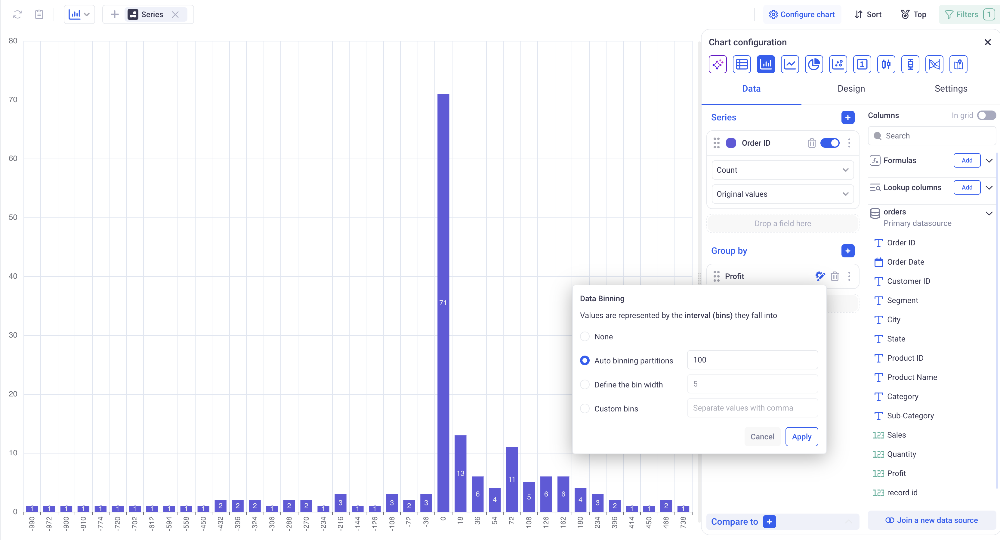

## 3. Drill down and Underlying data

A chart always displays aggregated data, but KAWA offers options to either view the underlying raw data for each point or drill down into other dimensions.
Both these options can be explored by doing a right click on a data point.

### 3.1 Show underlying raw data

Right clicking on a bar, and selecting "Show Underlying Data", a new section opens below the chart. It contains a Grid view filtered on the selected bar. 

Because it is a Grid View, you an feel free to interact with it to get further insights about this particular data point.

This bottom view can be expanded (full screen) or dismissed (closed) by clicking on the controls on its top right.

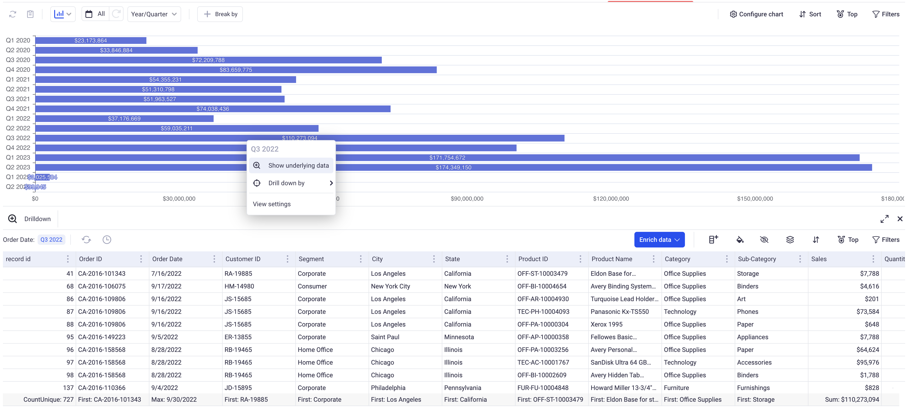

_Raw data is shown for Q3 2022._

### 3.2 Drill down into other dimensions

Right clicking on a bar, and selecting "Drill Down By" will open a sub menu that will let you select into which dimension you would like to drill down into.

This can be repeated as many time as you need by doing consecutive drill downs. It can also be combined with show underlying data at any point.

To help you keep track of what dimensions were picked, a breadcrumb will be displayed at the top left of the chart. CLicking on the (x) will reset the chart back to its original configuration.

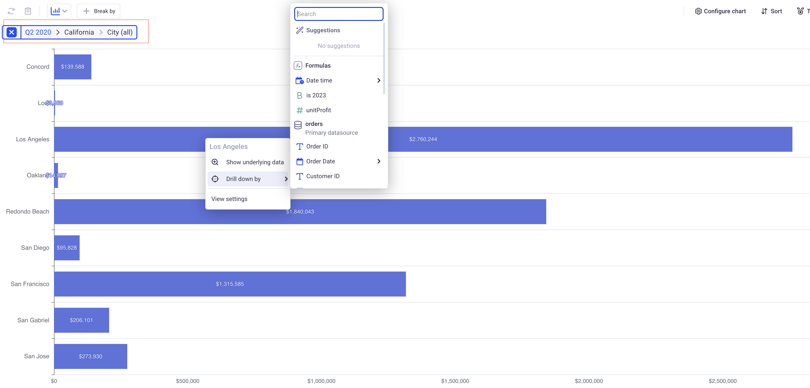

_Here, we are showing the Total Sales per City having drilled down on Q2 2020 and then the state of California._
