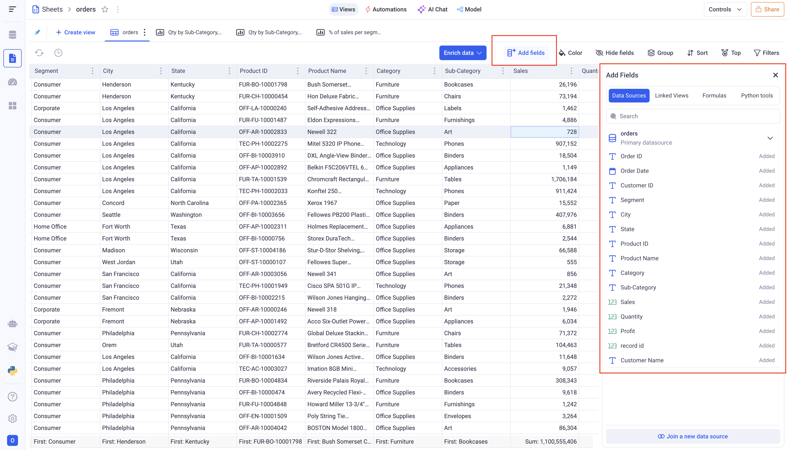

Grid views
---

Grid view is the most powerful type of visualization in KAWA.
They support an unlimited number of rows and have a very wide range of features.

> **Fields:** Each column of the grid is called a _field_. They are connected to your data and each one can be configured independently from the others. Note that you can connect many fields to the same data, if you want to show it in multiple ways in the same grid. 

* TOC
{:toc}

In order to create a new Grid View, click on the plus button at the top left of your sheet, and pick: Grid.

# 1 Manage the fields of your grids

## 1.1 Field visibility

You can show and hide your fields using the Hide Fields button situated at the top right of the grid. 

This menu lets you choose which fields you want to show or hide by clicking on the small eye icon in front of each field.

You can also opt to hide or show all of the fields by clicking on the hide all and show all button.

Also note that you can directly reorder fields in the grid by rearranging them from this component (drag and drop).

> Hiding a field does not mean that it is removed from your Grid. 

## 1.2 Adding and removing fields

In order to add new fields to your Grid, go to the add fields menu, situated at the top of the Grid. This will let you choose various type of data you can create fields from.

- Data Sources contains all the data from your underlying data sets.

- Linked Views contain column from the views that were linked to that Grid.

- Formulas are the computations that were added to your sheet

- Python Tools let you add fields that are computed with Python scripts.

Once you found the fields you wish to add, drag and drop it from the add field panel into the grid, at the desired location.

> You are not limited to one field from the same source.

Removing fields from the grid is done via the three dots menu on the header of the field. click on the delete field option.

## 1.3 Reordering your fields

To reorder you fields, you have several options:

Usually if the fields of your Grid can fit on your screen, you can directly drag and drop them at the desired position.

> When you move fields over other ones, you will see contextual menus appearing with several options. To reorder the field, please do not drop in a given option but below them all.

Another option to reorder your field is via the contextual menu in the header.

From there, you can either move your field to the first and last position, either move it next to an existing field.

> From the same menu, you can also Freeze your field. Frozen fields are moved to the first position and become insensitive to horizontal scrolling.

## 1.4 Formatting the fields

You have many ways to format your fields in KAWA.

### a. Conditional formatting

Conditional formatting will apply some style to
your fields based on their values. 
It will either set a style if a value matches a condition or apply some gradient coloring depending on where the values fall within a range.

This type of formatting, click on the Color button at the top of your grid.

#### i Rule based formatting:

In order to create a new Rule based formatting,
Click on Color > + Rule > Single color.

Here are the items to configure:

- _Apply to:_ It will define whether to color the Groups (Aggregated values) or the Rows (Row values).

- _Combine conditions:_ You can have multiple conditions (Adding conditions is done via the + Condition button). If you do, you can pick how to combine them: `AND` (in that case, the style will be applied if ALL the conditions are verified) or `OR` (here, you only need one condition to match to apply the style).

- _Define conditions:_ Pick which field will be subject to a condition and configure it following the options given to you. They depend on the type of the field you pick.

> If you are working at the group level, you also must decide how to aggregate your field. For example, you can want to color based on the average of profit or the minimum of sales.

- Lastly, Pick the color you want to apply and where you want to apply it: only one field or all the fields.

_Here we color in orange all row values above 100,000 `OR` below 0. The color is applied to the profit field._

#### ii Gradient based formatting:

In order to configure a new Gradient based formatting rule, 
click on Color > + Rule > Color Scale.

Similarly to the rule based formatting, pick the field you are basing the gradient on (not that you can compute the gradient on one field and color another).

- _Apply to:_ Gradient can either be applied to ROW values or GROUP values (Aggregations). If you pick group, you must also choose the aggregation to be used. For example: The average of Sales or the Maximum of profit.

- _Gradient configuration:_ Pick the color you want and to which values they correspond. Note that the values below the lowest bound will be colored with the lowest bound color. The same goes for the highest bound.

_Here we apply a gradient to the Row values of the quantity field_

#### iii Managing your rules

The rules can be removed and reorder to define in which priority the are applied. The first one will be applied first, then the second, and so on.

### b. Formatting the fields values

Another way to format the fields is to apply a static configuration on all values.

Depending on the type of the field, you will be able to format the content.

Regardless of the type, you can:

- apply a color to the entire field
- pick data position (left, center or right)

