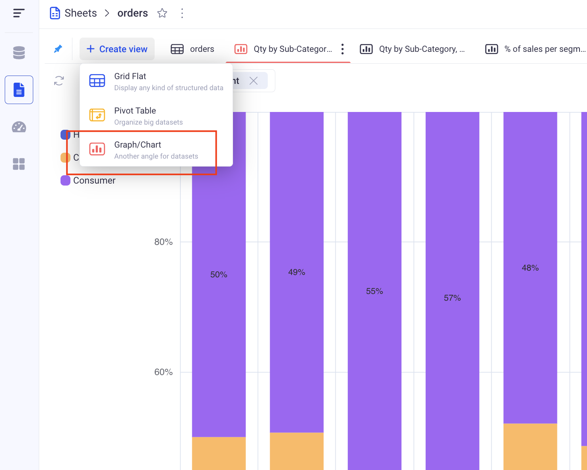

Chart views
---

Chart views let you build powerful visualizations of your data.
Many different types of charts are available and each one support a wide range of configuration parameters.

* TOC
{:toc}

In order to create a new Chart View, click on the plus button at the top left of your sheet, and pick: Chart.

# 1 Configure  your Chart

Configuring your chart is made through the Configure chart menu, accessible from the top right.

*There are three main sections in the chart configuration panel: Data, Design and Settings.*

Picking the type of your chart is made in the series of icons at the top of the configuration panel.

## 1.1 Configure a bar chart

In the data section, pick the Series and the Groupings.
A bar chart can have one or two levels of grouping and does not have any limit in the number of series.

> It is strongly recommended to have only one series when two level of groupings are present.

### a. Bar chart with one level of grouping and multiple series

In a bar chart, the first level of grouping will always be the X-Axis. There will be one "bar" per group and per series.

### b. Bar chart with two levels of grouping and one series

