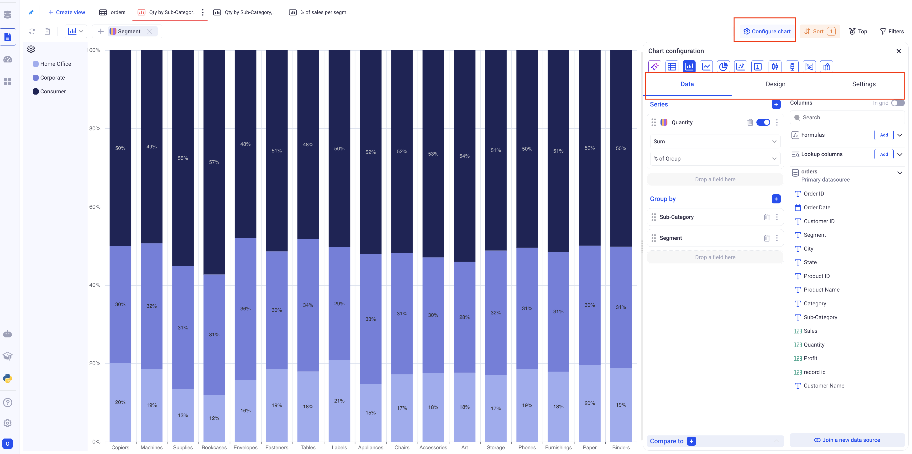
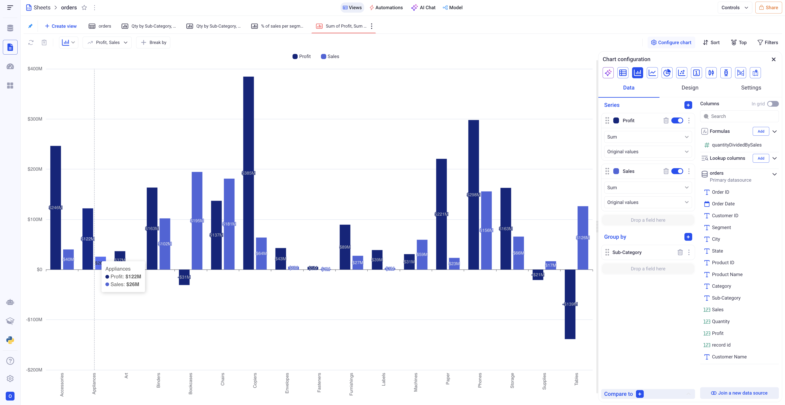
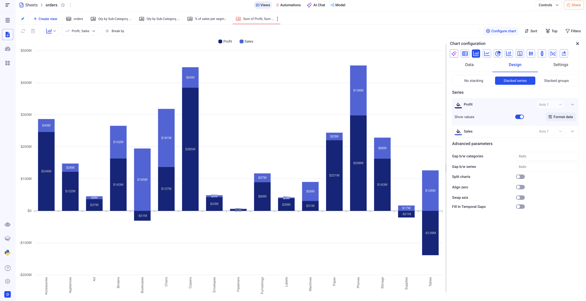
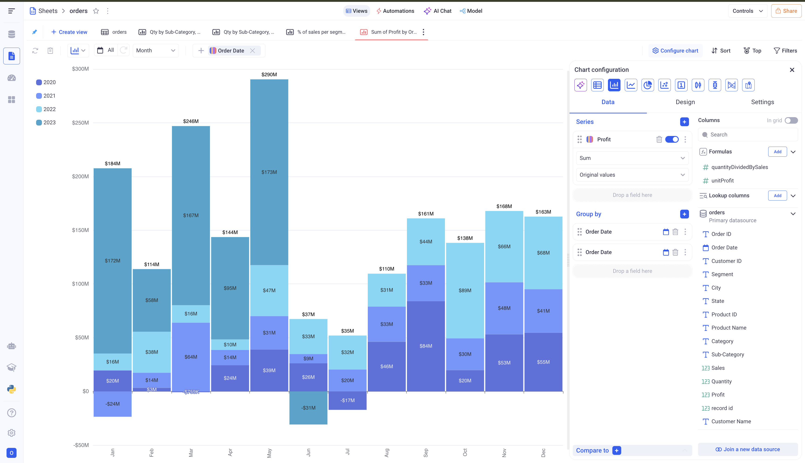
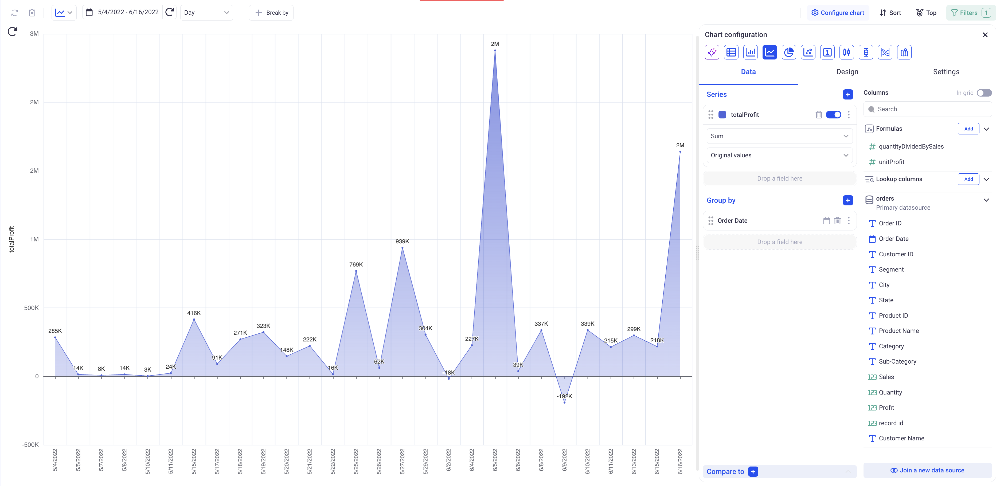
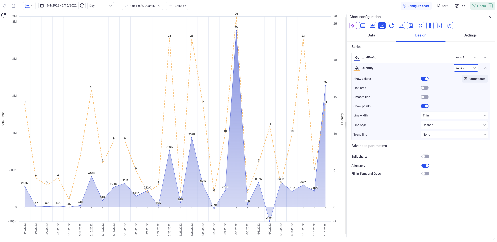
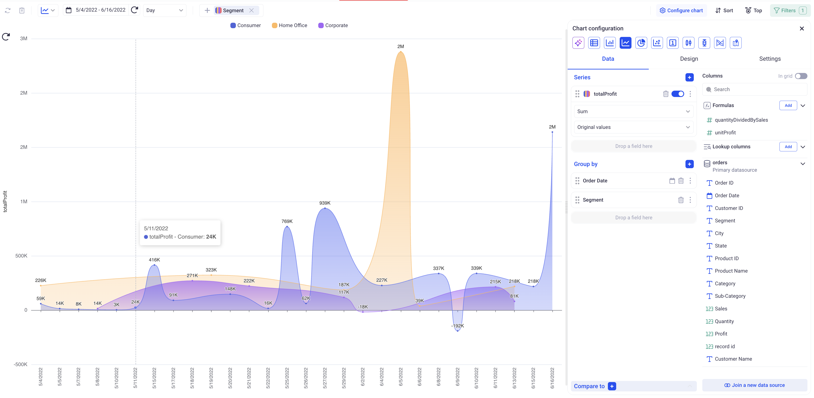
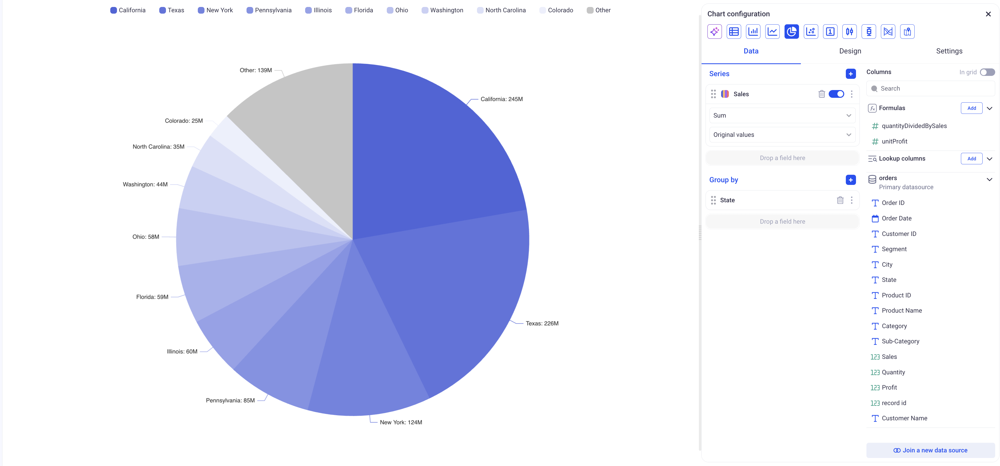
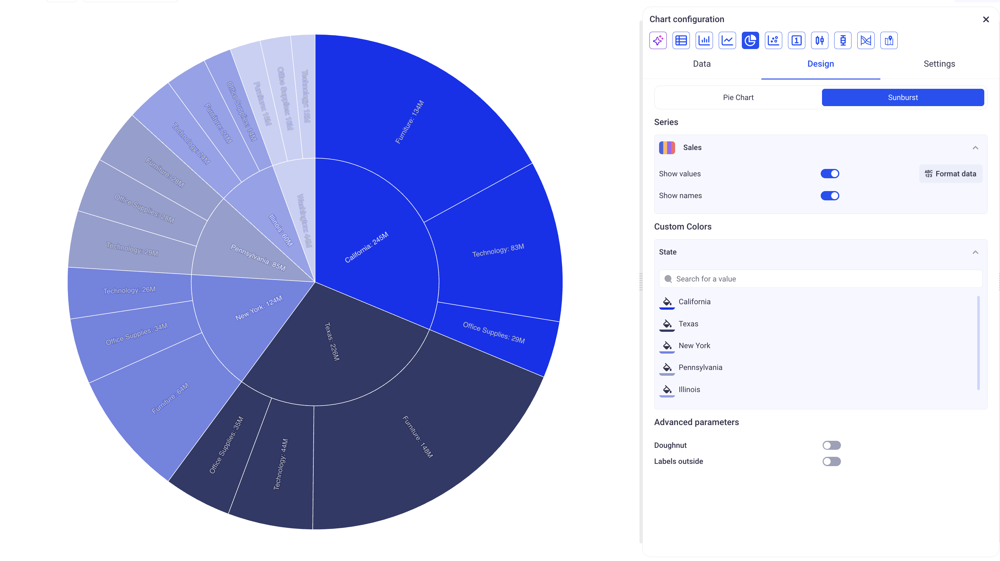

Chart views
---

Chart views let you build powerful visualizations of your data.
Many different types of charts are available and each one support a wide range of configuration parameters.

* TOC
{:toc}

In order to create a new Chart View, click on the plus button at the top left of your sheet, and pick: Chart.

# 1 Configure  your Chart

Configuring your chart is made through the Configure chart menu, accessible from the top right.

*There are three main sections in the chart configuration panel: Data, Design and Settings.*

You can pick your chart type at the top of the configuration panel.

__The settings tab:__ Contains global settings that apply for most types of charts. They let you control legend, behavior of axis, display properties and zoom.

The number of labels and label rotation work together. If you want to add more labels, you might need to rotate them by 45 or 90 degrees (vertical).

## 1.1 Configure a bar chart

In the data section, pick the Series and the Groupings.
A bar chart can have one or two levels of grouping and does not have any limit in the number of series.

> It is strongly recommended to have only one series when two levels of grouping are present.

### a. Bar chart with one level of grouping and one or more series

In a bar chart, the first level of grouping will always be the X-Axis.

When configuring a chart with multiple series and one grouping, you can decide to stack the series or show them separately. 

The stacking option is found in the design section, in the upper horizontal tab.

*Bar chart showing the profit and sales per sub-category, with and without Stacking*

### b. Bar chart with two levels of grouping and one series

With two levels of grouping, the first level will be the X-Axis and the second level will be reflected as the various portions of each bar.

*In the above example, you can see that the first level of grouping (Months) is shown on the X-Axis, while the second level of grouping is reflected on each bar (One color per year)*

### c. Specific settings for the bar charts

In the design section, you have several options to customize your bar charts:

- Formatting of each series
- Setting colors to each series or each point for the second level of grouping
- Defining gaps between bars
- Show the totals on top of each bar
- Make the bar chart horizontal (Only works for one level of grouping)

## 1.2 Configure a line chart

Line charts are similar to Bar charts, but are generally preferred to plot trends or evolutions of metrics.

In the data section, pick the Series and the Groupings.
A line chart can have one or two levels of grouping and does not have any limit in the number of series.

> It is strongly recommended to have only one series when two levels of grouping are present, otherwise the chart will be difficult to read.

### a. Line chart with one level of grouping and one or more series

In a bar chart, the first level of grouping will always be the X-Axis.

*Simple line chart showing the evolution of profit per day*

When plotting multiple series for one grouping, you can decide whether to plot all series on the same axis or on diverse axis. If you choose the split chart option, you can have one chart per axis.

*Plotting both Quantity (Ranges from -2 to 26 on a given date) and the Profit (Ranges from -200K to 3M on a given date) on two different axis.*

### b. Line chart with two levels of grouping and one series

Adding a second level of grouping on top of a temporal dimension is useful to see the breakdown of some indicator per another dimension.

*Here, we added the Segment as the second level of grouping -  as a result, we have one line showing the evolution of each segment over the days*

### c. Specific settings for line charts

In the design section, you can access the following parameters, specific to line charts:

- _Align zero:_ If we have many different axis, this setting will determine whether or not to align all the 0 horizontally.

- _Fill in temporal gaps:_ If the X-Axis is a temporal one, date or date time, empty points will be added in case the dataset is missing dates. For example, if the dataset has a point for the 1/1/2020, and one for the 1/3/2020 - the chart will add a tick on the X-Axis on the 1/2/2020. 

For each series, you can also configure if you want to:

- Smooth the lines
- Draw an area beneath the lines
- Add a trend line (Polynomial or Linear)
- Change line width / line style

## 1.3 Configure a pie chart

In the data section, pick the Series and the Groupings.
A pie chart can have one or two levels of grouping and does not have any limit in the number of series.

> When adding more than one series, KAWA will create as many pie charts as series.

> Only show series containing positive values. Otherwise the pie chart can lead to misinterpretation of the data.

*A simple pie chart showing the sales per state. A Pie chart will show the ten biggest categories and then aggregate all the others in an `Other` category*.

*Make sure to select the Sunburst option in the settings tab for a pie chart with two levels of groupings*.

> When using more than one level of grouping on a pie chart, you should use the `SUM` aggregation.

The design tab offer special options for Pie charts:

- _Doughnut:_ Plots as a doughnut instead of a pie chart

- _Labels outside:_ Shows the labels outside of the chart. Can be more readable in some configurations.