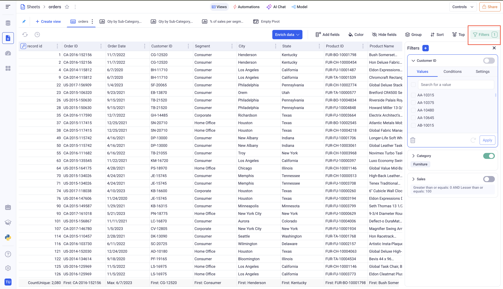
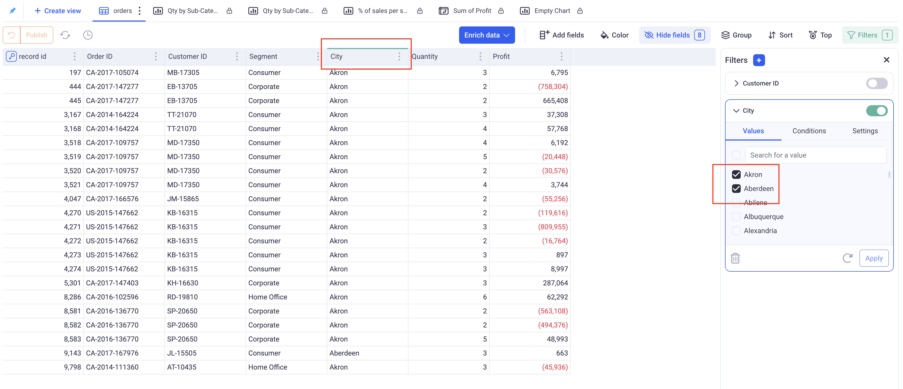
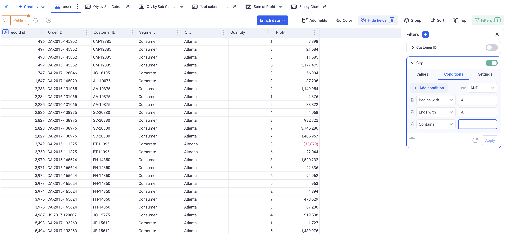
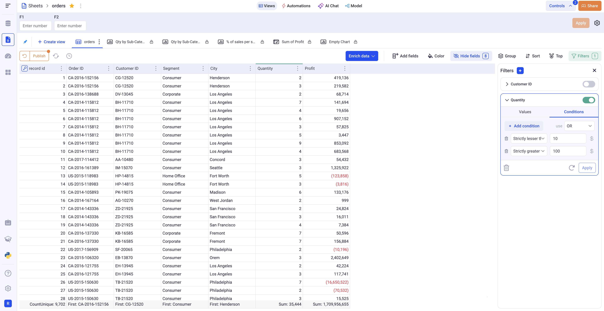

Filtering data
---

Filters can be applied to all types of view through the same filter panel.
Kawa comes with powerful built in filters, adapted to all your data types: text, number, booleans, date, date time.

* TOC
{:toc}

# 1. The filter panel

The filter panel is situated at the right of all the views (Charts, Grids and Pivots). It can be toggled on and of by clicking onf the green Filters button at the top right. This button indicates how many active filters are applied on your view.

_Here, three filters are configured, but only one is applied. The toggle button on each filter card toggles on and off the corresponding filters._

In this panel, you can configure the filters that are applied to you view, add new ones or remove existing ones.

To add new filters, click on the (+) button situated at the top of the panel. You can then choose what you want to filter. You have the choices between the fields of the current view or the columns of the underlying sheet. __You do not need to add the filtered columns to your views.__

# 2. Configuring your filters

## 2.1 The Text filters

### 2.1.1 Filtering particular values

This mode (The first tab of the filter) will only keep rows whose values for the picked column fall in a selection.

_Here, I will only keep rows for which the city is Aberdeen or Akron_

> IMPORTANT: The list of available values might not be exhaustive if there are too many (Above 300). This limitation exists to prevent millions and potentially billions of values to be sent to users. However, The search box has access to the entire list of values. For example, if the city `Miami` is not there in the initial set, typing the letter `M` will most likely filter down the list and make `Miami` available.

> IMPORTANT: As a consequence of the previous note, if you have text columns with a very high cardinality, do not use this mode to filter everything out EXCEPT a few values. (Clicking on select all followed by unchecking a few)

### 2.1.2 Filtering based on conditions

The second tab of the text filter lets you configure multiple conditions.

- You can add / remove conditions.
- When you have more than one condition, you can pick wether you want them ALL to match (`AND`) or at least one (`OR`).
- Each condition has an operator picked from the list: Begins with, Ends with, Contains, etc... and a text value (except for: Is empty and Is not empty).
- Important: All the conditions are not sensitive to case.

__Examples:__

- Begins with _W_ `AND` Ends with _E_ will match the word Wayne.
- Begins with _W_ `OR` Ends with _E_ will match the words Bruce, Walter and Wayne.

_Keeps only the cities whose name starts with A, ends with A and contains T._

### 2.1.3 Advanced settings for text filters

The third tab lets you configure the behavior of the filter card itself.

__Selection Mode:__ Can be set to multi-select or single-select. This will define how many can be selected in the selection (first tab).

__Configure options:__ Lets you define the exact content of the list in the selection. You can either restrict the values that are offered to the users or group them into categories. 

## 2.2 The Numeric filters

The numeric filters have two modes:

- _Simple range:_ Filter the number with a simple closed range. Note that both boundaries are optional. For example, if you specify only the Min, you will get all the values greater or equal to the Min. 

- _Conditions:_ Works the same way as the text filters with numeric conditions.

_The above filters only keep quantities that are either strictly lesser than 10 or strictly larger than 100._

