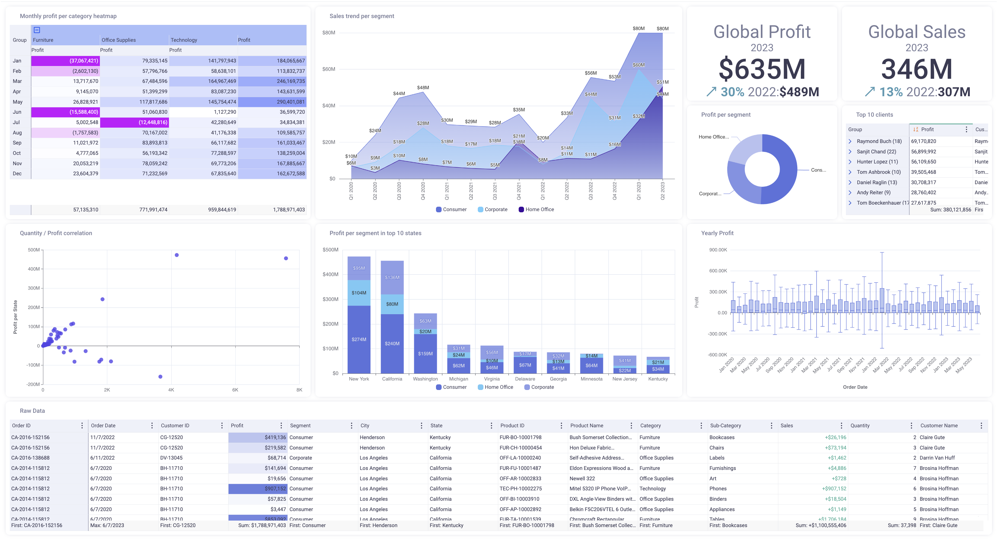

Visualization - Views
---

In KAWA, data can be visualized through charts, grids, and pivot tables, offering flexible and intuitive ways to explore and analyze information. Whether you're tracking trends over time, comparing metrics across dimensions, or drilling down into granular details, KAWA's visualization tools help turn raw data into actionable insights.

A sample of some charts, grids and pivot tables to Visualize various aspects of your datasets:

## Manage your views in sheets

Views are created directly in sheets and accessible via the main Tabs.

The tabs can be either Pinned (shown on the entire width of your screen) or Unpinned (Shown in a drop down list). In order to switch between one mode and another, click on the pin icon at the left of the tab bar / or at the right of the tab drop down menu.

_Create a new view:_ Click on the create view button situated at the top left (or inside the view drop down menu, when in the Unpinned mode). Then pick the type of view you need: Grid, Chart or Pivot.

_Reorder tabs:_ Tabs can reorder using drag and drop.

Clicking on the three dots menu next to each tab will display options. Here are the ones common to all types of views:

- Rename your view - the tab will be renamed as well
- Add a description to your view
- Duplicate a view
- Delete a view

The sharing of sheets and views is documented here: [Sharing](./07_01_permissions#21-sharing-sheets-and-views)

Here is a video that gives a global overview about views and sheets.

[Video tutorials about sheets and views](https://www.youtube.com/playlist?list=PL-glwHeQFKj4jEWqXz16I_RjzslAn2GO-)