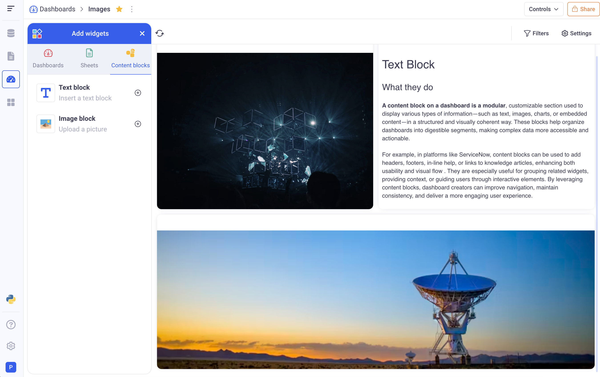
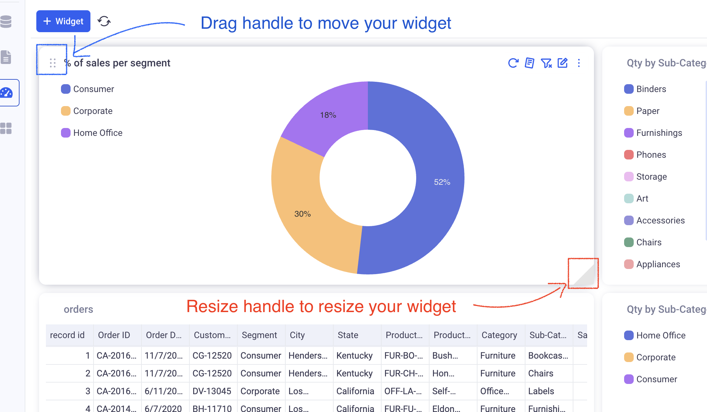
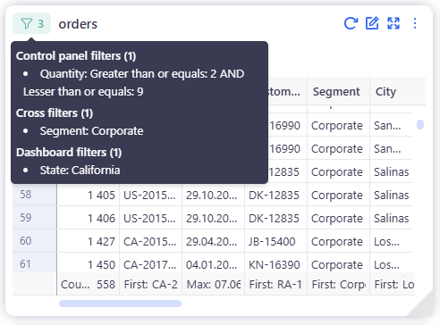
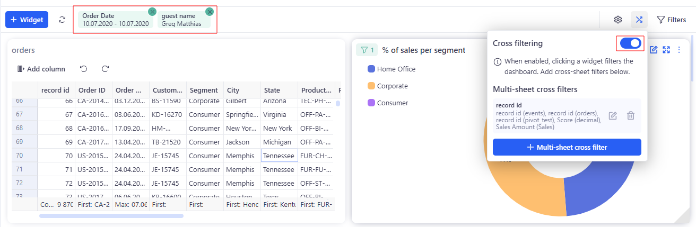
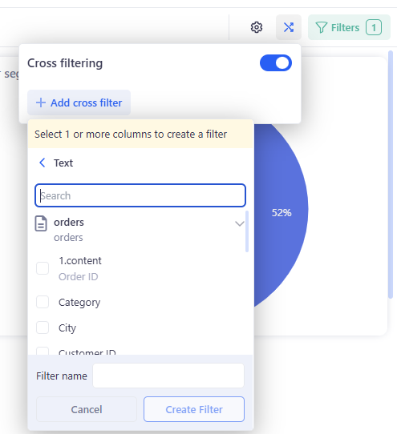

# Reports

See definitions in [Terminology](../13_00_terminology.md#reports) section.

Reports in KAWA serve as dynamic, interactive interfaces that consolidate and visualize data from various sources, enabling users to monitor key metrics and derive actionable insights in real-time. By integrating charts, grids, and pivot tables, KAWA reports facilitate a comprehensive view of business operations, allowing for efficient data analysis and decision-making. These reports are designed to be customizable, catering to diverse user needs and preferences.

## 1. Creating new Reports

In order to create a report, go to the Reports section and click on (+ Report). You can then pick one of the three available layouts:

* **Dashboard:** It is a blank canvas with unlimited height
* **Slides:** It is similar to power point and lets you create slides of fixed size.
* **Doc:** It is similar to Notion, a document-style report (free-length page) for rich text with embedded widgets.

## 2. Dashboards

### 2.1 Adding widgets to dashboards

When clicking on the (Add Widget) button, the widget selector will be displayed. It lets you choose views from sheets, widgets from existing dashboards or static blocks to add to your dashboard.

#### a. Adding widgets from existing sheets

In the widget selector, click on the (Sheets) tab. You will see the list of all the sheets in the workspace. Clicking on a sheet will show all the views contained in that sheet.

From that point, you can either:

* Pick an existing view from that sheet
* Create a new view, that will exist only in the dashboard

> All the views that are added to the dashboards will be copies of the ones from the sheet section.

#### b. Adding widgets from another dashboard

In the dashboards section of the widget selector, you will see all the widgets of each existing dashboard. Simply click on a widget to insert it in the current dashboard.

> All widgets will be copied and will not retain any link with the originals.

#### c. Adding content blocks

There are two types of content block:

* A Text block

_They provide an easy way to insert static texts to illustrate your dashboards. They support rich text formatting._

* An Image block

_They let you upload any image into your dashboards._

* A Code Block

_Accepts HTML content only and immediately renders it in place._

### 2.2 Managing your widgets

All your widgets can be resized and moved on the dashboard:

* Move with the the drag handle at the top left of each widget.
* Resize with the resize handle at the bottom right of each widget.

Here are all the actions that you can perform on the widgets. They are available in the menu at the top of each widget (additional options are available in the three dots menu).

* _Refresh:_ Will recompute a given widget. If one of the underlying datasources changed, the widget will be rendered reflecting that change.
* _Summary:_ This is available for chart widgets. It will show an automatic summary of the data that is displayed.
* _Edit widget:_ This opens the widget in full screen mode and lets you edit its parameters.
* _Full screen widget:_ Opens the widget in view-only full-screen mode.
* _Rename:_ This allows to change the name of the widget on the dashboard.
* _Disable all filters:_ Make the selected widget insensitive to the filters applied on the dashboard level (filters from the control panel, filters on the filter menu, cross filters).
* _Duplicate:_ This creates a copy of a widget.
* _Synchronize:_ Pulls the latest configuration and schema from the sheet/view, so the widget reflects recent changes; keeps the widget’s size and position on the dashboard.
* _Go to sheet:_ Navigates to the sheet/view and opens the underlying view used by this widget.
* _Delete:_ This removes the widget from the dashboard. If it was added from a sheet, it will not affect the original view.

### 2.3 Cross Filters

Cross filters let you explore a dashboard by clicking directly on a widget (bar, slice, point, cell, etc.). Each click adds a filter chip to the top bar, and all other linked widgets recalculate. It’s fast, in-context analysis without opening editors or changing the base views.

> Need a widget to ignore dashboard filters (including cross filters)? In its menu, turn on Ignore filters.

#### 2.3.1 How it works

* _Source:_ Clicking a value in a Chart, Grid, or Pivot Table adds a filter for that dimension (e.g., Segment = Consumer).
* _Scope:_ By default, the filter applies to all linked widgets on the dashboard. Widgets with Ignore filters do not react.
* _Combination logic:_ Selections from different fields combine with AND (e.g., State = Texas AND Segment = Consumer).
* _Local vs. dashboard:_ Local filters inside a widget still apply; cross filters further narrow the result.

#### 2.3.2 Interacting with widgets

* _Single select:_ Click a bar/slice/point or a value in a table.
* _Multi-select (same field):_ Hold Ctrl/Cmd and click more items.
* _Transparency:_ Tooltips show the active selection.

#### 2.3.3 Configure via the Config panel

Manage cross-filter behavior for the whole dashboard in Configure → Cross filtering.

#### 2.3.4 Enable

Go to Cross filtering -> Turn on the Cross filtering toggle — after this, clicks in widgets will add filter chips.

#### 2.3.5 Cross-filter groups

A cross-filter group is a named set of columns (often from different datasets/widgets) that should be filtered together.

* Click **+ Add cross filter**.
* In Select 1 or more columns to create a filter:
  * Find fields via Search or expand datasets (e.g., orders, sales).
  * Select one or more columns with the same meaning (e.g., State (orders) and State (sales)).
  * Enter a clear Filter name (e.g., Location, Customer, Product).

* Click Create Filter — the group appears in the list (with **edit** and **delete** icons).

What happens on click: If a user clicks a value in a column that belongs to a group, the system creates a chip and applies the same filter to all other columns in that group across related widgets. Groups do not affect widgets that don’t use the group’s fields or that have Ignore filters enabled.

#### 2.3.6 Examples:

* _Location:_ State (orders) + State (sales) — clicking a state in the orders table filters sales widgets by that state.
* _Product:_ Product (orders) + Product (sales) — clicking a product in a pie chart filters KPIs and tables from another dataset.

### 2.4 Exploration mode

* _What it is:_ Quickly change how a widget shows data.
* _How to use:_ Click **Explore** (binoculars).
* _What you see:_ A **Exploration mode** bar in the green board appears.

* _Save or undo:_
  * **Save** — keep the new view for this widget.
  * **Cancel** — discard the changes.
* _Scope:_ Affects **only this widget**. The dashboard layout and the source sheet stay the same.

### 2.4 View (read-only) mode

Reports include a dedicated View (read-only) mode designed for presenting and consuming content.

* A View mode toggle is available.
* When a user has read-only access, Reports open in View mode by default.
* The Control panel works in View mode: if at least one control exists, it is shown so viewers can apply filters without editing the report.
* Export to PDF is available in View mode.

## 3. Slides

## 4. Doc

Doc are a document-style report with flexible page length. They let you build structured documents with text, headings, images, and interactive widgets. This type is especially handy for analytics presentations, technical reports, or hybrid pages that combine explanations and visualizations.

### 4.1 Create

Go to **Reports** → click **+ Report** → choose **Doc** (next to **Dashboard** and **Slides**).

### 4.2 Structure and Editing

* **Adding blocks.** Use **+** or type **/** and choose: Text, Heading 1–3, Bulleted list, Numbered list, Checklist, Сode, Image, Add widget.

* **Block context menu.** Open it via the Block handle (six-dots icon): Convert to, Move up / Move down, Delete.

### 4.3 Adding widgets

* Click **Add widget**.

* In the dialog, choose **Sheet**.
* Pick **Existing widget** or **New widget** (chart, grid, pivot).
* Click **Apply** — the widget will be inserted at the cursor.

> The full list of actions (**Refresh, Summary, Edit widget, Full screen widget, Rename, Disable all filters, Duplicate, Synchronize, Go to sheet, Delete**) is described in **Dashboard → Managing your widgets**.

### 4.4 Formatting content

Text blocks support **Rich text** (bold, italics, underline), **H1–H3 headings, lists, checklists, code snippets**, and **images**. This lets you build full analytical documents with explanations and dynamic data.

### 4.5 Filters and exploration

**Control panel filters** also work for widgets embedded in a Doc.

**Exploration mode** and **View mode** for Doc widgets works the same as on a dashboard (see **Dashboard** → **Exploration mode**, **View mode**).

### 4.6 When to choose a Doc

* When you need a narrative plus visualizations on one canvas.
* For overview reports where charts are interleaved with explanatory text, images, and notes.
