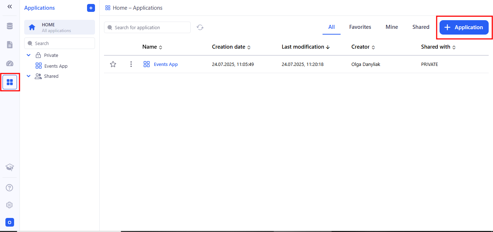
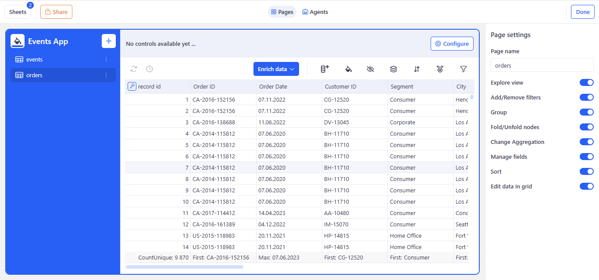
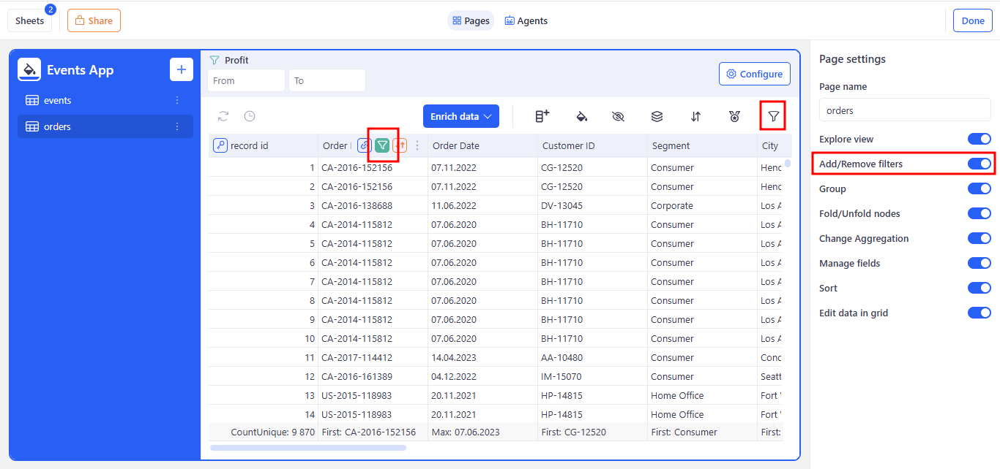
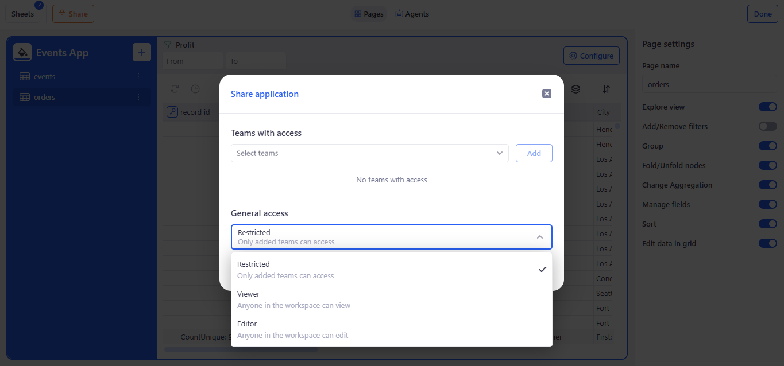

# Applications

Applications in KAWA let you create and deploy full-featured web apps directly on your datasets, using Views and Dashboards as pages. Each page can be customized to control user interactions such as filtering, sorting, grouping, and deploying/folding nodes.Also, the applications now include a built-in AI assistant for natural-language interaction with the data you see on the page.KAWA Applications make it quick and simple to turn raw data set into tailored interfaces that speed up work and help you make better decisions.

## 1. Creating applications

To create a new application, go to the Applications section and click on (+ Application).

The next step after clicking the + Application button is to choose the sheets that your application will be based on.

After you pick the sheets, a Select agents window appears where you choose which chat agents (AI assistants) will be available in your application.

## 2. Editing applications

Once your application is created, you’ll arrive at the Page Editor, which is organized into four main areas:

### 2.1 Left Sidebar (Navigation)

The left sidebar lets you fully control your application’s structure:

#### a. Application Title & Rename

* Your application’s name appears at the top.
* Click the pencil icon next to the title (e.g. “Events App”) to rename it in place.

#### b. Add New Pages

* Hit the + button to add a new page - choose from View, Dashboard, or Presentation.

#### c. Manage Existing Pages

* Each page (e.g. “events”, “orders”, “% of sales per segment”) is listed below the title.
* Click the three-dot kebab menu ⋮ on any page to Rename or Delete it.

#### d. Reorder Pages

* Drag any page up or down the list to change its position.
* The sidebar—and your app’s navigation—will update immediately to reflect the new order.

### 2.2 Main Canvas (Content Area)

Renders your active page - whether it’s a sheet, dashbord, presentation, or any custom view—in a live, fully interactive workspace.

Above it, the toolbar gives you one-click access to:

* Configure: after clicking the Configure button, the Add new control panel opens from the right side of the screen. You can read more about this in the [Control Panel](02_01_control_panel.md) section.
* Added active Controls.

Within the canvas itself, users can filter, sort, group, collapse/expand nodes, and even edit records directly. Which of these features are available at any moment depends on your settings in the Right Sidebar (Page Settings): toggling off “Add/Remove filters” will cause the filter icon of each column to disappear and in the canvas itself and block the creation of new filters, and disabling the "Change Aggregation" feature will prevent you from changing the aggregation of each column. In this way, every control on the canvas reflects the toggles you choose, ensuring that the page’s behavior always matches your configuration.

### 2.3 Right Sidebar (Page Settings)

Provides on/off toggles and text fields to customize the active page. The right sidebar offers context-sensitive controls for tweaking the active page. Depending on whether you’re editing a View, Dashboard or Presentation, you’ll see options to rename the page, turn on or off interactive features (like filtering, grouping or inline editing), adjust aggregation and field visibility, and configure other page-specific behaviors. Use these settings to fine-tune both the look and functionality of each page in your application.

### 2.4 Header (Page Toolbar)

Above the canvas, the header gives you quick access to global page actions:

#### a. Sheets

Delete or add the underlying data source for this page.

#### b. Share

Adjust who can view and edit it.

#### c. Pages/Agents Toggle

Flip between page layout controls and AI-assistant settings.

When you switch to the AI Agents tab, you can adjust every setting of the selected agent. This flexible setup lets you customize each assistant for different datasets, user roles, and use cases—making sure your team always has the right AI helper on hand.

#### d. Done

When you’ve finished configuring, click Done in the top-right corner to save and exit the editor.

## 3. Viewer Mode

KAWA will save your changes and automatically switch from the editor into Viewer Mode, displaying the production-ready interface of your application.

In Viewer Mode, your team sees the clean, final version of the app—no editing tools, just the controls you’ve exposed:

### 3.1 Left Sidebar

#### a. Back Arrow:

Return to the Home - Applications page.

#### b. App Title:

Shows your application’s name.

#### c. Page List:

Navigate between all published pages (Views, Dashboards, Presentations) in the order you defined.

#### d. Chat with your data:

Launch the context-aware AI assistant for natural-language queries against the visible dataset. Open a focused workspace where you pick an AI agent, choose from suggested prompts, or type your own questions. The agent uses your current page’s data to deliver context-aware answers—charts, tables, or summaries—in a clean, standalone view. Use the back link to return to the main application when you’re done.

You can read more about this in the [AI Integration](06_00_ai_integration.md) section.

### 3.2 Main Canvas (Content Area)

* Renders the selected page—grid, chart, form, or custom view—in a fully interactive, read-only layout.
* Users can filter, sort, group, collapse/expand nodes, and drill down into details according to the toggles you enabled during editing.

This Viewer Mode is what your end users will interact with day-to-day: a streamlined, secure interface for exploring data and leveraging AI assistance without any editing distractions.

#### a. Exploration mode

On this toolbar you’ll see the Explore button (binoculars icon) with a dropdown. It lets you instantly switch between three data exploration modes.

With one click, you can pick the best view for your current dataset—no need to rebuild pages or start from scratch.

