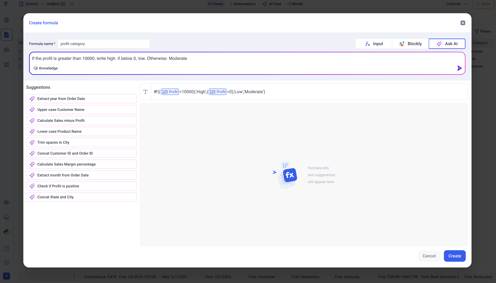
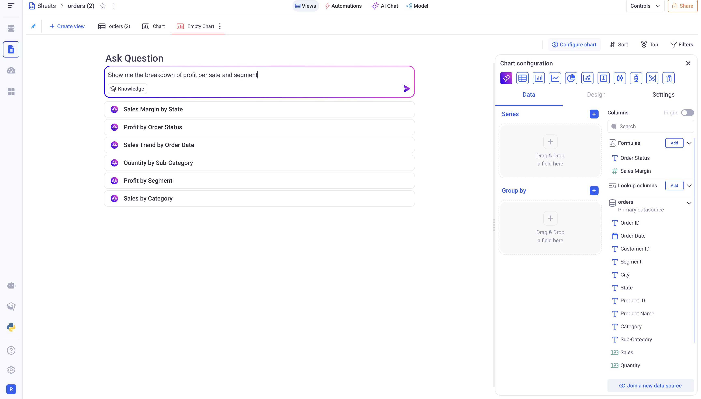
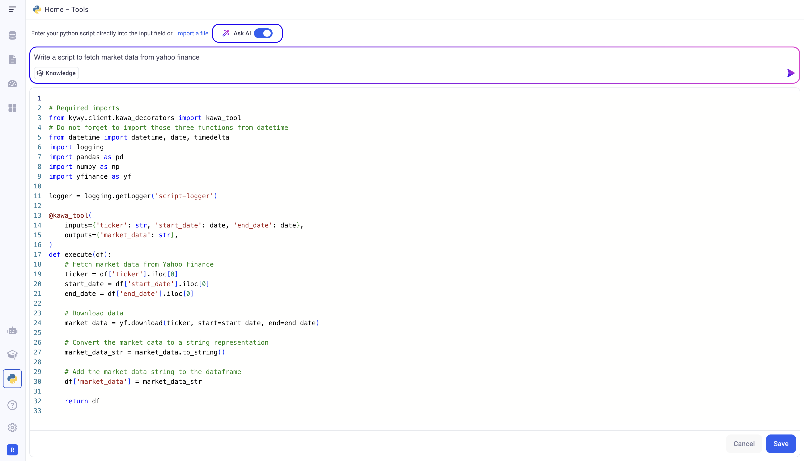
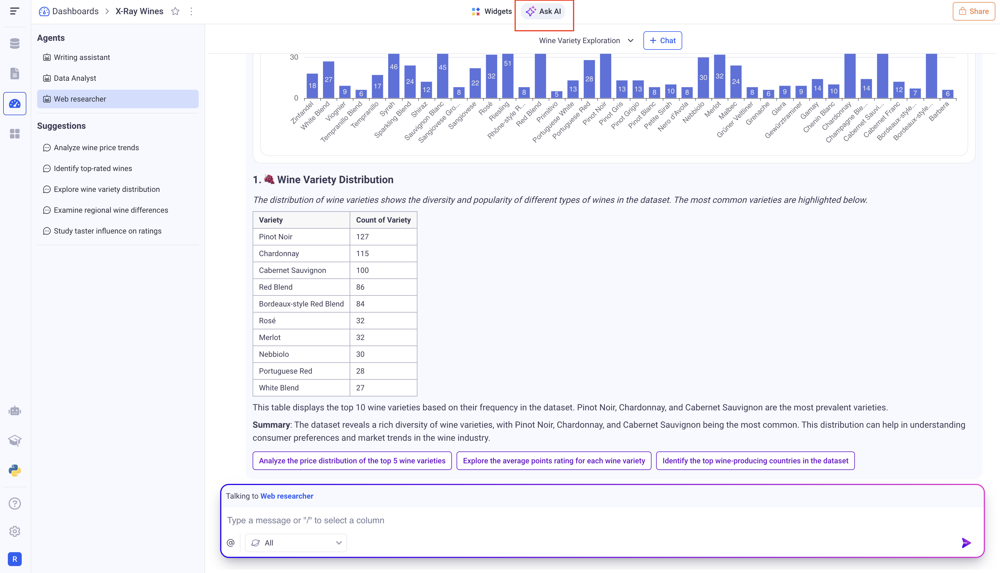
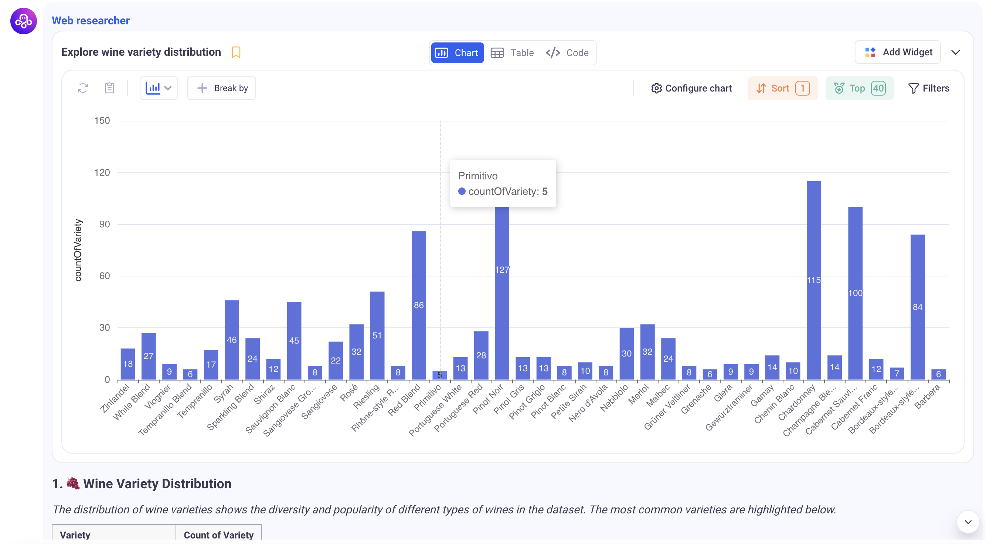
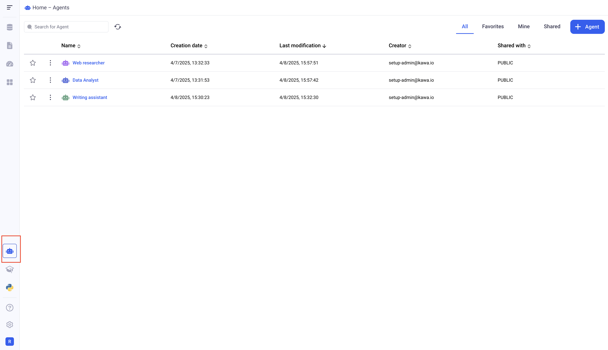
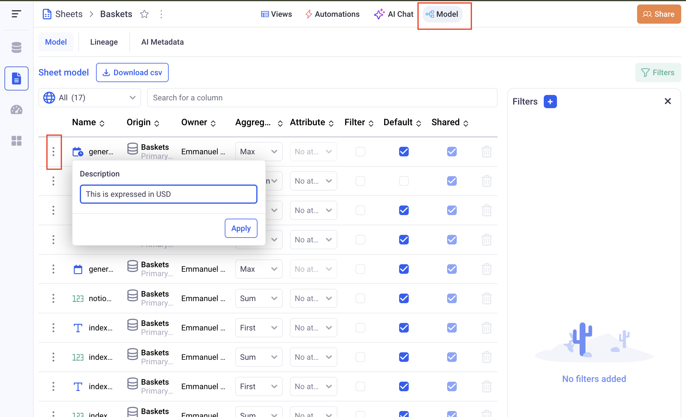

# AI Integration

* TOC
{:toc}

## 1. AI Integration to assist configuration

In KAWA, AI is integrated in various places to assist you configuring your data models and analytics.

### 1.1 Formula editor

Within the sheet section, the formula editor comes with an AI section that can write formulas from a description in natural language.



The AI also provides a list of suggested prompts that you can leverage.

### 1.2 Chart creation

When creating new charts, the AI can help by generating the appropriate configuration from a prompt.



Like for the formulas, it suggests a list of relevant charts that you can use.

### 1.3 Python script generation

From within the Script section, you can use AI to generate scripts with the correct syntax, tailored to your data and context. 



## 2. Integrated AI Chat

You can interact with your data intuitively using Kawa's integrated AI Chat. It utilizes a comprehensive understanding of sheet structures and employs a multi-agent approach to facilitate seamless data exploration. This feature allows you to engage with your data naturally, enhancing the efficiency and effectiveness of data analysis. By integrating AI capabilities, Kawa ensures that you can easily access and interpret complex datasets, making informed decisions based on real-time insights.

### 2.1 Using the chat

The chat can be found in three places:

- In a sheet (Access on the top of the page, `Ask AI`)
- In a dashboard (Access on the top of the page, `Ask AI`)
- In an application (Access at the bottom left: `Chat with your data`)



__Starting a conversation:__
To start a new conversation, click the (+Chat) button at the top. Each conversation is private and retains the full history of messages exchanged with Kawa's agents.

__Selecting the correct agent:__
When you send a message in a conversation, it's directed to a specific agent. The available agents for your current context are listed in the Agents section at the top left. You can switch to a different agent at any time during the conversation.

> When you switch agents, you'll see the relevant commands and suggestions defined by that agent's configuration in the right panel.

__Data Analytics:__
The agents have access to all the sheets of your context. 

| Chat | Context
|--------------------|---------------|
| Sheet            | The current sheet |
| Dashboard        | All the sheets of the Dashboard |
| Application        | All the sheets associated with the Application |

When asked a question that is relative to data stored in one (or many sheets), the agent will often query the data to provide an answer.

> The agent will use the security policy of the logged in users and will only access data that is authorized.

Each query that the agents make will result in a visual and interactive section with three tabs:

- A chart that shows a subset of the data in a visual manner
- A Grid that shows the actual data that was retrieved
- A Code section that shows the actual query

The outcome of an analytics session can be bookmarked and, when working within a dashboard, added directly as a widget for easy access.



## 3. Configuring Agents and Metadata

This defines the context for the messages you send in the chat. Each interaction includes:

- Information from the sheets, such as column definitions and metadata

- Instructions and knowledge associated with the agent you're interacting with

- The full history of previous messages within the active conversation

Together, these elements ensure the AI has the necessary context to generate accurate and relevant responses.

### 3.1 AI Agents

Each workspace includes a default AI agent named Paul. Agents are configured with specific instructions, connected knowledge sources (including unstructured data), a set of commands, and defined capabilities to assist with tasks and queries. See definitions in [Terminology](./13_00_terminology) section.

Agents can be configured from the agent section:



Agents can be added, updated and removed. Note: The default agent can be edited but not removed.

> All agents are always shared on the entire workspace. Anyone with the `Edit Agent` flag can edit them.

Agents are accessible within the various AI chats, allowing users to interact with them directly to retrieve information, execute commands, or perform specific tasks based on the agent's configuration.

### 3.2 Sheet Metadata

When chatting with data, the AI model has access to sheet metadata from multiple sources:

- Column details from the sheets, including each column's type, name, and description.

In order to configure the description for each column, go to the sheet model:
Model > Three dots menu of any column > Update description



- AI Metadata, which is a free-text field defined in the model. This allows you to provide any additional, context-specific information about your sheets to guide and enrich the AI's responses.

Configuring the AI Metadata can also be done through the sheet model: Model > AI Metadata (third tab on the right)

## 4. Connecting KAWA to your LLM through the Chat API

This section is reserved for platform administrators with an ADMIN account.
In order to connect to a LLM, KAWA must be configured to an Open AI API on any provider.
The API must be strictly compatible with Open AI specifications. Please contact support@kawa.ai for any requests to adjust KAWA to your API.

Examples of compatible providers:

- DeepSeek ([DeepSeek API](https://api-docs.deepseek.com/))
- OpenAI ([OpenAI API](https://platform.openai.com/docs/api-reference/chat))
- Groq Cloud ([Groc Cloud API](https://console.groq.com/docs/overview))
- Azure Open AI ([Azure OpenAI API](https://learn.microsoft.com/en-us/azure/ai-services/openai/reference))

We can provide connectivity to the following providers on request.

- Claude AI
- Mistral AI
- Gemini

> In order for KAWA to be fully operational, your model MUST support function calling through the `tools` parameter in the Completion API.

This configuration is done through the KAWA Python SDK.
Please cf [Kawa SDK on Github](https://github.com/kawa-analytics/kywy-documentation) to install the SDK.

```python
from kywy.client.kawa_client import KawaClient as K

kawa = K.load_client_from_environment()
cmd = kawa.commands

# Command to configure OPEN AI Completion API
# CF the below table for the list of available parameters.
cmd.replace_configuration('OpenAiConfiguration', {
    'activated': True, 
    'supportsStreaming': True,
    'openAiApiKey': 'sk-.........',
    'model':'gpt-4o',
    'openAiApiUrl': 'https://api.openai.com/v1',
})
```

List of configuration parameters to configure the connection the the completion API:

> There is NO need to restart the KAWA platform for these parameters to be taken in account.

| Parameter | Required | Default Value | Description  |
|-----------|----------|---------------|--------------|
| activated | Yes       | False         | Set to True to enable AI support.
| supportsStreaming | No | True         | Set to True if the API supports Server Sent Events
| openAiApiKey | Yes    | Empty text    | Use your provider's API Key. If omitted, AI support will be disabled
| model    | Yes        | gpt-4o        | The LLM to use. Check with your provider for the list of available models
| openAiApiUrl  | Yes   | https://api.openai.com/v1 | KAWA will use this URL:  `$(openAiApiUrl)/chat/completions`
| completionApiUrl | No  | Empty text   | If set, KAWA will ignore `$(openAiApiUrl)` and POST requests directly on this url
| additionalHeaders | No | Empty text   | Additional headers to send to the completion API. Syntax is: `HEADER1=VALUE1,HEADER2=VALUE2`
| authenticatesWithKerberos | No | False | If set to True, wil authenticate to the completion API with kerberos. The prerequisite being that all the Kerberos credentials are properly configured on the host machine.


