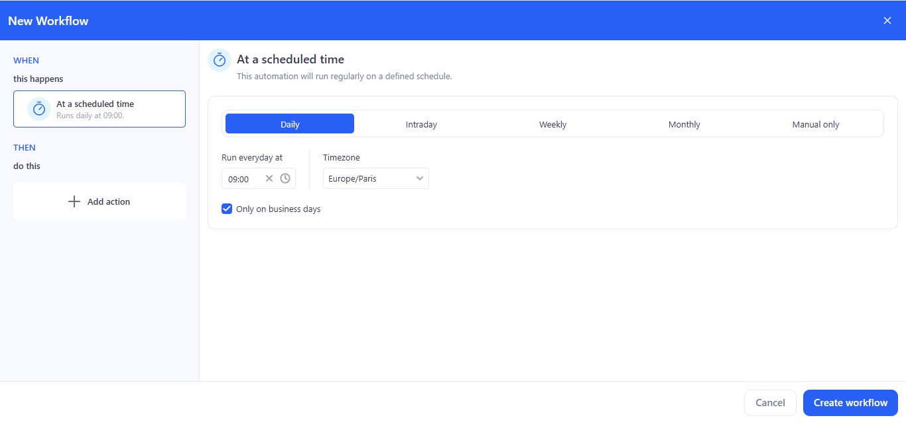
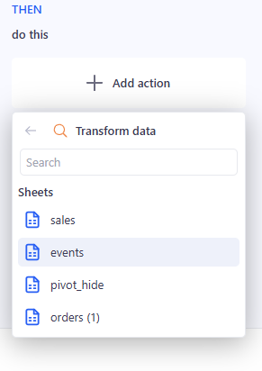
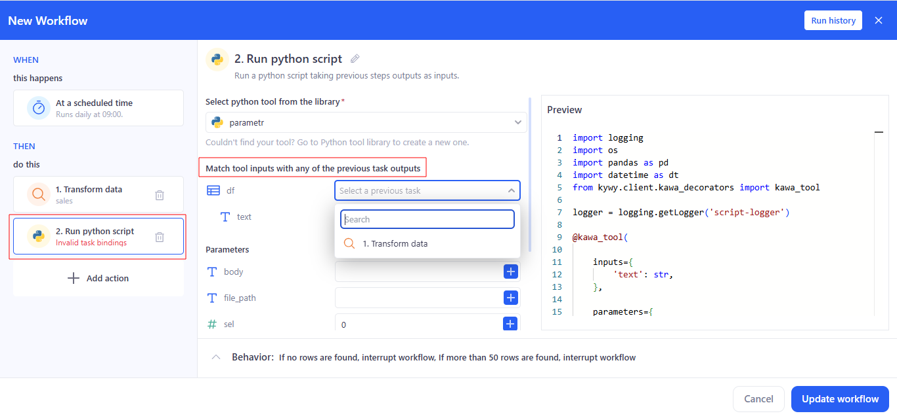

# Workflows

Workflows is KAWA’s builder for multi-step processes. Actions can be started on a schedule or manually, and steps run in sequence: data processing, running Python scripts, sending emails, and calling AI prompts.

## 1. First workflow

### 1.1 Create: 

To create a new workflow, go to the Workflows section and click  on **+ Workflow**.

 

### 1.2 Set trigger (At a scheduled time):

- Choose Daily, set time (e.g., 09:00), Timezone, and Only on business days if needed.

- For Intraday, specify an interval during the day.
- For Weekly/Monthly, specify days/months.
- Manual only — no schedule.

### 1.3 Add action: 

Click **Add action** — the Actions panel opens; select the needed action.

#### 1.3.1 Step 1: Transform data

- Choose a Sheet from the list.

- If needed, open Enrich data and use the quick transform icons.

- In the Behavior block, set:

  - If no rows are found → Interrupt workflow / Continue without a result.
  - If more than 50 rows are found → Interrupt workflow / Continue  without a result.
  - Max number of rows → a number (e.g., 50).

#### 1.3.2 Step 2: Run python script

- In Select python tool from the library, choose a tool.

- In Match tool inputs (required entries), bind inputs to outputs from previous steps:
  - df → select **1. Transform data** or other prior action.
  - text → bind to a source.
  - рarameters → optional/named options; they can also be bound to outputs from previous steps.

If Invalid task bindings appears, a required input is missing or linked to the wrong source.

#### 1.3.3 Step 3: Send email

Recipients, Subject, and Body can be entered manually, or use the + on the right to insert values from previous steps (e.g., a sales total or a generated table).

#### 1.3.4 Step 4: AI prompt

- Enter the prompt text. Use the **+** button to insert variables/fragments from previous steps (transformation results, script outputs, etc.).

- Use the prompt for summarization, recommendations, and generating explanations.

### 1.4 Save: 

Сlick **Create workflow**.

