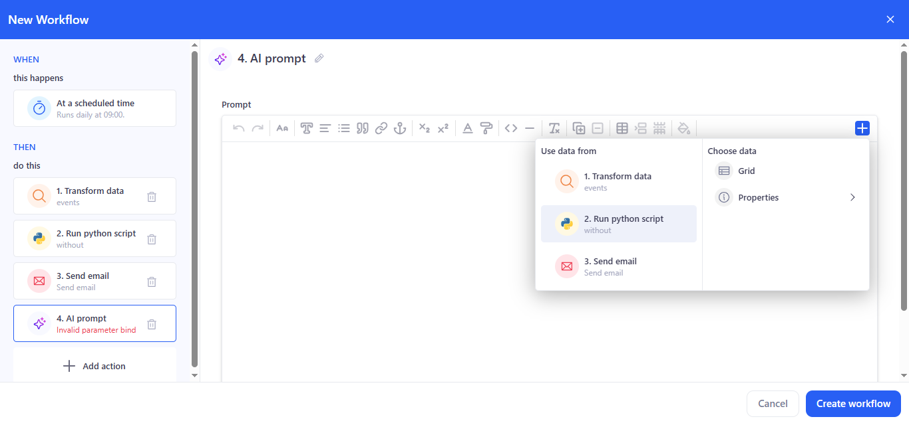
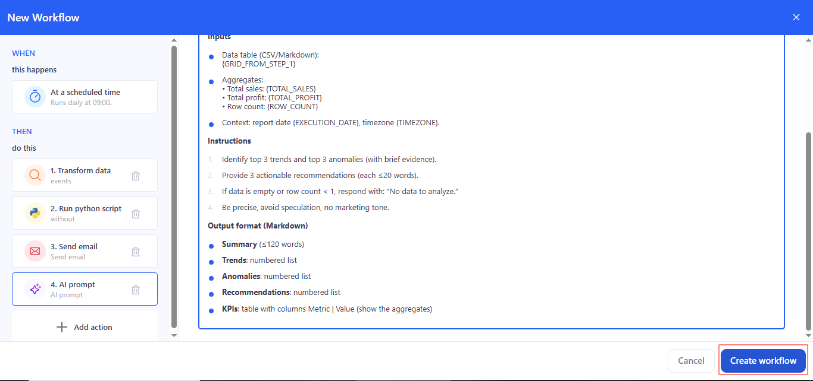
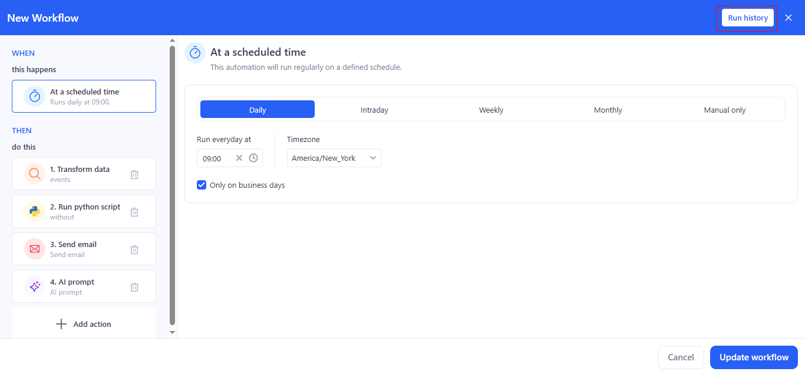

# Workflows

Workflows is KAWA’s builder for multi-step processes. Actions can be started on a schedule or manually, and steps run in sequence: data processing, running Python scripts, sending emails, and calling AI prompts.

## 1. First workflow

### 1.1 Create: 

To create a new workflow, go to the Workflows section and click  on **+ Workflow**.

 

### 1.2 Set trigger (At a scheduled time):

- Choose Daily, set time (e.g., 09:00), Timezone, and Only on business days if needed.

- For Intraday, specify an interval during the day.
- For Weekly/Monthly, specify days/months.
- Manual only — no schedule.

### 1.3 Add action: 

Click **Add action** — the Actions panel opens; select the needed action.

#### 1.3.1 Step 1: Transform data

- Choose a Sheet from the list.

- If needed, open Enrich data and use the quick transform icons.

- In the Behavior block, set:

  - If no rows are found → Interrupt workflow / Continue without a result.
  - If more than 50 rows are found → Interrupt workflow / Continue  without a result.
  - Max number of rows → a number (e.g., 50).

#### 1.3.2 Step 2: Run python script

- In Select python tool from the library, choose a tool.

- In Match tool inputs (required entries), bind inputs to outputs from previous steps:
  - df → select **1. Transform data** or other prior action.
  - text → bind to a source.
- Parameters (optional/named options) → they can also be bound to outputs from previous steps.

If a required field is empty or mis-bound you’ll see Invalid parameter binding.

Behavior (Python step only) — the same row-based guards as in Transform data appear at the bottom.

If Invalid task bindings appears, a required input is missing or linked to the wrong source.

#### 1.3.3 Step 3: Send email

Recipients, Subject, and Body can be entered manually, or use the + on the right to insert values from previous steps (e.g., a sales total or a generated table).

#### 1.3.4 Step 4: AI prompt

- Enter the prompt text. Use the **+** button to insert variables/fragments from previous steps (transformation results, script outputs, etc.).

- Use the prompt for summarization, recommendations, and generating explanations.

### 1.4 Save: 

Сlick **Create workflow**.

### 1.2 Manual run & history

Click **Run history** (top-right) → **Run** to execute immediately (does not change schedule).

**Status** shows the last result: **Success, Failed, Running, Stopped**.

### 1.3 Reorder / Delete steps

**Reorder**: drag & drop steps in THEN. If you move a step above its data source, dependent steps show Invalid task ref; open them and re-bind fields via +.

**Delete**: trash icon on a step. Steps referencing a deleted step also show Invalid task ref — fix or remove those bindings. Deletion can’t be undone.

## 2. Schedule (WHEN)

- **Daily** — one or more times per day.
- **Intraday** — runs multiple times per day at a set interval.
- **Weekly** — choose days of the week and a time.
- **Monthly** — choose specific days of the month or rules (e.g., “first Friday”).
- **Manual only** — runs only when Run is clicked in the Workflows list.

Additional:

- **Timezone** — the execution time zone.
- **Only on business days** — skip weekends/holidays (as configured in the workspace).