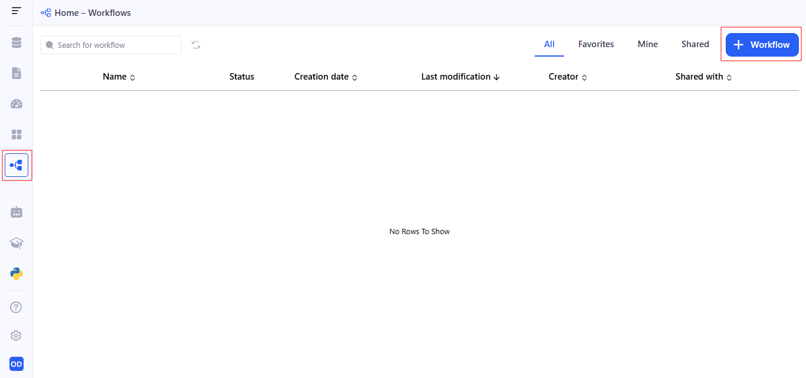
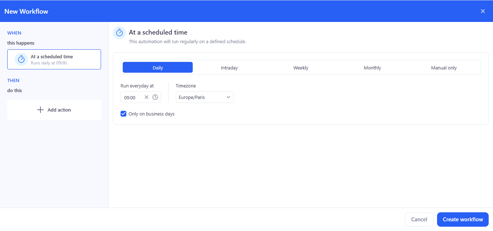
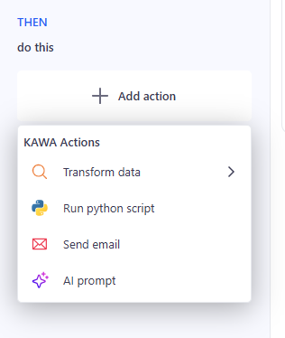
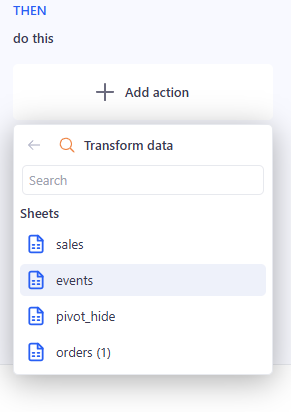
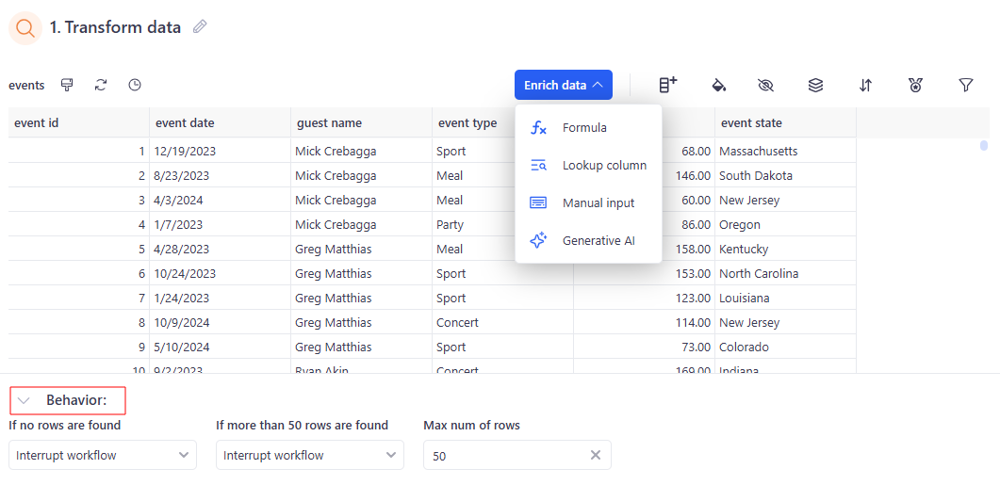
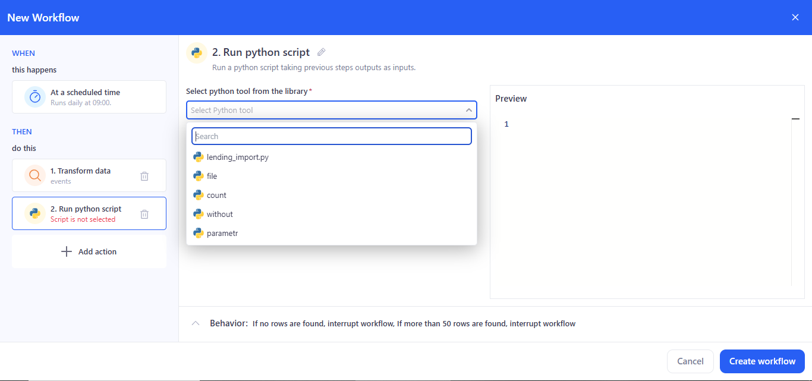
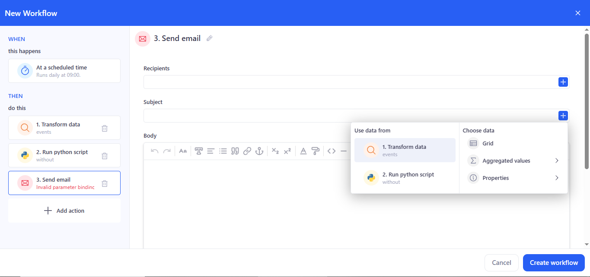
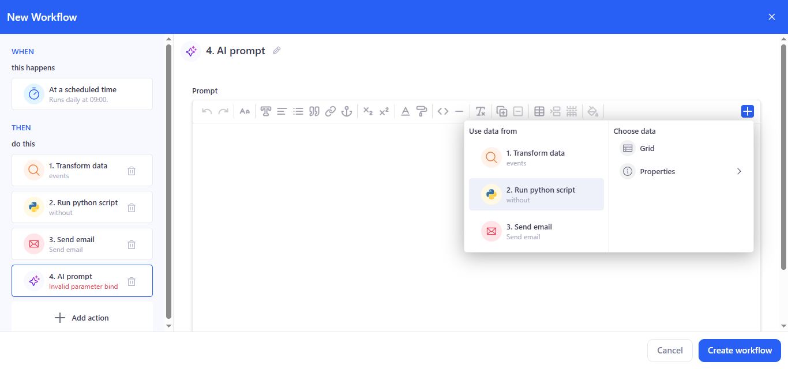
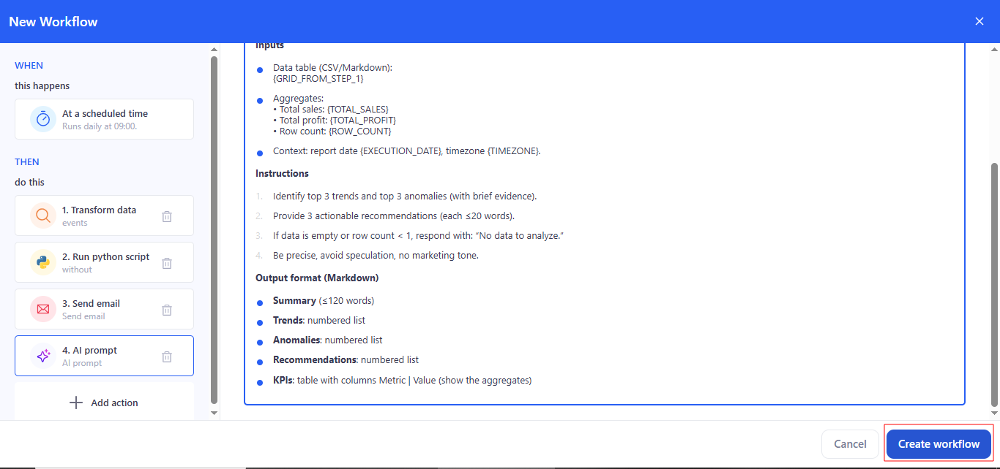
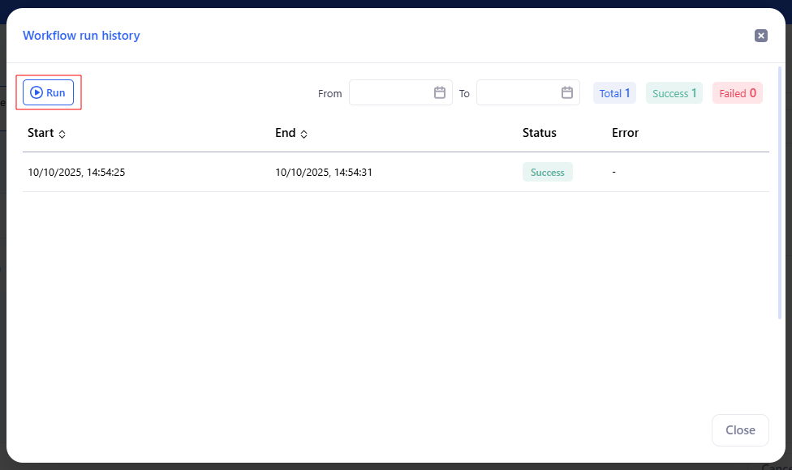

# Workflows

**Workflows** is KAWA’s builder for multi-step processes. Actions can be started on a schedule or manually, and steps run in sequence: data processing, running Python scripts, sending emails, and calling AI prompts.

* TOC
{:toc}

## 1. First workflow: Create

To create a new workflow, go to the **Workflows** section and click on **+ Workflow**.

 

## 2. Set trigger (At a scheduled time)

- Choose **Daily**, set time (e.g., 09:00), **Timezone**, and **Only on business days** if needed.

- For **Intraday**, specify an interval during the day.
- For **Weekly/Monthly**, specify days/months.
- **Manual only** — no schedule.

## 3. Add action:

Click **Add action** — the Actions panel opens; select the needed action.

### 3.1 Step 1: Transform data

- Choose a **Sheet** from the list.

- If needed, open Enrich data and use the quick transform icons.

- In the **Behavior** block, set:

  - If no rows are found → Interrupt workflow / Continue without a result.
  - If more than 50 rows are found → Interrupt workflow / Continue  without a result.
  - Max number of rows → a number (e.g., 50).

### 3.2 Step 2: Run python script

- In **Select python tool from the library**, choose a tool.

- In **Match tool inputs** (required entries), bind inputs to outputs from previous steps:
  - **df** → select **1. Transform data** or other prior action.
  - **text** → bind to a source.

> If a required input is empty or mis‑bound you’ll see **Invalid task bindinqs**.

- **Parameters** (optional/named options) → they can also be bound to outputs from previous steps.

> If a parametrs is empty you’ll see **Invalid parameter bind**.

**Behavior** — the same row-based guards as in Transform data appear at the bottom.

### 3.3 Step 3: Send email

**Recipients**, **Subject**, and **Body** can be entered manually, or use the **+** on the right to insert values from previous steps (e.g., a sales total or a generated table).
>If a required fields is empty you’ll see **Invalid parameter bind**.

### 3.4 Step 4: AI prompt

- Enter the prompt text. Use the **+** button to insert variables/fragments from previous steps (transformation results, script outputs, etc.).

- Use the prompt for summarization, recommendations, and generating explanations.

## 4. Save

Сlick **Create workflow**.

## 5. Manual run & history

Click **Run history** (top-right) → **Run** to execute immediately (does not change schedule).

**Status** shows the last result: **Success, Failed, Running, Stopped**.

## 6. Reorder / Delete steps

- **Reorder**: drag & drop steps in THEN. If you move a step above its data source, dependent steps show Invalid task ref; open them and re-bind fields via +.
- **Delete**: trash icon on a step. Steps referencing a deleted step also show Invalid task ref — fix or remove those bindings. Deletion can’t be undone.

