# Workflows

**Workflows** is a builder in KAWA for creating multi-step processes. See definitions in [Terminology](../13_00_terminology.md#workflow) section. A workflow can be started:

* on a schedule,
* manually,
* after a data source is successfully updated,

and the steps run **one by one** or **in branches** (using Logic steps).

## 1. Create a workflow

To create a new workflow, go to the **Workflows** section and click on **+ Workflow**.

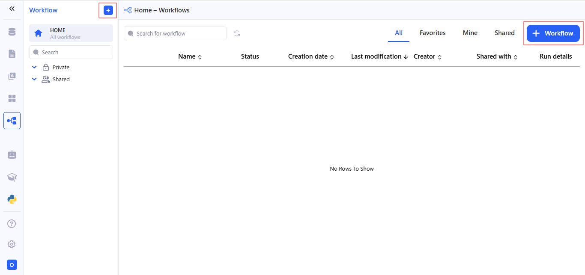

## 2. Set trigger

KAWA Workflows support three trigger types. Pick one in **WHEN** → Select a trigger.

### 2.1 At a scheduled time

Use this when the workflow must run automatically.

* Choose **At a scheduled time**.
* Configure:
  * **Daily** / **Intraday** / **Weekly** / **Monthly**.
  * **Run time**. **Daily** — Run at → pick an exact time (e.g., 09:00). **Intraday** — Run every N \[seconds/minutes/hours]; optionally turn on Set custom time period. **Weekly** — Run on (choose weekdays) at (time). **Monthly** — Run every month on (day of month) at (time).
  * **Timezone**.
  * **Only on business days** (optional).
* The header shows the summary (e.g., Runs daily at 09:00).

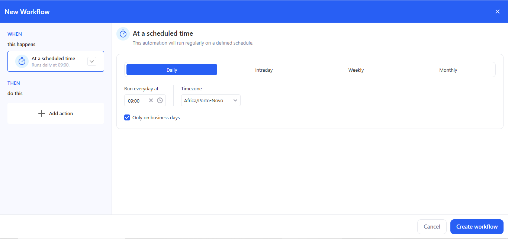

### 2.2 Manual run

Use this when the workflow is started on demand by a user.

* Choose **Manual run**.
* (Optional) Click **+ Add input** to define parameters that the user must enter each time they start the run: **Text**, **Select**, **Number**, **Date**, **Date Time**, **Boolean**.
* These inputs are available to later steps via bindings:
  * In Email / AI prompt editors: click **+** → Use data from → Choose data, then choose the input.
  * In Run python script, Parameters: click **+** → Use data from → Choose data, then choose the input.

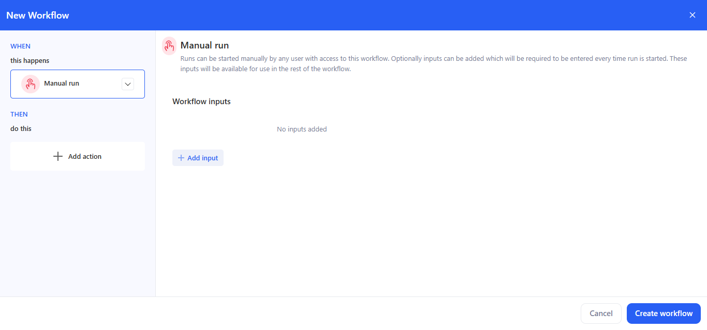

### 2.3 On data refresh

Use this trigger to run a workflow right after a data source is successfully refreshed.

* Choose **On data refresh**.
* Click **+ Add data source**, find it in the list, and select it. Multiple sources are supported.

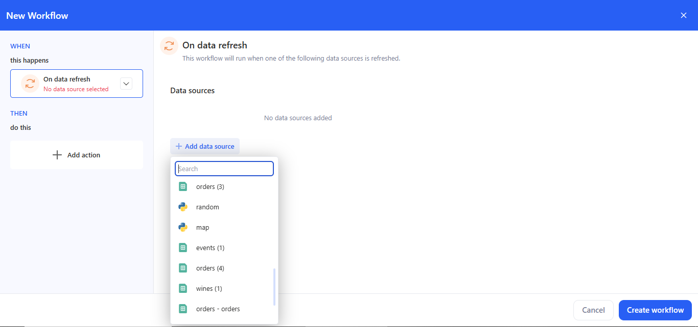

How it fires:

* Fires after a successful refresh of any selected source (Data source -> Overview -> Change data import).
* With multiple sources it uses OR logic — refresh of any selected source triggers the workflow.

## 3. Add action

### 3. Add action

Click **Add action** to open the Actions menu. Actions are grouped into categories:

**KAWA Actions**

* Run python script
* Send email
* AI prompt
* Enrich data with AI
* Report
* Build a chart
* Generate output
* User task

**Data Operations**

* Load data
* Export to data source
* Join datasets
* Stack datasets

**Logic**

* If / Else
* Routing
* Interrupt workflow

<figure>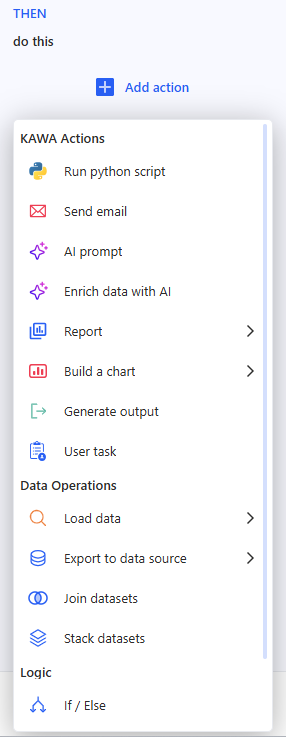<figcaption></figcaption></figure>

Below is how to set up each step type in practice.

### 3.1 Load data

* Choose a **Sheet** from the list.

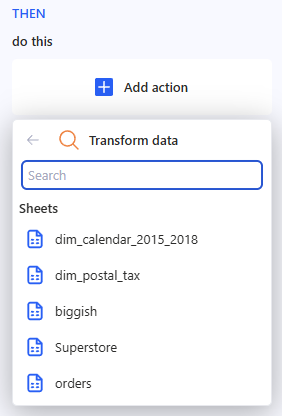

* If needed, open Enrich data and use the quick transform icons.

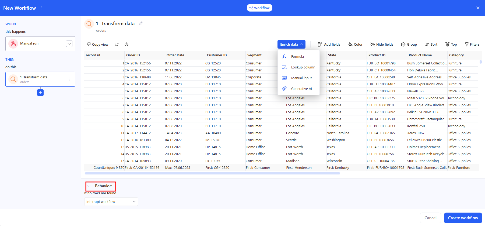

* In the **Behavior** block, set:
  * If no rows are found → Interrupt workflow / Continue without a result.

### 3.2 Run python script

* In **Select python tool from the library**, choose a tool.
* In **Match tool inputs with any of the previous task outputs**, connect the required inputs to the results of previous steps (for example, a dataframe from **Load data**).

> If a required input is empty or mis‑bound you’ll see **Invalid task bindinqs**.

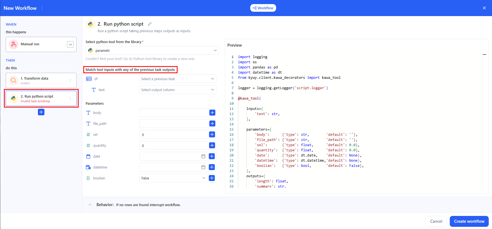

* **Parameters** (optional/named options) → they can also be bound to outputs from previous steps.

> If a parametrs is empty you’ll see **Invalid parameter bind**.

* **Behavior** — the same row-based guards as in Transform data appear at the bottom.

### 3.3 Send email

**Recipients**, **Subject**, and **Body** can be entered manually, or use the **+** on the right to insert values from previous steps (e.g., aggregates, tables, generated text, a link to a report, etc.). You can also add files to the email in the **Attachments** section.

> If a required fields is empty you’ll see **Invalid parameter bind**.

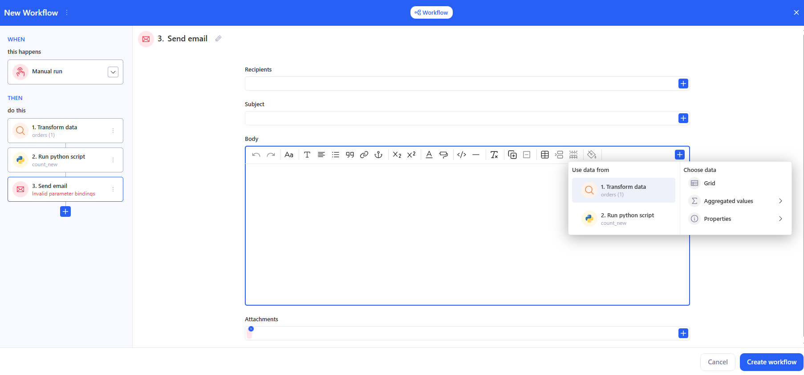

### 3.4 AI prompt

* Enter the prompt text. Use the **+** button to insert variables/fragments from previous steps (transformation results, script outputs, etc.).

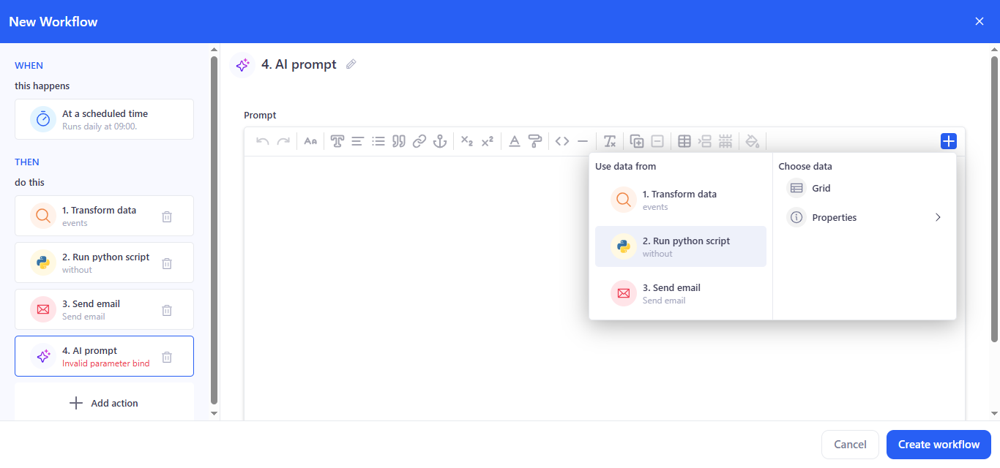

* Use the prompt for summarization, recommendations, and generating explanations.

### 3.5 Enrich data with AI

#### **3.5.1 How to set up**

* **Input table**

Select a table from the previous step (for example, the result of Transform data). Without a selected table, the step won’t run.

* **Prompt**

Describe what you want to generate for each row. In the prompt, you can reference fields from the input table (use data from the previous step as shown in the UI).

* **Outputs** (what the model should generate). Define the output schema in one of these ways:
  * Generate from prompt — the system will try to create the outputs structure automatically from your prompt.
  * Specify manually — manually add the required output fields/columns (recommended if you need a stable format).
* **Preview / Test**

Check the result in Preview. Click Test to run generation and see how outputs are filled.

* **Behavior**

Set what should happen if no rows are found in the input table (for example, Interrupt workflow).

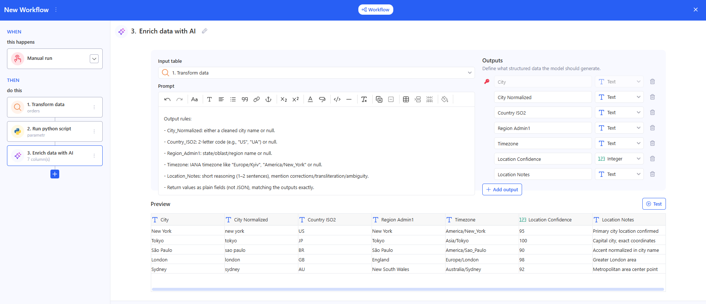

#### **3.7.2 Result**

This step returns a table with extra AI columns (outputs). You can use it in the next actions (email, export, report, logic, etc.).

### 3.6 Report

In the **Report** step, open the list, use **Search** if needed, and select the required report from the workspace so you can use it later as an artifact (for example, to send it in an email).

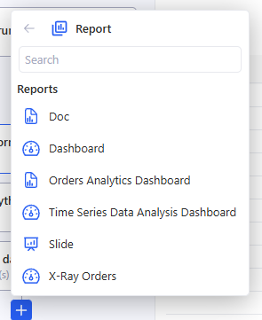

### 3.7 Build a chart

In the **Build a chart** step, choose a table from:

* **Previous Tasks** (for example, the result of **Run python script** or **Transform data**), or
* **Sheets** (any available sheet in the workspace).

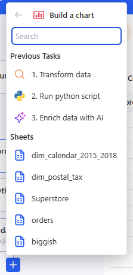

* **Configure the chart** (the Chart configuration panel)

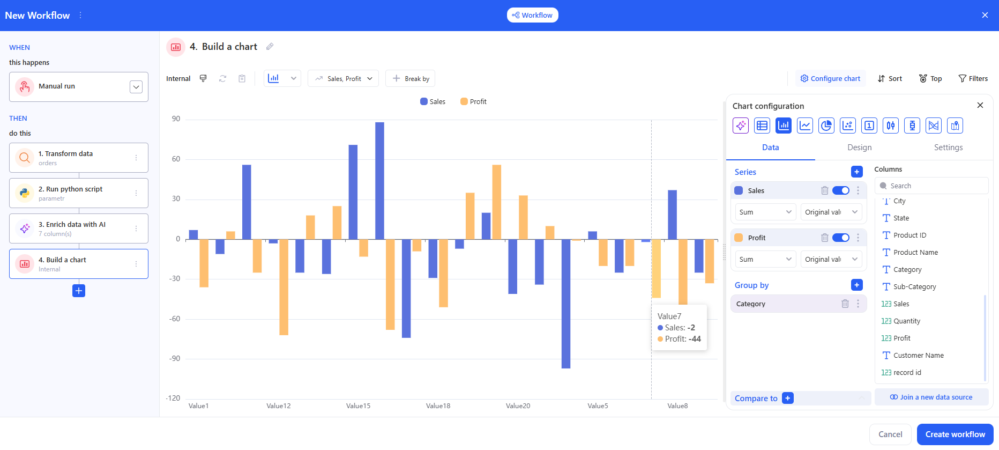

### 3.8 Export to data source

* In the **Previous Tasks** list, select the step that returns a table (for example, Transform data or Run python script). This choice determines what will be exported.

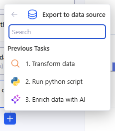

* In the **Add task – Export to data source** window, fill in the data source settings:
  * **Data source name** — required (the destination name).
  * **Description** — optional.
  * **Feed Type** — export mode.
  * **Default global policy** — access policy.
* Click Create.

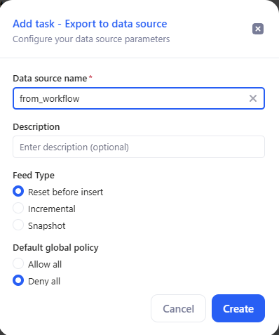

After creation, the **Export to data source** task screen will open. Then if needed, click **Go to data source** to open the created data source and change its settings.

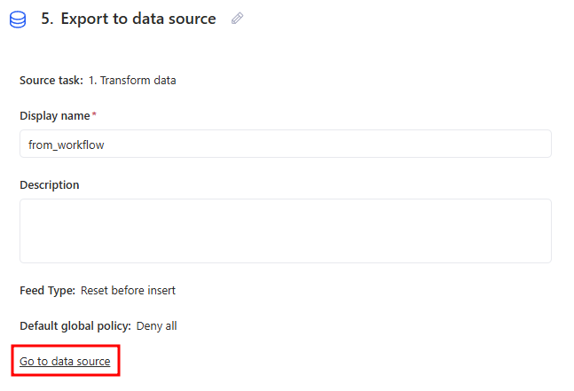

### 3.9 Generate output

* In the **Text** block, enter the message that the workflow should return. Use the **+** button to insert variables/fragments from previous steps (transformation results, script outputs, etc.).

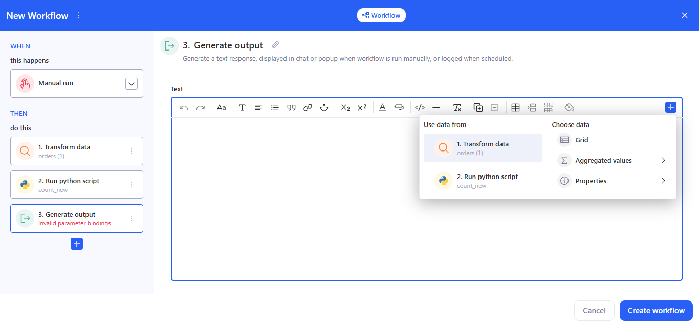

* Purpose: to generate a text output as the result of the workflow run.

### 3.10 User task

**User task** is a human-in-the-loop step. It **pauses the workflow** and creates a task for a user to complete a form. When the assignee submits the form, the workflow continues and the submitted values become available to the next steps.

Typical use cases:

* approval / validation before sending an email or exporting data;
* collecting missing parameters from a business user;
* routing to a colleague for a decision before continuing automation.

#### 3.10.1 How to set up

* Add action → **User task**.
* Fill in:
  * **Assign Task To** — choose the assignee(s) who will complete the task.
  * **Task Name** — the task title shown to the assignee.
  * **Task Description** — instructions (what to check, what to enter, acceptance criteria, etc.).

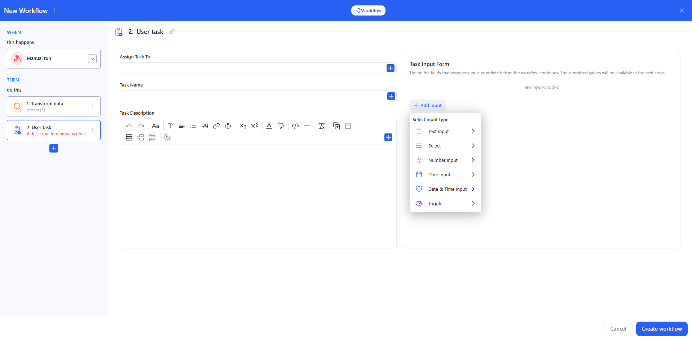

* In **Task Input Form**, click **+ Add input** and add at least one field. Supported input types:
  * **Text Input**
  * **Select**
  * **Number Input**
  * **Date Input**
  * **Date & Time Input**
  * **Toggle**

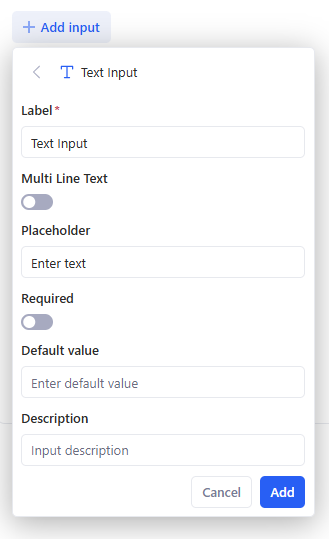

> If you don’t add any inputs, the step is invalid (you’ll see an error like “At least one form input is required”).

#### 3.10.2 Run behavior

* When the workflow reaches **User task**, it creates a task and notifies the assignee (typically by email with a link to the form).
* The assignee opens the form, fills the fields, and clicks **Submit**.
* After submission, the workflow resumes from the next step.

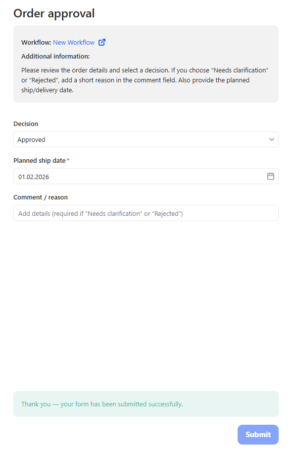

Use submitted values in later steps

* In any next step that supports bindings (e.g., **Send email**, **AI prompt**, **Run python script parameters**, **Generate output**), click **+** and choose: **Use data from** → **User task** → **Form variables**, then select the required field.

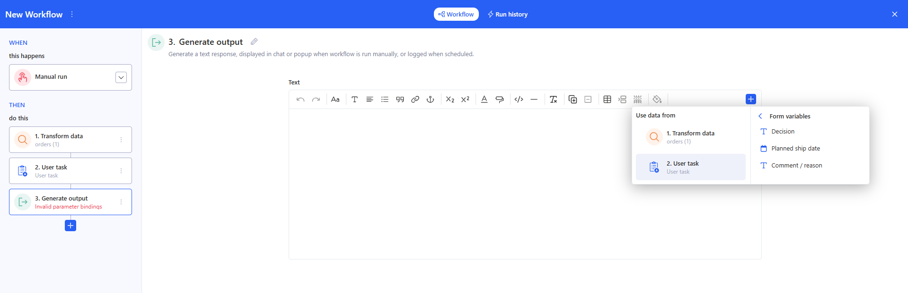

### 3.11 Join datasets

Use **Join datasets** to combine two tables produced by previous workflow steps into a single result table, using classic join types: **Inner**, **Left**, **Right**, and **Full Outer**.

<figure>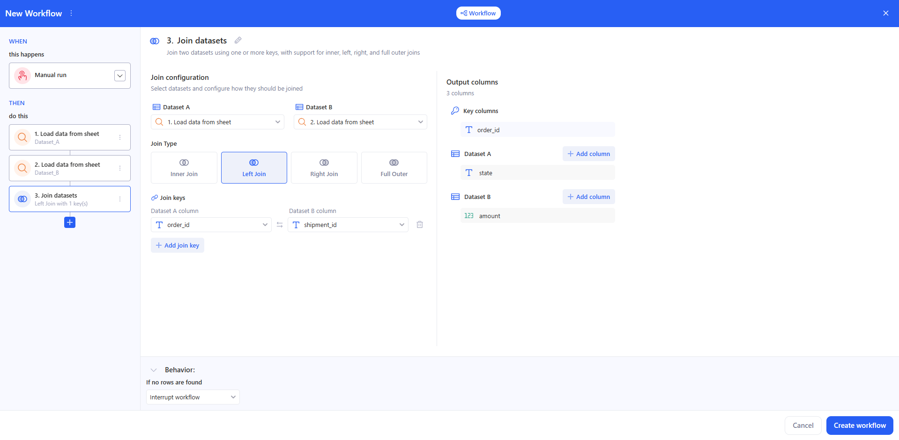<figcaption></figcaption></figure>

#### 3.11.1 How to set up

* In a Workflow, click **Add action** and select **Join datasets**.
*   Select the two datasets

    In **Join configuration**, choose:

    * **Dataset A** (left side)
    * **Dataset B** (right side)

    Each selector is tied to a workflow step that returns a table (for example **Transform data** or **Run python script**).
*   Choose the **Join Type**

    Pick one of:

    * **Inner Join** — keeps only rows that match in both datasets.
    * **Left Join** — keeps all rows from Dataset A and matches from Dataset B.
    * **Right Join** — keeps all rows from Dataset B and matches from Dataset A.
    * **Full Outer** — keeps all rows from both datasets and matches where possible.

    The task icon in the workflow updates to reflect the selected join type.
*   Define **Join keys**

    In **Join keys**, define one or more key pairs:

    * Select a column from **Dataset A**
    * Select a column from **Dataset B**
    * Click **+ Add join key** to add additional key pairs
    * Use the trash icon to remove a join key pair

    Notes:

    * Column choices are type-filtered as you pick keys, to help you select compatible columns.
    * If a previously selected column becomes unavailable (for example after changing an upstream step), it is shown as invalid/stale (highlighted) and must be fixed before saving.
    * Columns that are already used in another join key row are hidden from the join key dropdowns.
*   Choose **Output columns**

    In **Output columns**:

    * **Key columns** are always included in the output and are shown separately. They are read-only as “included”, but support **rename** (so you can control the output column names).
    * Add non-key columns from **Dataset A** and/or **Dataset B** using **+ Add column** in each dataset section.
    * For each selected output column, you can **rename** it and **remove** it. If a column was renamed, the original name is shown as a grey sub-label.
    * You can remove all selected output columns from one dataset using the trash icon in that dataset section header.
    * The **All columns** option is a shortcut to include all available columns from both datasets; **columns used as join keys are excluded from this list**. If needed, rename columns so the final output has unique column names.

    Notes:

    * Output column names must be unique in the resulting table. If two output columns end up with the same display name (including across **Key columns**, **Dataset A**, and **Dataset B**), the task shows the validation error **“Output column names must be unique”** and blocks saving. Conflicting columns are highlighted in magenta with a tooltip.
    * Output columns cannot include join key columns. Join key columns are already included under **Key columns**. Columns already used as join keys are hidden from the output column pickers. If a column was added to Output columns and then later used as a join key, it becomes highlighted in magenta with tooltip **“This column is already used as a join key”**, and saving is blocked until the conflict is resolved.
*   **Behavior**

    At the bottom of the task, set the row guardrail:

    * **If no rows are found** → **Interrupt workflow** or **Continue without a result** (depending on your workflow logic).

#### 3.11.2 Result

The task outputs a **single joined table**, which can be used as input for later steps (email, AI prompt, export to data source, logic steps, etc.).

### 3.12 Stack datasets

Use **Stack datasets** to combine 2 or more tables produced by previous workflow steps into a single result table by stacking them vertically (Union). The task merges rows from all selected datasets into one output table.

<figure><figcaption></figcaption></figure>

#### 3.12.1 How to set up

In a **Workflow**, click **Add action** and select **Stack datasets**.

**Stack configuration**

* Add at least two datasets.
* For each dataset slot, select a workflow step that returns a table (for example, Load data from sheet).
* Datasets are shown as A, B, C… and are stacked from top to bottom in the order shown in the list.
* Click **+ Add another dataset** to add more inputs.
* If you remove a dataset, its selections are removed from the mapping table.

**Column matching method**

Use the **Column matching method** panel to quickly populate or replace the column mappings. Three methods are available:

* **By column name** — automatically matches columns that have the exact same name across all selected datasets.
* **By column order** — matches columns based on their left-to-right position in each dataset, regardless of column names.
* **Auto-mapping** — smart matching that uses fuzzy logic and data types. Calls an AI endpoint to intelligently match columns across stacked datasets by name similarity and data type. While the request is in flight, a loading spinner is shown on the button and all matching buttons are disabled.

> If mapped columns already exist when you click any of the three matching methods, an **"Overwrite existing mapping?"** confirmation dialog appears. Confirm to replace the current mappings or cancel to keep them.

**Mapped columns**

* A dataset column appears only after a source dataset is selected.
* Click **+ Add mapping row** to add a new output column.
* A row may contain mappings for only some datasets; dataset cells with no mapping can be left empty.
* Each mapping row must contain at least one selected dataset column. A completely empty mapping row blocks saving/running the task.
* When you select a source column, the source column type icon is shown in the **Output column name** cell.
* Use the trash icon to remove a mapping row.
* Click **Clear all** to remove all mapped columns at once.

#### 3.12.2 Result

The task outputs a **single stacked table**. Each mapping row becomes an output column, and rows from all selected datasets are appended into one result. This result can be used in later steps (for example, Generate output, Send email, AI prompt, export to data source, or logic steps).

### 3.13 Logic: If / Else

**If / Else** is a logic step that splits a workflow into two branches:

* **IF** – runs when all conditions are true.
* **ELSE** – runs when at least one condition is not met.

The step uses data from previous actions: **Transform data**, **Run python script**, **AI prompt**, **Send email**, etc.

#### 3.13.1 Add an If / Else step

* In the THEN section, click **+ Add action**.
* In **KAWA Actions**, scroll to the **Logic** section.
* Select **If / Else**.

A new block appears in the steps list with two tabs:

* **IF** – conditions and actions for the “true” case.
* **ELSE** – actions for the alternative path.

Each tab has its own **+ Add action** button to build the branch.

#### 3.13.2 Add path rules

The behavior of **If / Else** is controlled by **path rules** – rows of conditions in the panel on the right.

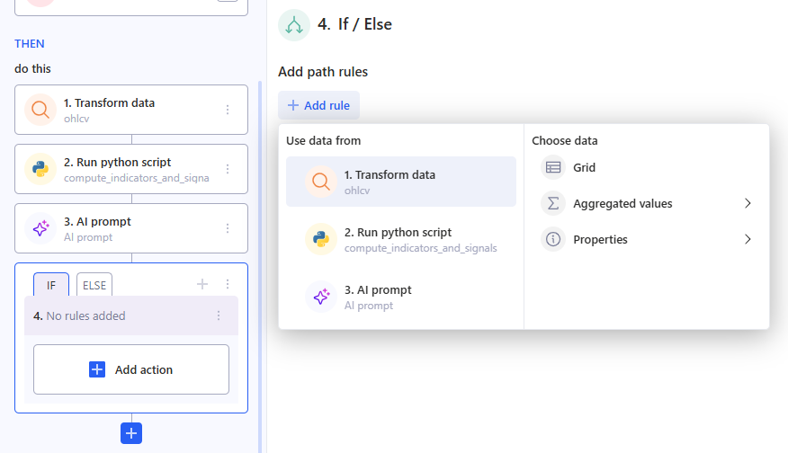

Each rule has three parts:

* **The first field is what you check**

(for example, an aggregate like “high”, a table “Grid”, or text like “Generated Content”). You pick it via **Use data from** → **Choose data**.

* **The second field is the comparison type**

Available operators depend on the data type.

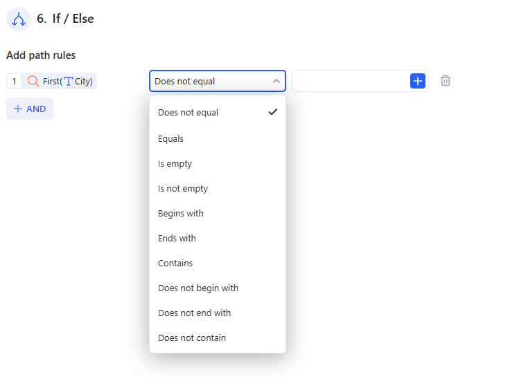

* **The third field is what you compare against**

You can:

* type a value manually (for example, 0, warning, TRUE), or
* click the + button on the right and select data from previous steps.

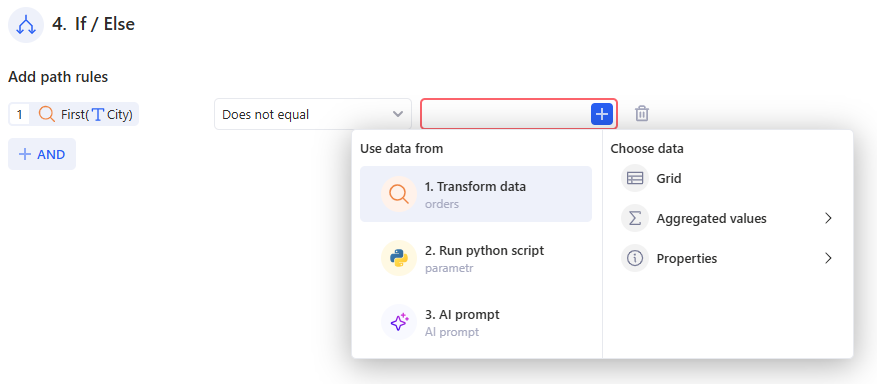

This lets you compare:

* an aggregate with a fixed threshold;
* AI-generated text with another column;
* properties from different steps with each other.

**Multiple rules**

* Click **+ AND** to add another condition.
* All rules inside an **If / Else** are combined with **AND** – they all must be true for the **IF** branch to run.
* The total number of rules is shown in the step name (for example, “5. 3 rules”).

#### 3.13.3 Actions in the IF and ELSE branches

After you set up the rules, define what each branch should do.

* Select the **IF** or **ELSE** tab in the **If / Else** block on the left.
* Click **+ Add action** inside that branch.
* Add the actions you need, for example.

Execution logic:

* If **all rules are true**, only the **IF** branch runs and the **ELSE** branch is skipped.
* If **any rule is false**, the **ELSE** branch runs (if it has actions).

### 3.14 Logic: Routing

**Routing** is a logic step that lets you split the processing of one table into multiple routes (R1, R2, R3 …). In each route, you set up your own data “slice” (view) and add a separate set of actions.

#### 3.14.1 How to add Routing

Choose the table source for Routing:

* Previous Tasks (for example, Run python script / Transform data), or
* Sheets (any sheet in the workspace).

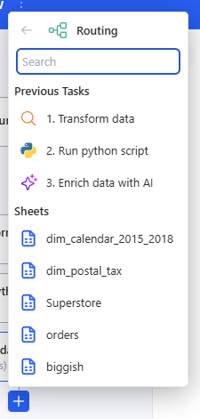

After that, a table preview for Routing will open on the right.

#### 3.14.2 How routes work (R1 / R2 / R3)

Routes are shown as tabs: **R1**, **R2**, **R3**…

* To open a route — click its tab.
* To add a new route — click + next to the tabs.

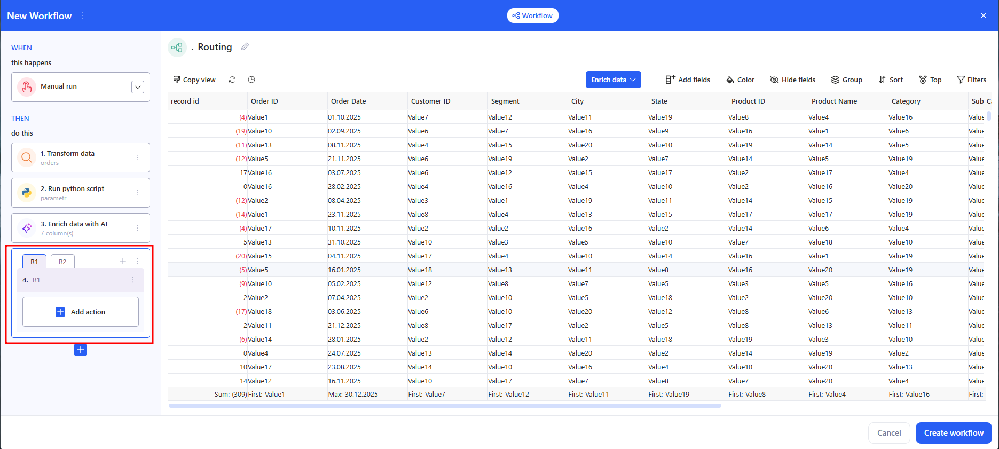

#### 3.14.3 Add actions inside a route

* Select the route you need (for example, R1).
* In the route block, click Add action and add the steps you need (Send email, Export to data source, Report, etc.).
* Repeat for R2, R3… if needed.

#### 3.14.4 Result

Routing creates multiple independent branches where:

* the input is one table,
* each branch (route) can have its own data view/slice,
* each branch runs its own set of actions.

### 3.15 Logic: Interrupt workflow

This task has **no settings**: you simply place it where you need it in the chain. Its purpose is to **immediately stop** the workflow execution at the point where this step is added. All steps after it will **not** run.

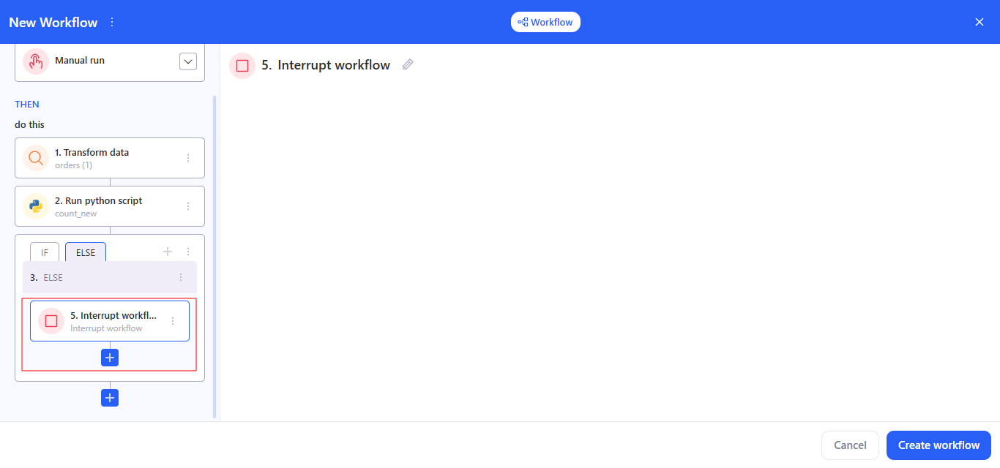

For example, it works like an “emergency stop” inside **If / Else** or **Routing** branches, so you can explicitly end routes you don’t need.

## 4. Save

Сlick **Create workflow**.

## 5. Update workflow

When you open an existing workflow from **Home** → **Workflows**, the editor shows the current **WHEN** (schedule) and **THEN** steps. The **Create workflow** button is replaced with **Update workflow** (bottom-right). Update workflow saves changes to an existing workflow (schedule, steps, bindings, Behavior). After saving, both scheduled and manual runs use the latest version.

## 6. Manual run & history

Use manual runs to test or trigger a workflow on demand. A manual run does not change the schedule.

### 6.1 Run from the workflow editor

* Click **Run history** (top-right).
* In the modal, press **Run** to start immediately.
* The table shows Start, End, Status, and Error for each attempt. Use the date filters and counters (Total / Success / Failed) to review past runs.

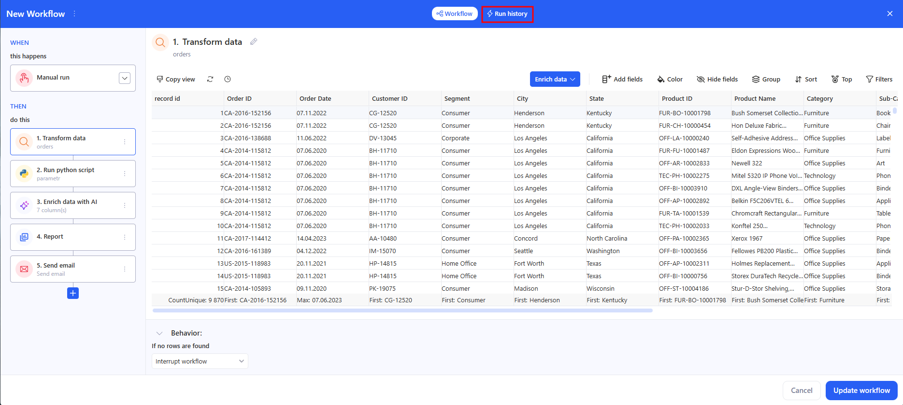

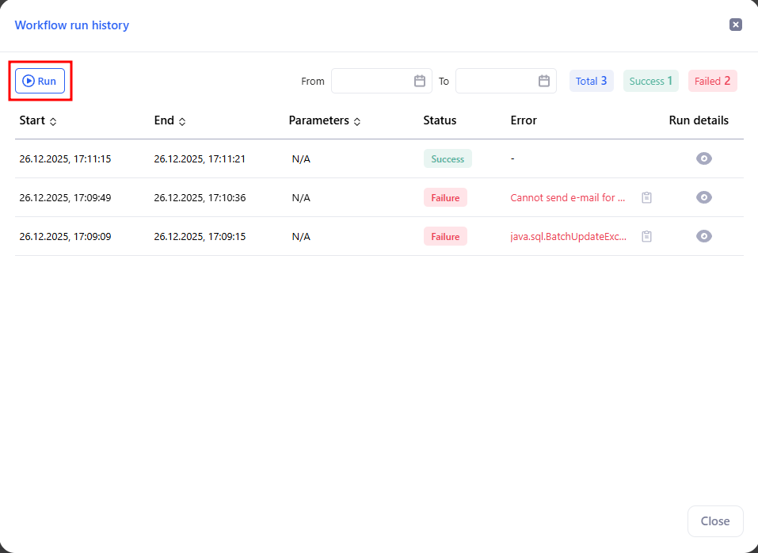

### 6.2 Run from Home → Workflows

* Open **Home** → **Workflows**.
* In the row of a workflow, open the three-dot menu → **Run**.
* The current **Status** appears in the list; open the workflow and Run history for details.

**Status** shows the last result: **Success, Failed, Running, Stopped**.

### 6.3 Run from the Control panel

You can also start a workflow from the **Control panel** using a button:

* Open **Controls** → **Configure** → **Add new control**.
* In Control type, choose **Button**.
* In **Action**, select **Run workflow**.
* In the **Select workflows** modal, select one workflow that this control should run.
* Click **Save**.

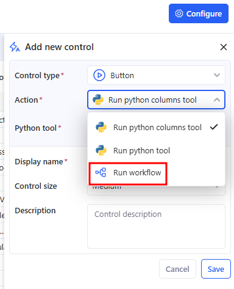

After that, users can run the selected workflows directly from the controls panel.

### 6.4 Run from AI Chat (Agent commands)

You can run a workflow from **AI Chat** as an agent command, but first you need to add it to the AI agent.

#### a. Step 1. Add the workflow to the AI agent

* Go to **Agents** and open the agent you need.
* In the **Commands** section, click + (add command).
* In the **Select workflows** modal:
  * choose one or more workflows,
  * click **Apply**.

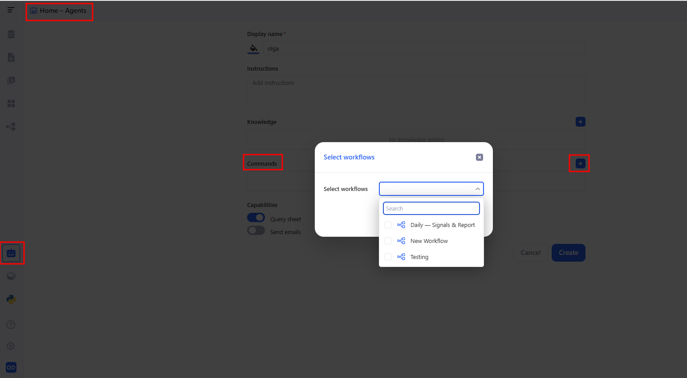

After that, the selected workflows will appear as available commands for the agent.

#### b. Step 2. Run the workflow from AI Chat

* Open the **AI Chat** tab.
* Select the agent in the left panel.
* In **Agent commands**, click the workflow command you need to start it.

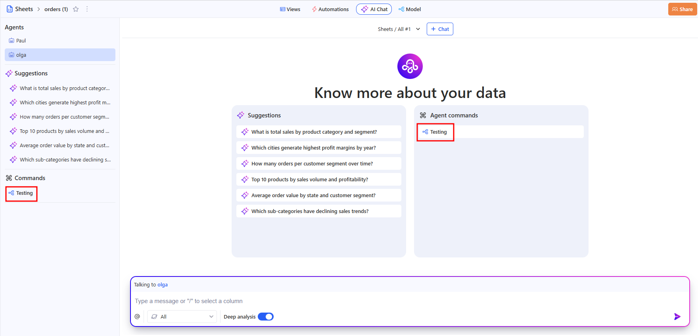

This is handy when you want to run a workflow without going to the editor or the Workflows list.

## 7. Reorder / Delete steps

* **Reorder**: drag & drop steps in THEN. If you move a step above its data source, dependent steps show Invalid task ref; open them and re-bind fields via +.
* **Delete**: trash icon on a step. Steps referencing a deleted step also show Invalid task ref — fix or remove those bindings. Deletion can’t be undone.
