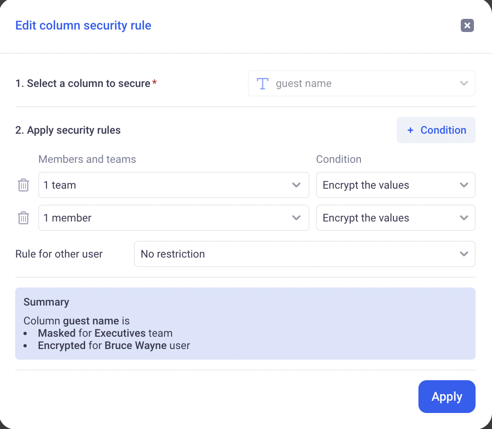
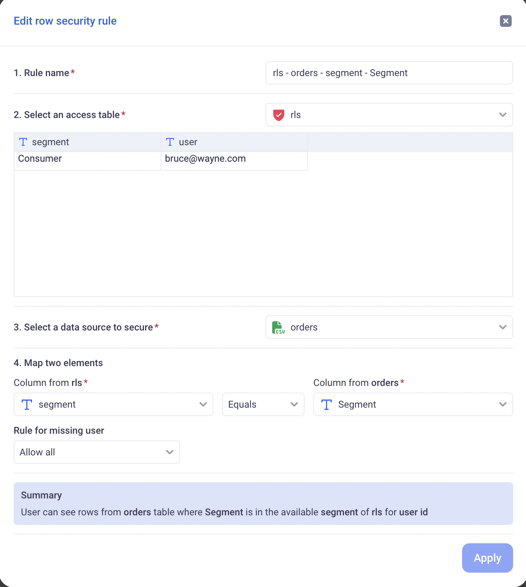

Data security
---

In KAWA, securing the data can be done both at row (Row level Security) and column (Column level Security) level. This is always done at the data source level.

In order to configure security on data sources, users must either own them or  have the 'Manage row level and column level security' permission and be granted write access on the data source.

* TOC
{:toc}

# 1 Column level security

Column level associates to one column in a data source a set of rules to limit access to that column.

> **⚡ Important:** If one of the below condition is matched, the user will __BYPASS__ the column level security and see the entire dataset regardless of what is configured: 
User OWNS the data source, User is an application ADMIN, or User has the ` Access restricted data and restricted data providers` workspace flag.

A rule targets a given Audience (Teams or individual users), and has a particular action:

- Completely hides the column
- Obfuscate the column's values (one way hash that makes the value impossible to read but preserves the repartition)
- Keeps the value unaltered

If a user is targeted by more than one rule, the most restrictive applies.

`HIDES is more restrictive than OBFUSCATES is more restrictive than SHOW`

# 2 Row level security

Row level security will filter the rows of a given data source based on a set of rules.

> **⚡ Important:** If one of the below condition is matched, the user will __BYPASS__ the row level security and see the entire dataset regardless of what is configured: 
User OWNS the data source, User is an application ADMIN, or User has the ` Access restricted data and restricted data providers` workspace flag.

## a. Security Mapping

Those rules will be defined as a mapping between user or team names and particular values for dimensions. 

For example:

| Team Name         | Country        |
|--------------------|---------------|
| Thunderbolts      | USA           |
| Samurai Warriors  | Japan         |
| Desert Falcons    | UAE           |
| Nordic Vikings    | Sweden        |
| Nordic Vikings    | Finland        |
| Amazon Jaguars    | Brazil        |

In the above table (called: Security Mapping), all users members of the `Thunderbolts` team will be allowed to see only the row in the data source whose country is USA.
The secured dimension here is the Country.

Security mappings support special values:

- `#MATCH_MANY_TOKEN#` :If a user or team is assigned that value, they can see all elements of the secured dimension.

- `#BLANK_VALUE_TOKEN#` :If a user or team is assigned that value, they can see all elements with a blank value for the secured dimension.

For example:

| Team Name         | Country        |
|--------------------|---------------|
| Thunderbolts      | `#MATCH_MANY_TOKEN#`          |
| Nordic Vikings    | Sweden        |
| Nordic Vikings    | Finland        |
| Nordic Vikings    |  `#BLANK_VALUE_TOKEN#`        |
| `#MATCH_MANY_TOKEN#`   |  Belgium       |

In the above table, Thunderbolts can see all Countries (including blank Countries).
Nordic vikings can see: Sweden, Finland and rows without Countries.
All users can see: Belgium, including the Nordic vikings.

The mapping between user or team identification is saved in a special data source called: Access Table.

This type of data source behaves like a normal data source. It can be connected to external systems, CSV files etc...

Access Tables require the 'Manage row level and column level security' to be created.

In addition to the normal data source configuration, Access Tables require its creator to explicitly designate which column contains a user identifier (which can be user ids or security team `security names`).

## b. Security Rules

Security rules allow to define how a Security Mapping will be applied to a data source to secure it.

Section by section on the above screenshot:

- Section 1: The name of the rule itself
- Section 2: The access table to use for that rule
- Section 3: The data source whose access we want to restrict
- Section 4: The dimension to secure (Above: we are securing `Segment` in the orders data source, matching it against the `segment` column in the security mapping)
- Section 5: Defines what to do for users who are not present (directly or through a team) in the Security Mapping.

## c. Global rule

The global rule of a data source is applied for a given user in case NO RLS rule applies for that user. It can be either: ALLOW ALL or DENY ALL.

If at least one rule applies the user, then the Rule for missing user in each rule applies (Section 5 above)

## d. Example

_fig1: Access Table:_

| User Id         | Segment          |
|--------------------|---------------|
| bruce@wayne.com    | Consumer      |
| bruce@wayne.com   | Enterprises    |
| lucius@wayne.com    |  `#MATCH_MANY_TOKEN#`     |
|

User id column is the user identifier: The user id (not the team name)

_fig2: ata source to secure:_

| profit         | category          |
|--------------------|---------------|
| 12   | Consumer      |
| 34   | Enterprises    |
| 56   | R&D    |

_Global Rule_:

The Global rule is set to Deny All.

_Rule_:

- Section 1: Segment control
- Section 2: The Access Table in fig1
- Section 3: The Data Source in fig2
- Section 4: The `category` of the data source will be paired with the `Segment` of the access table.
- Section 5: Deny All for users that are not in the access table.

_Result_:

- User bruce@wayne.com will see row 1 and row 2 of the data source:

| profit         | category          |
|--------------------|---------------|
| 12   | Consumer      |
| 34   | Enterprises    |

- User lucius@wayne.com will see the entire data source (`#MATCH_MANY_TOKEN#` is applied):

| profit         | category          |
|--------------------|---------------|
| 12   | Consumer      |
| 34   | Enterprises    |
| 56   | R&D    |

- All other users will be denied access to the data source (Global rule applies)

