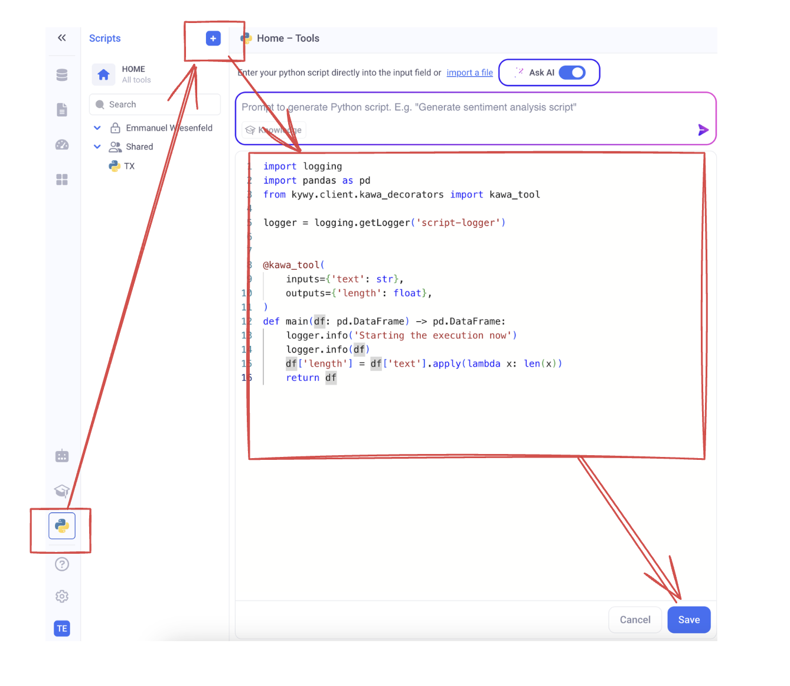
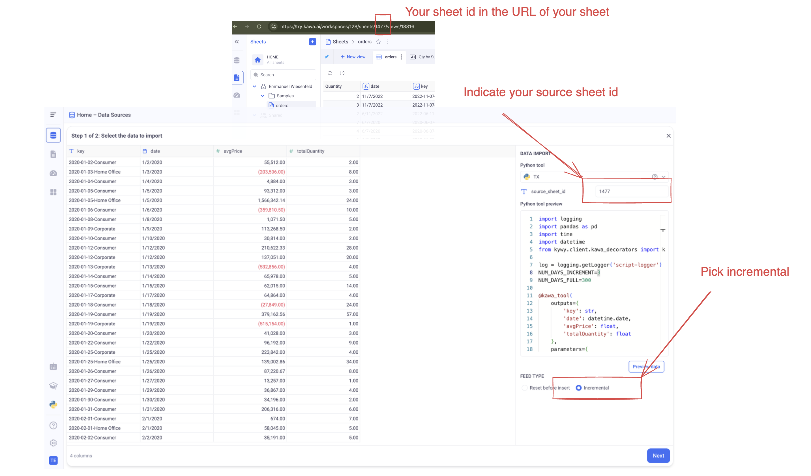
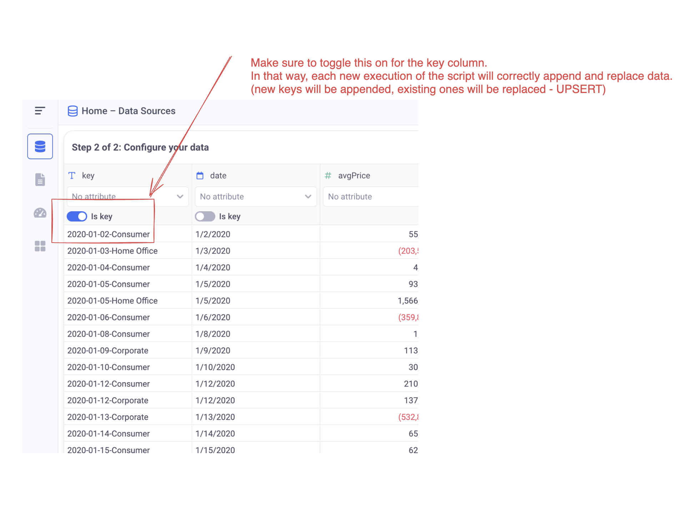
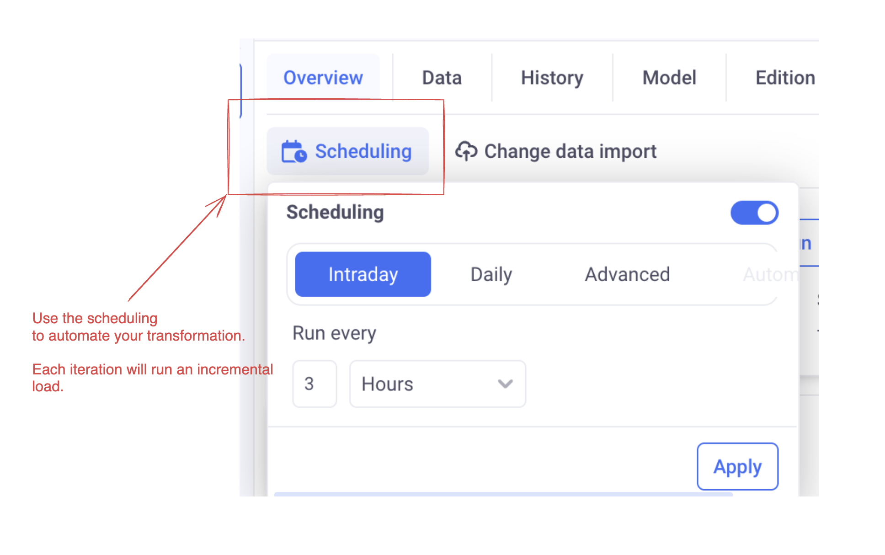

# Scenario description

This scenario will demonstrate how to create a datasource from a python script, scheduled to run automatically.

This new datasource will be derived from an existing sheet.

This setup assumes that you are creating python tools directly in KAWA (Without any connection to a Version control system).

* TOC
{:toc}


## 1. Preparing a sheet

Please create a sheet that has the following columns:

- `date` (a date column)
- `price` (a numeric column, can be integer or decimal)
- `quantity` (a numeric column, can be integer or decimal)
- `key` (a text column)

(If you have different names, you can adjust your script to match what you have)


## 2. Creating a new python tool

Here is an example script that you use to derive data from the prepared sheet:
(please refer to [Computation From Python notebook]

```python
import logging
import pandas as pd
import time
import datetime
from kywy.client.kawa_decorators import kawa_tool

log = logging.getLogger('script-logger')
NUM_DAYS_INCREMENT=3
NUM_DAYS_FULL=300

@kawa_tool(
    outputs={
        'key': str,
        'date': datetime.date,
        'avgPrice': float,
        'totalQuantity': float
    },
    parameters={
        'source_sheet_id': {'type':str}
    })
def sync_data(kawa, source_sheet_id, data_preview=False, append=False):
    start=time.time()
    log.info('Python etl example with computation')

    
    num_days = NUM_DAYS_INCREMENT if data_preview or append else NUM_DAYS_FULL
    from_date = datetime.date.today() - datetime.timedelta(days=num_days)

    #
    # This step loads data from the data warehouse.
    # Use filters and group_by to limit as much as possible the 
    # data that will be processed by your script.
    # This ensures that your process scales.
    #
    log.info(f'Loading data from:{from_date}')
    query = (kawa
            .sheet(sheet_id=source_sheet_id)
            .select( 
                # Adjust to the names of the columns of your sheet
                # (Make sure to adjust the filter as well)
                kawa.col('key').first().alias('key'),
                kawa.col('date').first().alias('date'),
                kawa.col('price').avg().alias('avgPrice'),
                kawa.col('quantity').sum().alias('totalQuantity'),
            )
            .filter(kawa.col('date').date_range(from_inclusive=from_date))
            #
            # Feel free to add stages to your query
            #
            .group_by('key')
            .no_limit())

    #
    # From this point on, you work with a regular pandas dataframe.
    # Feel free to add any more advanced transformation on it
    #
    df= query.compute()

    # 
    # The important thing is to return a dataframe with the columns
    # declared in the output section of the @kawa_tool decorator.
    #
    elapsed=time.time() - start
    log.info(f'Your transformation was performed in {elapsed}s', )
    return df
```

> (https://github.com/kawa-analytics/kywy-documentation/blob/main/notebooks/data-operations/02_compute_notebook.ipynb) to learn all the 
transformations you can apply to your data.


> 📚 Please note that we inject to the function two boolean parameters: `data_preview` and `append`. Those will 
be `True` when (respectively) we are previewing the data to configure the data source or when the load is incremental.
Use them wisely in your script! in our case, it is read to change the range of the main date filter.

In order to save your script in KAWA, go to the script section and paste the script in a new tool.




## 3. Create your data source

Go to the datasource section, Click on [+] or [+ DataSource] and select: `Load with Python`.

Then, select your newly created script:




> 🚨 Make sure to select the correct sheet ID and set the FEED TYPE to Incremental.


Click on `Preview Data` and then: `Next`.



> 🚨 In our example, the primary key is called: `key`. Make sure to select your primary keys consistently with the unicity criteria of your dataset. Each execution of the ETL in incremental mode will insert rows with new primary keys and replace rows with existing ones.


## 4. Configure scheduling

Make sure to configure scheduling in your datasource:



