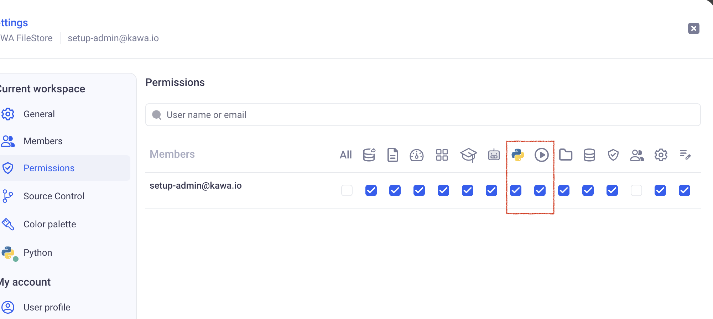
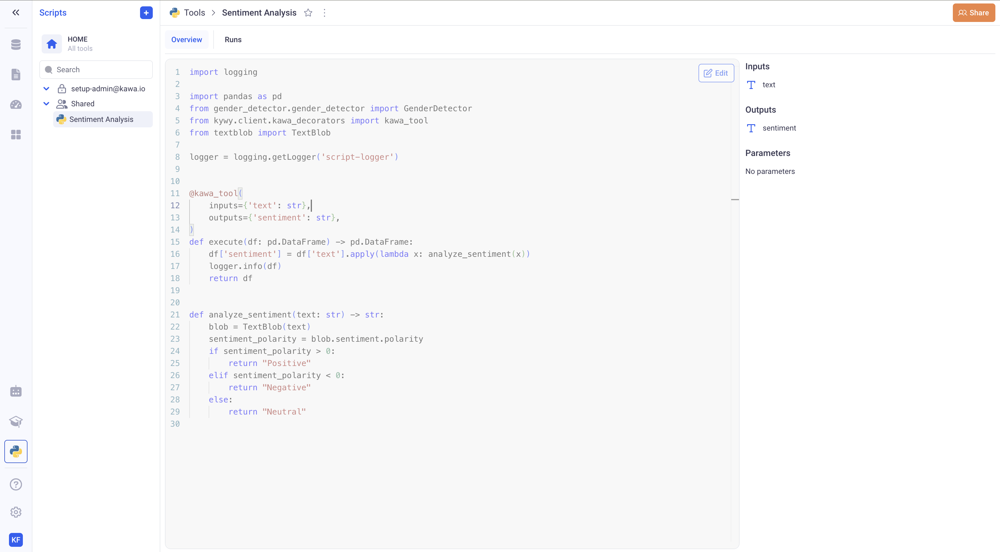

# Python tools

In addition to proposing a Python SDK (`kywy`) to interact with your data in Python, KAWA also comes in with its own Python runtimes.
These runtimes can be deployed in your infrastructure and scaled out to fit your use cases and load. See definitions in [Terminology](13_00_terminology.md) section.

In order to get started, please make sure that Python is healthy in our workspace. If it is not, please get in touch with the administrators of the system.


_Make sure that you see a green dot on the python icon, like shown above._

You can find example workbooks and additional documentation here: [KAWA Tools Github Repository](https://github.com/kawa-analytics/kawa-toolkits).

* TOC
{:toc}

## 1. Configuring your Version Control System

You have two main options when configuring your Version Control System:

- Using KAWA's own store. This is a very simplistic setup that can be used when no governance or version control is needed on the script libraries that are connected to KAWA.

- Connecting to GIT using an SSH private key. With this option, KAWA will automatically synchronize with your repository. All your source code will then we entirely be handled by your organization, following the governance rules put in place.

> This configuration should be done when creating your workspace. It can be changed later on, but KAWA does not handle any migration. __If you are working on KAWA's store and decide to move to your GIT repo, you will need to reconnect your scripts manually.__

> This configuration is made _at the workspace level_, and can differ from one to the other. You can for instance have a sandbox workspace that is making use of the simple Kawa file store configuration. You can also work on a staging workspace connected to a staging branch and a production workspace connected to a production branch.

### 1.1 Using the KAWA file store

In the settings, go to (Source Control) and pick KAWA File Store.
There is no further configuration to do. All your scripts can directly edited in the GUI and will be saved on KAWA.


### 1.2 Connection to your GIT server using SSH

#### 1.2.1 Prepare your repository

Before you setup the connection, it is necessary to add the following files in your repository:

- A `requirements.txt` file at the root of the repository containing all the dependencies.

- At least one KAWA toolkit, described in a `kawa-toolkit.yaml` file.

Here is an example of a valid `kawa-toolkit.yaml`:

```yaml
name: basic-tools
tools:
  - name: Length of a Text
    file: length.py
```

And here is the valid `length.py` script:

```python
import pandas as pd
from kywy.client.kawa_decorators import kawa_tool

@kawa_tool(
    inputs={'text': str},
    outputs={'length': float},
)
def main(df: pd.DataFrame) -> pd.DataFrame:
    df['length'] = df['text'].apply(lambda x: len(x))
    return df
```

A very simplistic valid repository could look like this:

```txt
/
- requirements.txt
- kawa-toolkit.yaml
- length.py
```

> Please refer to [KAWA Tools Github Repository](https://github.com/kawa-analytics/kawa-toolkits) for more details about tools and toolkits. (This repository can be loaded in KAWA, it contains many examples).

#### 1.2.2 Configure the connection

In the settings, go to (Source Control) and pick Git (SSH).
Please fill in:

- Your SSH remote URL
- The branch name (KAWA will only clone and pull source code from that branch)
- Your SSH private key.

> This private key will be encrypted in KAWA's secure store, and only decrypted at runtime to pull or clone the relevant branch.


__Always use the SSH URL, the HTTPS one will not work.__

> KAWA Will only performs `git clone` and `git pull` commands. It is recommended to use a key associated with a git account with readonly permissions only.

A valid URL looks like that: `git@github.com:kawa-analytics/kawa-toolkits.git`. Do not include the protocol (like `ssh://`)

_On Gitlab, it can be found in the code section:_


_On Github, it can be found in the code section, SSH tab:_


_On Bitbucket, in the Clone section, (do not copy the `ssh://`):_


> Please refer to the documentation of your platform to learn how to create a new SSH key pair. It will require you to paste the private key in KAWA and the public one in your version control system.

## 2. Adding new tools in KAWA

KAWA tools are regular python functions, decorated with the `@kawa_tool` decorator. (It requires `pip install kywy` and `from kywy.client.kawa_decorators import kawa_tool`).

The kywy library is available on [pypi](https://pypi.org/project/kywy/). 

Please refer to this for details and examples: [KAWA Tools Github Repository](https://github.com/kawa-analytics/kawa-toolkits).

In order to access these features, make sure you have the two following permissions:




## 2.1 With the KAWA file store (no Version Control System)

In order to add a new tool to your workspace, go to the Script section and click on (+ Tool).


Type in the content of your script and click on save.


### 2.2 With a connected Version Control System

Like in the previous paragraph, navigate to the Script section and click on (+ Tool).

You will be presented with all your tools grouped by their corresponding toolkit:

For example:


This reflects the following repository structure:

```txt
/
- requirements.txt
- kawa-toolkit.yaml
- length1.py
- length2.py
```

With the following toolkit file:

```yaml
name: basic-tools
tools:
  - name: Length of a Text
    file: length1.py
 - name: Length of a Text 2
    file: length2.py
```

Once a tool is added from VCS, it cannot be edited in the GUI. You need to add commits to your branch for it to get picked up by KAWA. _There is a delay of a few seconds for the new commits to reach KAWA_.


