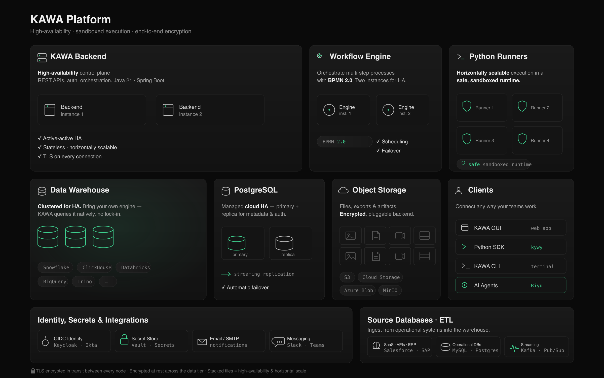

# Architecture

This section describes the KAWA platform architecture — its core components, how they work together, and how KAWA connects to your data warehouse, storage, and source systems.

KAWA runs as a high-availability, horizontally scalable platform: an active-active backend control plane, a BPMN 2.0 workflow engine, sandboxed Python runners, and a pluggable warehouse and object-storage layer — encrypted in transit and at rest.

<figure><figcaption></figcaption></figure>

_KAWA platform architecture — high-availability components, sandboxed execution, and end-to-end encryption._

***

* [Data Lakehouse](10_01_lakehouse.md)
* [Snowflake native connection](10_02_snowflake_native_connection.md)
* [BigQuery native connection](bigquery-native-connection.md)
* [Databricks native connection](databricks-native-connection.md)
* [KAWA Query cache](10_03_query_cache.md)
