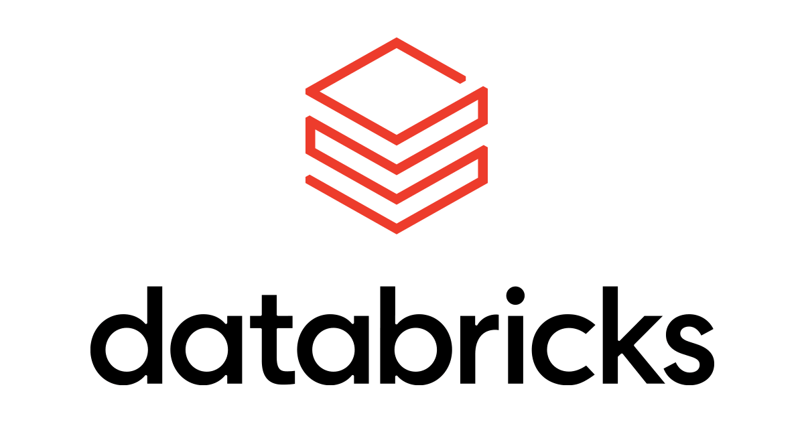
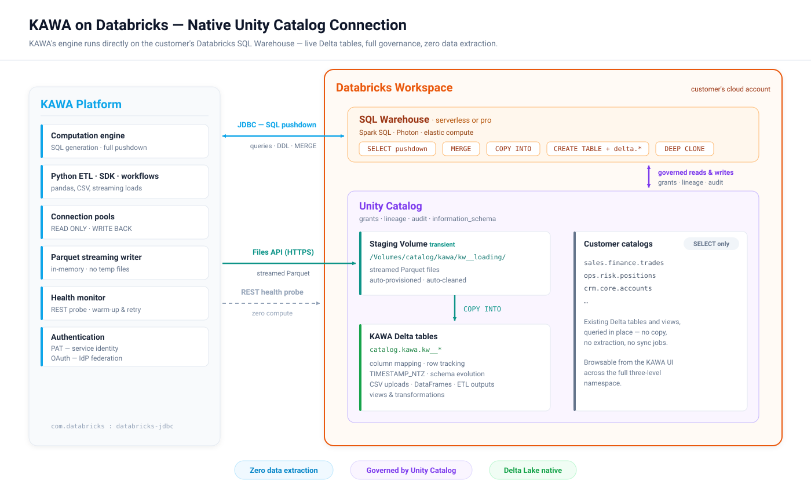

# Databricks native connection

<div align="center"></div>

## 1. Overview

KAWA's native connection to **Databricks** runs KAWA directly on the lakehouse. KAWA's computation engine sits on top of a live **Databricks SQL Warehouse** — every query KAWA generates is compiled to Spark SQL and executes inside the customer's warehouse, against the customer's actual Delta tables. There is no extraction, no copy, and no separate analytics store.

The connection is built for **Unity Catalog**:

* KAWA addresses data through the full three-level namespace (`catalog`.`schema`.`table`) and browses every catalog the connected identity is granted access to.
* Every table KAWA creates is a **Delta table** in a dedicated Unity Catalog schema, governed like any other asset in the metastore — grants, lineage, audit and `information_schema` included.
* Bulk data movement goes through **Unity Catalog Volumes** and the Databricks **Files API** — never through unmanaged storage paths.

On top of this connection, the full KAWA feature set — Python ETL, dynamic columns, cell-level editing, workflows, dashboards and real-time visualizations — is executed by Databricks SQL.

<div data-with-frame="true"></div>

> This guide covers Databricks as KAWA's primary data warehouse. A Unity Catalog-enabled workspace is required: KAWA relies on Volumes and the three-level namespace.

## 2. How it works

### 2.1 Query execution

KAWA connects through the official **Databricks JDBC driver** (`com.databricks:databricks-jdbc`), with two pooled connection sets: a **read** pool for analytics queries and a **write-back** pool bound to the KAWA catalog and schema. All identifiers are fully qualified and backtick-quoted, so query semantics never depend on session state.

Session defaults applied by KAWA (each can be overridden in the JDBC URL):

| Setting             | Default | Purpose                                          |
| ------------------- | ------- | ------------------------------------------------ |
| `timezone`          | `UTC`   | Deterministic date and timestamp semantics       |
| `STATEMENT_TIMEOUT` | `1800`  | No runaway query can hold the warehouse > 30 min |

Query results are served through the [KAWA Query Cache](10_03_query_cache.md), which is invalidated automatically on every write to the underlying table.

### 2.2 Tables created by KAWA

KAWA writes exclusively into one catalog and schema, with a configurable table prefix (`<prefix><table_name>`, lower-cased). Every table is created as a Delta table with the following properties:

```sql
TBLPROPERTIES (
  'delta.columnMapping.mode'      = 'name',      -- rename / drop columns without rewriting data
  'delta.minReaderVersion'        = '2',
  'delta.minWriterVersion'        = '5',
  'delta.feature.timestampNtz'    = 'supported', -- native TIMESTAMP_NTZ storage
  'delta.enableRowTracking'       = 'true'       -- deterministic deduplication (see 2.4)
)
```

Type mapping between KAWA indicators and Databricks SQL:

| KAWA type   | Databricks type                    |
| ----------- | ---------------------------------- |
| text        | `STRING`                           |
| integer     | `BIGINT`                           |
| decimal     | `DOUBLE`                           |
| boolean     | `BOOLEAN`                          |
| date        | `DATE`                             |
| date time   | `TIMESTAMP_NTZ`                    |
| list        | `ARRAY<...>`                       |
| time series | `ARRAY<STRUCT<d: INT, v: ...>>`    |

### 2.3 Bulk loading

All data loads — CSV uploads, pandas DataFrames pushed from the Python SDK, ETL and workflow outputs — follow the same high-throughput staging pipeline:

1. KAWA serializes the incoming rows to **Parquet**, streamed in memory (constant memory footprint, no temporary files on disk).
2. A staging **Unity Catalog Volume** is provisioned on first use: `CREATE VOLUME IF NOT EXISTS <catalog>.<schema>.<prefix>loading`.
3. The Parquet stream is uploaded over HTTPS through the Databricks **Files API** (`PUT /api/2.0/fs/files/Volumes/...`).
4. The warehouse ingests it in one transactional statement:

```sql
COPY INTO `catalog`.`kawa`.`kw__mytable`
FROM (SELECT ... FROM '/Volumes/catalog/kawa/kw__loading/load_<uuid>.parquet')
FILEFORMAT = PARQUET
```

5. The staged file is deleted from the volume — on success and on failure alike.

Because staging happens in a governed Volume inside KAWA's own schema, the pipeline requires no cloud-storage credentials, no DBFS access, and no external locations.

### 2.4 Upserts and deduplication

When a datasource defines primary keys, incremental loads are merged with a null-safe `MERGE`:

```sql
MERGE INTO target
USING (deduplicated source batch) AS source
ON target.pk <=> source.pk
WHEN MATCHED THEN UPDATE SET *
WHEN NOT MATCHED THEN INSERT *
```

After each load, KAWA probes for duplicate keys and — only if any exist — rebuilds the table keeping the most recent version of each row, ordered by Delta **row tracking** metadata (`_metadata.row_commit_version`, `_metadata.row_id`). The result is strict *last-write-wins* semantics, guaranteed by the Delta transaction log itself.

Full refreshes replace a table atomically with a zero-copy `CREATE OR REPLACE TABLE ... DEEP CLONE`. Cell-level edits and edition rules translate to plain `UPDATE`, `DELETE` and `INSERT` statements on the Delta table.

### 2.5 Views and transformations

Transformations and materializations are expressed as `CREATE VIEW ... AS SELECT` and `CREATE TABLE ... AS SELECT` inside the KAWA schema. Since these are standard Unity Catalog objects, **table-level lineage is captured automatically** by Databricks, from source tables through KAWA transformations. Workflow runs materialize per-instance tables that KAWA lists and drops automatically when the instance completes.

### 2.6 Warehouse lifecycle and health

* **Health monitoring costs zero compute**: KAWA checks the warehouse through the REST API (`GET /api/2.0/sql/warehouses/{id}`) rather than probe queries, with a one-minute cache — a health check never wakes a stopped warehouse.
* **Cold starts are handled transparently**: at pool start-up, KAWA warms the warehouse with exponential backoff for up to three minutes, so a serverless warehouse that is scaling from zero never surfaces as an error.
* Connection-pool state (active / idle / waiting) is logged every 30 seconds for operational visibility.

### 2.7 Governance

KAWA operates as a regular, least-privilege Unity Catalog principal. Everything it can read or write is defined by UC grants (section 3.2), every statement lands in the Databricks audit log attributed to the KAWA identity, and every object it creates participates in UC lineage and `information_schema`. Row-level security and column policies applied in KAWA compose with the governance already enforced by Unity Catalog.

## 3. Configuration guide

### 3.1 Prerequisites

* A **Unity Catalog-enabled** Databricks workspace.
* A **SQL Warehouse** (serverless or pro) that KAWA is allowed to use. The JDBC path must be a warehouse path: `httpPath=/sql/1.0/warehouses/<id>`.
* A catalog and schema dedicated to KAWA's write-back (created below).

### 3.2 Configuring Databricks

#### a. Create a catalog and schema for KAWA to write in

KAWA will create tables containing user data — CSV uploads, pandas DataFrames, ETL outputs — in this schema only.

```sql
CREATE CATALOG IF NOT EXISTS kawa_analytics
  COMMENT 'Catalog for KAWA to write back its objects';

CREATE SCHEMA IF NOT EXISTS kawa_analytics.kawa;
```

#### b. Create the KAWA identity and grant privileges

Create a **service principal** (recommended) or a dedicated workspace user for KAWA, then grant it:

```sql
-- Write-back schema: full control of KAWA-managed objects
GRANT USE CATALOG                                ON CATALOG kawa_analytics       TO `kawa`;
GRANT USE SCHEMA, CREATE TABLE, CREATE VOLUME    ON SCHEMA  kawa_analytics.kawa  TO `kawa`;
GRANT SELECT, MODIFY, READ VOLUME, WRITE VOLUME  ON SCHEMA  kawa_analytics.kawa  TO `kawa`;

-- Enterprise data: read-only, per catalog / schema you want to expose in KAWA
GRANT USE CATALOG ON CATALOG sales         TO `kawa`;
GRANT USE SCHEMA  ON SCHEMA  sales.finance TO `kawa`;
GRANT SELECT      ON SCHEMA  sales.finance TO `kawa`;

-- 🚨 DO NOT GRANT anything beyond USE and SELECT outside the kawa_analytics catalog.
```

Also give the identity **Can use** permission on the SQL Warehouse.

#### c. Choose an authentication mode

KAWA supports two authentication modes on Databricks:

* **Personal access token (PAT)** — the default mode, shown in section 3.3. Generate a token for the KAWA identity (workspace *Settings → Developer → Access tokens*, or the Token API for a service principal). This single secret authenticates the JDBC connection, the Files API uploads, and the warehouse health probe.
* **OAuth — service principal and identity federation** - no long-lived secrets. KAWA authenticates as a Databricks **service principal via OAuth M2M** (client credentials, short-lived tokens, automatic rotation). On top of it, **per-user identity federation** lets interactive queries run *as the end user*: KAWA exchanges the user's IdP-issued token (RFC 8693 token exchange against a Databricks federation policy) for a Databricks token, so Unity Catalog **row filters**, `current_user()` dynamic views and the **audit log** all see the real user — with no re-authentication. User-triggered workflows keep their identity across deferred and scheduled runs through `offline_access` refresh tokens, governed by an explicit per-workflow **Run as** setting.

### 3.3 Configuring KAWA

KAWA needs the following environment variables:

```bash
# Warehouse selection
KAWA_WAREHOUSE_TYPE=DATABRICKS

# Connection (PAT authentication: user is the literal string "token")
KAWA_DATABRICKS_JDBC_URL='jdbc:databricks://<workspace-host>:443/default;transportMode=http;ssl=1;AuthMech=3;httpPath=/sql/1.0/warehouses/<warehouse-id>'
KAWA_DATABRICKS_USER=token
KAWA_DATABRICKS_PASSWORD=<access-token>

# Write back
KAWA_DATABRICKS_WRITER_CATALOG=kawa_analytics
KAWA_DATABRICKS_WRITER_SCHEMA=kawa
KAWA_DATABRICKS_WRITER_TABLE_PREFIX=kw__
```

Write-back activates when the three `WRITER` variables are set; without them KAWA runs in read-only mode on the warehouse.

As with every KAWA secret, these keys can be provided as plain environment variables or resolved at startup from a managed secret store — **AWS Secrets Manager**, **Google Secret Manager**, **Azure Key Vault**, or **HashiCorp Vault** — with the same names and values in every case.

### 3.4 Verifying the setup

At startup, the KAWA logs confirm the configuration:

```
Databricks Write back config:
----------------------------------------------
Databricks Catalog: kawa_analytics
Schema: kawa
KAWA Tables prefix: kw__
Write Back is 🟢 Enabled
----------------------------------------------
🔥 (Pool: READ ONLY) Databricks warehouse ready — warm-up succeeded on attempt 1
```

The platform health endpoint then reflects the live warehouse state as reported by the Databricks REST API.
