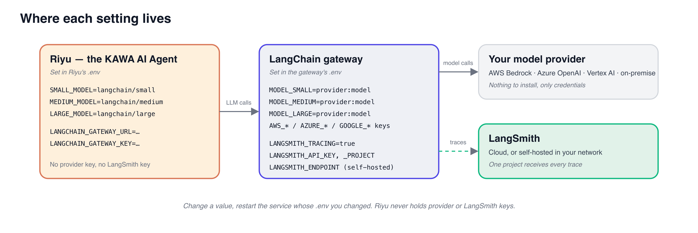
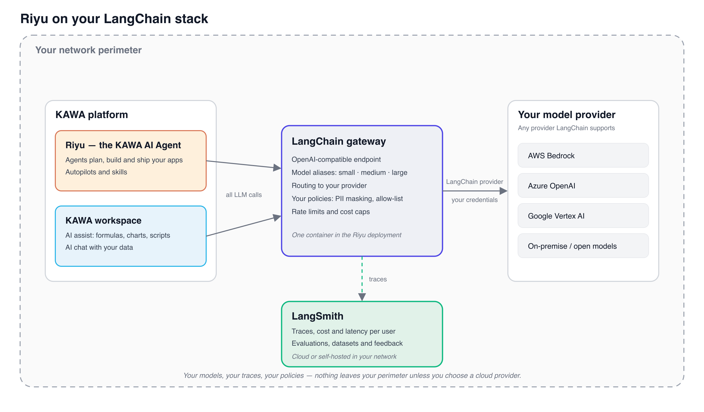

# LangChain / LangSmith integration

<figure><figcaption></figcaption></figure>

**Riyu is the KAWA AI Agent**: you describe what you need in plain language, and Riyu plans it, connects the data and ships it. Riyu, and the AI features built into the KAWA workspace, can run entirely on the LLM stack you already operate. Every model call goes to a **LangChain gateway** that you configure; the gateway routes it to your model provider and reports it to **LangSmith**. You choose the models, you keep the traces, and nothing leaves your network unless you decide it should.

## 1. At a glance

Two services, two environment files. Riyu only knows the address of the gateway. The gateway holds the model choice, the provider credentials and the LangSmith settings.

<div data-with-frame="true"><figure><figcaption></figcaption></figure></div>

_Each setting lives in exactly one place. Riyu never holds a provider key or a LangSmith key._

| What you configure                              | Where                 | Restart |
| ----------------------------------------------- | --------------------- | ------- |
| Model aliases and the gateway address           | Riyu's `.env`         | Riyu    |
| Which model serves each alias, provider credentials | Gateway's `.env`  | Gateway |
| LangSmith tracing                               | Gateway's `.env`      | Gateway |

## 2. How it works

<div data-with-frame="true"><figure><figcaption></figcaption></figure></div>

_Riyu and the KAWA workspace send their LLM calls to the LangChain gateway, which routes them to your provider and traces them in LangSmith._

| Component                   | Role                                                                                                                                                                                              |
| --------------------------- | ------------------------------------------------------------------------------------------------------------------------------------------------------------------------------------------------- |
| Riyu and the KAWA workspace | Send every LLM call to the gateway as a standard chat completion request. No vendor SDK, no vendor key inside KAWA.                                                                                |
| LangChain gateway           | A single container shipped with Riyu. It exposes an OpenAI-compatible endpoint, maps three model aliases (`small`, `medium`, `large`) to the models you pick, and applies your policies.           |
| Your model provider         | Any provider LangChain supports: AWS Bedrock, Azure OpenAI, Google Vertex AI, OpenAI, Anthropic, or open models served on-premise.                                                                 |
| LangSmith                   | Receives a trace of every call: prompt, tool calls, tokens, cost and latency, tagged with the KAWA user and project. Runs in the LangSmith cloud or self-hosted inside your network.               |

## 3. Configuration

### 3.1 On Riyu: point it at the gateway

Set in **Riyu's `.env`**, then restart Riyu.

```
SMALL_MODEL=langchain/small
MEDIUM_MODEL=langchain/medium
LARGE_MODEL=langchain/large
LANGCHAIN_GATEWAY_URL=http://langchain-gateway:8000/v1
LANGCHAIN_GATEWAY_KEY=<shared secret between Riyu and the gateway>
```

Riyu uses `small` for quick tasks, `medium` for routine work and `large` for planning and building. The three aliases can point to the same model. This is the only place Riyu is involved: it never sees a provider key or a LangSmith key.

### 3.2 On the gateway: choose your models

Set in the **gateway's `.env`**, then restart the gateway. Each alias is resolved with a LangChain provider string and the credentials you give the gateway.

```
MODEL_SMALL=bedrock_converse:<model id>
MODEL_MEDIUM=bedrock_converse:<model id>
MODEL_LARGE=bedrock_converse:<model id>
```

| Provider                 | Provider string             | Credentials, also in the gateway's `.env`            |
| ------------------------ | --------------------------- | ---------------------------------------------------- |
| AWS Bedrock              | `bedrock_converse:<model>`  | Standard `AWS_*` variables or an instance role       |
| Azure OpenAI             | `azure_openai:<deployment>` | `AZURE_OPENAI_ENDPOINT`, `AZURE_OPENAI_API_KEY`      |
| Google Vertex AI         | `google_vertexai:<model>`   | `GOOGLE_APPLICATION_CREDENTIALS` (service account)   |
| On-premise / open models | `ollama:<model>`            | None, the gateway talks to your local model server   |

Mixing providers is fine: a small on-premise model for `small` and a hosted frontier model for `large` is a common setup.

### 3.3 On the gateway: connect LangSmith

Set in the **gateway's `.env`**, then restart the gateway. LangChain picks these up on its own; there is nothing to configure on the Riyu side.

```
LANGSMITH_TRACING=true
LANGSMITH_API_KEY=<your LangSmith key>
LANGSMITH_PROJECT=riyu-production
LANGSMITH_ENDPOINT=https://langsmith.your-company.com   # self-hosted LangSmith only
```

From the first conversation after the restart, traces appear in the LangSmith project.

## 4. What you get in LangSmith

* Every agent turn as a trace: the prompt, each tool call, tokens, cost and latency.
* Filters by KAWA user, project, autopilot and model alias. The gateway attaches them as metadata on every trace.
* Datasets and evaluations: replay real Riyu conversations against a candidate model before you switch to it.
* Feedback attached to runs, so a thumbs-down in Riyu lands next to the trace that caused it.
* Data masking with `LANGSMITH_HIDE_INPUTS` and `LANGSMITH_HIDE_OUTPUTS` for regulated content.

## 5. Governance and security

* **Credentials stay in one place.** Riyu never sees a provider key; only the gateway does.
* **One control point.** Model allow-list, PII masking, rate limits and cost caps are gateway policies, applied to every call from every user.
* **Switching providers is a configuration change.** Edit the provider strings in step 3.2 and restart the gateway. No change on the Riyu side.
* **Self-hosted LangSmith** keeps prompts and traces inside your perimeter. Combined with an on-premise model, no data leaves your network.

## 6. Frequently asked questions

**Do we need LangSmith?** No. Set `LANGSMITH_TRACING=false` on the gateway and it runs without tracing. LangSmith can be enabled later without any other change.

**Can we use our existing LangSmith project?** Yes. Set `LANGSMITH_PROJECT` to its name and the Riyu traces sit next to your other applications.

**Which models does Riyu need?** Riyu works best with a current frontier model behind `large`. Tool calling and streaming are required, which every provider in the table above supports.

**What about the AI features inside the KAWA workspace?** Formula assist, chart generation and the data chat use KAWA's own LLM configuration, which can be pointed at the same gateway so all AI traffic shares one policy and one LangSmith project.
