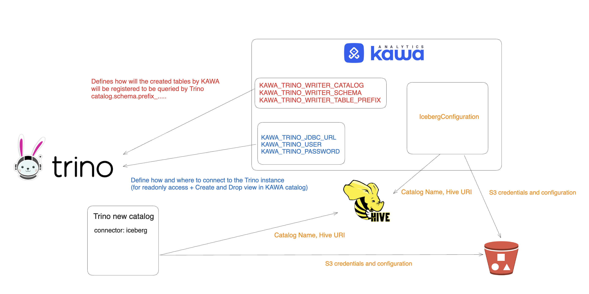

## Data Lakehouse integration

This section illustrates how KAWA can be integrated in your data lakehouse.

* TOC
{:toc}

# 1. Overview

KAWA integrates seamlessly into the consumption layer of your data lakehouse, providing an intuitive interface for data exploration and analytics while directly leveraging the Iceberg API to manage KAWA tables and ingest user data—all within a dedicated S3 bucket. It bridges to the processing layer by utilizing existing execution engines like Trino to perform scalable analytical queries using standard SQL. This integration allows users to harness the full suite of KAWA’s features—such as Python ETL, dynamic columns, and rich visualizations—natively within the lakehouse, combining performance, flexibility, and usability in a unified environment.


# 2. Configuration guide

This configuration guide outlines how to integrate KAWA into a data lakehouse architecture using Trino as the execution engine, S3 as the object storage layer, and Hive Metastore as the metadata layer.

This guide supposes the following prerequisites:

- Working instance of a hive metastore
- An existing S3 bucket with a R/W account for KAWA
- A Trino instance with a Read only account for KAWA

## 2.1 Configuring Trino

> ℹ️ If you do not wish to activate the write back feature, you can skip this paragraph.

### 2.1.1 Creating an Iceberg catalog

In Trino, you have to configure a new catalogue using the iceberg connector.

> Example for the Trino catalog kawa (content of the file: `kawa.properties`)

```ini
# Connector
connector.name=iceberg

# Catalog
iceberg.catalog.type=hive_metastore
hive.metastore.uri=thrift://hive-metastore:9083

# Name of you hive catalog if you support multi catalogs
# (Not necessarily the same as the trino catalogue...)
hive.metastore.thrift.catalog-name=hive

# S3 Configuration
fs.native-s3.enabled=true
s3.endpoint=http://my-bucket:9000
s3.aws-access-key=KAWA
s3.aws-secret-key=***********
s3.path-style-access=true
s3.region=us-east-1
```

### 2.1.2 Create a new schema via Trino

In the new catalog (Here, we are working in the `kawa` catalogue), create a new schema via Trino.

```sql
CREATE SCHEMA IF NOT EXISTS kawa.kawa_sandbox
```

## 2.2 Configuring KAWA

### 2.2.1 Readonly configuration

In order for KAWA to function in read only mode on Trino, you need the following four environment variables:

```bash
export KAWA_TRINO_USER=....
export KAWA_TRINO_PASSWORD=....
export KAWA_TRINO_JDBC_URL=jdbc:trino://host:port
export KAWA_WAREHOUSE_TYPE=TRINO
```

### 2.2.2 Read+Write configuration

To add the write back capability, __in addition to the four variables described above__, three more variables are necessary

_Environment variables:_

```bash
# Use the TRINO catalog name (kawa in the previous paragraph)
export KAWA_TRINO_WRITER_CATALOG=....

# Use the schema name you created in paragraph 2.1.2
export KAWA_TRINO_WRITER_SCHEMA=....

# Any string that will serve as a prefix for all tables created by KAWA
export KAWA_TRINO_WRITER_TABLE_PREFIX=__KAWA__
```

Once those four variables are set, use the Python SDK to configure the S3 access as well as the Hive URL. This will allow KAWA to initialize the Iceberg API with the correct information and credentials.

_Server configuration:_

```python

from kywy.client.kawa_client import KawaClient as K
kawa = K(kawa_api_url='https://your-domain:your-port')
kawa.set_api_key(api_key='kawa-****')

kawa.commands.replace_configuration('IcebergConfiguration', {
  # Must match hive.metastore.thrift.catalog-name 
  # in Trino catalogue
  "hiveCatalog": "hive",

  # Options for the iceberg API when loading the hive catalogue.
  # These options will be passed when the Iceberg API
  # initializes the Hive catalogue.
  # cf: https://iceberg.apache.org/docs/1.8.0/
  "options": {
        # Hive metastore URI
        "uri": "thrift://localhost:9083",
       
        # S3 configuration, must match the ones specified in the 
        # Trino catalogue
        "s3.region": "us-east-1",
        "s3.endpoint": "http://localhost:9999",
        "s3.path-style-access": "true",
        "s3.access-key-id": "KAWA",
        "s3.secret-access-key": "**********",      
  }
})
```

For these to be taken in account, the KAWA server must be restarted.


## 2.3 Recap of the configured components



This diagram shows all the different configuration elements that were covered in the previous paragraphs.

Note that `KAWA_TRINO_WRITER_CATALOG` (In red) must match the name of the catalog in Trino ( `$(KAWA_TRINO_WRITER_CATALOG).config`).