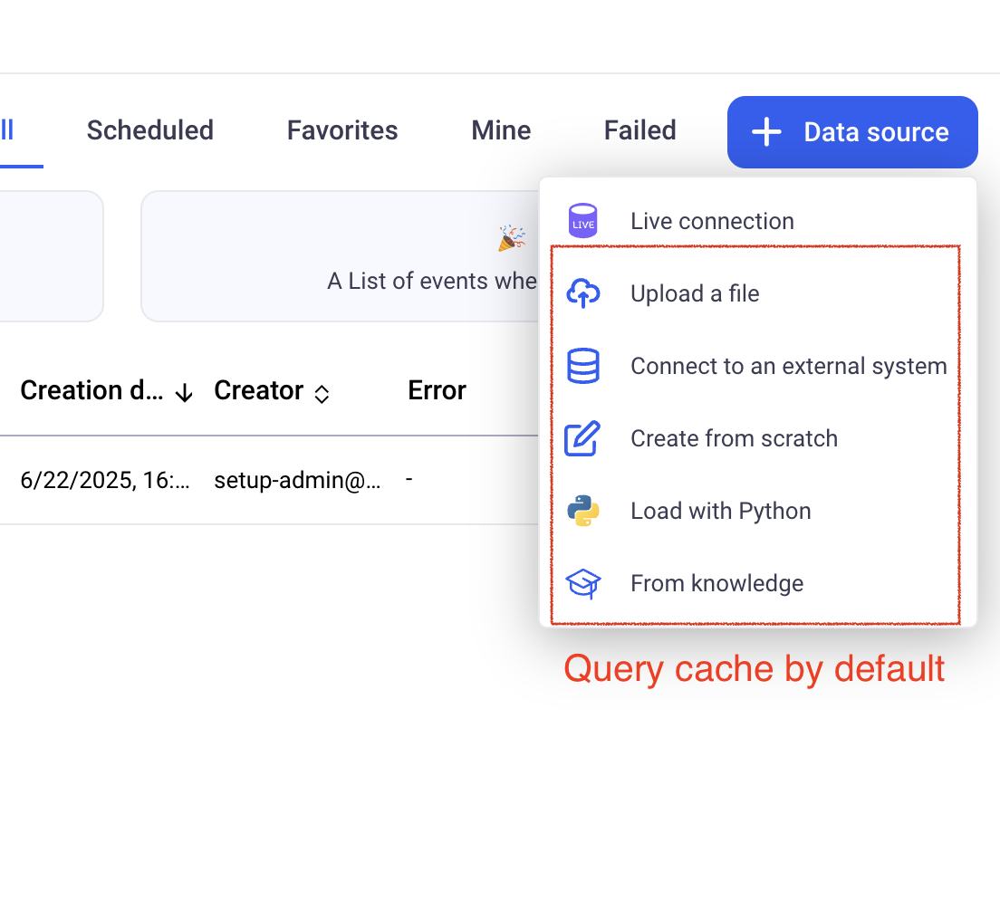
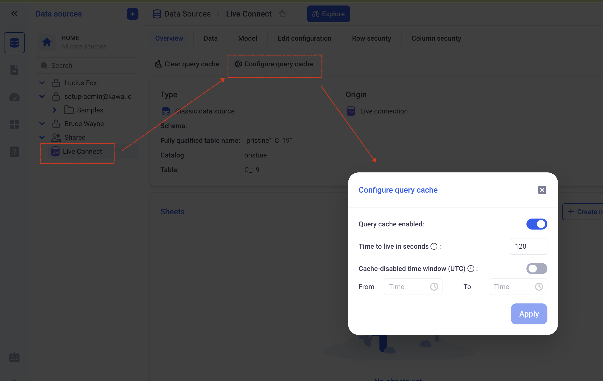
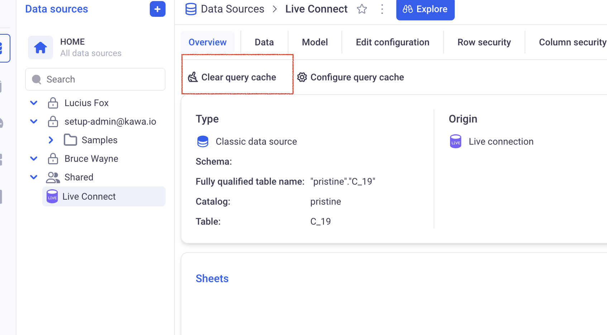
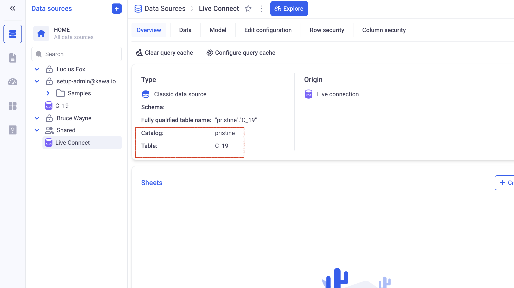

# KAWA Query Cache

This section explains how to work with KAWA query cache.

* TOC
{:toc}

## 1. Default query cache

KAWA uses a query cache on all datasources that are managed by KAWA. This does not require any particular configuration.



However, for data sources using the Live Connection option, no query cache is provided by default. This is because KAWA does not know when the data has changed and cannot invalidate the cache when needed.

> The cached queries are stored in KAWA's postgres database. The cached data is encrypted by KAWA (no clear text query results are stored in the cache).

## 2. Configuring a query cache for Live connections

For live connections, you can decide to enable a query cache from the datasource section.



Here are the settings of the query cache:

- _Query cache is enabled:_ Determines whether a query cache is activated for this datasource.

- _Time to live:_ Defines how long will each query stay in the cache for, in seconds.

- _Cache disabled time window:_ During that time window, the cache will not be used. (The times are indicated in UTC). For example, if you set a time window from 10:00 to 11:00, the query cache will be bypassed everyday from 10 to 11. (This can be used in case you know when the data will be refreshed, but have no control over it or do not have the possibility to add cache invalidation logic in your ETLs).

## 3. Cache eviction mechanisms

### 3.1 Using the Clear Cache button from the GUI

Anyone with access (in readonly or read write) to the datasource, can decide to manually invalidate the cache for this datasource. 



### 3.2 Eviction based on TTL (time to live)

Each time a query is added to the cache, it will be naturally evicted once its time to live has elapsed. The TTL is computed taking in account the configured TTL on the GUI, but will also take in account the _Cache disabled time window_ parameter.

For example, a query that is made during the _Cache disabled time window_ will have a TTL of 0.

### 3.3 Programmatic evictions (Recommended method)

In order to evict entries from the query cache directly from your ETL processes, you can use the Python SDK:


```python
from kywy.client.kawa_client import KawaClient
kawa = KawaClient.load_client_from_environment()

kawa.commands.run_command(
    command_name='ClearQueryCacheForTable',
    command_parameters={
        'catalog':'pristine',
        'schema': '',
        'table': 'C_19'
    } 
)
```

This command outputs the ids of the datasources that were invalidated. Please consider checking the `catalog`, `schema` and `table` if you see empty arrays (which means that no data sources has been found connected to that table).

You can check here for the correct definition of tables:



> In clickhouse, the schema should be left empty.