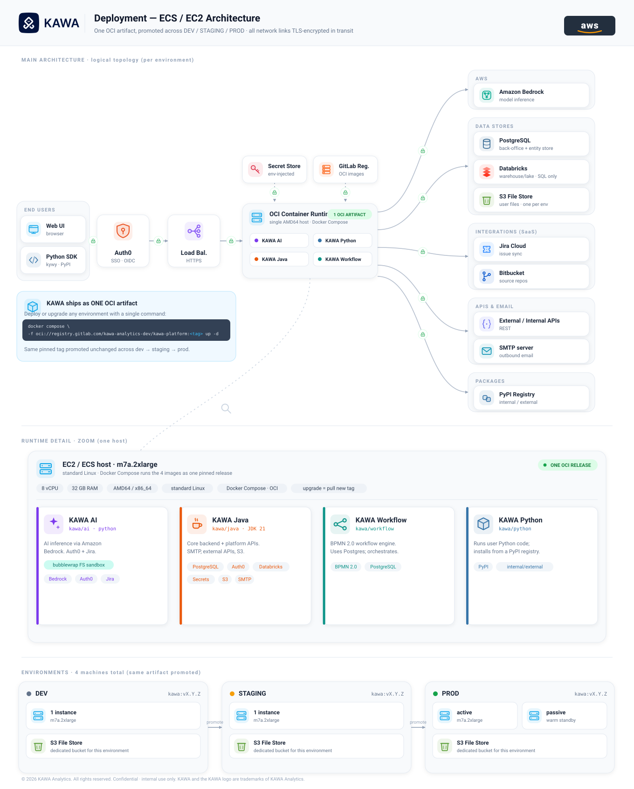

# Deployment Architectures

KAWA can be deployed in several ways. This page shows the reference architecture for each option, illustrated with a diagram. For a side-by-side comparison of what each cloud provider supports, see **Deployment Options**.

## 1. AWS (EC2 / ECS)

A single-host **Docker Compose** deployment: KAWA runs as one OCI artifact on a single **EC2 / ECS** host. This is one of several supported options — for the Kubernetes (**EKS**) topology, see **Deployment Options**. The same pinned artifact is promoted unchanged across environments, and all network links are TLS-encrypted in transit.

<div data-with-frame="true"><figure><figcaption></figcaption></figure></div>

<table data-search="false"><thead><tr><th>Category</th><th>Details</th></tr></thead><tbody><tr><td>Model</td><td>Single-host <strong>Docker Compose</strong> deployment — one OCI artifact on a single <strong>EC2 / ECS</strong> host.</td></tr><tr><td>Artifact</td><td>One OCI release bundling four images: <strong>KAWA Java</strong> (JDK 21 — core backend and platform APIs), <strong>KAWA AI</strong> (Python — inference via <strong>Amazon Bedrock</strong>, isolated in a filesystem sandbox), <strong>KAWA Workflow</strong> (<strong>BPMN 2.0</strong> workflow engine), <strong>KAWA Python</strong> (runs user Python code, packages from <strong>PyPI</strong>).</td></tr><tr><td>Host</td><td><code>m7a.2xlarge</code> — 8 vCPU, 32 GB RAM, <strong>AMD64 / x86_64</strong>, standard Linux. Runtime: <strong>Docker Compose</strong> (OCI).</td></tr><tr><td>Data &#x26; storage</td><td><strong>PostgreSQL</strong> — back-office and entity store; <strong>Amazon S3</strong> — user files, one bucket per environment; <strong>Databricks</strong> — SQL warehouse / lake.</td></tr><tr><td>AI</td><td><strong>Amazon Bedrock</strong> — model inference.</td></tr><tr><td>Authentication</td><td>OIDC / OAuth2 — <strong>Auth0</strong> or any OIDC-compliant IdP.</td></tr><tr><td>Integrations &#x26; email</td><td><strong>SMTP</strong> — outbound email; <strong>Jira Cloud</strong> — issue sync; <strong>Bitbucket</strong> — source repositories; external / internal REST APIs.</td></tr><tr><td>Environments</td><td>Same pinned artifact promoted <strong>DEV → STAGING → PROD</strong>. Production runs active with an optional passive warm-standby host — see <strong>Disaster Recovery Architecture</strong>. Each environment has its own <strong>S3</strong> bucket.</td></tr></tbody></table>

### 1.1 Deploy or upgrade

Deploy or upgrade an environment with a single command:

```bash
docker compose \
  -f oci://<registry>/kawa-platform:<tag> up -d
```

Replace `<registry>` and `<tag>` with the values provided by KAWA during onboarding. To upgrade, pull a new tag — there is no rebuild. The same pinned artifact moves unchanged from non-production to production.
