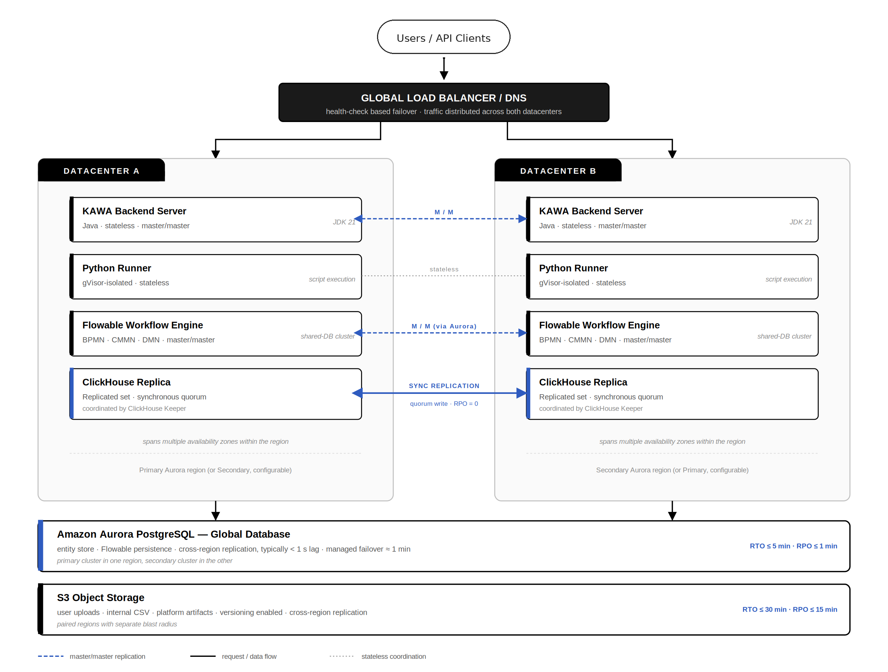

# Disaster Recovery Architecture

## 1. Overview

This page covers the disaster recovery (DR) reference architecture for self-hosted and on-premise KAWA deployments. Use it to plan a resilient installation that meets your recovery objectives.

You will find:

* The recommended active/active topology and the role of each component.
* Achievable RTO / RPO targets per component.
* Backup strategy, failover procedures, and testing cadence.

All recommendations can be adapted to your own infrastructure, compliance requirements, and risk appetite.

## 2. Scope

This guidance applies to production deployments of the KAWA platform operated by a customer in their own environment, whether on-premise, in a private cloud, or in a public cloud account managed by the customer. The components covered are:

* **KAWA Backend Server** (Java application, JDK 21), deployable in an active/active topology across two datacenters.
* **KAWA Python Runners** (script execution containers, isolated with gVisor), deployable in each datacenter.
* **Flowable Workflow Engine** (BPMN, CMMN and DMN execution), deployable in an active/active topology backed by the shared PostgreSQL database.
* **PostgreSQL** — the entity store for KAWA server state and the persistence layer for the Flowable workflow engine. The recommended deployment is Amazon Aurora PostgreSQL Global Database, or an equivalent managed multi-region PostgreSQL service in non-AWS environments.
* **ClickHouse** — the analytical data warehouse, deployable as a replicated set with replicas across both datacenters, coordinated by ClickHouse Keeper.
* **Object storage** for user-uploaded files, internal CSV exchanges and platform artifacts (Amazon S3 or S3-compatible storage with versioning and cross-region replication).
* **Configuration, secrets and infrastructure-as-code repositories** required to rebuild the platform from a known-good state.

> This guidance does not cover the KAWA SaaS environment operated by KAWA Analytics Corp.; that service is governed by KAWA's own internal policies and the commitments made in its customer contracts and SOC 2 report.

## 3. Definitions

**Disaster Recovery (DR):** The set of processes, tools, and procedures used to recover the KAWA platform after a service-affecting failure of one or more system components.

**Recovery Time Objective (RTO):** The maximum tolerable elapsed time between a disaster declaration and the restoration of service.

**Recovery Point Objective (RPO):** The maximum tolerable amount of data loss measured in time, between the most recent recoverable state and the point of failure.

**Active/Active:** A deployment topology in which two or more instances of a component serve production traffic concurrently. The KAWA Backend Server supports this through its master/master deployment mode.

**Replicated Set:** A clustered deployment of a stateful component (ClickHouse, PostgreSQL) where data is replicated across multiple nodes or availability zones.

## 4. Recommended Operational Roles

We recommend that the customer team operating the KAWA platform identify owners for the following responsibilities. These do not need to be distinct individuals; in smaller teams a single engineer may cover several of them.

**Platform Owner:** Owns the KAWA deployment end-to-end, approves the recovery objectives the deployment commits to, and is the escalation point during a disaster.

**Infrastructure / SRE Team:** Implements and operates the DR architecture, executes failover procedures, maintains backup tooling and runs DR tests.

**Incident Commander (on-call):** Declares a disaster, coordinates the response and decides when to invoke failover procedures.

**Compliance / Risk Owner:** Confirms the DR posture meets the customer’s internal compliance and regulatory obligations, and retains evidence of testing.

**KAWA Support (escalation):** KAWA Analytics Corp. provides product-level support for the platform during recovery; contact details are provided in the customer’s support agreement.

## 5. Recommended Reference Architecture

The KAWA platform is designed to be deployed in a fully symmetric, active/active topology across two independent datacenters (referred to here as **DC-A** and **DC-B**). Each stateful and stateless component runs as a master/master pair, with one instance in each datacenter serving production traffic concurrently. For the relational store, we recommend Amazon Aurora PostgreSQL Global Database, with a primary cluster in one region and a secondary cluster in the other for cross-region failover.

<figure><figcaption></figcaption></figure>

<em>Figure 1. KAWA platform reference architecture for self-hosted deployments.</em>

The components of the reference architecture are:

* **KAWA Backend Server:** master/master, one active instance in DC-A and one in DC-B.
* **KAWA Python Runners:** master/master, one active runner in DC-A and one in DC-B.
* **Flowable Workflow Engine:** master/master, one active instance in each datacenter, coordinated through the shared Aurora database.
* **ClickHouse:** deployed as a replicated set with replicas in both DC-A and DC-B (master/master replication). Writes are synchronously acknowledged by the replication quorum so committed data is present in both datacenters.
* **PostgreSQL:** Amazon Aurora PostgreSQL Global Database with primary cluster in the DC-A region and secondary cluster in the DC-B region. Typical cross-region replication lag is under one second; managed promotion of the secondary is achievable in approximately one minute.
* **S3 object storage:** versioning enabled, with cross-region replication between the two paired regions.
* **Traffic routing:** global load balancer / DNS layer with health-check-based failover, distributing traffic across both datacenters during normal operation.

### 6. Achievable Recovery Objectives

The following recovery objectives are achievable with the recommended reference architecture for the loss of a single datacenter. Operators may target tighter or looser objectives by adjusting the topology (for example, additional ClickHouse replicas, more aggressive backup cadence, or a warm DR region for the both-datacenters-down scenario). The simultaneous loss of both datacenters — a separate scenario covered in §9.4 — has its own recovery objectives shown in the final row.

| Component                  | RTO       | RPO      | Failover Mode                   |
| -------------------------- | --------- | -------- | ------------------------------- |
| KAWA Backend Server        | ≤ 10 min  | 0        | Master/Master                   |
| KAWA Python Runners        | ≤ 10 min  | 0        | Master/Master                   |
| Flowable Workflow Engine   | ≤ 10 min  | 0        | Master/Master (shared DB)       |
| ClickHouse                 | ≤ 10 min  | 0        | Master/Master across DCs        |
| PostgreSQL (Aurora Global) | ≤ 5 min   | ≤ 1 min  | Cross-region promotion          |
| S3 object storage          | ≤ 30 min  | ≤ 15 min | Cross-region replication        |
| Loss of one datacenter     | ≤ 10 min  | 0        | Traffic re-route, both DCs live |
| Loss of both datacenters   | ≤ 4 hours | ≤ 15 min | Rebuild from backups            |

## 7. Recommended Deployment Pattern by Component

### 7.1 KAWA Backend Server

The KAWA Backend Server is stateless and supports a master/master deployment. One active instance is operated in each datacenter (DC-A and DC-B), and both serve production traffic concurrently behind a global load balancer with HTTP-level health checks. The loss of either instance, or of an entire datacenter, results in traffic shifting automatically to the surviving instance.

* Each instance is sized to handle 100 % of production load to absorb the loss of its peer.
* Container images are pulled from an internal registry; images are pinned by digest in deployment manifests so a restored instance is always reproducible.
* Configuration and license files are stored in a version-controlled repository and rendered at deploy time.
* RTO: ≤ 10 minutes (bounded by health-check detection and load-balancer convergence). RPO: 0.

### 7.2 KAWA Python Runners

Python Runners are stateless script execution containers deployed master/master, with one active runner in DC-A and one in DC-B. Job scheduling is performed by the KAWA Backend Server and is idempotent at the script execution layer; if a runner fails mid-execution, the job is rescheduled to the surviving runner.

* Runners interact with the KAWA server through HTTP APIs and retrieve script artifacts from source control / the KAWA file store.
* RTO: ≤ 10 minutes. RPO: 0.

### 7.3 Flowable Workflow Engine

The KAWA platform uses the Flowable engine for BPMN, CMMN and DMN execution. The Flowable engine is deployed master/master with one active instance in DC-A and one in DC-B. Both instances share the Aurora PostgreSQL Global Database described in §7.4, which acts as the synchronization anchor for the cluster. No additional clustering middleware is required.

This topology is supported natively by Flowable: the engine is stateless and any number of nodes pointed at the same database operate as a cluster, with idempotent service calls regardless of which node served the request. Asynchronous and timer jobs are coordinated through the database: a job is first attempted on the originating node and, if not picked up, becomes available for any node in the cluster to acquire via a database-backed lock. This guarantees exactly-once execution of each job without external coordination.

* Both nodes run the same Flowable engine version and use a digest-pinned container image.
* The `workflow.properties` configuration file is identical on both nodes and is managed in version control.
* **Auto-deployment locking is enabled** (`flowable.auto-deployment.use-lock=true`) so that only one node performs process-definition deployments on startup.
* **Sticky sessions are configured on the load balancer** for any flow that relies on long-polling (SockJS) or the OpenID Connect authorization code exchange, as those flows hold node-affine state.
* All durable workflow state (process instances, tasks, timers, history) is held in Aurora PostgreSQL and inherits the recovery objectives of that component.
* On loss of a Flowable node, jobs locked by the failed node are released after the lock timeout and picked up by the surviving node. In-flight job interruption is bounded by the configured lock timeout (typically 5 minutes).
* RTO: ≤ 10 minutes. RPO: 0 (no local state on the engine nodes).

### 7.4 PostgreSQL (Aurora Global Database)

PostgreSQL holds the KAWA entity store (users, workspaces, dashboards, permissions, configuration, metadata) and the Flowable workflow engine's durable state (deployments, process and case instances, tasks, timers, history). It is operated as Amazon Aurora PostgreSQL Global Database, with the primary cluster in the DC-A region and a secondary cluster in the DC-B region. Aurora provides typical cross-region replication lag under one second and supports managed promotion of the secondary cluster in approximately one minute when the primary region is lost.

* Within each region, the Aurora cluster runs across multiple availability zones with synchronous replication, providing transparent failover within the region in under 60 seconds.
* Cross-region replication is asynchronous but typically sub-second; RPO under normal operation is well under one minute.
* Automated daily snapshots are retained for **30 days**; point-in-time recovery (PITR) is enabled with a **7-day** recovery window.
* Snapshots are copied to a third region at least once every **24 hours** to protect against simultaneous loss of both Aurora regions.
* Connection strings resolve to the Aurora cluster endpoints; promotion of the secondary cluster is transparent to KAWA Backend and Flowable nodes after connection reset.
* RTO: ≤ 5 minutes for cross-region failover. RPO: ≤ 1 minute.

### 7.5 ClickHouse (Analytical Warehouse)

ClickHouse stores customer analytical data and is the execution engine for all queries prepared by the KAWA Backend. It is deployed master/master across the two datacenters, with replicas in both DC-A and DC-B coordinated by ClickHouse Keeper. Writes are synchronously acknowledged by the replication quorum, so committed data is present in both datacenters before the write returns to the client.

* Each shard has replicas placed in both DC-A and DC-B, providing immediate read availability after the loss of a datacenter.
* ClickHouse Keeper is deployed as an odd-numbered ensemble (minimum three nodes) spread across both datacenters and at least one additional availability zone to avoid split-brain.
* On the loss of a replica or an entire datacenter, the surviving replica continues to serve reads and accept writes immediately; no promotion step is required.
* Full backups are taken daily using `clickhouse-backup` (or equivalent) and stored in S3 with cross-region replication, providing an independent recovery path against logical corruption or simultaneous loss of both datacenters.
* Incremental backups are taken every **6 hours**.
* Backup restorability is validated by automated test restores at least monthly.
* RTO: ≤ 10 minutes for the loss of a single replica or datacenter. RPO: 0 within quorum.

### 7.6 Object Storage (S3)

S3 stores user-uploaded files, internal CSV exchanges, query result caches, and platform artifacts. It is configured with object versioning to protect against accidental deletion and overwrite, and with cross-region replication to a secondary region for regional resilience.

* Versioning is enabled on all production buckets; lifecycle policies retain prior versions for at least **90 days**.
* Cross-region replication targets a paired region with a different blast radius (e.g., us-east-1 → us-west-2).
* Bucket access is restricted by least-privilege IAM policies; bucket policies block public access by default.
* MFA Delete is enabled on buckets containing customer data, where supported.
* RTO: ≤ 1 hour (regional). RPO: ≤ 15 minutes via replication.

#### 7.7 Configuration, Secrets, and Infrastructure

All infrastructure is defined as code (Terraform / equivalent) and stored in version control. Application configuration is stored alongside the deployment manifests. Secrets are stored in a dedicated secret manager (AWS Secrets Manager / Vault) with replication enabled to the secondary region.

* Infrastructure code is retained indefinitely in Git with off-platform mirroring.
* Secrets are versioned; rotation policies are documented separately in the Access Control Policy.

## 8. Recommended Backup Strategy

Backups should provide an independent recovery path from the live replication topology, protecting against logical corruption, accidental deletion, and ransomware in addition to infrastructure failure. The frequencies and retention periods below are starting points; operators should adjust them to their own data volumes, regulatory requirements and risk appetite.

| Component              | Frequency     | Retention  | Location                     |
| ---------------------- | ------------- | ---------- | ---------------------------- |
| Aurora snapshots       | Daily         | 30 days    | Primary + tertiary region    |
| Aurora PITR (WAL)      | Continuous    | 7 days     | Primary cluster              |
| ClickHouse full backup | Daily         | 30 days    | S3, cross-region             |
| ClickHouse incremental | Every 6 hours | 7 days     | S3, cross-region             |
| S3 versioned objects   | On change     | 90 days    | Same bucket + replica region |
| Configuration / IaC    | On change     | Indefinite | Git + off-platform mirror    |

> We recommend that backup integrity be verified through automated restore tests performed at least monthly, with outcomes logged and retained as evidence of backup viability.

## 9. Disaster Scenarios and Response

### 9.1 Loss of a Single Node or Container

* Detection: automated health checks at the load balancer and container orchestrator.
* Response: traffic is automatically routed to the surviving master in the same datacenter or its peer in the other datacenter; the failed instance is replaced by the orchestrator. No manual intervention is required.
* Service impact: typically none observable to end users.

### 9.2 Loss of an Availability Zone

* Detection: simultaneous health-check failures of multiple components in the same AZ, confirmed by the cloud provider status page.
* Response: Aurora PostgreSQL fails over within the region in under 60 seconds; ClickHouse continues to serve from surviving replicas; the affected datacenter's KAWA Backend, Python Runner and Flowable Workflow Engine instances are rescheduled in the surviving AZ. Flowable jobs locked by the failed node are released automatically and picked up by the surviving node after the lock timeout expires.
* RTO: ≤ 5 minutes for the affected components.

### 9.3 Loss of an Entire Datacenter (DC-A or DC-B)

This is the primary disaster scenario the KAWA topology is designed for. Because every component runs master/master across DC-A and DC-B, the loss of one datacenter is a traffic-routing event rather than a recovery event.

* Detection: complete loss of connectivity to all services in one datacenter, confirmed by independent health checks and the cloud provider status page.
* KAWA Backend, Python Runners and Flowable Workflow Engine: the global load balancer detects the failed datacenter and shifts all traffic to the surviving instances in the other datacenter, which are already live and sized to handle full production load.
* ClickHouse: surviving replicas in the other datacenter continue to serve reads and writes immediately; no promotion is required.
* PostgreSQL (Aurora Global): if the lost datacenter was the primary Aurora region, the secondary cluster is promoted (managed promotion, approximately one minute). If it was the secondary, no action is required.
* Flowable: jobs locked by the failed datacenter's engine instance are released after the lock timeout and reacquired by the surviving instance.
* S3: requests are redirected to the replica bucket if the lost datacenter's region was the primary.
* RTO: ≤ 10 minutes (bounded by health-check detection, load-balancer convergence, and Aurora promotion if required). RPO: 0 to 1 minute (Aurora cross-region replication lag).

### 9.4 Simultaneous Loss of Both Datacenters

This scenario covers the rare catastrophic event in which both DC-A and DC-B are lost simultaneously: a multi-region cloud provider outage, a coordinated cyber incident, or a geographic disaster affecting both regions. It is the only scenario in which the platform must be rebuilt rather than failed over.

* Detection: confirmed loss of both regions from the cloud provider and loss of all production endpoints.
* The Incident Commander formally declares a disaster and initiates the recovery runbook.
* PostgreSQL is restored from the most recent cross-region snapshot (stored in a third region for this scenario).
* ClickHouse is restored from cross-region backups stored in S3.
* S3 traffic is redirected to a tertiary region replica or restored from versioned backups.
* Application services (Backend, Python Runners, Flowable) are deployed from the IaC repository to a recovery region.
* RTO: ≤ 4 hours. RPO: ≤ 15 minutes.

#### 9.5 Logical Corruption or Ransomware

* Detection: integrity checks, anomalous activity in audit logs, customer reports.
* Response: affected services are isolated; restore from the most recent clean backup taken before the corruption window. S3 object versioning is used to restore overwritten or deleted objects. Forensic copies are preserved before restoration.

## 10. Recommended Testing and Validation

We recommend that operators test the DR design on a defined cadence to ensure procedures remain effective and runbooks reflect the current deployment. The cadence below is a starting recommendation.

* **Backup restore tests:** Monthly, automated, for PostgreSQL and ClickHouse.
* **Component failover drills:** Quarterly. Includes forced failover of a KAWA Backend instance, a Python Runner, a Flowable Workflow Engine instance, and a ClickHouse replica.
* **Datacenter failover exercise:** Annually. Simulates the loss of one datacenter and validates that the surviving datacenter sustains full production load.
* **Tabletop exercise:** Annually. Walk-through of the disaster declaration, communication and decision-making process with the operator's key stakeholders.

Each test should produce a written report capturing scope, participants, observations, RTO and RPO actually achieved, and remediation items. Operators with regulatory or audit obligations should retain these reports for the period required by their own programmes.&#x20;

## 11. Communication Plan (Recommended)

During a declared disaster, internal and external communication should be coordinated by the operator's Incident Commander. We recommend that operators define, in advance, the channels and timelines below.

* **Internal:** a dedicated incident channel for the response team and a paging mechanism (PagerDuty or equivalent) for the on-call rotation.
* **End users:** status updates published through whatever channel the operator's users normally consume (status page, email, in-product banner). For customer-facing deployments, an initial update within 30 minutes of disaster declaration and updates at least every 60 minutes thereafter until resolution is a reasonable starting point.
* **Regulators / contractually-bound parties:** notifications issued as required by the operator's customer contracts and applicable regulations.
* **KAWA Support:** for product-level issues during recovery, the operator should contact KAWA Support through the channel defined in their support agreement.

### 12. Document Maintenance

This reference architecture is maintained by KAWA Analytics Corp. and is reviewed at least annually. Material changes to the platform architecture, supported components or recommended deployment patterns trigger an out-of-cycle update. The version, issue date and next review date are recorded in the document control table at the top of this page.

Operators are encouraged to share feedback on this guide with KAWA through their support channel so that real-world operational experience can be reflected in subsequent revisions.
