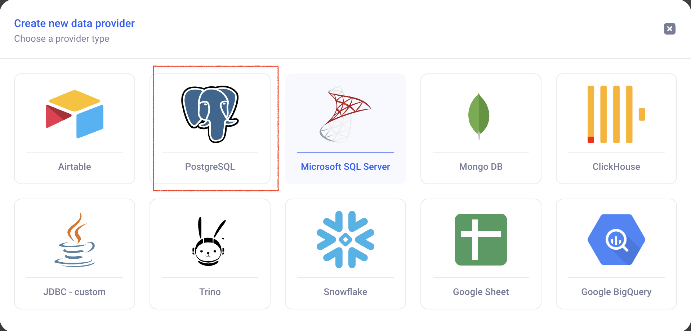

## Create monitoring views

* TOC
{:toc}


# 1. Monitor user events

## 1.1 Setup a connection to KAWA's database from the KAWA GUI

From the datasource section, create a new data source:
(+ Data Source) > (Connect to an external system) > (+ Create new connection)

Pick the postgres connector:




Then, configure the connection to the KAWA store (The configuration is present in KAWA server configuration, in the _POSTGRES JDBC URL_). Click on Test Connection and then Create.


_The above screenshot contains some example parameters_.


## 1.2 Create a new datasource to load application events


Making sure that you selected your new connection (here KAWA), click on the Custom SQL query option.


Then, copy paste the following query in the text area (feel free to adapt it to your needs).

```sql
-- Query to load events and associated user information
SELECT
    E.event_id,
    upper(E.event_name) as event_name,
    upper(E.event_group) as event_group,
    upper(E.event_context_id) as event_context_id,
    E.event_date,
    E.event_correlated_entity_id,
    E.event_principal_id,
    E.event_correlated_entity_type,
    -- E.event_payload::text as payload, (OPTIONAL for more detailed information)
    P.display_name,
    P.payload->>'email' as email,
    P.payload->>'uniqueId' as uniqueId,
    P.payload->>'role' as role


FROM kawa.application_event as E
    LEFT JOIN kawa.entity_principal as P 
    ON E.event_principal_id = P.entity_id::text

```

CLick on (Preview data) > (Next) > (Save).

Input a name for your datasource: __Application Events__ then click on (Save and Run).


Once your data is ready, feel free to schedule it:


_On this example, we schedule a full refresh of this data every 10 minutes. Feel free to adjust the frequency to your requirements._


## 1.3 Create some charts and views to visualize this data

Below are a few examples of views that you can do to visualize the data:


_Chart to show number of interactions per user and command name:_:


_Chart to show when users interact with the platform:_:


_Chart that shows which show the evolution of events per type_:


# 2. Monitor script execution

In order to monitor script execution, please follow the steps described in 1.1 to connect to KAWA's database.

## 2.1 Create a new datasource to load the script monitoring table


Making sure that you selected your new connection (here KAWA), click on the Custom SQL query option.


Then, copy paste the following query in the text area (feel free to adapt it to your needs).


```sql
SELECT
    JOB.job_id,
    JOB.status,
    JOB.date_created,
    JOB.date_updated,
    ROUND(EXTRACT(EPOCH FROM (JOB.date_updated - JOB.date_created)))::int AS duration_seconds,
    SCRIPT.display_name,
    SCRIPT.workspace_id
FROM kawa.python_jobs AS JOB
    LEFT JOIN kawa.entity_script as SCRIPT ON JOB.script_id = SCRIPT.entity_id
```

CLick on (Preview data) > (Next) > (Save).

Input a name for your datasource: Application Events then click on (Save and Run).


Like for the events, feel free to schedule the ETL to run automatically.


## 2.2 Create some charts and views to visualize this data


_Boxplot chart to show script execution time_:


_Boxplot chart to show script status over time_:

