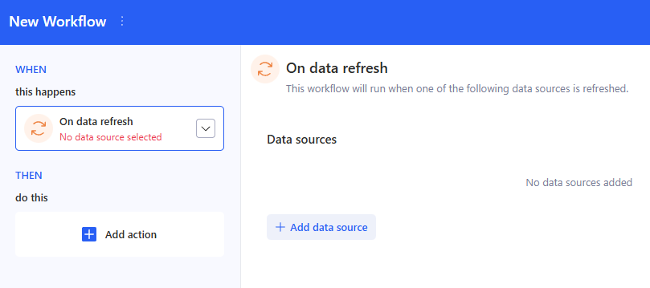
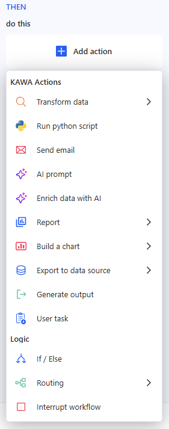
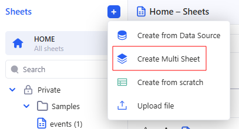
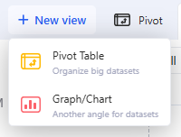
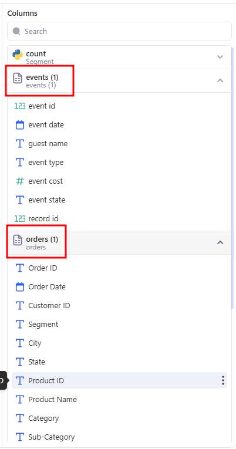
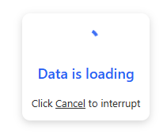
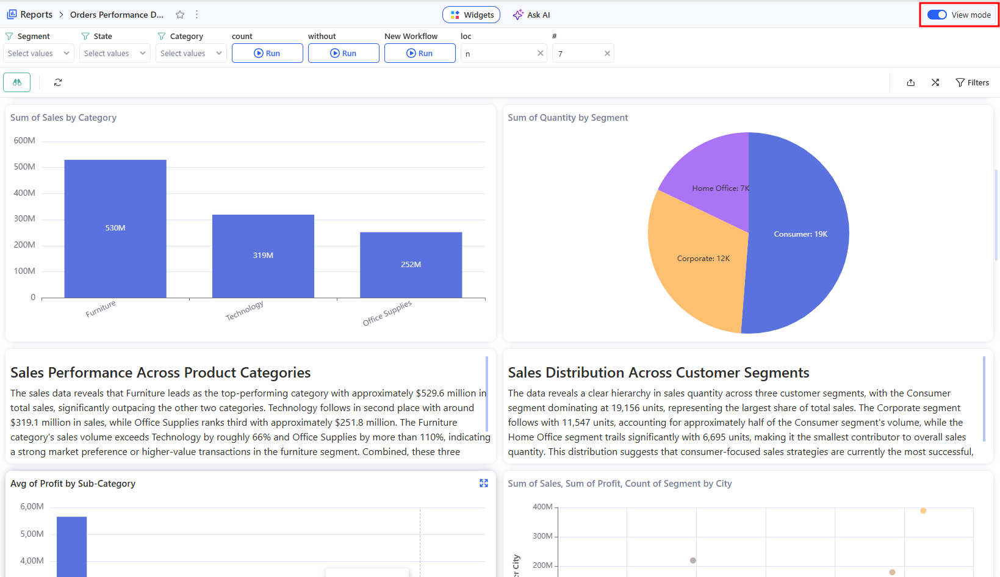

# Release note 1.34

## 1. New Features

### 1.1 Workflows — more triggers, actions, and control flow

**Workflows** (introduced in [Release note - KAWA 1.33](12_02_release_note_1.33.md)) are KAWA’s automation builder: define a trigger (WHEN), chain actions (THEN), pass outputs between steps, and monitor every run in Run history. In 1.34, **Workflows** expand with an On data refresh trigger, more built-in actions (Enrich data with AI, Reports, Build a chart, Export to data source, Generate output, User task), and control-flow blocks (If/Else, Routing, Interrupt workflow) for real-world orchestration.

> You can read more about this in the [The Workflows section](../07_00_workflows/).

Workflows now support richer automation from end to end:

* **New trigger: On data refresh** — run a Workflow automatically right after a selected data source refreshes (supports multiple sources with **OR** logic).

* **New actions** to build pipelines without leaving the editor
  * **Enrich data with AI** (generate output columns per row)
  * **Report** (select a report from the workspace and use it later in the Workflow as an artifact)
  * **Build a chart** (from previous steps or any Sheet)
  * **Export to data source** (export a table result with export mode + access policy)
  * **Generate output** (produce a text result using variables from prior steps)
  * **User task** (assign a task to a user and collect form inputs before the Workflow continues)

* **New logic blocks** for advanced orchestration
  * **If / Else** with multiple rules (**AND** logic), comparing values from prior steps (grid, aggregates, properties)
  * **Routing** to split one input table into multiple routes (R1/R2/R3…), each with its own slice and actions
  * **Interrupt workflow** to immediately stop execution (useful as an “emergency stop” inside branches/routes)
* **More ways to run workflows**: from the **Controls panel** (button → Run workflow) and from **AI Chat** as Agent commands (add workflows to an agent and run them directly from chat)

### 1.2 Create Multi-sheets — support Pivot tables and Charts across multiple sheets

Now user can create a **Multi-sheet** (a combined sheet) that consists of several child sheets. A Multi-sheet supports working with multiple primary data sources in one object.

* Multi-sheet supports **Pivot Table** and **Chart** as the main modes (Grid Flat is disabled), so user can build visualizations using columns from different child sheets.

* **Filters** show all Multi-sheet columns (from all child sheets).
* A **2-level hierarchy** was added to the column picker: **Data sources** → **Columns**, so sources don’t get mixed into one list and the setup is easier to understand.

* For Multi-sheet, the “Join a new data source” option was removed.
* For Multi-sheet, AI Chat and Automations are disabled; the Model is still available, but read-only.
* Editing actions that don’t make sense for Multi-sheets were removed: Edit linked columns and mapping edit.

## 1.3 Views — cancel a computation

Long-running computations can now be interrupted directly from the loading state using a **Cancel** action. A new backend command, InterruptComputation, stops the current computation and returns a **CANCELLED** status (with metadata and empty records).

## 1.4 Reports — Read-only (View) mode

Reports now have a clearer **View** (read-only) mode designed for presenting and consuming content:

* A dedicated **View** mode toggle is available.
* When a user has **read-only** access, Reports open in View mode by default.
* The Control panel works in View mode: if at least one control exists, it is shown so viewers can apply filters without editing the report.
* Export to PDF is available in View mode.

## 2. Improvements & Bugs fixes

### 2.1 Data sources

* Changed data deletion permissions

### 2.2 Pivot table & charts

* Improved legend behaviour

### 2.3 Filters

* Improved Text filters: User can now paste a list of values copied from Excel into a text filter. KAWA converts line breaks into ; and automatically selects all pasted values (even if they are not currently in the list). The same behavior is supported in the **Control** panel.
* Improved Date filter

### 2.4 Reports

* Improved AI widgets
* Visual polish and UI fixes
* Added button to duplicate dashboards

### 2.4 Applications

* Added Export as CSV content of views in Applications

### 2.5 Python

* Scripts — built-in script library: Scripts can now be marked as built-in (builtIn: true) and surfaced as a dedicated “built-in” set in the Scripts list (with a filter). Built-in scripts are read-only for users: they can’t be deleted, renamed, edited (description), or shared — only Add to favorites is available.

### 2.6 Authentication

* Improved API key management

### 2.7 Other

* Improved Conditional formatting

## 3. Patch releases (1.34.x)

### Patch 1.34.2

* Fixed Python step timeout behavior to ensure workflows fail gracefully instead of hanging the workflow engine

### Patch 1.34.3

* Fixed workflow Date filters not resolving LAST DATE
* Fixed workflow computations incorrectly using the server default timezone: scheduled runs now use the workflow creator’s timezone, and all other runs use the triggering user’s timezone

### Patch 1.34.4

* Added environment variable `KAWA_EMAIL_IS_ENABLED` to control email related features. It is FALSE by default
* Improved Workflow engine stability when jobs get stuck
* Improved stability of drag and drop columns on the Grid

### Patch 1.34.5

* Added “Send email” toggle to User Input Task configuration — defaults to ON when emails are enabled and is hidden when emails are disabled
* Added an Abort action in Run history → Run details to interrupt running workflow executions, updating the run status to Interrupted
* Show who triggered a workflow run (“Triggered by”) in the Workflow run history dialog
* Speeded up the linked column sheet/view selector by loading a lightweight (shallow) sheets list instead of full sheet data, while preserving server-side suggestions and default view selection
* Added a KYWY endpoint to list workspace teams and their members (team contents) for a given workspace
* Added a KYWY reporting endpoint to retrieve who viewed what (which user opened which views/dashboards, and when)
* Improved Lookup columns UX by displaying the source sheet name in the Model panel, and Lookup column field information
* Added a new “X” button in dashboards to clear all active cross filters at once (shown when 2+ cross filters are applied, including in the overflow menu), and fixed the “N more…” dropdown to display the correct overflow items
* Added a new “Last run date” column on the Workflows homepage list to show when each workflow was last executed
* Added a new “User tasks” (TODOs) section in Workflows, with a badge showing the number of pending tasks and a searchable task list that lets users open and complete task validation forms
* Added the ability to duplicate conditional formatting rules (both Single and Scale) via a new clone action, which creates a copy and opens it in the rule editor for quick adjustments
* Added a new “Trigger type” column to the Workflows list grid, displaying whether each workflow is Manual, Scheduled, or On refresh (with corresponding icons)
* Improved Workflow task naming in the editor: Transform data tasks now show clearer dynamic titles (e.g., “Load data from sheet/task”), and Python tasks display the selected script’s name instead of the generic “Run python script”
* Added a “Download widget” action for dashboard Sheet widgets (grid/pivot/chart) to export the widget’s current data as CSV — available in view mode via the widget header button and in edit mode via the widget actions dropdown
* Improved Sheets list loading by lazy-loading `defaultLayoutId` (no longer fetched upfront for every sheet), while keeping sheet opening/navigation, view CRUD, and sharing behavior unchanged
* Improved performance of sheet selector dropdowns by switching several dialogs to a lightweight “shallow sheets” list (full sheet details load only after selection), speeding up lookup/link/widget configuration flows—especially in workspaces with many sheets
* Improved the “Link columns” flow by auto-selecting the target column when a matching column display name is found in the targets list (users can still change the selection)
* Updated Workflow execution to stop using ApiKey and instead run actions as the initiator (PrincipalId) for more accurate permissions and auditing
* Updated Workflow permissions so users can run a workflow shared in read-only, as long as they have the workspace “Run Workflows” permission (previously it required the workflow to be shared with Edit access)
* Fixed ETL file authorization so users with Edit access can update datasource files (e.g., replace a CSV) and successfully run the ETL, resolving previous permission-related failures
* Added Entity Audit (Audit Log) support across entity pages, providing a change history modal with date/user/entity filters, an “only master” toggle, and version comparison for audited entities (e.g., sheets, data sources, reports, workflows, scripts)
* Fixed missing user timezone on first login by resolving it from the browser during workspace initialization and performing a one-time sync to persist it on the backend (without blocking workspace load)
* Enhanced Indicator charts to support text outputs

### Patch 1.34.6

* Added “Transpose view” option in the grid context menu (Sheets & dashboard grid widgets) to switch between transposed and standard table layouts (swap rows/columns)
* Improved Pivot view CSV export to use client-side export with flattened headers, so the exported values/rows/columns match what users see
* Fixed dashboard full-screen widget mode so it preserves Cross Filters when opening/closing a widget in full screen (previously the cross-filter state was lost and data was reloaded from scratch)
* Added clickable “Link” properties for Workflow URLs (e.g., View Link, Image Link, Report Link) rendered as \<a>
* Added “Apply format” option in the Grid column menu, with “To other fields” and “From another field” actions to copy column formatting

### Patch 1.34.7

* Added a new “Join datasets” workflow task to combine two datasets using INNER / LEFT / RIGHT / FULL OUTER joins, with support for selecting datasets, configuring one or more join keys, and choosing which output columns to include
* Added a new “Stack datasets” workflow task to stack (union) multiple datasets into a single output, with support for adding/removing dataset inputs and manual column mapping to define the resulting output columns
* Fixed OutOfMemoryError (Java heap space) / 504 Gateway Timeout when loading Backoffice → Computation history
* Added a “Value source” setting for text-type dashboard column filters, allowing users to choose which bound sheet(s) are used to load filter value suggestions (defaulting to all bound sheets) to improve performance on multi-sheet dashboards
* Improved ClickHouse (CH) connections to support multi-user access (handling multiple user credentials for the same connection)
* Added entity history tracking and a new API endpoint to retrieve previously stored entity history
* Added COUNT\_TRUE and COUNT\_FALSE aggregations for boolean columns (available across dashboards, views, and workflows), and updated SUM on booleans to behave as COUNT\_TRUE (also exposed in the formula editor)
* Added a “Cancel all computations” control to dashboards: the toolbar refresh button now switches to a stop action while any widget is computing, allowing users to cancel all running dashboard computations in one click
* Added a “Free-form placement” toggle in Dashboard settings, allowing widgets to be dragged and placed anywhere on the grid without automatic re-packing (default behavior remains auto-packing to fill gaps)
* Added Y-axis range controls to view charts, letting users set custom min/max bounds (with an optional log scale toggle for numeric axes)

### Patch 1.34.8

* Added a “Value source” setting for text-type dashboard column filters, allowing users to choose which bound sheet(s) are used to load filter value suggestions (defaulting to all bound sheets) to improve performance on multi-sheet dashboards
* Updated ClickHouse installation scripts and CI for compatibility with the latest LTS version
* Added a collapsible left sidebar for application pages with a persistent icon-only collapsed state
* Added dashboard size controls to dashboards embedded in applications, matching the same Small / Medium / Large / Full options available in standalone dashboards
* Standardized indicator card font sizes by using fixed size steps for titles and values, with improved truncation for long text and progressive display of comparison rows as card height increases
* Improved workflow editor interaction for If/Else and routing blocks by making block backgrounds non-selectable, while allowing branch tabs and route/condition rows to be clicked to select the corresponding task
* Added read-only mode for mapping column editors and definition view dialogs
* Added Y-axis range and log scale controls for numeric chart axes, allowing users to set custom min/max bounds
* Added table support to dashboard text and report editor widgets, with a new “Table” block in the editor toolbox and controls for inserting tables, managing rows and columns
