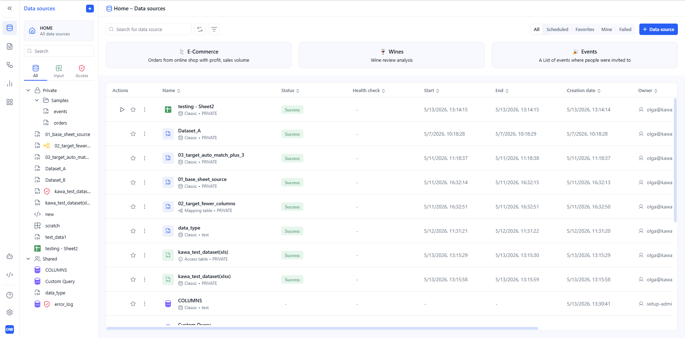
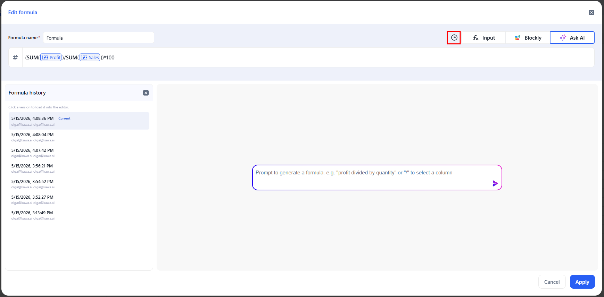
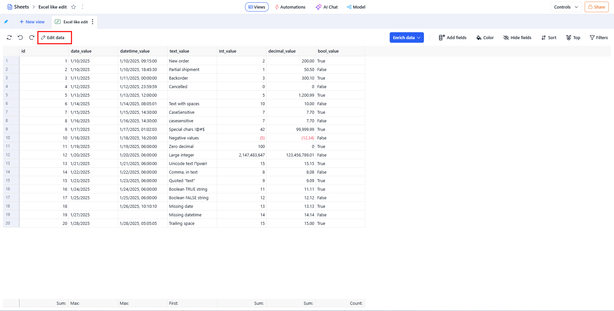

# Release note - KAWA 1.35

## 1. New Features

### 1.1 Workflows — Loop and Run workflow

In 1.35, Workflows gain two new capabilities — **Loop** for row-level iteration and **Run workflow** for composing workflows together.

> You can read more about this in the [Workflows section](../07_00_workflows/).

* **New logic block: Loop** — iterate over the rows of an input table, repeating a set of actions for each row.
* **New action: Run workflow** — run an existing workflow as a sub-workflow.

### 1.2 New design for home pages

All **home pages** have been restyled — **Data Sources**, **Sheets**, **Workflows,** **Applications**, **Dashboards**, **Scripts**, **Agents**,  and **Knowledge** now share a consistent, updated layout.

<figure><figcaption></figcaption></figure>

### 1.3 Formula history

The formula editor now keeps a **Formula history**. Click the **clock icon** next to Input / Blockly / Ask AI to open a side panel listing saved formula versions with timestamps and authors. Click any version to load it back into the editor.

<figure><figcaption></figcaption></figure>

### 1.4 Sheets — Edit mode

Sheets based on an editable data source now support a dedicated **Edit mode**. Click **Edit data** in the action bar to open an edit session. Changes are no longer sent to the backend after each action — they are collected as pending edits and submitted in one pass when you click **Save**.

<figure><figcaption></figcaption></figure>

## 2. Improvements & Bugs fixes

### 2.1 Workflows

Improved Stack datasets — the column mapping panel now offers three Column matching methods to auto-populate the mapped columns table: By column name, By column order, Auto-mapping.
