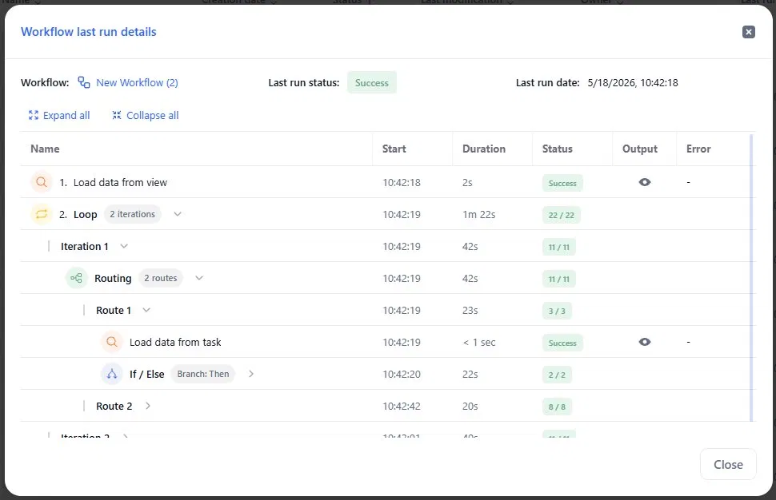
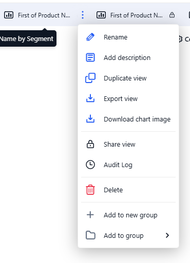
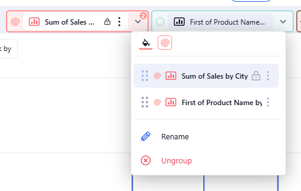

# Release note - KAWA 1.35

## 1. New Features

### 1.1 New design for home pages

All **home pages** have been restyled — **Data Sources**, **Sheets**, **Workflows,** **Applications**, **Dashboards**, **Scripts**, **Agents**,  and **Knowledge** now share a consistent, updated layout.

<figure><figcaption></figcaption></figure>

### 1.2 Workflows — Loop and Run workflow

In 1.35, Workflows gain two new capabilities — **Loop** for row-level iteration and **Run workflow** for composing workflows together.

> You can read more about this in the [Workflows section](../07_00_workflows/).

* **New logic block: Loop** — iterate over the rows of an input table, repeating a set of actions for each row.
* **New action: Run workflow** — run an existing workflow as a sub-workflow.

### 1.3 Workflows — new format for Run history

**Run history** is now rendered as an expandable tree. Loops, If / Else, Routing, and Sub-workflows appear as container rows with a count pill (e.g. **2 iterations**, **2 routes**, **Branch: Then**). Click the chevron to expand and inspect nested tasks.

<figure><figcaption></figcaption></figure>

### 1.4 Formula history

The formula editor now keeps a **Formula history**. Click the **clock icon** next to Input / Blockly / Ask AI to open a side panel listing saved formula versions with timestamps and authors. Click any version to load it back into the editor.

<figure><figcaption></figcaption></figure>

### 1.5 Sheets — Edit mode

Sheets based on an editable data source now support a dedicated **Edit mode**. Click **Edit data** in the action bar to open an edit session. Changes are no longer sent to the backend after each action — they are collected as pending edits and submitted in one pass when you click **Save**.

<figure><figcaption></figcaption></figure>

### 1.6 Sheets — Tab grouping


Views in a sheet can now be organized into groups. Each group is displayed as a colored tab with an icon in the view strip.

<figure><figcaption></figcaption></figure>

Open the group dropdown: pick a Style (color and icon), rename the group with an optional title, or Ungroup.

<figure><figcaption></figcaption></figure>

### 1.7 Sheets — Change data source

A new **Change data source** action in the **Model** tab lets you replace the primary data source of a sheet without losing its structure. KAWA guides you through a 4-step wizard: **Select source → Map columns → New columns → Review**.

<figure><figcaption></figcaption></figure>

* Columns are auto-matched by name and type. Key columns must remain mapped; non-key columns can be left unmapped.
* If the new source has extra columns, choose which ones to add to the sheet in the **New columns** step.
* Unmapped columns stay in the sheet but receive no data — they can be reconnected in a later replacement.
* Existing charts, pivot tables, filters, formulas, and lookup columns are preserved.

> You can read more about this in the [Change data source section](../02_00_modeling/change-data-source.md).

## 2. Improvements & Bugs fixes

### 2.1 Workflows

* Improved Stack datasets — the column mapping panel now offers three Column matching methods to auto-populate the mapped columns table: By column name, By column order, Auto-mapping.
* When a task's input comes from a previous task's output (not a data source), the editor now shows an info banner: "Preview data is a sample. Actual values will be computed when the workflow runs."

### 2.3 Pivot table & charts

* Pivot CSV export now offers two modes: Visible data (exports what's currently rendered, with formatting) and All data (raw) (full unformatted export from the backend).&#x20;

### 2.2 ClickHouse

* Migrated from the JDBC driver to the native ClickHouse Java client. The new client reuses connection pools across requests and is backward compatible with ClickHouse LTS versions 24, 25, and 26.
