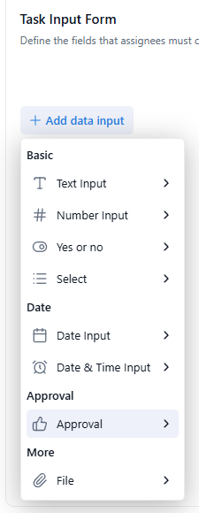
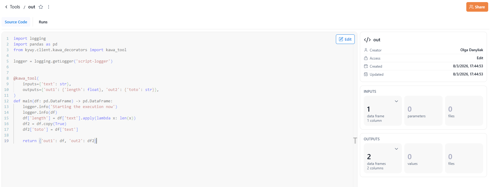
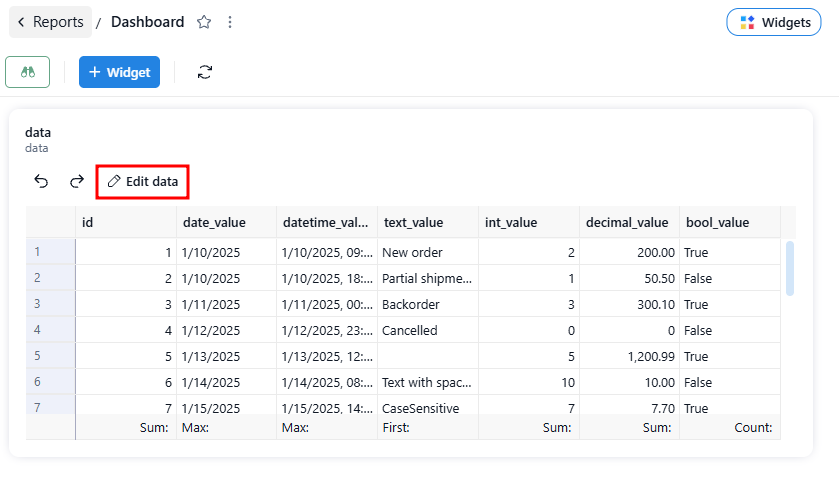
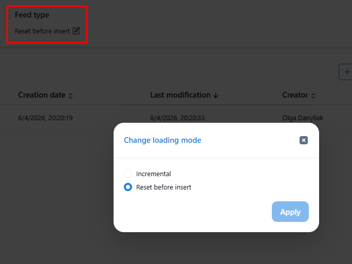
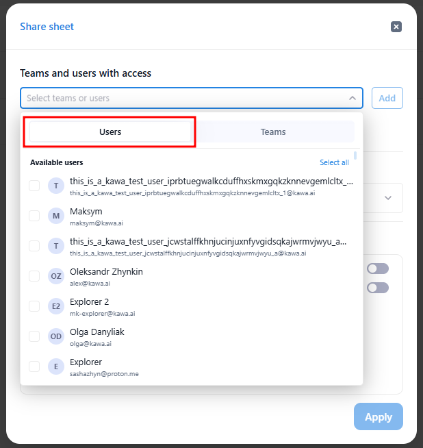
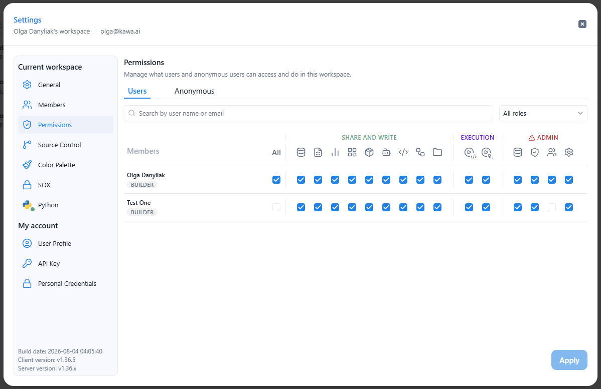

# Release note - KAWA 1.36

## 1. New Features

### 1.1 Workflows — Approval step for User Input tasks

The workflow form builder now includes an **Approval** input for **User Input** tasks. It comes seeded with editable "Approve" / "Reject" options, and KAWA automatically generates an **If / Else** branch for each option immediately after the task — so an approver's decision routes the run without any manual branch setup.

<figure><figcaption></figcaption></figure>

### 1.2 Workflows — File input

Workflows can now collect a file from the user. A new **File** input is available in two places:

* As a **data input** in the **Task Input Form** of a **User** task (**+ Add data input → File**), so an assignee can upload a file as part of completing the task.
* As a **workflow input** on the **Manual run** trigger (**+ Add data input → File**), so a user starting the run manually is prompted to upload a file.

Either way, the uploaded file is passed into the run and can be used by downstream tasks.

### 1.3 Python — Workflow tools with the `@kawa_workflow_tool` decorator

Python workflow scripts gain a first-class way to declare their interface. The new **`@kawa_workflow_tool`** decorator lets a script declare its **input files**, **output files**, **output scalars**, and **named output data frames**, which downstream tasks can bind to individually. An **overview panel** summarizes each tool's inputs and outputs.

* Scripts can now produce **multiple named output data frames** in a single run, and each downstream task selects and binds to the specific output it needs.

<figure><figcaption></figcaption></figure>

### 1.4 Dashboards — Edit sheet data in place

Editable sheet views embedded in dashboards can now be edited without opening them full-screen. A new **"Edit data"** toolbar on dashboard sheet widgets opens a buffered edit session: changes are collected as pending edits and either committed on **Save** or discarded on **Cancel**. This extends the sheet **Edit mode** introduced in 1.35 to dashboards.

<figure><figcaption></figcaption></figure>

### 1.5 Data sources — Feed type switcher

The data source overview now shows a **"Feed type"** section with the current loading mode. Users can switch between **Incremental** and **Reset before insert** directly from the overview — with an inline warning about the impact of the change — instead of going through a separate toolbar action.

<figure><figcaption></figcaption></figure>

### 1.6 Sharing — Share with individual users

Entities can now be shared with **individual users**, not only teams. The **Share** dialog uses a single combined picker with a **Users / Teams** toggle, and each user or team gets its own **Viewer** / **Editor** access level.

<figure><figcaption></figcaption></figure>

### 1.7 Permissions — Reworked workspace roles

The workspace permissions UI has been reworked for clarity:

* Clearer role names — **Explorer**, **Builder**, and **Admin** — with a **role** field on the **User Profile** tab.
* Share and write permissions are combined into a single **"Share and Write"** group.
* Admin-level permissions are grouped into a highlighted **"danger zone"**.

<figure><figcaption></figcaption></figure>

## 2. Improvements & Bugs fixes

### 2.1 Workflows

* Added a **"Left Anti Join"** type to the **Join** task, returning rows from Dataset A with no match in Dataset B.
* Added **auto-matching of join columns by name**, pre-selecting columns that exist on both sides of the join.
* Added a **"Preview workflow"** button to the sub-process task, opening a read-only preview of the selected sub-workflow.
* Updated the workflow header to a **breadcrumb-style header** matching other entity pages (inline rename, favourite star, share, and **Workflow** / **Run history** tabs), and improved the creation flow to prompt for a name and description.
* Fixed workflow updates to share the layouts backing **COMPUTE** / **CHART** tasks, so adding or rebuilding a task no longer leaves those layouts private and breaks workspace mounts for non-admin members.
* Fixed workflow filters so an invalid or missing variable binding is surfaced and blocks saving, instead of failing silently until deploy; the collapsed filter card now shows the binding's real name and turns red when broken.

### 2.2 Sheets & Computations

* Added the ability to **duplicate a lookup (linked) column** — like duplicating a formula — keeping the same target view, source field, aggregation, and join keys.
* Added **view / edit** for formula, lookup, and mapping columns in the **Sheet model** section.
* Added editable **multi-line descriptions** to formula, lookup, and mapping columns, accessible from an info icon in their editors.
* Added support for **integer and date columns as mapping keys**, so mapping columns can key off numeric and date values in addition to text.
* Added a distinct **icon for editable sheets** wherever sheets are listed.
* Added a **computed-columns count** to each sheet in the home page catalog, updating automatically as computed columns are added or removed in the grid view.
* Fixed formula creation in grid view so users **without formula edit permission** can create a new formula, instead of being blocked by a permission check that was mistakenly applied in create mode.

### 2.3 Charts & segmentation

* Added a per-series **Bar / Line type toggle** to grid-based charts, so a single chart can mix bar and line series.
* Added a **3M (three-month) granularity** option to date and date-time segmentation across the app.

## 3. Patch releases (1.36.x)

### Patch 1.36.1

* Added a new "Artifacts" tab — a workspace-level library to upload, store, preview, version, publish, and download files (PDF, Image, PowerPoint, Excel, Word, Text, Application, and other Binary files): create an artifact as an empty container (Name + Type), add files as versions with a full v1/v2… history (timestamp, author, and optional description per version), preview supported types in the browser, and Publish a chosen version with Restricted, Signed-in users, or Anyone with the link visibility
* Added a new "Load artifact" workflow action to load a stored artifact (Latest or a pinned version) so its properties (Author, Version, Description) can be used by later steps via bindings (e.g., Send email, AI prompt, Generate output, Run python script)
* Added a new "Save artifact" workflow action to persist a workflow's file output as a new version of an existing or newly created artifact, keeping earlier versions and making the result available in the Artifacts tab and to later Load artifact steps
* Added an "Anonymous" permissions tab (Workspace → Permissions) to control which actions anonymous artifacts can perform — grouped into READ (Query, Get workflow status, Get workflow definition, List workflow run tasks, Get ETL status, Download file), WRITE (Patch data, Upload file), EXECUTION (Run workflow, Run ETL), and a WARNING group of sensitive actions (Generate by AI); any action left off is disallowed
* Redesigned the "Add action" selector in the workflow editor — clicking "+" (between tasks or at the end of a branch) now opens a searchable panel over a dimmed backdrop, with the clicked "+" highlighted to show where the action will land; actions are grouped into categorized columns (DATA, TRANSFORM, OUTPUT & LOGIC, Integrations) with a "Recently used" list, support partial and out-of-order search with full keyboard navigation (arrows to move across actions/columns, Enter to add, Esc to close), and actions that need a sheet/view (e.g., Load data, Compute view) open a second step to pick a sheet and then a view
