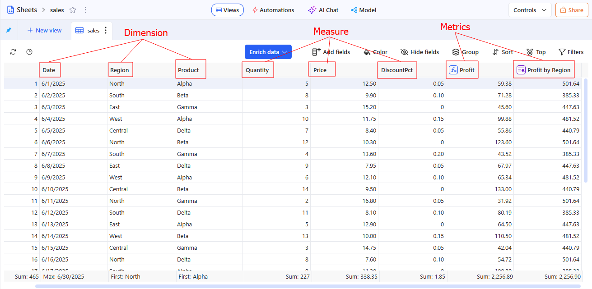
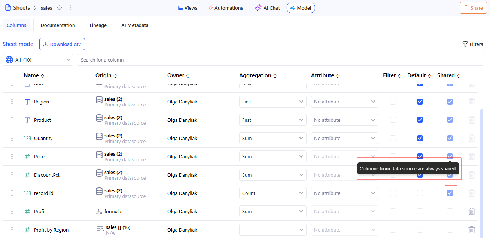
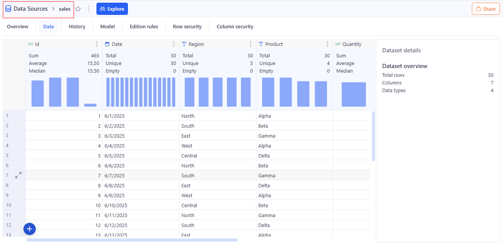
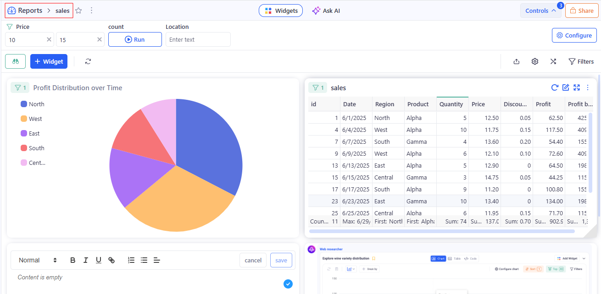

# Terminology

## A

### Agent
**In KAWA:** A workspace-wide AI assistant available in AI chats. Each agent is configured with instructions, connected knowledge sources (including unstructured data), a set of commands, and defined capabilities to help with tasks and queries. Every workspace includes a default agent (Paul) that can be edited but not removed; users with the Edit Agent flag can create, update, or remove other agents.

**How it relates to data modelling and standard terminology:** Not a data object; an application component that augments analysis and automation; comparable to BI assistants or workflow bots that sit outside the relational model but can read model metadata and execute queries/commands.

**Used in:** [AI Integration](06_00_ai_integration.md) section.

---

## C

### Column
**In KAWA:** A Column is an attribute in a Sheet that’s part of the sheet’s model and is used in queries, grouping, aggregations, and visualizations. Columns can come from the Data Source or be derived (formulas, mappings, Python). They define what the model captures and how the data can be queried, grouped, and visualized; values can be displayed as-is or aggregated/formatted for analysis. Columns can be:
- **Dimension** — descriptive, categorical data used to group, slice, or label metrics (e.g., names, dates, categories, regions). Can be from a Data Source indicator or Calculated (derived in the Sheet).
- **Measure** — numeric indicator from the Data Source.
- **Metrics** — numeric values that are derived from expressions/formulas or other columns saved in the Sheet.

> Columns from Data Source are always shared (non-toggleable). Promoted columns can be shared/unshared according to Sheet settings.

**How it relates to data modelling and standard terminology:**
- In standard terms, a column is a table attribute (a field).
- In KAWA, a Sheet’s granularity (level of detail) is set by the primary key of the main Data Source. The set of columns only defines how data can be queried, grouped, and aggregated in the Sheet.

**Example**

**Used in:** [Data Modeling](02_00_modeling.md) section.

### Control Panel
**In KAWA:** A configurable set of user-facing controls that manages both filters (applied to one or many Views/Sheets/Reports) and variables used to configure scenarios and referenced in formulas/metrics. It defines scope, default values, and propagation rules for governed self-service.a configurable set of user-facing controls that manages both filters (applied to one or many Views/Sheets/Reports) and variables used to configure scenarios and referenced in formulas/metrics. It defines scope, default values, and propagation rules for governed self-service.

**How it relates to data modelling and standard terminology:** Parameters (similar to parameters in BI) that shape queries and visuals. Scope defines where a setting applies; propagation governs inheritance.

**Example**

**Used in:** [Control Panel](02_01_control_panel.md) section.

---

## D

### Data Source
**In KAWA:** A single data table in KAWA. It contains Indicators (columns) with defined types (e.g., date, datetime, text, boolean, integer, decimal; lists of texts/numbers are supported) and must have a primary key (single or composite) that uniquely identifies each row.
Data can come through  Importing files, Connecting to external systems such as CRMs, databases, APIS etc, Linking to existing tables in the main warehouse, Importing unstructured data, Importing data from Python scripts, creating a data source from input table.

**How it relates to data modelling and standard terminology:**
- Data Source in KAWA corresponds to a single data table or tabular representation.
- Column in modeling = table column; in KAWA it is represented as Indicator.
- Primary key in relational database meaning: uniquely identifies a row; can be composite.

**Example**

**Used in:** [Data Integration](01_00_data_integration.md) section.

---

## F

### Field
**In KAWA:** The contextual use of a Column within a View, specifying role (axis, series, grouping, value) and aggregation behavior. Fields control how data is rendered and summarized, without changing the underlying column definition.

**How it relates to data modelling and standard terminology:** In standard terms, this is the presentation layer: a field in a view (a visualization field). It’s not a physical column in the data model, but a projection within a specific View with a chosen role and aggregation. The field controls how data is rendered and summarized, but it doesn’t change the schema or the definition of the Column.

**Example**

**Used in:** [Grid views](04_01_grid_views.md) section.

### Filter
**In KAWA:** A condition that limits the records returned and shown by KAWA when a View, Sheet, or Report is evaluated. A filter specifies fields, operators, and values; it can be saved with a view, defined on a sheet, or applied report-wide. Filters change what is queried and displayed; they do not modify stored data.

**How it relates to data modelling and standard terminology:** The behavior of filters in KAWA follows the common practice of BI and relational systems: a filter returns a subset of rows that meet the conditions.

**Example**

**Used in:** [Filtering data](04_04_filtering.md) section.

---

## I

### Indicator
**In KAWA:** A Data Source column (one field of the source table). Indicators have a defined type (e.g., date, datetime, text, boolean, integer, decimal; lists are also supported) and may be part of the primary key (single or composite) that uniquely identifies rows. After clicking **+ Create new sheet** on this Data Source, KAWA creates a new Sheet where the initial columns are automatically populated from the Indicators of that source.

**How it relates to data modelling and standard terminology:** An Indicator is a column (attribute) in a Data Source table with a defined data type; it can be part of the primary key. Analytical roles are assigned later within the Sheet.

**Example**

_**See:** Data Source — Example_

**Used in:** [Data Integration](01_00_data_integration.md) section.

---

## K

### Knowledge
**In KAWA:** A workspace section for connecting and integrating unstructured data (documents, files) into KAWA to support data-driven work. This feature requires a connection to OCR (Optical Character Recognition) and to a completion API.

**How it relates to data modelling and standard terminology:** In the classic data classification, unstructured data is information in the form of files or documents that is not stored in tables. To convert this kind of content into text suitable for further processing, OCR is used. Then, text operations are performed using the completion API.
So, Knowledge in KAWA follows the standard chain: unstructured data source → OCR → text → working with text via completion API.

**Used in:** 

---

## P

### Python Tool
**In KAWA:** A Python function registered in KAWA with the @kawa_tool decorator (from kywy.client.kawa_decorators). Tools run on KAWA’s Python runtimes configured at the workspace level. You can add tools in two ways:
1. KAWA File Store — write/edit the script directly in the GUI;
2. Connected VCS (Git over SSH) — KAWA clones/pulls your repo; each repo includes requirements.txt and a kawa-toolkit.yaml that groups tools into toolkits.
When a tool is added from VCS, it is not editable in the GUI (update via commits). Tools declare inputs/outputs in the decorator, appear in the Tools section, and require the appropriate workspace permissions and a healthy Python setup.

**How it relates to data modelling and standard terminology:** In standard terms, a Python Tool is a regular Python function with the @kawa_tool decorator, which declares inputs and outputs for use in the GUI and runs in managed Python runtimes at the Workspace level. In other words, a Python Tool belongs to the execution/extension layer of the platform, not to data modelling.

**Used in:** [Python Tools](09_02_python_tools.md) section.

---

## R

### Reports 
**In KAWA:** Published collections of Views arranged with layout, shared Filters, and optional Control Panels for interactivity. Reports define audience, permissions, and refresh behavior, and serve as the primary surface for analyses. User can create three types of reports: Dashboard (infinite canvas), Slides (fixed-size pages), and Doc (rich text with embedded widgets). 

**How it relates to data modelling and standard terminology:**
- The Presentation layer, not the modeling layer. Reports don’t define schemas or modify stored data. Instead, they organize Views into a layout, apply shared Filters, and optionally include Control Panels for user interaction. They also manage the audience, permissions, and refresh behavior.
- Standard BI alignment: In typical BI terms, Reports correspond to the report/dashboard layer, which visualizes already modeled data through charts, grids, and pivot tables (i.e., widgets/views).

**Example**

**Used in:** [Reports](05_01_reports.md) section.

---

## S 

### Sheet
**In KAWA:** A data object built on one main data source (defines the sheet grain and primary keys) with optional linked data sources joined by LEFT JOIN to add columns. A sheet contains views (at least a Grid), columns (dimensions, measures, calculated, metadata), and metadata (descriptions, data types, relationships, aggregation/formatting), and also provides a control panel and global sheet filters. Sheets are used to explore/visualize data and to build your data model.

Metadata (Sheet) — descriptive info about the sheet’s model: a global description (for AI), column names and descriptions, data types, links between sources, and rules for aggregation and formatting. It ensures consistency, easy data discovery, and correct analytics in Views/visualizations.

**How it relates to data modelling and standard terminology:**
- The main Data Source in the Sheet defines the level of detail (granularity) and primary keys — this aligns with the “fact/detail” concept in relational or BI modeling.
- Related data sources are joined using LEFT JOIN — the classic approach of “enriching facts with attributes” without changing the number of rows in the fact table.

**Example**

_**See:** Column — Example_

**Used in:** [Data Modeling](02_00_modeling.md) section.

---

## T

### Team
**In KAWA:** A managed group of users with shared roles, permissions, and ownership within a Workspace. Teams control access to data sources, sheets, views, and reports, and can be targeted by workflows and sharing policies.

**How it relates to data modelling and standard terminology:**
- According to standard access control practices, these are user groups in an RBAC (role-based access control) model.
- This is not directly part of data modeling. Teams use already modeled objects for sharing and security purposes.

**Used in:** [Sharing and permissions](08_01_permissions.md) section.

---

## V

### View
**In KAWA:** A saved representation of data—grid, chart, or pivot—configured with Fields, Filters, and formatting. Views govern how data is queried and displayed and act as reusable building blocks inside Reports and applications.

**How it relates to data modelling and standard terminology:**
- In standard BI terms, a View corresponds to the visualization layer (grid/chart/pivot) built on top of already modeled data from the Sheet.
- A View does not perform data modeling. It consumes the Sheet model and defines how data is queried and displayed.

**Example**

_**See also:** Field — Example_

**Used in:** [Visualization](04_00_visualization.md) section.

---

## W

### Workspace
**In KAWA:** The top-level environment that contains data sources, sheets, views, reports, automations, knowledge, and teams. A workspace defines governance (roles, policies), resources, and collaboration boundaries for a project or organization.

**How it relates to data modelling and standard terminology:**
- In standard terms, this is the workspace scope: the level of governance and access control (roles, policies, RLS/CLS, sharing rules, resources, and collaboration boundaries).
- It does not perform data modeling; instead, it defines the security, visibility, and collaboration framework for all platform objects.

**Used in:** [Sharing and permissions](08_01_permissions.md) section.

---

## Key “vs” comparisons

### Column vs Field vs Indicator
- Indicator (Data Source level) - the source’s original columns; may be part of the primary key. After Create new sheet, these Indicators automatically become the Sheet’s initial Columns. They do not define an analytic role.
- Column (Sheet level) - built on top of Indicators or computed; used in queries and aggregations. The Sheet’s grain is set by the primary key of the main Data Source (not by the set of Columns). Column ≠ Field.
- Field (View level) - contextual use of a Column inside a specific View (role: axis/series/group/value, plus aggregation). Affects display only; does not change the data schema.

Consequences of changes:
- Changes to a Field do not change the Column/Indicator.
- Changes to a Column apply to all Views that use it.
- Changes to the Data Source schema affect Indicators and, in turn, any derived Columns in Sheets.

### View vs Reports

- View — one saved visualization (grid/chart/pivot).
- Reports — a collection of views with shared filters and layout.

### Data Source vs Sheet

- Data Source — data imported or synchronized from underlying systems (files, databases, APIs, SaaS еtс).
- Sheet — the data model built on top of one or more data sources, where you define metrics for downstream use.

### Filter vs Control Panel

- Filter — a rule that restricts the dataset for a View/Sheet/Report; sets conditions and scope (local/global) and affects the query context without changing stored data.
- Control Panel — a configurable set of user controls that manages filters and variables across Views/Sheets/Reports; defines scope, default values, and propagation, and exposes variables reusable in formulas/metrics.