KAWA Reference Documentation
==============

* TOC
{:toc}


# A Users, Sharing and Data Security

## 1 User management and permissions

Users in KAWA have a global profile that applies across all workspaces and some workspace
related permissions.


### 1.1 Authentication

#### a. KAWA internal authentication

KAWA can be configured to authenticate users without relying on
SSO. In this mode, administrators can either choose to let people
create accounts using email activation codes or to manage the user
accounts themselves through KAWA's Python API.

KAWA will store the user's unique identifiers (must be the email address
if people are making use of email activation), their first and last names, and their secure password hashes.


When using KAWA internal authentication mechanism, the following page will be shown to users:

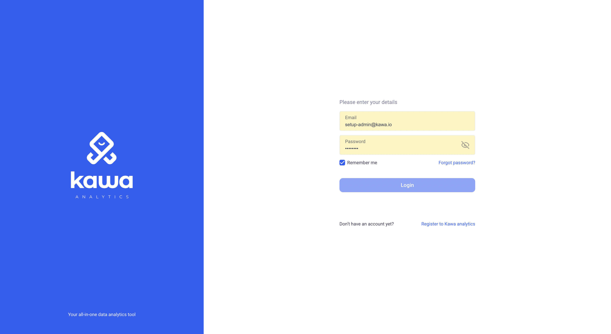

> **⚡ Important:** Note that the "Register in KAWA Analytics" section can be turned off if you do not wish users to sign up by themselves. The feature flag name is: `user-sign-up`.

> **⚡ Important:** If you want to allow users to sign up, you need to configure SMTP support


#### b. Using external IDPs and SSO

When configured to work with SSO, KAWA will automatically create users
in its database when new authenticated users will connect.

__Open ID Connect__:
KAWA is compatible with OIDC to authenticate users. It can be integrated with providers such as OKTA, AWS Cognito, Auth0, Azure Active Directory, etc...

__Kerberos SSO__: Kawa can be configured to integrate with Kerberos to authenticate users.

__HTTP Header-based Authentication__: Users can be authenticated with HTTP Header based authentication. In that setup, the user information will be extracted from the incoming HTTP requests.


#### c. Using API Keys

KAWA provides a mechanism to allow users to generate API keys in order to authenticate. This is mainly used to work with KAWA's Python API.


### 1.2 Application wide profile

Application wide profiles are configured through KYWY, KAWA's python client.

Please refer to this repository: https://github.com/kawa-analytics/kywy-documentation which contains all the details and examples regarding the usage of this library.


#### a. The user roles

There are 3 global roles in KAWA.
Each user has one role that is valid for the entire application.

Each time a new user is added in KAWA, they will get the _REGULAR USER_ role.

**ADMINISTRATORS**

Administrators can access all the admin functionalities of the platform. 
They can create, delete, activate, deactivate users. They can also modify user passwords
and change the global roles of other users.

Administrators can also access all workspaces and all assets in all of the workspaces without restrictions.

They can access all data bypassing all the row level and column level security.

> **⚡ Warning:** Typically, very few admin accounts should be created. They should be reserved for IT, global support and maintenance.

**SETUP ADMINISTRATORS**

There is only one such user for the entire KAWA platform. This user has all the privileges 
of ADMINISTRATORS. It can never be disabled, deleted or switched to another user role.


**REGULAR USERS**

Most of the users should have this role. It allows them to benefit from all the features
of the platform.


#### b. The restricted data source types

There are 7 data source types in KAWA:

- __USER FILES__: To create data sources of that type, users can upload CSV files from the GUI.

- __EXTERNAL SYSTEMS__: This type of data source is created by connecting to an external system directly from the GUI: Database, API, etc... 

- __KYWY__ (Python client): This corresponds to data sources created from the Python client using the data loader.

- __LIVE CONNECT__: Live connections are created by querying tables or views that are stored in the main data warehouse, without ETL or synchronization.

- __PYTHON ETL__: This type of data source is created by scheduling a Python script decorated by the `@kawa_tool` decorator.

- __FROM SCRATCH__: This allows users to create data sources directly in the GUI and edit the values manually, like Excel.

- __TRANSFORMATIONS__: Those are created by materializing existing views into new warehouse tables.


Each user (_Regular users_) can only create data sources of a type that was not explicitly restricted by administrators.

This allows administrators to control what the various users can load into the platform.


In the GUI, when users create a data source, the types they are allowed to work with are shown here:

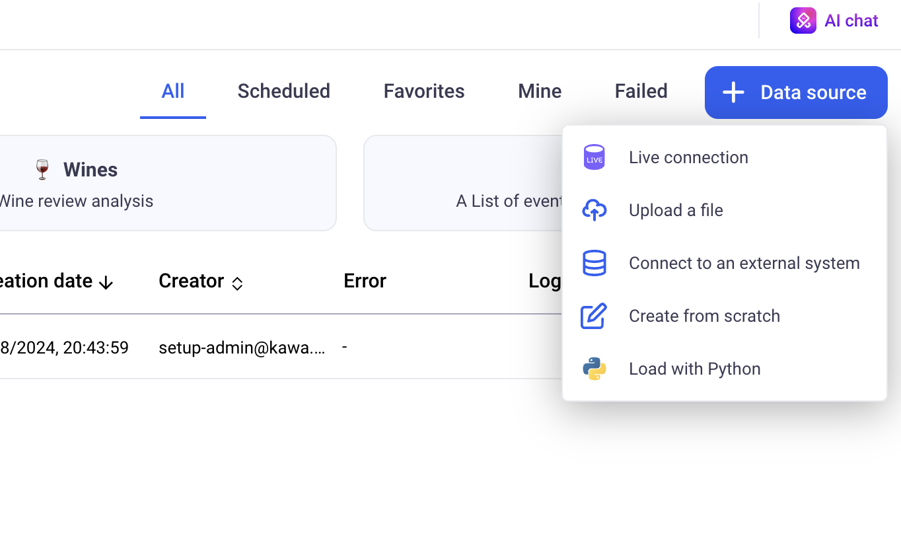


> **⚡ Important:** by default, users will not have access to the __LIVE CONNECT__ data type.

#### c. The overall permissions

Overall permissions are a list of features that individual users have access to.
For example, to benefit from all the Generative AI features,
the permission: `GENERATIVE_AI` must be granted. This grant will apply to the entire KAWA platform.


### 1.3 Workspace permissions

Each workspace functions as a separate isolated tenant. 

In order to access a given workspace, a user must be explicitly invited in it. 
A workspace can also be configured as public. If that is the case,  all the registered users in the platform can access it without restriction.

In each workspace, users benefit from a set of permissions:


__Sharing permissions:__

- Share Sheets and Views
- Share Data Sources 
- Share Dashboards
- Share Applications
- Share Knowledge


__Misc:__

- Access and manage Python scripts
- Run Python scripts
- Manage directories

__Data access permissions:__

>  **⚡ Warning:** Reserved to administrators of the workspace

- Manage row level and column level security
- Access restricted data and restricted data providers

__Workspace administrative permissions:__

>  **⚡ Warning:** Reserved to administrators of the workspace

- Edit workspace settings
- Manage workspace members


Workspace permissions are handled directly on the GUI, from the settings section (cog icon at the bottom left)

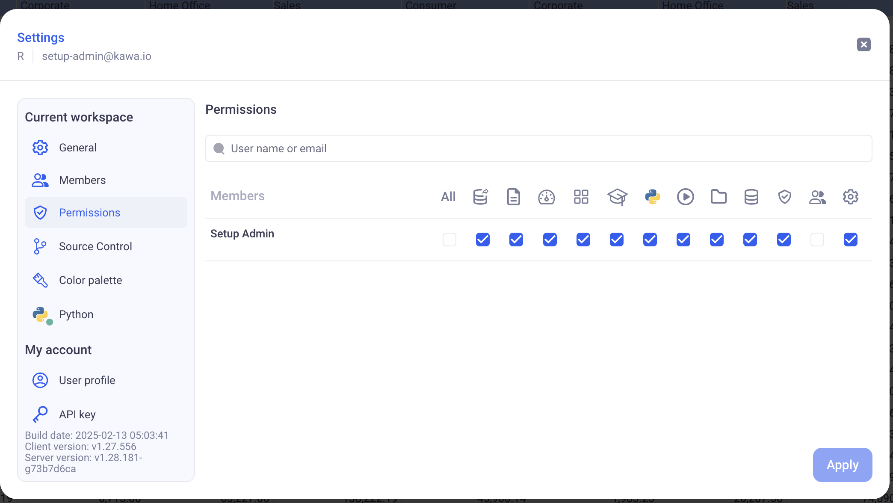


> **⚡ Warning:** Administrative and data access permissions give users ability to directly or indirectly access all data. Those permissions should
be reserved to workspace administrators only.

> **⚡ Warning:** Application wide Administrators will
benefit from ALL those permissions by default.


### 1.4 Teams

Within each workspace, users can be grouped in Teams. 
Teams can be used to share entities with user groups, such as applications,
dashboards, sheets and data sources.

Teams are configured on the GUI, from the settings menu.

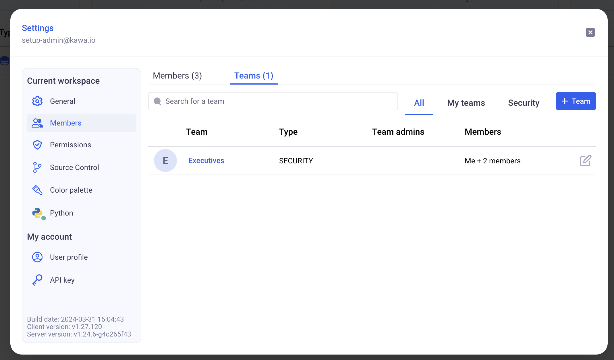


There are two types of teams:

- Sharing teams: Those teams are mainly used to share objects between users.
- Security teams: They work exactly as sharing teams with an additional property: a `security name`. Those are used in row level security and column security configuration policies.


#### Designating team administrators

When adding members to teams, you can designate them as team administrators.
Team administrators do NOT need any specific privileges to manage the members of the teams they administrate.

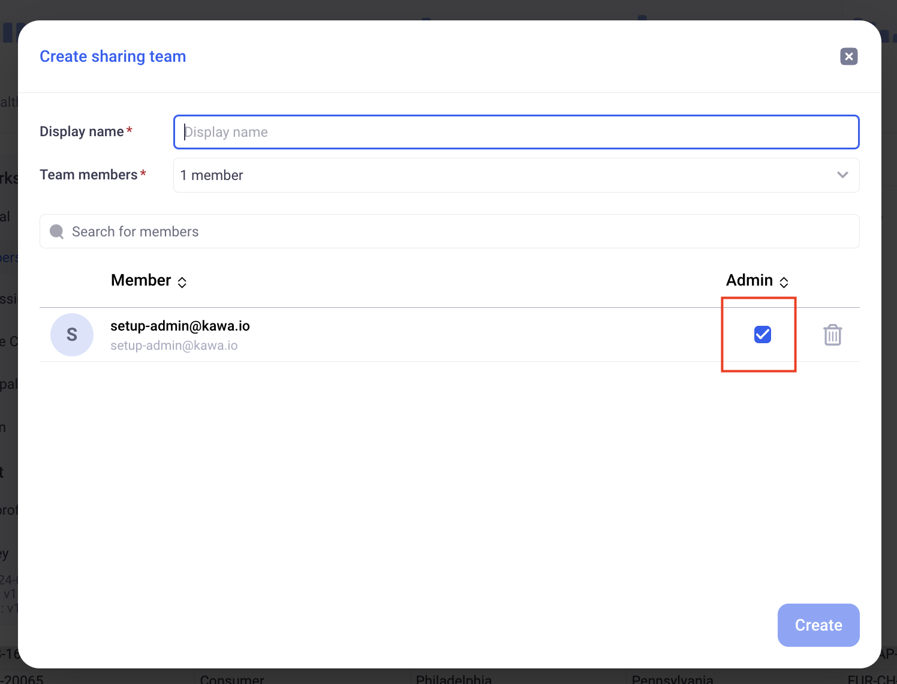


## 2 Sharing

The main assets of KAWA can be shared across the workspace to which they belong.
Sharing allows to set up publishing and collaborating flows between members of the KAWA workspaces.

No information contained in Sheets or Dashboards is confidential, those are mere configuration objects. The security in KAWA only stems from two sources:

- Workspace isolation
- Data ROW and COLUMN level security.

All entities consuming the data (Sheets, Dashboards, Python computations) are without exception subject to the configured RLS and CLS policies.


> **⚡ Important:** Entities can not be shared across workspaces.


__Sharing options__:

Entities can be shared with particular teams or with all the users who can access the workspace.
When sharing an entity:

- Set a general access policy: 
    - `RESTRICTED` means users of the workspace cannot access the entity
    - `VIEWER` means that users of the workspace can access the entity but cannot publish any change on it
     -`EDITOR` this level means that all the users of the workspace can publish changes on the entity

- Set a per team access policy: The same levels apply.


> **⚡ Important:** A user affected by more than one policy will benefit from the higher available access.
If a user is targeted by `RESTRICTED`, `VIEWER` and `EDITOR` simultaneously (through different teams perhaps), they will have the `EDITOR` policy on that entity.


### 2.1 Sharing Sheets and Views

A Sheet contains multiple views, such as charts, grids and pivot tables.
They also contain the business logic, expressed through formulas and python scripts.


#### a. Sheets and Views

A sheet can be shared in Read or Write mode with other users or teams of the workspace.

Within a sheet, views can be shared or private. When a view is shared,
it inherits the sharing mode (Read or Write) from its parent sheet.

If a sheet is shared with TeamA for Write, then all the shared views within that sheet will be editable by members of TeamA.

In order to configure sharing parameters for a sheet, use the icon at the top, next to the sheet name.

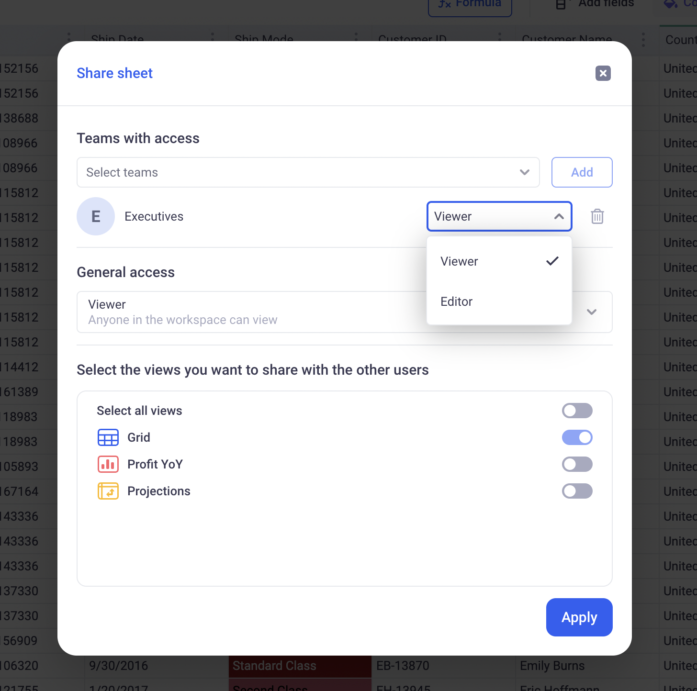

> **⚡ Information:** You can also individually share views, either from the sheet sharing parameters, or from the option menu within each individual view.


__Note about views:__

When views are shared, a control becomes available on them.
It lets users rollback to the latest published version,
publish a new version (if the user has write permission on the view) or save the view as a new object.


#### b. Columns: Formulas, Links, Mappings, Python

Within sheets, you can share your columns:
- Formulas,
- Mappings,
- Linked columns,
- Python columns.

This can be done through the sheet model, using the shared checkbox.

Sharing columns will make them available to all users accessing the sheet. They will be able to use those shared columns within their own formulas, and add them to their views - grids, pivots and charts.

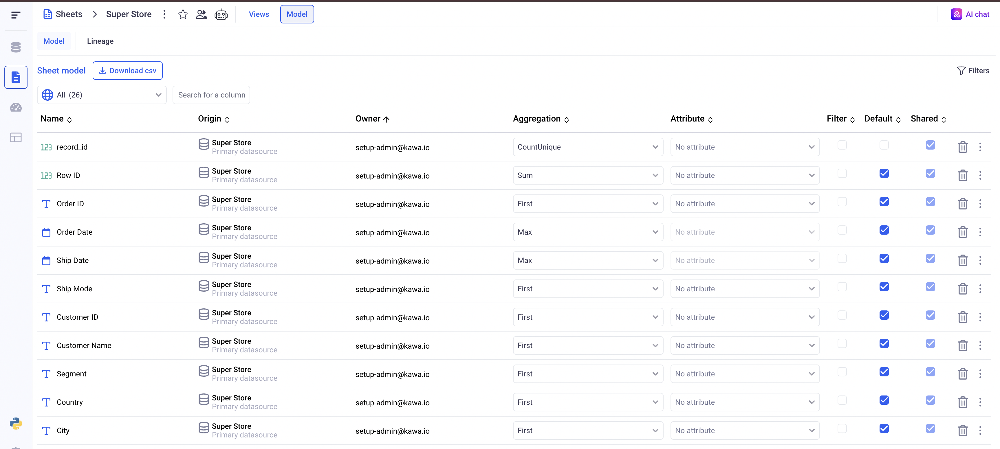

### 2.2 Sharing Data Sources

#### a. Data Sources

Data Sources can be shared like sheets, within the application.


> **⚡ Important:** If a data source is shared with some users, those users might __NOT__ see it if the row level security (RLS) configuration is set to __DENY ALL__. Make sure to either upload some specific RLS rules or set the general access to __ALLOW ALL__.


When a data source is shared with writing permissions,
users can configure them and manually override data.

In order for a user to be able to configure row level and column security on a data sources, two conditions must be met:

- The user must be able to edit the data source (shared with writing permissions)
- The user must have the `Manage Data Source Security` flag enabled.


#### b. Data Providers

Data providers are databases or external APIs to which KAWA is connected to import data.
When a data provider is restricted, only users with the `Access restricted data and restricted data providers` flag can access them to create new data sources.


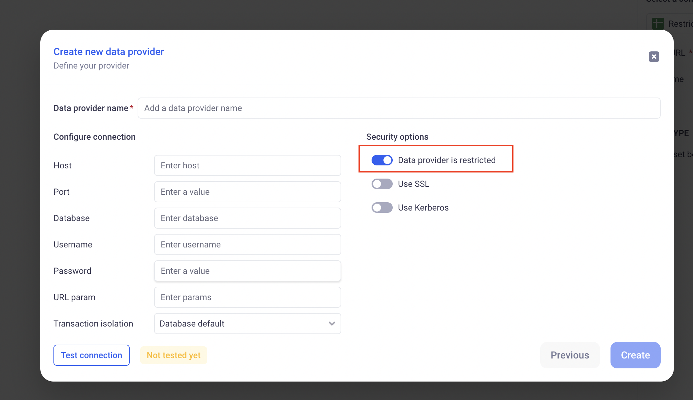


### 2.3 Sharing Dashboards

Dashboards can be shared in the UI, in the same way as sheets and data sources.
All the widgets of the dashboards follow the dashboard sharing policies and publications.

It means that the PUBLISH and ROLLBACK buttons on the dashboard will affect all views of the dashboards automatically.

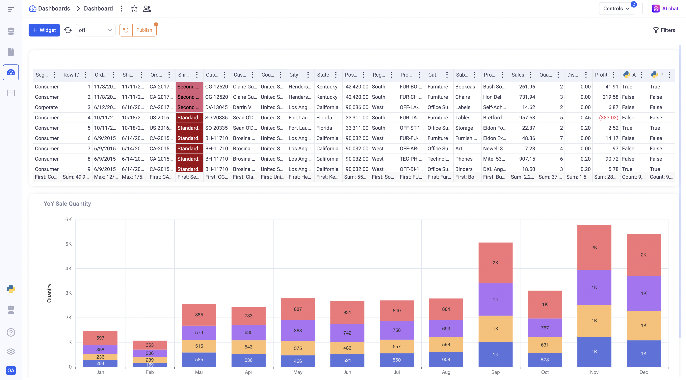


When sheets are used in shared dashboards, modifying elements of their model (like formulas for example), will result in a warning for the users:

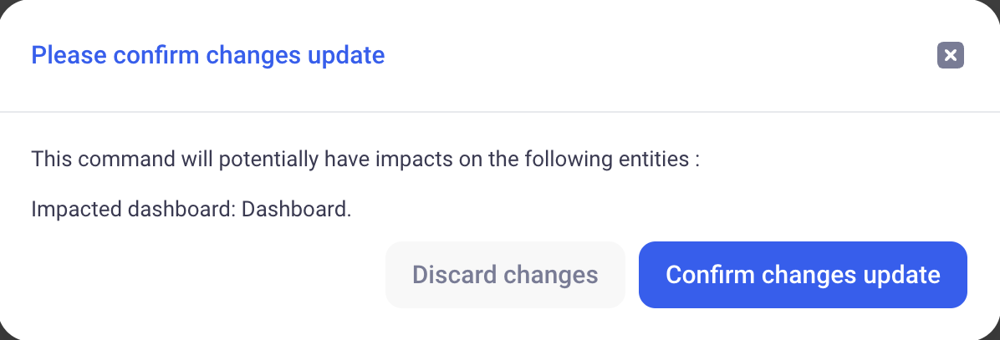


### 2.4 Sharing Apps

Applications can be shared in the UI, in the same way as sheets and data sources.
All the pages of the apps follow the zpp sharing policies and publications.

It means that the PUBLISH and ROLLBACK buttons on the app will affect all pages (views, dashboards) of the app automatically.

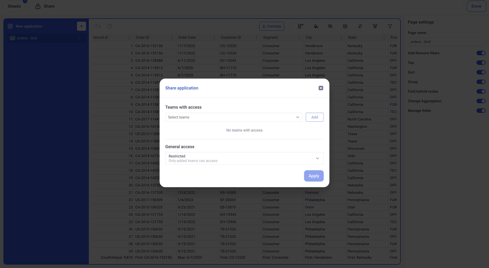


When sheets are used in shared apps, modifying elements of their model (like formulas for example), will result in a warning for the users.


### 2.5 Sharing Knowledge

As with the other entities, Knowledge can be shared in the workspace.
When a user does not have read access to a knowledge, they will not be able to access the 
content of the knowledge anywhere. (Parsed data, previews etc)


## 3 Securing the Data

In KAWA, securing the data can be done both at row (Row level Security) and column (Column level Security) level. This is always done at the data source level.

In order to configure security on data sources, users must either own them or  have the 'Manage row level and column level security' permission and be granted write access on the data source.


### 3.1 Column level security

Column level associates to one column in a data source a set of rules to limit access to that column.

> **⚡ Important:** If one of the below condition is matched, the user will __BYPASS__ the column level security and see the entire dataset regardless of what is configured: 
User OWNS the data source, User is an application ADMIN, or User has the ` Access restricted data and restricted data providers` workspace flag.

A rule targets a given Audience (Teams or individual users), and has a particular action:

- Completely hides the column
- Obfuscate the column's values (one way hash that makes the value impossible to read but preserves the repartition)
- Keeps the value unaltered

If a user is targeted by more than one rule, the most restrictive applies.

`HIDES is more restrictive than OBFUSCATES is more restrictive than SHOW`


### 3.2 Row level security

Row level security will filter the rows of a given data source based on a set of rules.

> **⚡ Important:** If one of the below condition is matched, the user will __BYPASS__ the row level security and see the entire dataset regardless of what is configured: 
User OWNS the data source, User is an application ADMIN, or User has the ` Access restricted data and restricted data providers` workspace flag.


#### a. Security Mapping

Those rules will be defined as a mapping between user or team names and particular values for dimensions. 

For example:

| Team Name         | Country        |
|--------------------|---------------|
| Thunderbolts      | USA           |
| Samurai Warriors  | Japan         |
| Desert Falcons    | UAE           |
| Nordic Vikings    | Sweden        |
| Nordic Vikings    | Finland        |
| Amazon Jaguars    | Brazil        |

In the above table (called: Security Mapping), all users members of the `Thunderbolts` team will be allowed to see only the row in the data source whose country is USA.
The secured dimension here is the Country.

Security mappings support special values:

- `#MATCH_MANY_TOKEN#` :If a user or team is assigned that value, they can see all elements of the secured dimension.

- `#BLANK_VALUE_TOKEN#` :If a user or team is assigned that value, they can see all elements with a blank value for the secured dimension.

For example:

| Team Name         | Country        |
|--------------------|---------------|
| Thunderbolts      | `#MATCH_MANY_TOKEN#`          |
| Nordic Vikings    | Sweden        |
| Nordic Vikings    | Finland        |
| Nordic Vikings    |  `#BLANK_VALUE_TOKEN#`        |
| `#MATCH_MANY_TOKEN#`   |  Belgium       |

In the above table, Thunderbolts can see all Countries (including blank Countries).
Nordic vikings can see: Sweden, Finland and rows without Countries.
All users can see: Belgium, including the Nordic vikings.

The mapping between user or team identification is saved in a special data source called: Access Table.


This type of data source behaves like a normal data source. It can be connected to external systems, CSV files etc...

Access Tables require the 'Manage row level and column level security' to be created.

In addition to the normal data source configuration, Access Tables require its creator to explicitly designate which column contains a user identifier (which can be user ids or security team `security names`).

#### b. Security Rules

Security rules allow to define how a Security Mapping will be applied to a data source to secure it.


Section by section on the above screenshot:

- Section 1: The name of the rule itself
- Section 2: The access table to use for that rule
- Section 3: The data source whose access we want to restrict
- Section 4: The dimension to secure (Above: we are securing `Segment` in the orders data source, matching it against the `segment` column in the security mapping)
- Section 5: Defines what to do for users who are not present (directly or through a team) in the Security Mapping.


#### c. Global rule


The global rule of a data source is applied for a given user in case NO RLS rule applies for that user. It can be either: ALLOW ALL or DENY ALL.


If at least one rule applies the user, then the Rule for missing user in each rule applies (Section 5 above)

#### d. Example

_fig1: Access Table:_

| User Id         | Segment          |
|--------------------|---------------|
| bruce@wayne.com    | Consumer      |
| bruce@wayne.com   | Enterprises    |
| lucius@wayne.com    |  `#MATCH_MANY_TOKEN#`     |
|

User id column is the user identifier: The user id (not the team name)


_fig2: ata source to secure:_

| profit         | category          |
|--------------------|---------------|
| 12   | Consumer      |
| 34   | Enterprises    |
| 56   | R&D    |


_Global Rule_:

The Global rule is set to Deny All.

_Rule_:

- Section 1: Segment control
- Section 2: The Access Table in fig1
- Section 3: The Data Source in fig2
- Section 4: The `category` of the data source will be paired with the `Segment` of the access table.
- Section 5: Deny All for users that are not in the access table.

_Result_:

- User bruce@wayne.com will see row 1 and row 2 of the data source:

| profit         | category          |
|--------------------|---------------|
| 12   | Consumer      |
| 34   | Enterprises    |


- User lucius@wayne.com will see the entire data source (`#MATCH_MANY_TOKEN#` is applied):

| profit         | category          |
|--------------------|---------------|
| 12   | Consumer      |
| 34   | Enterprises    |
| 56   | R&D    |


- All other users will be denied access to the data source (Global rule applies)


# B Computations

## 1 General Concepts

Computations are created in Sheets and can take various forms such as:

- A formula
- A mapping column
- A lookup column


### 1.1 Formulas

Formulas are created from the Formula editor, available from the enrich data button.
There are three modes to input formulas:
- Text mode (Excel like)
- Visual mode (Using blockly)
- AI assisted mode, via prompt.


Formulas can be composed of:
- Other columns
- Operators or Functions
- Variables (From the control panel)
- Constants

Here is an example of a simple formula, in Visual mode and in Text mode.

Visual:


Text:


This formula returns `ABOVE` if the profit is above `ProfitThreshold`
and it returns `BELOW` otherwise.

Note that:
- `Profit` is a column of the sheet
- `ProfitThreshold` is a variable from the control panel
- We use the IF/THEN/ELSE operator as well as the Greater Than one.

The return type of this formula is a `Text`, as indicated on the UI (Top left in text mode and top right in visual mode).

### 1.2 Types and Levels of detail

#### a. Types

Formulas are typed. It means that they only return one type of data which can be:

- `Text`
- `Integer`
- `Decimal`
- `Date`
- `Date Time`
- `Boolean`

Their type is derived from the operators they use and their various columns, constants and variables.
For example: Concatenating two texts will yield a text, adding two integers will yield an integer etc... 

You can always refer to the documentation of each operator directly on the GUI for that purpose:


#### b. Levels of detail

In addition to being typed, formulas also have a Level of Detail.
It can be either: `ROW`, `GROUP` or `ANY`.


- **The ROW level of detail:**

A ROW level of details means that the formula will be computed for each row of the data.

For example, the formula `Profit / Quantity` will have a value for each row. When we sum the values of this formula - that might happen in Grid, Pivots and Charts - we apply the sum of the division for each row:
`SUM(  Profit / Quantity  )`

In other words, the computation is done at the row level and we simply aggregate those results together.


- **The GROUP level of detail:**

A GROUP level of details means that the formula will be computed for both the rows and directly for the group. The main difference is that a group function manipulates aggregating operators, such as SUM or AVERAGE etc..

It allows us to write powerful formulas such as Weighted averages etc..

Here is how you would write a weighted average using a GROUP formula:

```
WeightedAverage = SUM(weight * value) / SUM(weight)
```


- **Quick example:**

The example below illustrates the difference between the two:

Look a the two columns on the right of the grid:
- `Profit / Quantity`
- `SUM(Profit) / SUM(Quantity)`

They both have the exact same value on each row, but the global aggregation of both, on the bottom row, is different.

Because the first one is computed ONLY for each row and then aggregated, the global aggregation will be: 

```
SUM(Profit / Quantity) = 
Profit1/Quantity1 + ... + Profitn/Quantityn
```

On the other hand, because the second one is computed directly at the group level, its aggregation will be:

```
SUM(Profit) / SUM(Quantity) = 
(Profit1 + ... + Profitn)/(Quantity1 + ... + Quantityn)
```

Note that for the second formula, the aggregation at the bottom of the grid cannot be changed (the same goes for charts and pivots), because it is imposed by the formula itself.


## 2 Window Functions


### 2.1 What is a Window Function?

A Window Function is a ROW LEVEL computation operation. This means that it will compute one value for each row of data.

Without window function, all the computations only "see" one row of data at a time. If you write for exampe: `col1 + col2`, this means that `col1` and `col2` will be added for each row.

With window functions, computations can now see a Window of rows around the current row.
We can now access rows such as: Previous and Next rows, all the rows before, all the rows after etc...

The image below illustrates this:


When you write a window function, you need to define which rows will be accessible from each computation.


### 2.2 Examples

- **Example 1: Average of surrounding rows**

Below, an example of an Average of the row before, the row after and the current row, per client.


- **Example 2: Cumulative Sum**

Here, we compute the Chronologic Cumulative sum per client.
Notice the use of the `NO_LIMIT` block in the Window range. This lets you define unbounded windows.

It is also important to note that the ORDER defined in the WINDOW function is independant from the one defined in the main view. The WINDOW function will operate on its own ORDER function and ignore the one of the view.


- **Example 3: Delta between today's price and yesterday's price for Stock**


**Case 1: Using the ROWS operator**

Notice how we use the `ROWS` operator to define the range. This operator will just look at the rows and ignore gaps in the dates. Here `STOCK2` has gaps but the delta ignores them (always -$1). In short, the `ROWS` operator will load N rows before and P rows after without caring about the content of those rows.


**Case 2: Using the RANGE operator**

With this syntax, we are using the `RANGE` operator.

As opposed to the `ROWS` operator, the `RANGE` looks at the values from the `ORDER` clause.

In this example, we order by date and we are looking at the actual previous date.
So if a row is dated on the 2nd of January 2025, It will fetch the row dated on the 1st of January 2025 (Within the defined partition, here: The STOCK). If there is no such row, then the window function will not find any row. 

In the below screenshot, it explains why, for STOCK2, the delta is defined only for the 16th of Feb 2025: it is because the WINDOW is able to pick up the previous date which exists.

As a result, the `ROWS` operator is interesting when you order by date and you want to account for missing dates in your computation.


### 2.3 Creating and defining window functions

In order to configure Window function, create a new formula and use the
Blockly mode. It has several prebuilt functions to help you getting started.


In order to define your Window, you must set the following parameters:

1) **The Partition**: 

The partition will define which dimension(s) will be used to build the Window function.
It defines where to pick the rows that will constitute the Window. 

2) **The Order By**:

Within each Window, this clause define how the data will be sorted.

3) **The Window Range**:

This defines how many rows before and after the current row we will look at in the window.

There are two ways to define a range:

- Using the `ROWS` operator: This will be based on the number of rows before and after the current one.

- Using the `RANGE` operator: It will look for consecutive values. It makes sense for dates and date times.


