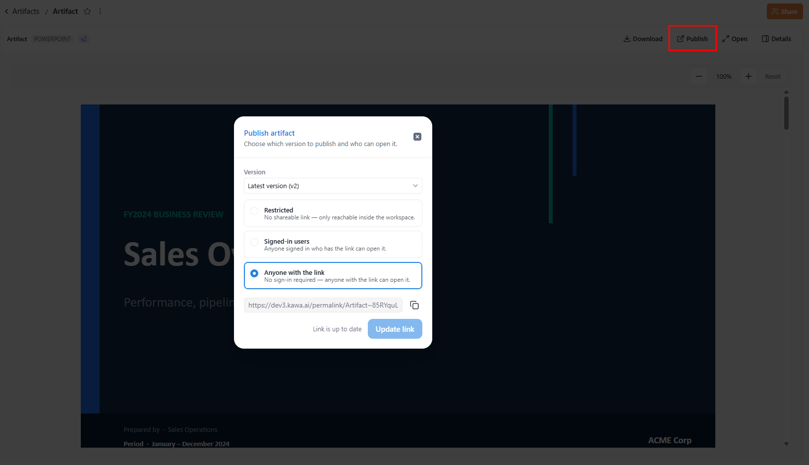

# Artifacts

See definitions in [Terminology](13_00_terminology.md#artifact) section.

The **Artifacts** tab is a workspace-level library for the files you bring into KAWA. It gives you a single place to upload, store, preview, version, publish, and download files — PDFs, images, presentations, spreadsheets, text, application files, and other binaries — without leaving the platform.

Where sheets hold your modeled data and dashboards hold your live views, the Artifacts tab holds your **files**: the documents and deliverables you want to keep, version, and share with your team.

### 1. Creating an artifact

An artifact is created first as an empty container; you then add a file to it as its first version.

Click (+ Artifact) at the top right — or the (+) button at the top of the left panel — to open the **Create artifact** dialog. Enter a **Name** (required), then choose a **Type** from the dropdown: `Application`, `PDF`, `Image`, `PowerPoint`, `Excel`, `Word`, `Binary`, or `Text`. Click (**Create**).

<figure><figcaption></figcaption></figure>

The new artifact appears in the list, labeled with its type (for example, `POWERPOINT`), and opens with an empty preview reading _No versions yet_. Add a file to populate it — see [ **Versions**](artifacts.md#id-3.-versions) below.

### 2. Viewing an artifact

Click an artifact's name to open its detail page. The detail page has three parts.

#### 2.1 Details panel

The left of the detail page summarizes the artifact:

* **Creator** — the user who created it.
* **Access** — the artifact's current visibility (managed in **Sharing and permissions**).
* **Created** and **Updated** — the creation and last-modification timestamps.

#### 2.2 Versions panel

Below the details, the **VERSIONS** panel lists every version of the artifact (v1, v2, and so on), each with its timestamp and author. The current version is marked with a check. Select any version to preview it, or use the (+) button to add a new version (see section [**Versions**](artifacts.md#id-3.-versions)).

#### 2.3 Preview panel

The main area previews the selected version's contents. For supported types, KAWA renders the file directly in the browser — for example, a text data file is shown as a table, and a presentation is shown slide by slide. Use the zoom controls (`−` / `+`, the percentage readout, and (Reset)) to adjust the view. The preview header offers these actions:

* **Download** — save the current version to your computer in its original format.
* **Publish** — choose a version and a visibility level for the artifact (see section [**Publishing**](artifacts.md#id-4.-publishing)).
* **Open** — open the current version in a new browser tab.
* **Details** — show or hide the details and versions panel.

<figure><figcaption></figcaption></figure>

### 3. Versions

An artifact keeps a full history of its **versions**. A new artifact starts empty (_No versions yet_); the file you add first becomes v1.

To add a version, click the (+) button in the VERSIONS panel to open the **Add new version** dialog. Upload the file — drop it onto the file area or click (Choose a file); the file chooser lists only files that match the artifact's type. Once a file is added, it appears as a chip with its type, name, and size, and an optional **Description** field appears for this version. Click (Add version) to save: KAWA stores it as a new version and keeps the previous ones.

<figure><figcaption></figcaption></figure>

This lets you update a file — a revised report, an updated deck, a corrected dataset — without losing what it replaced. The latest version is shown by default, and you can select any earlier version to preview or download it.

### 4. Publishing

Publishing controls who can open an artifact and through which link. Click **Publish** in the detail header to open the **Publish artifact** dialog.

Choose the **Version** to publish (for example, _Latest version (v1)_), then set the visibility:

| Visibility               | Who can open it                                          |
| ------------------------ | -------------------------------------------------------- |
| **Restricted**           | No shareable link — only reachable inside the workspace. |
| **Signed-in users**      | Anyone signed in who has the link can open it.           |
| **Anyone with the link** | No sign-in required — anyone with the link can open it.  |

Click (Apply) to save. The artifact list shows the current state in the **Published** column.

<figure><figcaption></figcaption></figure>

